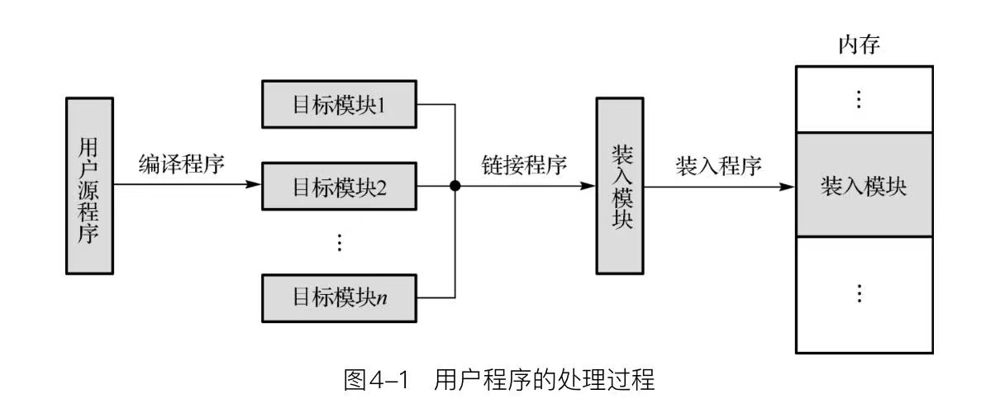

学习一门课程，心中首先泛起的一些疑问：
- 操作系统到底是什么东西？
- 操作系统在计算机运行过程中扮演什么角色？
- 操作系统的来历？
- 操作系统如何参与到程序的执行过程中？
- 操作系统有哪些概念？

# 1.操作系统概述
## 1.1.概念

### （1）计算机体系
在探究计算机操作系统的细节之前，需要简单了解计算机系统结构的一些知识。

###### 计算机
何为计算机？通常所讲的计算机，其全称是电子式数字计算机，它是一种能【存储程序】，能自动连续地对各种【数字化信息】进行【算术、逻辑运算】的快速工具。现代计算机都是冯诺依曼结构的计算机，它的基本原理是”存储程序和程序控制“，也就是说，计算机的工作是在程序的控制下运行，而程序又是预先存储在计算机内的。冯诺依曼机由存储器、运算器、控制器、输入设备、输出设备等5大部件组成计算机的硬件系统。

###### 计算机软、硬件
计算机系统的组成可分为两大范畴：硬件和软件。
- 计算机硬件是指系统可触摸到的设备实体，如运算器、控制器、存储器、输入设备、输出设备、以及将它们组织为一个计算机系统的总线、接口等。
- 计算机软件是指系统中的各类程序和文件，由于它们在计算机中体现为一些不能直接触摸到的二进制信息，所以称为软件。软件包括系统软件（如操作系统、编译程序、解释程序、各种软件平台如数据库管理系统或者中文处理软件）、应用软件。

###### 计算机层次结构模型
计算机层次结构模型是按照层次结构的观点去分析以上硬件、软件组成之间的关系，从而建立计算机系统的整机概念。计算机系统是相当复杂的，所以我们在分析、设计、开发时，往往采用层次结构的观点和方法，也就是将系统分成若干层，逐层的分析、设计、构件。
- 从计算机系统组成角度划分层次
    - 微体系结构层：微体系结构层主要从寄存器级观察CPU的结构、分析CPU执行指令的详细过程。在这一层，我们看到的是CPU内部的数据通路，即一些寄存器和算术逻辑部件相连构成的数据通路。
    - 指令系统层：指令系统层是机器语言程序员眼中所看到的计算机，指令系统层位于微体系结构层之上，是一个抽象的层次，其主要特征就是指令系统。指令系统（指令集）是指一台计算机所能执行的全部指令的集合。
    - 操作系统层：操作系统是一个在指令系统层提供的指令和特性之上又增加了新指令和特性的程序。这一层有新的指令集，有不同的存储器结构，有同时运行两个或多个程序的能力，以及其他一些特性。操作系统层指令集是系统程序员完全可用的指令集。这些指令称为系统调用。如创建进程。
    - 汇编语言层：其提供的语言是人民能理解的单词和缩略词。汇编语言实际就是符号化的机器语言，每一条汇编指令语句都对应一条机器语言指令，它是面向机器结构的语言。用汇编语言编写的程序先由汇编器翻译成机器语言程序，然后由微体系结构层解释执行。
    - 面向问题的语言层：面向问题语言层的语言通常是为解决现实问题的应用程序员使用的，这些语言称为高级语言。

###### 计算机工作过程
- 处理问题的步骤
    - 系统分析
    - 建立数学模型与设计算法
    - 编写应用程序
    - 编译为目标代码
    - 由硬件执行目标程序
- 指令执行过程
    - 取指令与指令分析
    - 读取操作数
    - 运算
    - 后继指令地址

###### 计算机系统
计算机系统可以粗分为四个组件：
- 硬件 
如CPU、内存、I/O设备，为系统提供基本的计算资源。
- 操作系统 
操作系统控制硬件，并协调各个用户应用程序的硬件使用。
- 应用程序 
如字处理程序、电子制表软件、网络浏览器。
- 用户 

### （2）程序的运行
计算机程序时如何运行的呢？

“一个正在运行的程序会做一件非常简单的事情：执行指令。处理器从内存中获取一条指令，对其进行解码（弄清楚这是哪条指令），然后执行它（如两个数相加、访问内存、检查条件、跳转到函数）。完成这条指令后，处理器继续执行下一条指令，依次类推，直到程序最终完成。” --这样，我们就描述了冯诺依曼计算模型的基本概念。

计算机程序是怎样运行的呢？

“1.首先当然是进行编程，而编程需要计算机程序设计语言作为基础。对于绝大多数写程序的人来说，使用的编程语言称为高级程序设计语言，如C、Java等。2.但由于计算机并不认识高级语言编写的程序，编号的程序需要通过编译编程计算机能够识别的机器语言程序，而这需要汇编器和汇编器的帮助。3.机器语言程序需要加载到内存，形成一个运动中的程序，即进程，而这需要操作系统的帮助。进程需要在计算机芯片CPU上执行才算是真正在执行，而将进程调度到CPU上运行也有操作系统完成。4.再次，在CPU上执行的机器语言指令需要变成能够在一个个时钟脉冲里执行的基本操作，这需要指令集结构和计算机硬件的支持，而整个程序的执行过程还需要操作系统提供的服务和程序语言提供的执行环境。”这样，一个从程序到微指令执行的整个过程就完成了。当然，以上描述的从程序到结果的演变过程还是过于简单，我们只是从一个线性的角度来看程序的演变过程，而没有考虑到各种因素之间的穿插和交互过程。

程序的运行涉及4个方面：
- 程序设计语言
- 编译程序
- 操作系统 
操作系统在计算机运行过程中扮演两个角色：魔术师和管理者。魔术师将没有变为有，将少变为多；管理者则对所有计算机资源进行管理以达到公平和效率的双料境界。对操作系统这两个角色的理解将非常有助于对进程、线程、虚拟内存、文件系统和输入输出系统的掌握。
- 硬件指令系统（计算机硬件系统）

### （3）操作系统
操作系统，英文名称为 Operating Systems（缩写为OS），英文的意思是操刀手，掌握事情的人，掌控局势的一种系统。那现在面临两个问题：第一个问题是操作系统到底是什么？第二个问题是操作系统到底掌控什么事情？

###### 操作系统到底是什么？

形象的说，操作系统是一个介于计算机硬件和应用软件之间的一个软件系统，下面是硬件平台，上面是应用软件。这么理解，这个概念就具体多了。
- 硬件：计算机硬件系统有CPU、内存储器、外存储器、输入输出设备。
- 应用软件：用户直接使用的软件通常为应用软件，应用软件一般需要借助系统软件来指挥计算机的硬件完成其功能。实质上，用户在使用计算机时直接面对的并不是计算机的硬件，而是应用软件，由应用软件在幕后与操作系统打交道，再由操作系统指挥计算机完成相应的工作。

###### 操作系统到底掌控什么？

操作系统代表的是掌控事情的系统，掌控什么事情呢？当然是计算机上或计算机里发生的一切事情，最原始的计算机并没有操作系统，而是直接由人来掌控事情，即所谓的单一控制终端、单一操作员模式。但是随着计算机复杂性的增长，人已经不能胜任直接掌控计算机了。于是我们编写出操作系统这个软件来掌控计算机，将人类从日益复杂的任务中解脱出来。
- 控制和管理计算机系统的所有硬件和软件资源。
- 合理的组织计算机的工作流程，保证计算机资源的公平竞争。
- 方便用户使用计算机
- 防止对计算机资源的非法侵占和使用
- 保证操作系统自身的正常运转

###### 操作系统描述
- 操作系统是管理计算机硬件的程序，它还为应用程序提供基础，并且充当计算机用户和计算机硬件的中介。

###### 操作系统定义

## 1.2.操作系统发展

# 2.程序

## 2.1.程序与CPU

## 2.2.程序与内存
在多道程序环境中要使程序运行，首先必须位它创建进程，而创建进程就必须将程序和数据装入内存，能装入内存执行的程序属于可执行程序。

图：用户程序的处理过程

- 要使程序能够运行，必须经过<u>编译、链接、装入</u>这三个步骤。

### ➤➤➤ 编译（涉及概念） ➤➤➤
### （1）编译程序
能够把一种语言程序（称为源语言程序）改造成为另一种程序（称为目标语言程序）的程序叫编译程序。后者和前者在逻辑上是等价的。如果源程序时诸如C、JAVA等这样的高级语言，而目标语言是诸如汇编语言或机器语言之类的低级语言，这样的一个翻译程序叫编译程序。

编译程序的典型工作过程是：输入源程序，对它进行加工处理，最后输出目标程序。

一个编译程序的整个工作过程分成六个阶段进行，每个阶段将源程序的一种形式转换成另一种形式，各个阶段进行的操作在逻辑上是紧密连在一起的。
### （2）词法分析
### （3）语法分析
### （4）语义分析
### （5）中间代码生成
### （6）代码优化
### （7）目标代码生成
第六阶段，目标代码生成。按照中间代码和各种表格所记存的有关源程序的信息，缺点各类数据的存储空间的位置，选择合适的代码指令，分配寄存器等等，直到最后形成可直接在机器上可运行的目标程序，这部分工作大多和具体的计算机硬件有关，如何产生出足以充分发挥硬件效率的目标程序不是件易事。

目标代码生成阶段的任务是把语法分析后生成的中间代码或经过代码优化后的中间代码变换成目标代码。目标代码的形式一般有以下三种：
- 可立即执行的机器语言代码。代码中所有地址已是真正的机器指令代码。
- 待装配的机器语言模块。当需要执行时，由连接装配程序把它们和某些运行程序连接起来，转化成能执行的机器语言代码。
- 汇编语言代码，运行时尚需要经过汇编程序汇编，转化成可执行的机器语言代码。

这一阶段的任务是把代码变换成特定机器上的绝对指令代码或重定位的指令代码,或汇编指令代码,这是编译的最后阶段,它的工作与硬件系统结构和指令含义
有关,这个阶段的工作很复杂,涉及到硬件系统功能部件的运用,机器指令的选择,各种数据类型变量的存储空间分配以及寄存器和后缓寄存器的调度等.

如果最终所得到的目标代码是绝对指令代码,则这种代码可立即运行.如目标码是汇编指令代码,则这种目标代码需经过汇编器汇编之后才能运行.必须指出现代多数实用编译程序所产生的目标代码都是一种可重定位的指令代码,这种目标代码在运行之前,必须借助一个连接装配程序把各个目标模块连接在一起(包括I/0或数学子程序之类的系统模块),确定程序变量在主存中的位置,对指令地址部分代真,使之可成为一个独立运行的绝对指令代码程序.

### （8）逻辑地址
用户源程序经编译、链接后得到可装入程序。由于无法预先知道程序装入内存的具体位置，因此不可能在程序中直接使用内存地址，只能暂定程序的起始地址为0。这样，程序中指令和数据的地址都是相对 0 这个起始地址进行计算的，按照这种方法确定的地址称为逻辑地址或相对地址。一般情况下，目标模块（程序）和装入模块（程序）中的地址都是逻辑地址。

### （9）物理地址
内存中实际存储单元的地址称为物理地址，物理地址也称为决定地址或内存地址。为了使程序装入内存后能够正常运行，就必须将程序代码中的逻辑地址转换为物理地址，这个转换称为地址转换。

### （10）逻辑地址空间
一个目标模块（程序）或装入模块（程序）的所有逻辑地址的集合，称为逻辑地址空间或相对地址空间。

### （11）物理地址空间
内存中全部存储单元的物理地址集合称为物理地址空间、绝对地址空间或内存地址空间。由于每个内存单元都有唯一的内存地址编号，因此物理地址空间是一个一维的线性空间。要使装入内存的程序后能够正常运行、互不干扰，就必须将不同程序装入到内存空间的不同区域。

### （12）虚拟地址空间
CPU支持的地址范围一般远大于机器实际内存的大小，对于多出来的那部分地址（没有对应的实际内存）程序仍然可能使用，我们将程序能够使用的整个地址范围称为虚拟地址空间。如Windows XP采用32位地址结构，每个用户进程的虚拟地址空间位4GB（$2^32$），但可能实际内存只有2GB。虚拟地址空间中的某个地址称为虚拟地址。而用户进程的虚拟地址就是前面所说的逻辑地址。

### ➤➤➤ 链接 ➤➤➤
链接是将各种代码和数据部分收集起来并组合成为一个单一文件的过程，这个文件可被加载（或被拷贝）到内存并执行。

即使一个简单的“Hello World！”程序，也依赖于背后的输入输出哭（或流库）及系统提供的模块，这种依赖性已经成为现代软件在操作系统环境下运行的一个必要条件。

### ➤➤➤ 装入 ➤➤➤
源程序经过编译、链接后形成可装入模块，将它装入内存后就可投入运行。

# 2.内存管理
## 2.1.概述
### （1）内存
内存是现代计算机系统执行的中心。内存是一个大的「字节数组」，大小从数十万到数十亿。每个字节都有地址。内存是个快速访问的数据仓库，并为CPU和I/O设备所共享。中央处理器在获取指令周期时从内存中读取指令，而在获取数据周期时对内存数据进行读写。内存一般是CPU所能直接寻址和访问的、唯一的、大容量的存储器。例如，<u>如果CPU需要处理磁盘数据，那么这些数据必须首先通过CPU产生的I/O调用传到内存</u>。同样，如果CPU需要执行指令，那么这些指令必须在内存中。

内存是计算机的重要组成部分，用于存储包括程序和数据在内的各种信息，属于非常重要的系统资源。能否对它进行有效管理，不仅直接影响到内存的利用率，而且对整个计算机系统的性能都有重要的影响。

程序运行需要两个最重要的条件，一个是程序和数据要占有足够的内存空间，另一个是得到CPU。

每个程序员都梦想有这样的内存：它是私有的、容量无限大的、速度无限快的，并且是永久性的存储器（断电时不会丢失数据）。遗憾的是，目前的技术还不能为我们提供这样的内存。

### （2）内存管理
如果一个程序需要执行，那么它必须映射到绝对地址，并且加载内存中。随着程序执行，进程可以通过产生绝对地址来访问内存的程序指令和数据。最后，程序终止，它的内存空间得以释放，这样下一个程序可以加载并得以执行。

为改进CPU的利用率和用户的计算机响应速度，通用计算机应在内存中保留多个程序，这就需要内存管理。内存管理的方案有许多，这些方案会有各种具体方法，所有特定算法的效率于特定场景。

操作系统复杂内存管理的以下活动：
- 记录内存的哪部分在被使用以及被谁使用。
- 决定哪些进程（或其部分）会调入或调出内存
- 根据需要分配和释放内存空间

虽然现在内存容量越来越大，但他仍然是一个关键性的紧缺资源。尤其是在多道程序环境中，多个程序需要共享内存资源，内存紧张的问题依然突出。所以内存管理的好坏不仅直接影响到内存的速度和利用率，而且在很大程度上还决定着计算机的性能。

内存管理涉及以下5个方面：
- 1.地址重定位的引入、概念及方法
- 2.对内存进行连续分配存储管理的方法，包括单一连续分配方式和分区分配方式
- 3.为了有效利用内存而采用的紧凑和交换技术
- 4.对内存进行离散分配内存管理的方法，包括分页存储管理方式、分段存储管理方式和段页式存储管理方式
- 5.虚拟内存的概念及请求分页存储管理、请求分段存管理和请求段页式存储管理的实现

内存管理研究针对编程人员的内存模型，以及怎样优化管理内存。

### （3）存储器抽象
经过多年探索，人们提出了“分层存储体系”（存储器抽象），在这个体系中，计算机由若干兆（M）快速昂贵且易失性的高速缓存、数千兆（GB）速度与价格适中且同样易失性的内存，以及几兆兆（TB）低廉非易失性的磁盘存储。操作系统的工作是将这个存储体系抽象为一个有用的模型并管理这个抽象模型。操作系统中管理分层存储器体系的部分称为存储管理器。它的任务是有效地管理内存，即记录哪些内存是正在使用的，哪些内存是空闲的；在进程需要时为其分配内存，在进程使用完后释放内存。

### （4）无存储器抽象
早期计算机没有存储器抽象，每一个程序都直接访问物理内存。当一个程序执行如下指令：`MOV REGISTER1,1000`，计算机会将位置为1000的物理内存中的内容移到 REGISTER1 中。因此，那时呈现给编程人员的存储器模型就是简单地物理内存：从 0 到某个上限的地址集合，每一个地址对应一个可容纳一定数目二进制位的存储单元，通常是 8 个。

在这种情况下，要想在内存中同时运行两个程序时不可能的。如果第一个程序在 2000 的位置写入一个新的值，将会擦掉第二个程序存放在相同位置上的所有内容，所以同时运行两个程序是根本行不通的，这两个程序会立刻崩溃。

### （3）内存管理算法
为了实现性能的改进，应将多个进程保存在内存中，也就是，必须「共享内存」。

内存管理算法有很多：从原始的裸机方法，到分页和分段的方法。

# 20.文件管理
# 21.设备管理
# 22.存储器管理
# 23.进程管理
# 24.处理器管理

