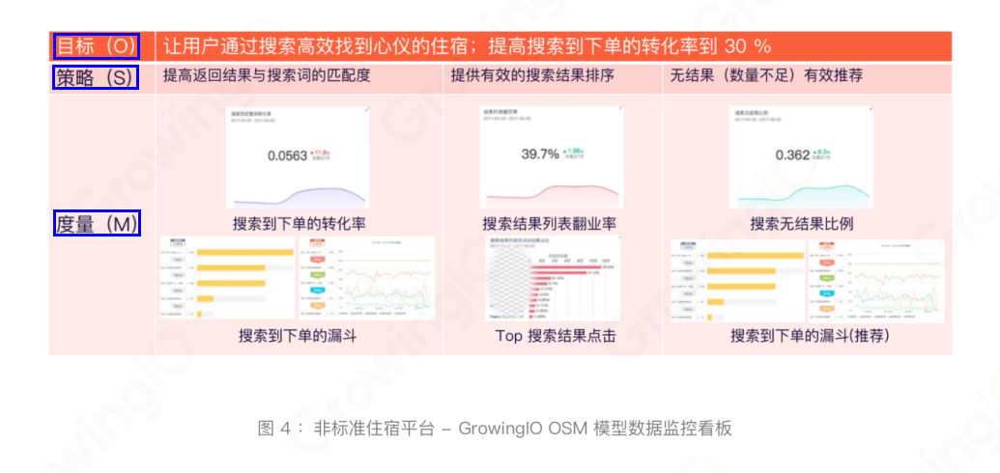
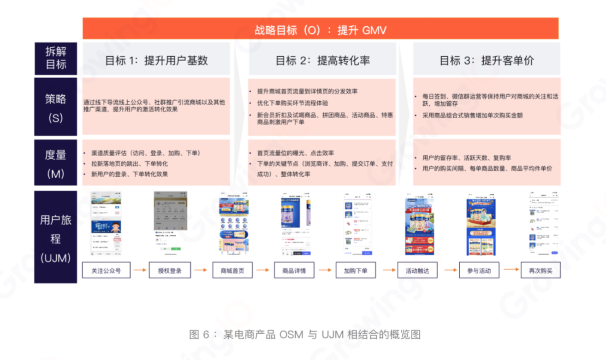
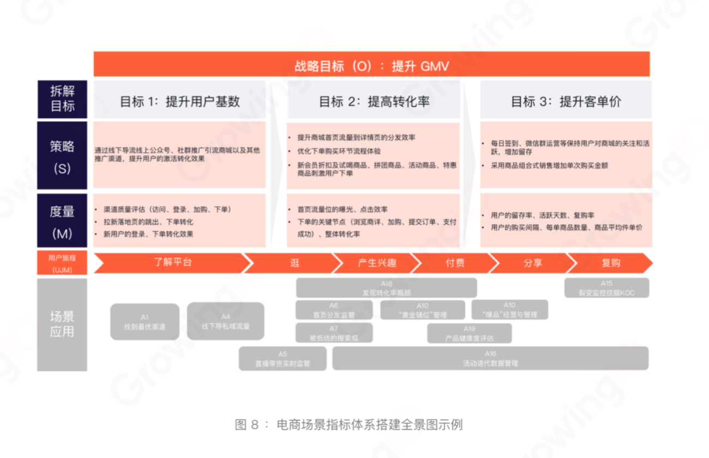

# 一、其他
## 1.数据分析报告

数据分析报告有哪些类型？
- 周会&月会业绩综述 
一般放在会议的第一部分，用描述性的统计数据，去呈现业务的全貌、关键节点发生的相关事件。并且用一两句话总结趋势和问题点。会上后续各个业务方都会进来补充细节。要求报告简洁精炼，高度概括点到即止。比方说大促期间gmv上涨8%，低于预期，主要的原因是直播场次排布和营销投放节奏出现偏差，把这个事情的性质说清楚，就不要去具体的解释这个偏差是什么，因为后面业务会来解释。这对这样的一类报告，通常我们会按照管理层的阅读习惯，用模板去固化下来。
- 复盘和效果评估 
这种报告没有固定的模式，原则上就是客观合理的还原事实的依据。这类报告当中比较容易出现一个方向性的偏差，就是做着做着变成了定责追责。这类的分析报告，重点要落在经验的沉淀上面，哪些有用，哪些没用，对于业务往后的动作有什么参考价值和借鉴意义，而不是纠结于过去的一些东西。
- 业务现状分析 
这类分析报告要对业务进行全盘的诊断，难度就上来了一些，需要花大量的时间去梳理业务流程，了解产品的细节，然后去评估客户的需求是不是得到了满足，业务目标是不是合理，达成的进度是不是符合预期，组织的形态是否良性发展，报告的框架比较大，需要探索的细节很多，所以写着写着容易失焦，有两个tips，一个是写好提纲，比方说用思维导图的时候，可能会有很多的分支，那么一定要标好优先级，严格按照优先级来探索细节，这样即便时间不够的情况下，至少能cover了重点的部分，另外一个是牢记这类报告的核心思想，是纠偏和及时止损，所以聚焦在需要改进和调整的部分，如果没有问题的部分可以简单写甚至不写。
- 决策支持类的分析 
通常是关于某个命题的探讨，某件事做与不做的选择，选择就意味着权衡，衡量的就是这件事以及做和不做之间的得失，所以这类报告的关键点是找到平衡点。比方说一个客服中心，要不要把考核指标从接通率改成考核30秒内接起率，背后其实是客户服务体验和成本之间的平衡。如果要做的话，30秒是不是最合理的，为什么不是20秒或者40秒。不同的方案，测算的数据是什么，都要详细的给出来。需要注意的是，很多同学只提供决策信息，数据分析师更应该给出你的建议，因为你的思考路径对于决策者来说同样也是有参考价值的。

数据分析报告框架和呈现形式有哪些？

数据分析报告中的数据分析方法有哪些？

数字趋势话术及excel可视化

## 2.业务分析

# 1.数据指标体系

数据的核心作用之一就是，监控业务的发展变化，从数据中发现潜在的业务问题。在实现通过数据监控业务变化这项功能时，数据指标体系会发挥强大的作用。

## 1.1.指标体系概念
### （1）指标体系
百度百科定义如下：
>指标体系是指由若干个反映社会经济现象总体数量特征的相对独立而又相互联系的「统计指标」所组成的有机整体。

# 1.数据驱动
## 1.1 概念
### （1）数据驱动
数据驱动增长的框架，从下往上依次分为四个层次，在这个框架中，越顶层产生的直接价值越高，但其价值的产生，深深依赖于底层的数据规划和数据采集。只有正确的规划和采集数据，我们才能够进行正确的数据分析、产生正确的数据决策、从而真正实现数据驱动增长。
- 数据规划 
    - 用户
    - 业务系统：ERP、CRM、OA、SCM
- 数据采集 
    - 数据采集平台
    - ETL、ELT、EL
    - EDW、HDP、ODS
- 数据分析 
    - Analysis
    - BI
    - DM
    - AI
    - Insight（洞察）
- 数据决策
    - 决策
    - 行动
    - 价值
    - 用户

# 1.增长 Growth
## 1.1 前述概念
### （1）营销
营销，指企业发现或发掘准消费者需求，让消费者了解该产品进而购买该产品的过程。

### （2）什么是增长
什么是增长？增长什么呢？增长是用户增长吗？

- 增长，主要依靠技术和数据的力量来达成各种营销目标（如北极星指标），通俗的说，目标是什么，就增长什么。
- 到底什么是增长呢？增长跟营销的区别是什么呢？如果没有区别，为什么我们要新造一个词叫“增长”，而不是沿用过去的“营销”一词呢？
- 增长是在数据驱动下，迎合场景与个性化需求，进行精细化运营带来用户增长与使用度提升的行为。

### （3）增长黑客
“增长黑客”这一概念近年来兴起于美国互联网创业圈，最早是由互联网创业者Sean Ellis提出。增长黑客是介于技术和市场之间的新型管理团队角色，主要依靠技术和数据的力量来达成各种营销目标，而非传统意义上靠赚钱来获取用户的市场推广角色。他们能从单线思维者时常忽略的角度和难以企及的高度通盘考虑影响产品发展的因素，提出基于产品本身的改造和开发策略，以切实的依据、低廉的成本、可控的风险来达成用户增长、活跃度上升、收入额增加等商业目的。简单来说，就是低成本甚至零成本地用“技术”来让产品获得有效增长。

### （4）增长思维

### （5）增长指标
增长数据统计与常规运营数据统计不一样。目前，大多数互联网团队在做统计分析时会统计PV、UV、下载量、注册量、APP启动次数以及次日、3日、7日、15日、30日的留存分析，付费产品还会统计付费用户数量以及销售额，做到对产品运营情况有明确认知，运营指标也大多围绕这些考核数据。

但对于增长运营来说，数据统计的维度需要更加细化，在做数据统计维度时常常引入“用户故事地图”、“漏斗分析”、“用户数据画像”等主要概念。

增长运营里的用户画像是什么样？通过统计用户特征数据，多维度进行用户筛选，实现用户个性化运营。以用户画像的数据统计为例，常规用户画像是通过年龄、性别、地域、消费能力等情况对用户进行整体概括，但增长运营中的用户画像是通过统计用户特征数据，对用户进行「多维度」筛选，比如统计维度包括地区、设备等
用户相关信息以及访问时长、转发数量、浏览文章关键词等产品使用数据进行多维度筛选，对筛选结果用户进行针对性运营。比如电商商家可以针对24小时内浏览过某一商品但未购买用户且停留时长大于30秒的用户推送这一商品的优惠券。对于互联网产品的运营来说，可以筛选用户浏览文章关键词、文章阅读时长等维度为用户有针对性的推送相关话题的长或短篇文章。

用户画像数据统计：
- 用户所在的地区分布：将用户划分为一线城市、二线城市、三线城市及以下3个维度
- 用户使用的设备分布：按品牌划分，品牌包括苹果、三星、华为、小米、VIVO、OPPP、魅族和其他
- 24小时内访问时长分布：按30分钟以下、30-60分钟、60-120分钟、120分钟以上划分
- 平均评论/转发数量分布：按评论/转发数量1-3次、4-6次、7-10次、10-20次及20次以上划分
- 平均文章阅读时长分布：按1分钟以下、1-3分钟、4-6分钟、6分钟及以上划分
- 浏览文章关键词TOP10：统计用户浏览文章的相关关键词，统计关键词出现次数的TOP10

### （6）增长运营
增长运营要通过数据建立3种认知：
- 产品认知 
利用数据反馈产品和内容的用户体验。产品认知是指通过数据统计用户使用行为
- 市场认知 
- 用户认知 

# 1.数据化运营
# 2.用户运营
# 3.活动运营
# 4.产品运营
# 5.内容运营
# 6.数据指标体系
## 6.1 概念
### （1）统计
当今世界，人类已步入信息社会，无时无刻不生活在信息的海洋中。其中，统计信息作为社会经济信息的主体，被广泛运用于社会、科技和国民经济的各个部门、各个行业，日益受到社会的重视。因此，“统计”二字在日常生活、经济工作和科学研究中出现的频率越来越大。

什么是统计？对此一般可以作三方面理解。
- 统计资料 
统计资料，即统计信息，是反映一定社会经济现象总体或自然现象总体的特征或规律的数字资料、文字资料、图表资料及其他相关资料的总称。它包括刚刚调查取得的原始资料和经过一定程度加工、整理的次级资料。其形式有：统计表、统计图、统计年鉴、统计公报、统计报告和其他有关统计信息的载体。
- 统计工作 
统计工作，即统计实践，或统计活动，是在一定的统计理论指导下，采用科学的方法、搜集、整理、分析统计资料的一系列活动过程。它是随着人类社会的发展，随着治国和管理的需要而产生和发展起来的，至今已有四五千年的历史。现实生活中，统计工作作为一种认识社会经济现象总体和自然现象总体的实践过程，一般包括统计设计、统计调查、统计整理和统计分析四个环节。
- 统计科学 
统计科学，也称统计学，是指导人们认识社会经济现象总体或自然现象总体数量特征的一门科学，是统计工作经验的总结和理论概括，是系统化的知识体系。

统计资料是统计工作的成果，统计工作与统计科学之间是实践与理论的关系。

### （2）统计学研究的方法
统计学是研究客观现象总体数量方面的一门学科，有一些专门的方法，这些方法相互联系、相互影响，构成了统计认识的方法体系。
- 大量观察法
- 统计分组法
- 统计指标法
- 统计模型法
- 统计推断法

### （3）大量观察法
大量观察法是指统计研究要从现象总体角度加以考察、对现象总体中的全部或足够多的个体进行观察登记的方法。因为社会经济现象总体是由许多的个体构成的，其中每一个体的特征及数量表现有很大的差别，所以如果孤立的对其中少数个体进行观察登记，其结果往往不足以反映现象总体的一般特征。必须对全部或足够多的个体单位进行观察研究，经过综合概括，使各单位之间的差异相互抵消，以显示出所研究的客观总体的本来面目，使我们能正确地从总体上把握客观事物的本质特征和规律性。

### （4）统计分组法
统计分组法是根据统计研究的目的和被研究对象的特点，按照一定的标志，将研究总体中的个体划分为若干个组成部分的方法。这种方法可以把总体内部相同或相似的单位归并在一起，把组与组明显区别开来。这样就可以对总体单位划分类型，反映总体的内部结构，分析总体各部分之间的相互关系等等。这是一种“解剖麻雀式”的认识总体数量特征的方法。

### （5）统计指标法
统计指标法就是运用统计指标来研究社会经济现象总体的数量状况，以认识事物本质或规律性的方法。统计指标法包括的具体方法很多，诸如总量指标法、相对指标法、平均指标法、动态指标法、统计指数法等。经过统计整理和分析，我们可以计算出说明现象总体在具体时间、地点条件下的总量规模、相对水平、集中趋势、变异程度等各种综合指标。这些指标都概括地描述了总体各方面的数量特征和规律。

### （6）统计模型法
统计模型法是根据一定的经济理论和假设条件，用「数学方程」去模拟现象发展变化趋势或现象之间相互关系的方法。利用这种方法可以对社会经济现象的变化或现象之间相互关系进行数量上的估计和预测，在很大程度上提高了统计分析的认识能力。它是经济管理、经济预测与决策中常用的一种统计方法。

### （7）统计推断法
统计推断法也称归纳推断法，是根据样本数据来推断总体数量特征的方法。它是归纳法在统计推理中的应用。归纳法是指由个体到一般，从事实到概括的逻辑推理方法，可以使我们从具体的事实中得出一般结论。在统计活动中，我们所研究的总体往往包含大量的甚至是无限多的总体单位，而对这许多的个体进行调查登记有时候是没有必要的，有时候是不可能的，因此我们只对其中的一部分单位进行登记研究，并且用这一部分单位所组成样本的资料对整个总体的数量特征作出科学的统计推理。

### （8）假设检验法

### （9）指标
指标是<u>说明总体数量特征</u>的概念及其数值的综合，故又称为综合指标。

在实际的统计工作和统计理论研究中，往往直接将说明总体数量特征的概念称为指标。例如：如果把某市工业企业为统计研究总体，该市2016年工业企业从业人数554万人，工业产值456亿元，理论总额45亿元就是指标。这里的从业人数、工业产值和利润总额为指标名称，554万人、456亿元、45亿元是指标数值。一个完整的统计指标一般应由指标范围、时间、地点、指标名称、指标数值和计量单位等要素构成。

### （10）指标分类
指标按说明总体内容的不同，可以分为数量指标和质量指标两种
- 数量指标 
例如从业人数、工业产值和利润总额。数量指标是反映总体总量的指标，是说明总体外延的规模大小、范围宽广或者水平高低的，其数值一般随总体范围大小的增减而增减，通常用绝对数表示。数量指标是最基本的统计指标，是计算其他指标的基础。
- 质量指标 
例如人口性别比例、人均粮食产量、平均工资。指令指标是反映总体内在的质的特征的，用来说明总体各部分之间、总体部分与总体之间、各总体之间的对比关系，通常由几个指标数值对比计算得到。

指标按表现形式不同，又可以分为总量指标、相对指标和平均指标。
- 总量指标 
属于数量指标。
- 相对指标 
属于质量指标。
- 平均指标 
属于质量指标。

### （11）指标体系
指标体系是指由若干个反映社会经济现象总体数量特征的相对独立又相互联系的统计指标所组成的有机整体。

在统计研究中，要说明总体全貌，只使用一个指标往往是不够的，因为它只能反映总体某一方面的数量特征。这个时候就需要同时使用多个相关指标，而这多个相关的又相互独立的指标所构成的统一整体，即为指标体系。如要综合反映某市工业企业这个总体的生产经营情况，就必须使用总资本额、总从业人数、总产值、总利润额和平均资金利润率等指标来说明。

指标体系：数学式联系、框架式联系。

指标体系中的各个指标之间既可以保持数量上的对等关系，又可以没有这种关系。前种情况称为数学式联系的指标体系，如收入、费用和利润这三个指标构成的指标体系中，利润等于收入减去费用；后种情况称为框架式联系的指标体系，如总资本额、总从业人数、总产值、总利润额和平均资金利润率等指标所构成的指标体系。

- 数据指标体系搭建，表面看是个执行问题，单背后反映的是流程、用户体验、商业、数据四个维度的集合，是给管理者的战略指导方针。

为什么要搭建数据指标体系：
- 随着流量成本倍增，粗放式经营失效等原因，企业越来越关注用户体验，希望提升各环节转化效率，落地精细化运营，按照用户旅程层层拆解指标、定位问题、优化策略。越来越多的企业开始直连用户，沉淀用户数据资产，推动业务增长。

### （12）静态分析指标
统计分析是统计整理的深入。在统计分析的各种方法中，<u>统计指标法是最基本的方法。而统计指标中最基本的是静态分析指标</u>。

所谓静态分析指标，是指根据同一时间条件下总体各单位的标志值汇总计算的指标，或者根据同一时间条件下多个指标数值计算的指标。按照其表现形式不同，指标可以分为总量指标、相对指标、平均指标和标志变异指标。

### （13）核心指标
### （14）结果指标
结果性指标，就比如电商场景下的GMV或订单量，它通常是业务漏斗的底部，是一个「不可更改」的、后验性的指标。

### （15）过程指标
过程性指标，可以简单理解为我们到达这个结果之前经过的路径，以及通过这个路径去衡量转化好坏的过程，它是「可干预」的，而且通常是用户行为。

优化过程指标可以改善结果指标的表现。

### （16）业务过程
### （17）北极星指标

## 6.2 规划数据指标体系
### （1）为何要规划
数据指标体系建立的第一步，就是要做好数据指标体系的规划。没有做好规划，经常出现以下问题：
- 难以快速定位问题原因 
 因为缺少体系化的数据指标监控，更关注结果性数据，很多过程性数据往往被忽略。这就导致当业务结果异常时，靠单一数据或者不成体系的数据，很难快速定位具体原因。
- 前期数据未采全，后期反复 
 数到用时方恨少
- 上下目标没对齐 
 事先没有进行数据指标体系的规划，也很容易导致我们从上到下的目标没有对齐。也就是从公司的战略目标、业务部门的目标、到各个业务线之间的目标没有对齐。
- 监控、分析数据阶段没有治理 
 没有治理的表现就是表多、数多、数据乱、报表看不懂，造成整个业务团队效率非常低下。

### （2）指标体系规划三步走
规划数据指标体系遵循 OSM-UJM-场景化 三步走思路。
- 首先，通过OSM拆解业务目标，使之结构化。
- 其次，结合UJM梳理用户生命旅程，将公司目标、策略与业务流程快速耦合在一起。
- 最后，通过场景化模块，推动指标体系落地。

### （3）OSM 模型
OSM模型，全称是 Object-Strategy-Measure。
- O代表业务目标Object。需要我们思考或者回答，我们的业务、产品、甚至是其中的一个小的功能存在的目的是什么、能够解决用户什么问题、满足用户的什么需求？如果你是公司的负责人，想一想公司的「核心目标」是什么，可能是公司今年的营收、利润额等。如果你是产品部门负责人，那你需要思考未来几年的产品方向、规划、路线图等。
- S代表业务策略Strategy。是指清楚业务目标之后，为了达成上述目标，我们应当采取的业务「策略」。
- M代表业务度量Measure。用于衡量我们的策略是否有效，是「策略的效果评估」，反映目标的达成情况。业务度量涉及两个概念，一个是KPI，用来直接衡量策略的有效性；一个是Target，是预先给出的值，用来判断是否达到预期。

### （4）OSM案例
OSM模型在App搜索场景的应用

以非标平住宿平台为例，从负责搜索功能的产品经理的角度，将OSM模型应用于实践，搭建一套数据监控指标体系。非标住宿有个特定，就是产品个性化。比如说住宿的时候选择情侣房等个性化住房，其数量是有限的，同一个风格的房源一般不会超过5间。一般情况下，非标住宿搜索预订的流程为：发起搜索-->搜索结果页-->产品详情页-->填写订单-->预订成功。

### （5）O-选定目标
在这个例子中，选定目标用了2种视角：
- 1.用户视角，用户可以使用搜索功能高效的找到自己心仪的住宿产品。
- 2.业务视角，通过提高搜索成功率，进而提升客户的下单转化率。

如何确定业务目标：
一个简单的办法就是从公司核心KPI目标拆解到业务线核心目标，长期目标和短期目标应该相辅相成。
在选取目标的时候，我们要注意4个原则，即DUMB：
- 切实可行 Doable
- 易于理解 Understandable
- 可干预可管理 Manageable
- 正向的有益的 Beneficial

### （6）S-采取策略
第一，返回与用户搜索值相匹配的搜索结果。

第二，提供有效的搜索结果排序。对于非标类产品，我们需要思考怎样把用户感兴趣的产品放在第一屏或者前三位，能够让用户一眼就看到他想搜索的产品。

第三，当搜索没有结果或者结果不足时，我们就要做有效的推荐。

### （7）M-效果评估【选指标】
选择合适的OSM指标度量。针对从搜索到下单的整个流程，拆解2个KPI「指标」。
- 搜索到详情页的转化率，在这一步，用户通过搜索得出想要的结果，才会点击产品的详情页。
- 详情页到下单的转化率，在这一步，如果用户看到的产品详情页是符合心意的，才可能会产生订购，达到最后的预订成功。

在这里，我们需要设定Target来衡量指标的好坏，这可以基于我们内部的历史数据和行业的数据，其设定原则是：要对内部有一定的挑战性，但又不是遥不可及的。这里，历史数据显示，从开始搜索到商品详情页，转化率是23%；从商品详情页到最后预订成功，转化率是23.8%。所以，我们可以设定30%作为target，作为预期的KPI-target。然后再看指标数据，是否达到target，策略是否起作用。

### （5）UJM
UJM，全称是User Journey Map，用户旅程地图。UJM模型就是我们在设计一款产品的过程中，必须要去梳理的用户生命旅程。

梳理UJM的过程包括：拆解用户所处的一个旅程阶段、了解每个阶段中用户的行为、明确每个阶段中产品的目标、发现各阶段中产品与用户的接触点、最终从接触点里找到产品的痛点和机会点。

### （6）UJM-阶段
以一个简化版的电商产品UJM为例，用户使用一款电商产品，大致会经历6个阶段：从各个途径了解该电商产品，并进入该产品 --> 通过首页、搜索功能乃至商品类目页等其他各个入口逛平台 --> 对商品产生兴趣，进入到商品详情页 --> 进入付费流程，完成一次重要的转化 --> 分享、复购阶段。

### （7）UJM-各个阶段目标
在整个用户旅程中，用户会反复繁盛各环节间互相的跳转。我们需要为每一个阶段都设置对应的一个目标。在这一思路中设置出的目标就可以去反哺我们之前定出来的OSM框架，判断其是否有遗漏。（OSM我们设置了final业务目标，和一套组合策略、各个策略有指标衡量，而UJM各个阶段的目标可以反哺我们的组合策略是否有遗漏）。

### （8）UJM-接触点
各阶段目标确定后，我们需要寻找到产品为了达到这一目标，与用户产生的接触点，例如首页的各大流量位，搜索页面和搜索框，商品类目页等就是用户逛产品时的接触点。

### （9）UJM-痛点
了解接触点后，我们紧接着就能找到每个环节的痛点，而痛点的反面就是我们的机会点。这里的每个机会点都可以反哺前面OSM模型中的S（Strategy），判断我们的机会点是否与业务策略相互吻合。

- UJM每一阶段机会点与OSM-S策略的对应。

### （10）UJM价值
为了要引入UJM，融入UJM有什么价值？通过梳理用户旅程，将UJM与OSM进行关联，使得我们的业务目标（OSM-O）能够满足用户需求，我们的策略（OSM-S）能够回答业务问题，达成用户旅程与业务目标相互耦合、相互影响的效果。

### （11）UJM与OSM模型结合
OSM模型与UJM模型相结合，可以激发有趣的化学反应。

OSM模型将迫使企业高层思考，公司现阶段最重要的（战略）目标是什么（是拉新还是盈利），哪些业务承载这些目标；而业务部门则可以通过UJM模型，将公司目标、策略与业务路程快速耦合在一起，最终形成一个清晰、明确的数据采集体系，数据语言变成了公司上下协同的统一语言。

上图梳理了OSM模型与UJM模型相结合，关联业务目标与用户路程的展示图。

首先，我们可以将电商的一个战略目标（O）“提升GMV”，根据电商的经典公式进行拆解。拆解称为三大目标分别是：提升用户基数、提高转化效率以及提升客单价。

接下来每个目标下面都会有对应的一个策略（S），而这里的<u>策略其实都是来自于刚刚的UJM模型里梳理出的用户每一阶段的机会点</u>，每个策略也都会有对应的一个度量指标（M）。
- OSM中的S并不是独立构建的，而是结合UJM每个阶段的机会点构建的。
- OSM的每一个目标（O）对应的策略、度量指标都是与用户旅程的每一环节对应。这样我们就有了一个数据指标体系的大框架。

### （12）场景化
用户旅程是一个通用的旅程，太过宏大，还不够执行与落地，梳理具体的通用的场景后，可以将场景分阶段（分门别类）对应到用户旅程中，来满足不同部门从拉新到转化最终到提升客单价等环节、不同层级的需求。（场景是各个部门的业务场景，如市场部、用户部等等的业务、功能。）

为什么需要场景化？

有了大框架后，就能直接开始去落地采集数据、洞察数据吗？光有OSM和UJM模型，在实际落地过程中还是有一些掣肘，这个框架过于庞大，当我们想要快速切入、快速落地的时候，往往可能找不到明确的切入点。

如何将这些高高在上的战略目标下沉到一些执行人员的具体工作中？

场景化就是为了帮助我们在庞大的OSM模型+UJM模型之下，能够模块化、结构化、具象化的快速切入落地指标体系。也就是说，场景化在这里的作用就是推动指标体系的落地。

### （13）互联网产品通用型场景

### （14）OSM+UJM+场景化指标体系搭建

在OSM模型与UJM模型关联的基础上，我们<u>在每一个环节（UJM阶段）上又对号入座了各自关键的场景</u>。

举一个例子，第一个目标是“提升用户基数”（OSM-O），对应的用户旅程阶段是需要用户从不同的渠道、平台了解产品（UJM-阶段），所以需要对应的就是“找到最优渠道”这一场景（场景化）。或者考虑是否有线下活动可以导入私域流量，如果有线下活动的渠道，还需要融入“线下导私域流量”的场景。

<u>有了OSM模型和UJM模型并「匹配」到了我们的各个场景后，整个指标体系就可以从一个非常大的战略目标进行层层拆解，拆解到我们一线执行人员可落地的场景中。（将战略根据场景分到各个执行部门）</u>

## 6.X 指标体系搭建方法论

量化业务目标，需要构筑一套业务指标体系，构建指标不能是启发式的想到什么就建什么指标，构筑指标体系是有套路可循的。
- 第一关键指标法构筑指标体系
- 套用AARRR模型构建基于用户的指标体系
- 应用Pipeline衡量销售流程（转化漏斗）

### ➤➤➤ 关键指标 ➤➤➤
这种方法的第一步就是寻找“最核心的指标是哪个？”，确定了第一个关键指标后，我们就将它逐层分解，分解到一定程度，指标体系也就有了。

第一关键指标法应该是普适性最强的构建指标体系的套路，并且非常灵活，因为最重要的指标在不同阶段是会改变的，或者随着企业的战略目标改变，第一关键指标变化后，指标体系就该重构了。

### （1）例子
假如我们确定了“销售额”是现阶段的第一关键指标，那么，分解过程如下。

- 确定第一关键指标
- 按计算方式先行分解
- 按影响因子分解
- 核心维度分解
到维度细分层面，指标会非常多，建议只挑选关键的维度进行追踪。

### ➤➤➤ AARRR模型 ➤➤➤
- Acquisition 用户获取（获取）
- Activation 用户激活（活跃）
- Retention 用户留存（留存）
- Revenue 用户价值转化（收益）
- Referral 用户推荐（传播）

### （1）AARRR
“用户获取-->用户激活-->用户留存-->用户价值转化-->用户推荐”，这就是AARRR模型。它基于这样一个「假设」：企业的经营过程就是围绕用户群体展开的，这样的假设非常适用于互联网公司。因此，许多互联网公司的指标体系就参考AARRR这五个环节来设计。

### （2）侧重哪个环节
在实际业务中，我们不能教条地将五个环节都作为指标追踪的内容，而是要根据业务的变化有所侧重。
- 初始阶段 
如果你所在的业务正在初始阶段，产品还不够完善，你就应该将重点放在“留存”这个环节，因为它直接反映了你的产品能不能留住用户。「留存」的计算是通过某种规则将用户切片，观察每个细分群体随着时间的变化的使用情况。等用户留存逐步增长到一个稳定值，说明你的产品已经具备了留住用户的能力，就可以进入成长期。
- 成长期 
在成长期，我们期望能快速地获取新用户。在这个阶段要把重点放在“用户获取”、“用户激活”、“用户推荐”三个环节。
    - 「用户获取」的关键是要衡量用户获取的效率，一般从注册转化率和用户获取成本两个角度来衡量。
    - 「用户激活」需要做出定义，建议用比较严格的定义方式，比如定义注册完成并完成新手引导同时在第二天有登录的用户为激活用户。
    - 「用户推荐」做得好，形成口碑营销甚至是病毒传播，能大大降低用户获取成本。
- 成熟期 
在产品的成熟期，我们的注意力会放在「用户价值」的转化上。这时会去衡量用户生命周期价值、付费用户转化率、利润率等指标。
用户生命周期价值的计算逻辑就是将从单个用户端获取的收入分摊到使用产品的每一天上，将所有活跃用户每天分摊到的金额进行汇总，就是当天的总的用户价值。

### ➤➤➤ Pipeline漏斗转化 ➤➤➤

### （1）Pipeline
Pipeline就是销售管道。将销售流程想象成管道，流程中的各个环节就是一节节的管子，销售线索就是管道中的水流，销售过程就是水流通过一节节拼接而成的管道的过程。由于管道是多节的，因此在接口处水流会漏出，各个环节的效率越高，水流损失越少。

在软件行业中，销售管道一般形如“用户注册形成线索-->销售对接-->产品演示-->部署试用-->签订合同-->付款”。计算每个环节间的转化率，就是Pipeline数据追踪的过程。业务结果是看整个管道的转化效率，而优化思路是改进转化率较差的环节。

可以将Pipeline理解成一种漏斗。在业务分析中，凡是有计算转化率的地方，都可以想象是否存在Pipeline。

# 7.AARRR
AARRR需要运营人员和数据人员紧密配合，或者运营人员具有很好的数据分析素养，即运营「动作」+数据「指标」结合。
## 7.0 AARRR综述
## 7.1 A-用户获取
- 在互联网行业经典的运营体系“AARRR”模型中，拉新为其中第一环节，也就是为当前产品拉来新用户，拉新的质量直接影响了后面的活跃、留存质量。高质量的拉新离不开合适的内容、产品定位、用户和渠道。也就是，当有了合适的产品，用合适的内容将合适的用户从合适的渠道引过来。

### （1）PMF

### ➤➤➤ 用户获取运营方式 ➤➤➤

### ➤➤➤ 指标 ➤➤➤
## 7.2 A-用户激活
## 7.3 R-用户留存
## 7.4 R-用户价值
## 7.5 R-用户推荐

# 7.分析方法
# 8.分析框架
分析框架（指标体系）要多样化，不要局限于一种框架
# 9.数据模型
# 10.业务模式
电子商务的定义，可以分为广义和狭义的两个方面。广义的电子商务，又称电子业务（e-business,EB），泛指利用包括Internet在内的一切信息网络和信息技术进行的所有业务活动。狭义的电子商务，又称电子交易（e-commerce，EC）主要指利用Internet提供的通信手段而进行的网上商业交易活动。

# 2.数据驱动前述
## 2.1 概念
### （1）精细化管理
- 精细化管理是个不断迭代的过程。为了得到更为精准的结论（如某部分客群的偏好），阶段性运营数据获取的新发现，在后续的运营中是需要不断测试的。

### （2）数据运营

### （3）精细化运营
### （4）用户的消费特征
### （5）用户分层
### （6）用户偏好
### （7）用户画像

# 3.数据指标体系

## 3.2 从0-1构建指标体系
- 一个成熟项目的指标体系往往经过前人的构建和完善后，已经非常成熟，不必从0开始构建产品的数据指标体系。但是一定会有接触新产品的时候，即便是同一产品在不同的生命周期重点数据指标也可能不一样。

## 3.3 指标大全
### ➤➤➤ 电商行业 ➤➤➤

# 4.数据分析方法
# 5.数据模型

# 6.精细化运营

## 6.1.概念
### （1）用户分层、用户分群、用户价值
###### 用户分层
- 用户分层是指根据用户的某一特性划分层次，不同层次具有不同的性质和特征。

###### 用户分群
- 用户分群

###### 用户价值

# 一、运营体系

## 1.C端运营体系
## 2.B端运营体系

==
1.数据化运营
- 业务、数据、运营：业务中有数据，数据中有运营
- 行业特性--运营框架--

http://www.crazypm.com/tag/%E6%8C%87%E6%A0%87%E4%BD%93%E7%B3%BB_1.html

http://www.woshipm.com/data-analysis/3366141.html

https://www.pinterest.com/pin/857302479046834658/

https://github.com/wnma3mz/Reading-Books/blob/master/%E7%A1%85%E8%B0%B7%E5%A2%9E%E9%95%BF%E9%BB%91%E5%AE%A2%E5%AE%9E%E6%88%98%E7%AC%94%E8%AE%B0.pdf

https://blog.growingio.com/courses/498

http://www.woshipm.com/operate/4168608.html

kindle搜索关键词：精细化、数据化运营（管理、决策）、用户运营、产品运营、活动运营、内容运营、精细化运营（决策）

https://www.iyunying.org/growth-hacker/226317.html

https://www.growingio.com/ebook

http://www.woshipm.com/operate/1200682.html

互联网名词：http://www.gupowang.com/article/view/4032

爱运营 https://www.iyunying.org/yunying/100693.html

关注链接：
- [爱运营](https://www.iyunying.org/yunying/100286.html)