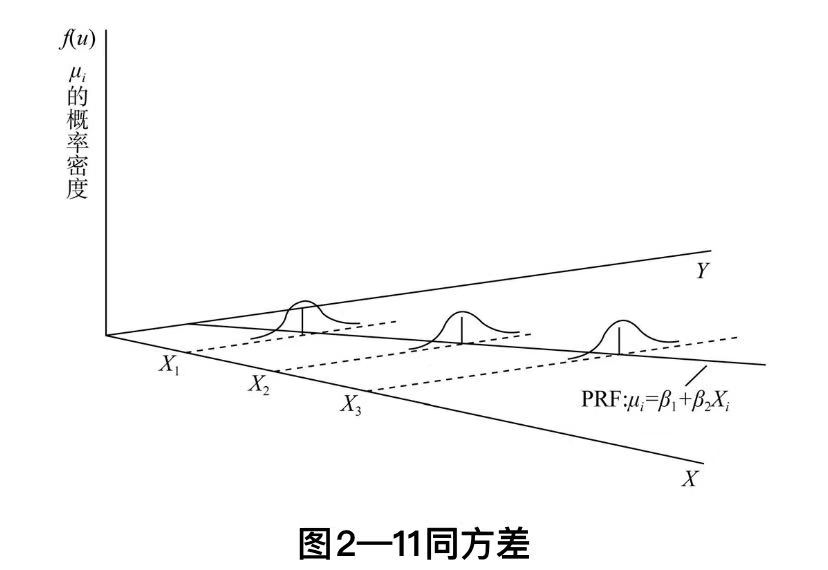
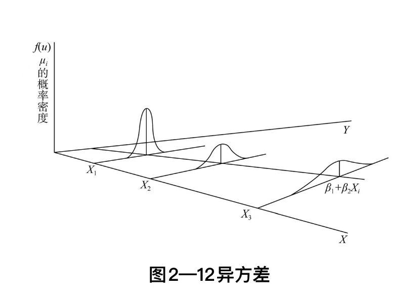

# （一）统计学
## 1.统计学发展

### ➤➤➤古典统计学➤➤➤
17世纪中叶~18世纪中叶，这是统计学的创立时期。
### （1）国势学派
又称记述学派，由于该学派主要以文字记述国家的显著事项，故称记述学派。
- 该学派在进行国势比较分析中，偏重事物性质的解释，而不注重数量对比和数量计算。

### （2）政治算术学派
这里的政治是指政治经济学，算术指统计方法。注重数量对比和数量计算。注重从数理角度探讨社会经济现象规律的活动。标志着统计学的诞生。不同于记述手段，明确地用大量的数据资料分析问题，试图把研究结论建立在可靠的事实基础上。

统计研究方法是数量性质的，主要以数字资料为语言，通过对数字资料的分析探讨客观现象发展变化的规律。

统计学产生之初，主要是为研究社会经济问题。

### ➤➤➤近代统计学➤➤➤
18世纪末~19世纪末
### （1）数理统计学派
- 数理统计学派产生于19世纪中叶，它是在概率论已有相当发展的基础上，把概率论引进统计学而形成的。促进了统计学的研究手段由”算术“阶段向”数理“阶段的迅速转变，是统计学发展成为一门既适用于自然科学又适用于社会科学的通用方法论。
- 奠基人是凯特勒，主张用研究自然科学的方法研究社会现象。最先用大数据定律论证了社会生活现象纷繁复杂变化的偶然性中存在着一定的规律性，并提出了**误差理论**，在方法论方面解决了统计观测的准确性问题。
- 由于历史局限性，凯特勒在研究社会问题过程中混淆了自然现象和社会现象的本质区别。
### （2）社会统计学派
19世纪后半叶，社会统计学派以德国为中心，认为统计学是研究社会总体而不是个别的社会现象，认为由于社会现象的复杂性和整体性，必须对总体进行大量观察和分析，研究其内在联系，才能揭示现象内在规律，这是社会统计学派的实质性科学的显著特点。

### （3）统计方法
社会经济的发展，要求统计学提供更多的统计方法，向方法论转换。
### （4）描述统计
高尔顿、皮尔逊为代表的，共同创立了描述性统计的基本体系。

### ➤➤➤现代统计学➤➤➤
20世纪初迄今。

- 数理统计学由于广泛用于自然科学和工程技术而获得快速发展。首先，它**在随机抽样的基础上建立了推断统计的理论和方法**。
- 随着数学发展，数理统计学越来越广泛的应用数学方法
- 出现了数理统计学新分支和以数理统计为基础的边缘学科，如抽样理论、非参数估计、多变量分析、时间序列分析，经济计量学、工程统计学
- 数理统计学称为现代统计学的主流派。社会统计学发展缓慢，且由实质性科学向方法论转变。

### （1）推断统计
通过随机样本来推断**总体数量特征**的方法。

### （2）统计假设理论
### （3）决策理论
将统计雪中的估计和假设理论加以归纳，创立了决策理论。
### （4）样本分布理论
### （5）试验设计的理论和方法

### （6）概率论
柯尔莫哥洛夫把勒贝格测度引入概率论研究，使人们第一次清楚地认识到现代统计学的继承--概率论原来也是数学大家庭的一员。
### （7）t分布
t分布，揭开了小样本统计推断研究的序幕。有的实验不能多次重复进行，必须依据少量观察做出结论，比如有些化学实验、生物学实验，它们也应该成为统计学的研究对象。
### （8）统计方法论
### （9）经典统计学
所谓经典统计学是以内曼和皮尔逊为代表，以频率思想为基础、以置信推断为基本特征的统计学。
### （10）贝叶斯统计学
指以贝叶斯公式为核心、以先验信息和后验信息为综合依据、以辩证推断为主要特征的统计学。

### ➤➤➤大数据统计学➤➤➤
### （1）大数据
所谓大数据就是一个大的样本和数据集合，通过某些样本的问题，利用统计学来进行抽样分析，达到需要的精度，由于有些问题维数高，需要通过统计学原理来降维，压缩以及分解。
### （2）数据预处理

## 2.统计思维
任何科学研究，无论是自然科学还是社会科学，都是试图回答休谟诘问：如何从经历到的过去、特殊、局部，推论到没有经历到的未来、一般、整体？都遵循以下过程，首先是关于偶然的、个别的、特殊的现象的观察；其次是从对偶然的、个别的、特殊的现象的观察中，提出假说，或者说理论，或者是模型，这些假说是关于必然、一般、普遍现象而言的；然后对假说进行检，检验方法一般包括实验的方法、预测的方法和回归的方法；最后是发现，关于必然、一般、普遍的规律的发现。

## 3.统计学基本概念
### （1）小数据
- 小数据是样本数据。小数据是是因为回答特定问题，通过传统抽样调查方式获得的数据，小数据是基于抽样调查技术而建立的数据收集、存储、传输、处理的安全系统，抽样调查时小数据的本质特征。
- 小数据来源于实验室，来自于被测试者（样本）的调查
- 数据体量小且通过传统抽样方式采集的数据就是小数据
- 小数据是围绕不同个体的人而采集的相关兴趣爱好
- 大数据重相关关系的发现，小数据则有利于发现因果关系，因为小数据是在海量数据下根据特定需要有针对地提供个性化服务或寻找因果关系的依据

### （2）大数据
- 不是随机样本，而是全体数据。（在一定条件下的全体数据，大数据并不一定等同于总体数据）
- 不是精确性，而是混杂性
- 不是因果关系，而是相关关系

样本、总体、参数、估计、特征等等、回归、中位数、似然函数、矩估计、卡方分布
### （3）统计学是什么
>统计学是收集、分析、展示和解释数据的科学。
- 统计学有两个大的分类，数理统计学和应用统计学，一个偏理论一个偏应用。应用统计学分为描述性统计学和推断性统计学，分别对应数据分析和数据挖掘。
- 统计学起源于收集数据的活动
- 统计学研究客观现象的数量方面，数量包括确定性数量和随机性数量，对一个问题，可用确定的数量方法进行认识，也可以把它转化为随机性数量来研究，而统计学研究随机性数量，主要依靠概率论。所以概率论是统计学的第三个来源。
- 描述性统计学和推断统计学的争论，构筑了统计学的完整体系

### （4）科学研究
科学研究的方法是：观测世界或进行试验，得到数据，提出可以解释这些观测的假说或理论，试图尽可能地接近现实世界的规律。

当出现理论或假说无法解释的现象（数据）时，就有可能需要对原有理论进行修正或者代之以新理论。

试验-->数据-->假说-->分析评估结论-->重复

### （5）试验
### （6）数据
### （7）假说/模型
统计学的假说或理论称为模型。
- 统计学的模型仅仅是对现实的仅是，没有任何模型是”正确“的，也无法证明任何模型是正确的。
- 在数学逻辑中存在的确定性在统计中完全不成立。
- 能否解决实际问题是评价统计方法的最终标准。

### （8）分析结论（假说）
评估结论的可信度

### （9）总体回归模型
计量经济学模型方法说到底就是回归分析方法。任何一项计量经济学应用研究课题，首先也是最重要的工作是设定总体回归模型。只有设定了正确的总体回归模型，才能通过严格的数学过程和统计推断，得到正确的研究结果。因此，它决定了应用研究的成败。
$$Y=f(X)+\mu=\beta_0+\beta_1X+\mu$$

总体回归模型与样本回归模型不同点：
- 描述对象不同 
总体回归模型描述总体中变量 y 与变量 x 的相互关系，而样本回归模型描述所观测的样本中变量 y 与 x 的相互关系。
- 建立的模型不同 
总体回归模型是依据总体全部观测资料建立的，样本回归模型是依据样本观测资料建立的。
- 模型性质不同 
总体回归模型不是随机模型，样本回归模型是随机模型，它随着样本的改变而改变。

### （10）总体回归函数（方程）
$$E(Y|X) = f(X) = \beta_0 + \beta_1X$$
### （11）样本回归模型
$$Y=\hat Y+\hat\mu=\hat{\beta_0} + \hat{\beta_1}X+\epsilon$$
### （12）样本回归函数（方程）
$$\hat Y = \hat{\beta_0} + \hat{\beta_1}X$$
### （13）随机干扰项
随机干扰项，又称随机误差项、随机扰动项，指不包含在模型中的解释变量和其他一些随机因素对被解释变量的总影响项。随机干扰项包括：模型中省略的对被解释变量不重要的影响因素（解释变量）；解释变量和被解释变量的观测误差；经济系统无法控制、不易度量的随机因素。将随机误差项引入模型，是计量经济学和数理经济学的根本区别。
- 随机干扰项不是一个固定的值，而是一个变量。与截距的区别。截距称之为参数，随机项可不是参数。
- 模型数学形式的误差，如用线性模型近似非线性经济关系，不属于随机误差。
- 随机项反映了未纳入模型中的其他各种因素的影响
- 计量经济模型就是由有关的变量、相应的参数、随机干扰项组成的数学表达式，借以反映经济变量之间的因果相关关系。

### （14）残差
- 用残差 $e$ 去估计随机干扰项 $\mu$。
- 随机误差项（随机干扰）标识总体模型的误差，残差标识样本模型的误差。
- 随机误差项：观察值 $y_i$ 与条件期望 $E(Y|X_i)$ 的差
- 残差：观察值 $y_i$ 与估计值（样本条件均值）$\hat {y_i}$的差
- 无关紧要的因素或者未考虑到的因素会体现在残差上

### （15）均值回归

## X1.主成分分析
### （1）主成分分析
- 在实际的课题或者事件中，为了全面分析问题，往往提出很多与此有关的因素。每个因素又都在不同程度反映了事件的某些信息，然而对每个因素逐个进行分析不仅会增加分析的复杂性，而且还可能忽略了它们的某些内在联系。因此，在如此多的因素之中，人们希望能够找出它们的少数“代表”来对某课题或事件进行描述，也即主成分分析。
- 主成分分析，是将多个变量通过「线性变换」以选出较少个数重要变量的一种多元统计方法，旨在利用降维的思想把多指标转换为少数几个综合指标。它是把各变量之间相互关联的复杂关系进行简化分析的方法，试图在力保数据信息丢失最少的原则下对这种多变量的截面数据最佳综合简化，也就是对高维变量空间进行降维处理。
- 当我们对事件进行全面分析时，会发现决定事件的变量很多，每个变量在不同程度上反映了事件的某些信息，并且这些变量彼此都有一定的「相关性」，那么他们所反映的信息就会有一定的「重叠性」。此时，我们会发现这些众多的变量会增加我们统计或分析问题的复杂性。在实际课题中，在进行定量分析的过程中，我们总希望在较少变量的情况下，获得更多的信息量。--正因为变量间有相关性，才有PCA的发挥空间，找出冗余变量。
- 主成分分析是利用降维的思想，在损失很少信息的前提下把多个指标转化为几个综合指标的多元统计方法。转化生成的综合指标称之为主成分，其中<u>每个主成分都是原始变量的线性组合</u>，且<u>各个主成分之间互不相关</u>，这就使得主成分比原始变量具有某些更优越的性能。

### （2）PCA算法步骤

# （二）计量经济学
数理统计、计量经济学、机器学习异同
[!计量经济学与机器学习](https://www.zhihu.com/question/294293951)
[!统计学与计量经济学](https://www.zhihu.com/question/24622808)

符号表示

符号|含义
-|-
$Y_i = \beta_1 + \beta_2X_i+\mu_i$|总体回归模型
$Y_i$|因变量第 i 个观测值，给定自变量不变时，由于随机误差项的存在，每次实验测得的因变量是不同的
$E(Y|X_i)$|条件期望，给定 X 不变时，无穷次实验测得 Y 的均值
$X_i$|自变量第 i 个观测值
$\beta_1,\beta_2$|总体回归系数
$\mu_i$|随机误差项，随机变量，与 X 无关
$Y_i = \hat \beta_1 + \hat \beta_2X_i+e_i$|样本回归模型
$\hat Y_i = \hat \beta_1 + \hat \beta_2X_i$|样本回归函数
$Y_i = \hat Y_i+e_i$|观测值与估计值关系
$\hat Y_i$|$\hat Y_i$是对$Y_i$的估计

## 1.概念
### （1）经验分析
经验分析就是利用数据来检验某个经济理论或者估计变量之间某种经济关系。
### （2）经验分析步骤（建模步骤）
- 1.建立模型或者确定变量之间的经济关系 
经济学模型是以方程的形式建立的，方程主要用于描述经济和相关变量的行为，所建立的模型可以是一个方程或者是包含若干方程的系统。
模型建立依据：可以依据经济理论建立经济模型；也可以从经验或者常识出发建立描述经济行为的经济模型。

- 2.收集数据 
从广义角度说，数据有三种：试验数据、样本调查数据、观察数据。
- 试验数据：做试验得到数据，如医药新药实验。
- 样本调查数据：做调查得到数据，如人口普查。
- 观察数据：指不是从样本调查或控制试验中获得的数据。如国内生产总值、通过膨胀等。

- 3.估计模型参数 
在建立完模型并收集好相关数据后，接下来的任务就是要对模型中的未知参数进行估计。模型参数的估计，是计量经济学的核心内容。

- 4.假设检验 
计量经济模型的设立通常以经济理论、经验和以往的研究为依据，这些仅仅为计量经济模型的设定提供了一个框架，当我们将收集的数据应用到模型，并选择一定的方法估计出参数值后，结果要么重要性不显著，要么变量之间的关系与理论和经验相反。因此，要对模型进行各种检验以确保基本假设和估计方法适合数据反映的变量之间的关系。也许需要重新建立模型，并使用不同的技术反复估计，假设检验的目的不仅是要改善模型的设定合理性，还要检验理论的有效性。

- 5.解释结果 
最后一个步骤是解释所估计方程的含义。

### （3）经济数据类型
数据的收集与整理，是影响模型质量好坏的重要因素之一。用于经济分析的数据有三种：时间序列、横截面和混合数据。
- 时间序列数据 
时间序列数据是由一个或几个变量**不同时间的观测值**所构成的。如每日（股票价格）、每周（货币供给量）等。时间序列数据一个重要的特征是数据搜集中的数据频率，如每天、每周、每月、每个季度、每年。在计量经济学分析时间序列数据时，数据应该按时间序列排序。

- 横截面数据 
横截面数据是一定时间点上采集的样本所构成的数据，横截面数据存在异方差问题。

- 混合面板数据 
将多个时间点的横截面数据合并为一个数据集，就是一个很合横截面的数据集。既有横截面数据特点又有时间序列数据的特点。

### （4）回归模型的几个差
##### 误差
也叫随机误差，随机干扰，随机变量。误差是模型的总体性质，由于现实世界的随机与不可预测，总体模型必然包含错误，即误差。是衡量模型总体性质的一个指标，是总体性质的体现，与样本无关。公式表示为：$\epsilon_i=Y_i-f(x_i)$
##### 残差
残差是因变量真实值（观测值）与模型拟合值（预测值）之间的差，公式表示为 $e_i=y_i-\hat y_i$。误差描述了总体的性质，残差描述了样本点的性质。残差是误差的一个抽样，是误差的一个估计值。
##### 偏差
偏差是因变量真实值与预测值之间的差，跟残差接近，只是偏差排除了噪声的干扰，而噪声是真实世界实际存在的，不应该排除。偏差更多是针对某个模型输出的样本误差。
##### 离差
离差是因变量真实值与平均值之间的差。
##### 方差
模型方差不是针对某一个模型输出样本进行判定，而是指多个（多次）模型输出的结果之间的离散差异，是不同模型或同一个模型不同时间的输出结果的方差。方差较大，说明训练数据要不然数量不够，要不然质量不好，分布不均匀，不能很好的反映总体。导致模型输出结果无法准确地预测实际结果。

### （5）同方差
相同的方差，方差用来反映数据的波动情况，方差相同，说明数据的波动情况是相同的。
- 同方差是为了保证回归参数估计量具有良好的统计性质。经典线性回归模型的一个重要假定是总体回归函数中的随机误差项满足同方差性，即他们具有相同的方差。如果这一假定不满足，即随机误差项具有不同的方差，则称线性回归模型存在异方差性。

### （6）异方差
##### 什么是异方差
不同的方差，组间方差不同，随机变量方差不同，不同样本（集）间方差不同。异方差性是计量经济学术语，指回归模型中扰动项的方差不全相等。
##### 异方差检验
##### 异方差后果
##### 异方差处理
##### 异方差例子
① 消费函数：$C_i=\alpha+\beta Y_i+\epsilon_i$。其中，C 为消费，Y 为收入。富人的消费计划较有弹性，而穷人的消费多为必需品。富人的消费支出难测量，包含较多测量误差。

② 企业的投资、销售收入与利润：大型企业的商业活动以亿元计，而小型企业以万元计，扰动项规模不同。

③ 组间异方差：样本包含两组数据，第一组为自我雇佣者（企业主、个体户）的收入，第二组为打工族的收入，前者的收入波动比后者大。

④ 组平均数：如果数据为组平均数，则大组平均数的方差要比小组平均数的方差小。例如，全国各省的人均GDP，人口多的省份其方差较小，方差与人口数成反比。

## 2.计量经济学

## 3.回归分析
一元线性回归模型，也称简单线性回归模型。
### （1）工资方程
例如，一个简单的工资方程。经济学家试图找到一个人的工资水平与他的教育水平及其他因素之间的关系。构造如下方程：$$wage = \beta_0+\beta_1educ+\mu$$
- wage 表示每小时美元数，即收入。
- educ 是受教育年数。
- $\beta_1$度量了在其他条件不变的情况下，每增加一年教育所获得的小时工资增长量。
- $\mu$ 是其他因素，包括劳动力的经验、天生的素质、在现在雇主之下供职的时间、工作道德一级无数的其他因素。

### （2）回归
回归一词最先由高尔顿引入，高尔顿发现，“虽然有一个趋势，父母高，儿女也高；父母矮，儿女也矮，但给定父母的身高，儿女辈的平均身高却趋向或者回归到全体人口的平均身高”。高尔顿的回归定律被K.皮尔逊证实，皮尔逊发现，“对于一个高的群体，儿辈的平均身高低于他们父辈的身高，而对于一个父亲矮的群体，儿辈的平均身高则高于其父辈的身高。这样就把搞的和矮的儿辈一同‘回归’到所有男子的平均身高”。

回归是指研究一个随机变量 Y 对一个 (X) 或一组 $(X_1,X_2,...,X_k)$ 变量的相依关系的统计分析方法。

### （3）因变量
通常称 $Y_1,Y_2,...,Y_i$ 为因变量。

因变量的值可以分解为两部分：一部分是由于自变量的影响，即表示为自变量的函数，其中函数形式已知，但含一些未知参数；另一部分是由于其他未被考虑的因素和随机性的影响，即随机误差。

### （4）自变量
称 $X_1,X_2,...,X_k$ 为自变量。

### （5）回归分析
回归分析是一类数学模型，特别当因变量与自变量为线性关系时，此时是线性模型。
回归分析就是研究变量之间的的依赖关系。
回归分析是研究具有因果关系的变量之间的依赖关系，即一个随机因变量对另一个（些）解释变量的依赖关系。
**回归分析根据已知的自变量，去预测因变量的总体均值**。

##### 回归分析研究内容
- 建立模型，估计参数：从一组数据出发确定某些变量之间的定量关系式，即建立数学模型并估计其中的未知参数。估计参数的常用方法是最小二乘法。
- 检验：对这些关系式的可信程度进行检验。
- 显著性：在许多自变量共同影响着一个因变量的关系中，判断哪个或哪些自变量的影响是显著的，哪些自变量的印象是不显著的，将影响显著的自变量选入模型中，而剔除影响不显著的变量，通常用逐步回归、向前回归、向后回归等方法。
- 预测：利用所求的关系式对某一生产过程进行预测或控制。回归分析的应用是非常广泛的，统计软件包使各种回归方法计算十分方便。
- 回归分析种类：线性回归、曲线回归、二元逻辑回归、多元逻辑回归。

##### 回归分析经济学例子
- 消费（因变量）与收入（自变量）关系
经济学家想研究个人消费支出对税后或可支配实际收入的依赖关系。这种分析有助于估计实际收入变化引起消费支出的**平均**变化。

- 产品需求（因变量）与价格（自变量）关系
厂商想知道产品需求对价格变化的实际反应。通过定价模型，能估计出产品需求的价格弹性，从而确定实现利润最大化的价格。

- 货币工资（因变量）与失业率（自变量）关系
劳动经济学家想研究货币工资变化率对失业率的关系。根据菲利普斯模型能预测给定某个失业率，货币工资的**平均**变化。

- 产品需求（因变量）与产品广告支出（自变量）关系
公司的销售部想知道消费者对产品需求与广告支出的关系。

- 农作物收成（因变量）与气温、降雨量、阳光量、施肥量（自变量）关系
农业经济学家想研究农作物收成对气温、降雨量、阳光量和施肥量的依赖关系。回归分析能根据给定的解释变量的值预测农作物的**平均**收成。

### （6）一元线性回归
最简单的情形是一个自变量和一个因变量，且具有线性关系，叫做一元线性回归，即模型为 $Y=a+bX+\epsilon$，其中 X 是自变量，Y 是因变量，$\epsilon$ 是随机误差，通常假定随机误差的均值为0，方差为$\sigma^2$，$\sigma^2$与 X 的值无关。若进一步假定随机误差遵从正态分布，就叫做正态线性模型。

### （7）线性回归分析模型
当函数形式为未知参数的线性函数时，称线性回归分析模型。

### （8）非线性回归分析模型
当函数形式为未知参数的非线性函数时，称为非线性回归分析模型。

### （9）多元回归
当自变量的个数大于1时称为多元回归。

### （10）多重回归
当因变量个数大于1时称为多重回归。

### （11）回归与依赖关系

回归分析不研究具有确定性关系的变量间关系，而研究具有统计依赖关系的变量间关系（随机变量）。

在现实世界中，我们常与各种变量打交道，变量之间相互联系，相互制约。
常见的变量间关系有两种：
- 确定性关系：一种为确定的关系，即变量间有确定性关系，其关系可以用函数表达式表示，例如路程S、时间t与速度v之间有关系式：S=vt；圆的面积S与半径r之间有关系式 $S=\pi r^2$
- 统计依赖关系：另外还有一种一些变量之间也有一定的关系，然而这种关系并不完全确定（随机性），不能用函数的形式来表达，这种关系表现为统计依赖关系。例如农作物产量 Y 与施肥量 X 之间的关系。一般来说，农作物的产量 Y 随着施肥量 X 的变化而变化。随着 X 的增加，Y也增加。但给定一个 X 的值，与之相关的 Y 的值不确定。为什么是不确定的关系，因为除了施肥量，还有其他因素如阳光、气温、降雨和其他随机因素都在影响农作物的产量。这时，我们无法建立农作物产量 Y 与施肥量 X 之间确定的函数关系。这个性质的意义在于：这些解释变量固然都重要，但不能使农业经济学家准确地预测农作物的收成。一是测量误差的存在，二是还有一些影响收成的因素，我们很难一一找出。因此，无论我们考虑了多少变量，都无法完全解释农作物收成这个因变量，**因变量的值不是确定性而具有随机性**（但是可以找到因变量的均值）。这样，农作物的产量Y 与施肥量 X 之间的关系就只有统计依赖关系，变量 Y 是一个随机变量。

回归分析中，我们不去研究确定性现象，主要处理的是随机变量，也就是有着概率分布的变量。（意思是即时拿到了确定的自变量，因变量的值也是随机的，但是随机中具有一定的概率分布，多么美妙且有魅力的的世界）

当自变量固定时，因变量是一个随机变量，即有着概率分布的变量，有点均值回归的意思。

来源：《应用计量经济学》 曹、毛、李

### （12）回归与因果关系
具有依赖关系的变量不一定具有因果关系，回归分析研究具有因果关系的变量之间的依赖关系。

虽然回归分析是研究一个变量对另一个（些）变量的依赖关系，单回归分析后显示具有依赖关系并不意味着具有因果关系。例如夏天游泳溺死数同冰激凌销售量，使用回归分析后结果显示具有线性关系，统计上显示具有依赖关系，并不能说明它们具有因果关系。

显示具有统计依赖关系的变量并不意味着它们具有因果关系，要确定变量之间的因果关系，必须要有先验货理论上的支持。计量经济学利用回归分析研究具有因果关系的变量之间的依赖程度。

>一个统计关系式，不管多强也不管多么具有启发性，却永远不能确立因果方面的联系；对因果关系的理念，必须来自统计学以外，最终来自这种或那种理论。  --肯达尔.司徒亚提

### （13）回归与相关关系

- 回归分析：回归分析试图根据其他变量的设定值来估计或预测某一变量的**平均值**。要点是回归分析根据自变量预测因变量，自变量被看做固定值，因变量被看做统计的、随机的。例如回归分析给定一个年龄变量的值，预测平均身高。
- 相关分析：相关分析以测度两个变量之间的线性关联度为主要目的。相关系数用来测度这种（线性）关联强度。要点是相关分析不区分因变量与自变量，对称的对待两个变量，仅说明两个变量间的相关性、关联度。例如相关分析研究吸烟与肺癌之间的相关系数。

### （14）散点图
可通过散点图直观的描述变量之间的关系。

## 4.一元线性回归模型
### （1）一元线性回归模型
$$Y_i = \beta_0 + \beta_1X_i+\mu_i$$
- $Y_i$ 表示因变量第 i 个观测值
- $X_i$ 表示自变量第 i 个观测值
- $\beta_0,\beta_1$ 是待估参数（回归系数）
- $\mu_i$ 是随机误差项，是随机变量

### （2）误差项
误差项（随机干扰项）产生的原因有：
- 省略的其他解释变量 
例如房地产定价问题中，房价作为因变量，使用了居住面积作为自变量，省略了其他诸如卧室、浴室、交通等因素。因为我们主要想研究住房面积对房价的影响，虽然我们认识到还有其他变量的影响，而且其他变量的数据也是可以搜集到的，但忽略其他变量对房价的影响，考虑到模型的简洁性，建模时忽略这些变量，随机误差项中包含了这些潜在变量对房价的影响。
- 模型形式设定的偏误 
由于经济现象的复杂性，即使我们有了解释一种经济现象的理论，并且获得了数据，我们也常常不知道回归关系式是什么样的。变量之间的真实关系往往是未知的，因此，模型的设定可能和真实情况有偏误。例如，如果真实模型是$Y_i=\beta_0+\beta_1X_i+\beta_2X_i^2+v_i$，而我们设定的模型是$Y_i=\beta_0+\beta_1X_i+\mu_i$，则$X_i^2$ 的影响将包括在随机误差项中。
- 度量的误差 
X 和 Y 的度量误差也往往归入随机误差项。例如，假设 $Y_i$ 为新建筑的价值，我们使用估计函数 $Y_i=\alpha+\betar_i+v_i$，式中$r_i$为建筑贷款的利率；但在实际估计中则使用模型 $Y_i=\alpha+\betaX_i+\mu_i$，式中 $X_i$ 为银行最低贷款利率。用银行最低贷款利率$X_i$替代建筑贷款利率$r_i$的误差包括在随机误差项中。
- 不可预测的影响因素 
不管计量经济学模型的设计有多么具体，总会存在一些无法预测的随机影响因素。由于人类行为的随机性，即使我们成功的把有关的变量都引入模型中，个别 Y 的变化仍不免有一些随机性影响它的值，且无法解释，这些影响被包括在随机误差项中。

### ➤➤➤ 总体回归模型 ➤➤➤
### （1）例子：消费与收入
假如一个班级总共60人，我们要研究每月每人消费支出 Y 与每月可支配收入 X 的关系。也就是说知道了某个人的每月收入，要预测出在这个收入水平每月消费支出的（总体）平均水平。这里我们无法预测出个人的实际消费水平，因为个体的消费水平除了受收入的影响之外还受其他因素如偏好等因素的影响，只能试图预测平均消费水平。为了达到这个目的，将60名学生划分为组内收入差不多的10组，分析每一收入组的消费支出情况。

### （2）条件分布
解释一下以上的表格，表示总体中每一个收入水平 X 对应消费 Y 的条件分布，对于每月收入800元的5名同学的每月消费支出为550-750元不等。当X=2400元，6名学生的每月消费支出为1370-1890元。以上表中每列给出的是对应于一定收入水平 X 的消费支出 Y 的分布，也就是说，它给出了以 X 为确定值为条件的 Y 的条件分布。

### （3）条件概率
以上表是一个总体，有了这个总体的信息，容易算出每一个给定 X 的 Y 的概率分布 p(Y|X)，即 Y 的条件概率。

当 X=800 元时，有5名学生，他们的消费支出 Y 的值分别是：550、600、650、700、750元。因此，给定 X=800，得到这组的每个学生消费支出的概率是 1/5，记为：$P(Y=550|X=800)=\frac{1}{5}$，同理，$P(Y=650|X=1000)=\frac{1}{6}$。

### （4）条件均值/条件期望（值）
对每一个给定收入水平 X 条件下，我们能算出消费支出 Y 的均值，称为条件均值或条件期望（值），记做 $E(Y|X=X_i)$，读为“在 X 的值为 $X_i$ 时 Y 的均值（期望值）”。有时简记为 $E(Y|X_i)$。

将 Y 值乘以相应的条件概率，然后求和，得到条件均值。如收入水平X=800时，消费支出 Y 的条件均值是：$500\times \frac{1}{5}+600\times \frac{1}{5}+650\times \frac{1}{5}+700\times \frac{1}{5}+750\times \frac{1}{5}=650$，即收入水平X=800的学生的组内消费水平 Y 的平均值为 650 元。

### （5）散点图
将每一个收入水平 X 对应消费 Y 的条件分布（表2--1）用散点图画出来。如下图：

从图中可以看出，散点表明了不同收入水平下消费支出的分布状况，即对应于各个 X 值，Y 的分布状况。

### （6）总体回归线
从散点图（图2--2）可以看出，虽然每个学生的消费支出各异，但我们可以清楚的看出：随着收入水平 X 的增加，不同收入水平下组内消费水平的均值在增加，或者说，随着收入的增加，虽然同组内个体的消费水平有差异，但消费支出平均值在增加。换句话说，**Y 的条件均值随 X 增加而增加**。

本例中给定收入水平 X 下的 Y 的条件均值 $E(Y|X_i)$ 落在一条向上倾斜的直线上，这条直线叫做总体回归线。

解释变量 X 的值确定的条件下，因变量 Y 的条件均值（条件期望值）的轨迹称为总体回归线（可以是回归直线，也可以是回归曲线）。回归直线或回归曲线是穿过这些条件均值的线。

如下图是一条总体回归线：

### （7）总体回归函数 PRF
从图2--3不难看出，每一个条件均值 $E(Y|X_i)$ 都是 $X_i$ （$X=X_i$）的一个函数，这条（总体回归）线的函数表达式为：$$E(Y|X_i)=f(X_i)$$

其中，$f(X_i)$ 表示解释变量 $X_i$ 的某个函数。以上方程称为总体回归函数，它表示在给定 $X_i$ 下 Y 的分布的（总体）均值与 $X_i$ 有函数关系。

总体回归函数说明了因变量 Y 的均值是怎样随解释变量 X 的变化而变化的。

### （8）假设
函数 $f(X_i)$ 的具体形式如何确定呢？在实际研究中，我们不可能得到全部总体的数据作分析，理论经济学家剔除消费支出与收入有线性关系，依据这个假设，我们知道消费支出的条件均值 $E(Y|X_i)$ 是收入 $X_i$ 的线性函数，其函数形式如下：$$E(Y|X_i)=\beta_0+\beta_1X_i$$

### （9）回归系数
以上方程式中$\beta_0$ 和 $\beta_1$ 为待估参数，称为回归系数。

在回归分析中，我们的兴趣在于估计PRF，就是说，根据 Y 和 X 的观测值估计未知参数 $\beta_0$ 和 $\beta_1$ 的值。

### （10）线性总体回归函数
以上方程式称为线性总体回归函数。

### （11）平均消费支出
即条件均值。
- 平均消费支出随收入增加而增加。

### （12）个体消费支出
从上面的例子可以看出，随着收入增加，消费支出的条件均值也在增加。但是对于一个个体，也就是某一位学生来说，消费支出与他的收入水平的关系如何呢？从表2--1和图2--1中，可以清楚的看出，一个个体或者某一位学生的消费支出不一定随收入的增加而增加。例如X=1000时，某一位同学Y=650，少于X=800时两位同学的消费支出。
- 个体消费支出随收入增加不一定增加。

### （13）离差/随机误差项
随机误差项，随机干扰项，离差，随机变量，反映个体消费支出与平均消费支出之间的关系。

当收入水平给定时，各个学生的个体消费支出聚集在平均消费支出（条件均值）周围。

给定收入水平$X_i$的每个个体$Y_i$与条件均值 $E(Y|X_i)$的关系表示为：$$Y_i=E(Y|X_i)+\mu$$

某个个体$Y_i$与均值$E(Y|X_i)$的离差为：$\mu_i=Y_i-E(Y|X_i)$。离差是一个随机变量，是一个可正可负的变量。

### （14）再论个体消费支出
假定 $E(Y|X_i)$与$X_i$是线性关系，个体消费支出表示为：$$Y_i=E(Y|X_i)+\mu_i=\beta_1+\beta_2X_i+\mu_i$$

由此可知，个体消费支出的多少受两部分影响：
- 系统性部分：相同收入水平下的平均消费支出$E(Y|X_i)$的影响
- 随机部分：$\mu_i$为随机或非系统性部分

例如，给定收入水平X=800，在此收入水平下，个体消费支出由两部分组成：（1）在该收入水平下的平均消费支出（条件期望），即$\beta_1+\beta_2*800$。（2）其他因素$\mu_i$

$Y_{i1}=550=\beta_1+\beta_2*800+\mu_{i1}$

$Y_{i2}=600=\beta_1+\beta_2*800+\mu_{i2}$

$Y_{i3}=650=\beta_1+\beta_2*800+\mu_{i3}$

### ➤➤➤ 样本回归模型 ➤➤➤
现实中，总体的信息无法得到，在实际经济问题的研究中，我们往往抽取一个样本（样本点集合）并对其特征进行度量，进而推导出样本回归函数，并在拥有样本信息的基础上估计PRF。
回归分析的主要目的就是根据SRF来估计PRF。然而，我们根据SRF仅仅能得到PRF的近似值，由于抽样的波动，可能高估也可能低估。

### （1）样本回归线
从总体中随机抽取一个样本（进行k次实验），将数据绘制成散点图，散点图构成的直/曲线称作样本回归线。

有N个样本，就会得到N条样本回归线，这N条样本回归线一般情况下位置各异，哪一条与真实的总体回归线更接近呢？

### （2）样本回归函数 SPF
由样本数据得到的回归线的函数表达式 $\hat Y_i=\hat \beta_1+\hat \beta_2X_i$ 称为样本回归函数SRF。

### （3）估计量
以上式子中：
- $\hat Y$ 是条件均值 $E(Y|X_i)$的（样本）估计值
- $\hat \beta_1$ 是总体回归系数$\beta_1$的（样本）估计值
- $\hat \beta_2$ 是总体回归系数$\beta_2$的（样本）估计值

### （4）样本回归函数的随机形式
所抽取的样本的个值表示为 $Y_i=\hat \beta_1+\hat \beta_2X_i+e_i$，该方程为样本回归函数的随机形式。

### （5）残差
以上式子中 $e_i$ 表示（样本）残差，表明样本点与回归线上的点的偏离。可看做总体回归函数随机误差项$\mu_i$的估计值。

### ➤➤➤ 普通最小二乘法 ➤➤➤
在回归分析中有许多计算SRF参数值的方法，而最广泛使用的一种是普通最小二乘法（method of ordinary least squares），简记为OLS。OLS的准则就是“残差平方和最小”。

### （1）原理
>残差平方和 $\sum e_i^2$ 最小

我们有一个简单的线性回归总体模型PRF：$Y_i = \beta_1+\beta_2X_i+\mu_i$

总体回归函数不能直接得到，实际研究中通过抽样估计出SRF来近似代替PRF：$Y_i=\hat \beta_1+\hat \beta_2X_i+\hat \mu_i$

样本估计函数：$\hat Y_i=\hat \beta_1+\hat \beta_2X_i$

样本估计值与个体值：$Y_i = \hat y_i+e_i$

- $Y_i$是观测值，测量值
- $\hat \beta_1,\hat \beta_2$是通过抽样所得数据计算出来的样本回归的系数，是总体回归系数$\beta_1,\beta_2$的估计值
- $\hat Y$既是个值$Y_i$的估计值也是条件均值$E(Y|X_i)$的估计值，双重身份（个值可以认为是度量值，既然是度量就有误差。条件均值可以认为是真值，不可测得）
- $e_i$是残差项，它表明个值$Y_i$与估计值$\hat Y$的偏差，是随机误差项$\hat \mu$的估计量

那现在的问题变成了：对于随机抽取的样本，给定 X 和 Y 的观测值，如何计算得到 SRF 使得它尽可能地靠近真实的 Y 值？

残差平方和最小，即$$\sum e_i^2=\sum{(Y_i-\hat Y_i)}=\sum{[Y_i-(\hat \beta_1+\hat \beta_2X_i)]^2}$$

### （2）推导
##### 函数
$$Q=\sum e_i^2=f(\beta_1,\beta_2)$$
当二元函数值最小的时候，$\beta_1,\beta_2$是最佳估计值。

##### 微分法
关于函数的极值或者最值的讨论，微积分提供了很好的方法。下面通过微分法，计算能使残差平方和最小的$\hat \beta_1,\hat \beta_2$。

函数：$$Q=\sum(Y_i-\hat \beta_1-\hat \beta_2X_i)^2$$

### ➤➤➤ 普通最小二乘法估计的假设 ➤➤➤
### （1）假定1：参数的线性性
### （2）假定2：
### （3）假定3：随机误差均值为0
首先说几个概念：真值、测量值（观测值）、拟合值（预测值）
- 真值 
真值只有通过完善的测量才有可能获得，但实际测量是不完善的，因此实际测量不能获得真值。真值近似于无限次测量值的均值。
- 测量值
实际测量到的值。
- 拟合值
模型预测值。

###### 随机误差
在相同测量条件下（重复性条件）多次测量统一量Q时，每次测量结果为 $y_i (i=1,2,...,n)$，随机误差是【测量结果】与【在重复性条件下，对统一被测量进行无限多次测量结果所得结果的平均值】之差。$$\epsilon_i=y_i - \lim_{n\to \infty}\frac{1}{n}\sum_{j=1}^ny_i$$
其中，$\epsilon_i$表示每次测量结果的随机误差。

随机误差的统计规律是 $\epsilon_i$ 的算术平均值随着测量次数的增加而趋于零。$$\lim_{n\to \infty}\frac{1}{n}\sum_{i=1}^n\epsilon_i=0$$

### （4）假定4：随机误差项的方差相等或同方差
###### 解释
给定X值，对所有的观测值Y，Y与其条件均值$E(Y|X_i)$偏离距离$\mu_i$的方差都是相同的。就是说，不同的X值对应的Y与其条件均值的分散程度都是相同的。

给定$X_1$，所有观测值Y与其条件均值$E(Y|X_i)$偏移距离$\mu_1$有一个方差，给定$X_2$有第二个方差，这些方差都是相等的。

###### 随机误差项方差公式
$$var(\mu_i|X_i)=E[\mu_i-E(\mu_i)|X_i]^2=E(\mu^2_i|X_i)=\sigma^2$$

为了更好地理解同方差的含义，我们看一个例子。令 Y 为平均工资，X为受教育水平，图1和图2都表示随着受教育水平的增加，平均工资也在增加。图1中，平均工资的差异在所有受教育水平上都保持不变；图2中，这个方差随受教育水平的增加而增加。换句话说，接受了更多教育的人比受教育水平较低的人的平均工资差异大。后一种情况更符合实际，因为接受了更多教育的人可能有更多的就业机会，这就导致了更高教育会产生更大的工资差异；而教育水平低的人工作机会少，而其只能拿到最低工资，这就使得教育水平较低的人工资差异小。

###### 同方差可视化（图1）

- 对于每个$\mu_i$的条件方差都是等于某个正的常数$\sigma^2$，同方差性代表分散度相同或者方差相同。

###### 异方差可视化（图2）

- Y的条件方差随X值的不同而不同，这种分布称为异方差，或者说分散度不同或方差不同。

## 5.多元线性回归模型