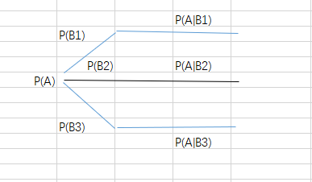
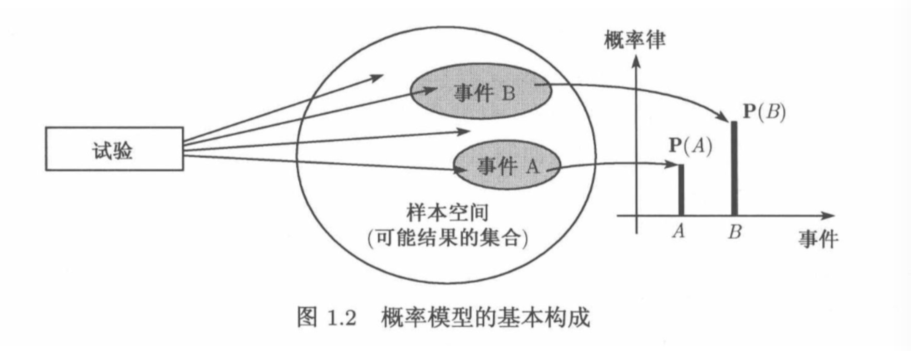
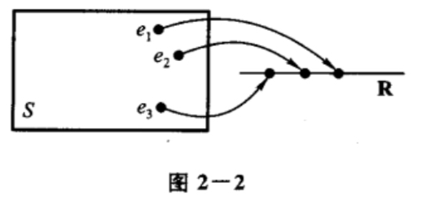
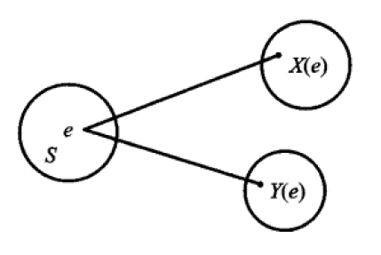
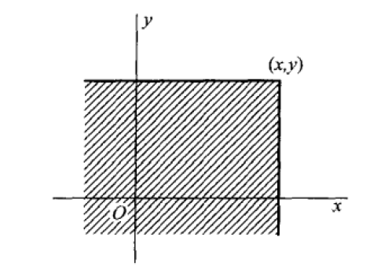
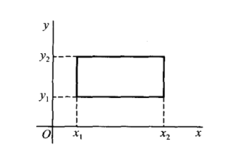

# 概率论与数理统计

概率论符号表

符号|含义|备注
-|-|-
E|试验|试验含义广泛，可以是科学实验，可以是对某个事物的某个特征的观察
S|样本空间|一个集合，样本点的集合，试验E的所有可能的结果组成的集合，如试验掷骰子的样本空间为{1,2,3,4,5,6}。设 E 是随机试验，S 是它的样本空间。
A|事件|一个集合，试验结果的集合，样本点的集合，样本空间的子集，试验的某些结果组成的集合，如试验掷骰子掷得奇数这个事件{1,3,5}。这个子集中的一个样本点出现，称事件A发生
$A\subset B$|事件B包含A
A = B|事件A等于事件B
$A \cup B$|和事件|事件A与事件B的和事件，当A或B有一个事件发生时，事件 $A\cup B$ 发生
$A\cap B$（AB）|积事件|事件A与事件B的积事件，A与B同时发生时，事件$A\cap B$发生
$\overline A$|互逆事件，对立事件|$A \cup B=S,A\cap B=\emptyset$，事件A与B必有一个发生，且仅有一个发生
P(A)|事件A的概率，函数，离散模型的事件的概率由包含的各个试验结果的概率确定
$P(A\cup B)$||事件A、B至少发生一个的概率
$P(A\cup B)=P(A)+P(B)$|概率的有限可加性|前提是，A与B是不相容的事件，即$A\cup B=\emptyset$
$P(A\cup B)=P(A)+P(B)-P(AB)$|概率的$\red{加法公式}$|没有前提，任意两个事件A、B
$P(A\cap B)或P(AB)$|联合概率|事件A、B同时发生的概率
$P(A\cap B)=P(AB)=P(A)P(B)$|A、B同时发生的概率|前提，事件A、B相互独立。事件A对事件B的发生没有影响，反之亦然
$P(A\cap B)=P(AB)=P(A)P(B\|A)$|概率的$\red{乘法公式}$|前提，事件A、B不是相互独立。事件A对事件B的发生有影响
P(B\|A)|条件概率|事件A已发生的条件下事件B发生的概率。事件A对事件B发生的概率有影响
X|随机变量|是函数，是自变量，是样本点的映射，是随机试验的试验结果，或者随机试验的样本空间中的样本点或样本点集合（事件）在实数范围内的映射。是对事件的量化
## 0.概率论发展
概率论有三种不同的解释：古典概率、频率概率、主观概率。
## 1.概率论基础概念
### 1.1.集合
#### （1）集合
将一些研究对象放在一起，形成集合。
- 概率论大量应用集合运算。

##### 记法
若 S 包含有限个元素 $x_1,x_2,...,x_n$，我们只需将这些元素包含在花括号中，$S = \{x_1,x_2,...,x_n\}$

我们也可以以 x 具有某种性质 P 为条件来刻画一个集合，记作 {x|x 满足性质 P}。如 $\{x|0\leq x \leq 1\}$

#### （2）集合元素
集合中的对象称为元素。
记号：x 是 S 的元素，我们将元素和集合的这种关系写成 $x\in S$，若 x 不是 S 的元素，就写成 $x\notin S$。

#### （3）空集
一个集合可以没有元素，这个特殊的集合称为空集，记作 $\emptyset$。

#### （4）子集
若集合 S 的所有元素均为集合 T 的元素，就称 S 为 T 的子集。记作 $S\subset T$

#### （5）空间
将我们感兴趣的所有元素放在一起，形成一个集合，这个集合称为空间。记作 $\Omega$

#### （6）集合运算
##### 补集
集合 $\{x\in \Omega|x\notin S\}$称为集合 S 相对于 $\Omega$ 的补集。
##### 并集
由属于 S 或属于 T 的元素组成的集合称为 S 和 T 的并，记为 $S\cup T$，$S\cup T = \{x|x\in S 或 x\in T\}$。
##### 交集
既属于 S 又属于 T 的元素组成的集合称为 S 和 T 的交，记为 $S\cap T$，$S\cap T$，$S\cup T = \{x|x\in S且x\in T\}$。
##### 无穷个集合并
$$\bigcup_{n=1}^{\infty}S_n = S_1\cup S_2\cdots =\{x|x\in S_n 对某个n成立\}$$

##### 无穷个集合交
$$\bigcap_{n=1}^{\infty}S_n = S_1\cap S_2\cdots = \{x|x\in S_n 对一切n成立\}$$

#### （7）韦恩图
集合及其运算可用韦恩图形象化表示。

#### （8）有序对
设 x 和 y 为两个研究对象，我们用 (x,y) 表示 x 和 y 的有序对。

#### （9）实数集合
我们用 R 表示实数集合，用 $R^2$ 表示实数对的集合，即二维平面。用 $R^3$ 表示三维实数向量的集合（三维空间）。

### 1.2.试验
#### （1）随机试验
试验作为一个含义广泛的术语，可以是科学试验，也可以是对某一个事物的某一特征的观察。用 E 表示试验，例如掷骰子试验 E。

将具有以下三个特点的试验称为随机试验
- 1.可以在相同的条件下重复地进行
- 2.每次试验的可能结果不止一个，并且能事先明确试验的所有可能结果
- 3.进行一次试验之前不能确定哪一个结果会出现。

#### （2）随机现象
在个别试验中其结果呈现出不确定性，在大量重复试验中其结果又具有统计规律性的现象，我们成为随机现象。概率论与数理统计是研究和揭示随机现象统计规律性的一门数学学科。

我们是通过研究随机试验来研究随机现象的 。

### 1.3.样本
#### （1）样本空间
试验的所有可能结果组成的集合是已知的，将随机试验 E 的所有可能结果组成的集合称为 E 的样本空间，记为 S。例如掷骰子的样本空间为：S = {1,2,3,4,5,6}

样本空间是样本点的集合。

#### （2）样本点
样本空间的元素，即 E 的每个结果，称为样本点。

### 1.4.事件
#### （3）随机事件
我们称试验 E 的样本空间 S 的子集为 E 的随机事件。记为A，如掷骰子掷得奇数的事件 A = {1，3，5}

事件是集合，样本点的集合。

#### （4）事件发生
当且仅当事件中的一个样本点出现时，称这一事件发生。

#### （5）基本事件
由一个样本点组成的单点集，称为基本事件。

#### （6）必然事件
#### （7）不可能事件
#### （8）事件间的关系与事件的运算
事件是一个集合，因而事件间的关系与事件的运算按照集合论中集合之间的关系和集合运算来处理。
- 子集
- 包含
- 相等
- 和事件：$A\cup B=\{x|x\in A或x\in B\}$称为事件 A 和 事件 B 的和事件，当A、B中有一个样本发生时，事件 $A\cup B$发生。
- n个事件的和事件：$$\bigcup_{k=1}^nA_k为n个事件A_1,A_2,...,A_n的和事件$$
- 可列个事件的和事件：
$$\bigcup_{k=1}^{\infty}A_k为可列个事件A_1,A_2,...的和事件$$
- 积事件：$A\cap B=\{x|x\in A且x\in B\}$称为事件 A 与 事件 B 的积事件，当且仅当A、B同时发生时，事件$A\cap B$发生，也记作 AB。
- 和事件：$A\cup B=\{x|x\in A或x\in B\}$称为事件 A 和 事件 B 的和事件，当A、B中有一个样本发生时，事件 $A\cup B$发生。
- n个事件的积事件：$$\bigcap_{k=1}^nA_k为n个事件A_1,A_2,...,A_n的和事件$$
- 可列个事件的积事件：
$$\bigcap_{k=1}^{\infty}A_k为可列个事件A_1,A_2,...的和事件$$

#### （9）差事件
事件$A-B=\{x|x\in A 且 x\notin B\}$称为事件 A 与事件 B 的差事件。当且仅当 A 发生、B不发生时事件 A-B 发生。

#### （10）互斥事件
若 $A\cap B=\emptyset$，则称事件 A 与 B 是互不相容的，或互斥的，即事件 A 与事件 B 不能同时发生。

#### （11）对立事件（互逆事件）
若 $A\cup B=S，且A\cap B=\emptyset$，则称事件 A 与事件 B 互为逆事件，又称事件 A 与事件 B 互为对立事件。对每次试验而言，事件A、B必有一个发生，且仅有一个发生。A的对立事件记为 $\overline A$，$\overline A=S-A$

#### （12）事件运算
事件运算，即集合运算
- 交换律
- 结合律
- 分配律
- 德摩根律

### 1.5.频率与概率

符号|含义
-|-
n次试验|
$n_A$|频数，n次试验中事件A发生的次数$n_A$称为事件A发生的频数
$n_A/n$|频率，比值$n_A/n$称为事件A发生的频率
$f_n(A)$|频率，$f_n(A)=n_A/n$
E、S、A|E是随机试验，S是它的样本空间，A是E的一个事件
P(A)|事件A发生的概率

#### （1）试验次数
重复试验次数 n

#### （2）可能性
可能性是说某些事件在一次试验中发生的可能性大小。

对于一个事件（除必然事件和不可能事件外）来说，它在一次试验中可能发生，也可能不发生。我们常常希望知道某些事件在一次试验中发生的「可能性」究竟有多大。例如，为了确定水坝的高度，就要知道河流在造水坝地段每年最大洪水达到某一高度这一事件发生的可能性大小。我们希望找到一个合适的数来表征事件在一次试验中发生的可能性大小。为此，首先引入频率，它描述了事件发生的频繁程度，进而引出表征事件在一次试验中发生的可能性大小的数--概率。

#### （3）频率

频率：表征事件在一次试验中发生的可能性的频繁程度。

定义：
在相同的条件下，进行了 n 次试验，在这 n 次试验中，事件 A 发生的次数 $n_A$ 称为事件 A 发生的频数，比值 $n_A/n$ 称为事件 A 发生的频率，并记成$f_n(A)$

#### （4）频率的性质
- $0\leq f_n(A)\leq 1$
- $f_n(S)=1$
- 若$A_1,A_2,...,A_k$是两两互不相容的事件，则 $f_n(A_1\cup A_2\cdots A_k)=f_n(A_1)+f_n(A_2)+\cdots +f_n(A_k)$

当重复试验的次数 n 逐渐增大时，频率 $f_n(A)$ 呈现出稳定性，逐渐稳定于某个常数，这种“频率稳定性”即通常所说的统计规律性。

但是，在实际中，我们不可能对每一个事件都做大量的试验，我们从频率的稳定性和频率的性质得到启发，给出表征事件发生可能性大小的概率的定义。

#### （5）概率
概率：表征事件在一次试验中发生的可能性的大小的数。

- 逆概率
- 互斥：A、B不可能同时发生
- 对立：A、B不可能同时发生，必有一个发生
- 独立：A、B发生互不影响
- 条件：A、B发生有影响

#### （6）概率定义
定义：设 E 是随机试验，S 是它的样本空间，对于 E 的每一个事件 A 赋予一个实数，记为P(A)，称为事件的概率，如果集合函数$P(\cdot)$满足下列条件：
- 1.非负性：对于每一个事件A，有$P(A)\geq 0$
- 2.规范性：对于必然事件S，有P(S)=1
- 3.可列可加性：设$A_1,A_2,...$是两两互不相容的事件，即对于$A_iA_j=\emptyset ,i≠j,i,j=1,2,\cdots$，有$$P(A_1\cup A_2\cup \cdots )=P(A_1)+P(A_2)+\cdots$$

概率：
- 频率，概率都是函数。
- 当 $n\to \infty$时频率$f_n(A)$在一定意义下接近于概率P(A)

#### （7）概率的性质
- 1.$P(\emptyset)=0$
- 2.有限可加性，若$A_1,A_2,...,A_n$ 是两两互不相容的事件，则 $P(A_1\cup A_2\cup \cdots \cup A_n)=P(A_1)+P(A_2)+\cdots+P(A_n)$
- 3.逆事件概率：$P(\overline A)=1-P(A)$
- 4.概率的加法公式：对于任意两事件A、B，有$P(A\cup B)=P(A)+P(B)-P(AB)$

### 1.6.等可能概型（古典概型）

### 1.7.条件概率
#### （1）条件概率引入
 
-|描述
-|-
试验 E|一次试验：将一枚硬币抛掷两次，观察其出现正反面的情况
样本空间 S|S={HH,HT,TH,TT}
事件A|至少有一次为H，A={HH,HT,TH}
事件B|两次掷出同一面，B={HH,TT}
已知事件A已经发生的条件下事件B发生|{HH}
P(A)|即P{HH,HT,TH}，事件A发生的概率=3/4
P(B)|即P{HH,TT}，事件B发生的概率=2/4
P(AB)|即P{HH}，事件A、B同时发生的概率=1/4
P(B\|A)|已知事件A发生的条件下事件B发生的概率，P(B\|A)=1/3。可知，P(B)≠P(B\|A)
P(B\|A)|条件概率，P(B\|A)=P(AB)/P(A)
n次试验|相同条件下，进行n次试验
P(A-B)=P(A)-P(AB)|减法公式
P(A+B)=P(A)+P(B)-P(AB)|加法公式
P(B\|A)=P(AB)/P(A)|条件概率公式，在事件A发生的条件下事件B发生的条件概率
P(AB)=P(B\|A)P(A)=P(A\|B)P(B)|乘法公式
$P(A)=P(A\|B_1)P(B_1)+P(A\|B_2)P(B_2)+\cdots+P(A\|B_n)P(B_n)$|全概率公式
$P(B_i\|A)=P(A\|B_i)P(B_i)/\sum_{j=1}^nP(A\|B_j)P(B_j)$|贝叶斯公式

#### （2）✔︎条件概率关系式（公式）
定义：设A，B是定义在同一样本空间$\Omega$中的两个事件，且P(A)>0，称$$P(B|A)=\frac{P(AB)}{P(A)}$$为在事件 A 发生的条件下事件 B 发生的**条件概率**。

条件概率 $P(\cdot |A)$ 符合概率定义中的三个条件：
- 非负性：对于每一事件B，有$P(B|A)\geq 0$
- 规范性：对于必然事件S，有 P(S|A)=1
- 可列可加性：设$B_1,B_2,\cdots$是两两互不相容的事件，则有$$P(\bigcup_{i=1}^{\infty}B_i|A)=\sum_{i=1}^{\infty}P(B_i|A)$$

#### （3）条件概率性质
1.对于任意事件$B_1,B_2$，有$$P(B_1\cup B_2|A)=P(B_1|A)+P(B_2|A)-P(B_1B_2|A)$$

#### （4）条件概率例子
**例1** 一盒子装有4只产品，其中有3只一等品，1只二等品。从中取产品两次，每次任取一只，作不放回抽样。设事件A为“第一次取到的是一等品”，事件B为“第二次取到的也是一等品”，求条件概率 P(B|A)。

解：此属古典概型问题。试验为：从一个盒子中取产品两次，观察取到的产品的等级。A事件为“第一次取到的是一等品”，B事件为“第二次取到的也是一等品”。事件AB为A与B同时发生。

给产品编码，1、2、3是一等品，4是二等品。S={(1,2),(1,3),(1,4),(2,1),(2,3),(2,4),(3,1),(3,2),(3,4),(4,1),(4,2),(4,3)}。A={(1,2),(1,3),(1,3),(2,1),(2,3),(2,4),(3,1),(3,2),(3,4)}。B={(2,1),(3,1),(4,1),(1,2),(3,2),(4,2),(1,3),(2,3),(4,3)}。AB={(1,2),(1,3),(2,1),(2,3),(3,1),(3,2)}

P(A)=9/12，P(AB)=6/12，所以P(B|A)=P(AB)/P(A)=2/3

回头再看这个问题，B|A是一个全新的随机试验的事件，样本空间S={(1,2),(1,3),(1,4),(2,1),(2,3),(2,4),(3,1),(3,2),(3,4)}，B|A={(1,2),(1,3),(2,1),(2,3),(3,1),(3,2)}，P(B|A)=6/9

综上，会发现，事件“AB”的样本点与事件“B|A”的样本点一样。首先分析随机试验，再通过条件概率公式得到条件概率；也可以通过全新的随机试验，直接得到条件概率。

#### （5）条件概率研究
- 要想透彻理解条件概率P(B|A)这个概念，就必须搞清它所包含的三个要点：事件A、事件B以及条件关系，三者缺一不可。事件B的特点，在于它的随机性；事件A的特点，在于它的确定性，A是已经发生的事件，不再是随机事件；而条件关系的特征，在于其表达方式的多种多样性，在大多数情况下它是由一个明确的条件结构表示的，如“已知...条件下，求...的概率”等，而在有些场合中，它却不是用明确的条件结构表示的，这就需要我们去学会判断。

拆解条件概率：
$$P(B|A)=P(AB)/P(A)$$
- 随机试验：每一个随机试验的发生，都是在一定条件下进行的。不同的试验样本空间不一样。
- 事件A：A是随机试验的一个事件
- 事件B：B也是随机试验的一个事件
- 事件AB：AB同样也是随机试验的一个事件，表示A、B事件同时发生
- 事件B|A：事件B|A不是一个通常意义上的随机事件，这是因为它在随机试验前加了一个条件，已知A发生，则试验结果的数量也必将发生变化，于是构成一个全新的「随机试验」，"B|A"便是这个新的随机试验的一个事件（新的样本空间）
- A、B、AB、B|A：前三个事件是一个随机试验的事件，后一个事件是新的随机试验的事件
- P(A)：P(A)表示在某条件下事件A发生的可能性的大小
- P(AB)：P(AB)为事件A与事件B同时发生的概率
- P(B|A)：P(B|A)是指在原条件下又添加“事件A发生”这个条件时，事件B发生的可能性的大小。P(B)与P(B|A)的差别在于两者发生的条件不同，是两个不一样的概率。当A、B互不相容时，两者只能发生一个，则P(B|A)=0<=P(B)；当$B\subset A$时，P(AB)=P(B)，P(B|A)=P(AB)/P(A)=P(B)/P(A)；当A、B既不是互不相容，又不是包含关系时，P(B|A)=P(AB)/P(A)；当A、B是独立事件，即事件Ade发生对B的发生没有影响，B的发生对A的发生没有影响，P(AB)/P(A)=P(B|A)=P(B)
- 建模：解题的时候首先要理解问题的本质是，确定所解的问题是不是条件概率问题，如果所求解的事件必须是在另一件事件发生的情况下，才能发生，那么该事件的概率就需要按照条件概率的逻辑来进行处理。解答条件概率问题，主要有三种常规方法：1是化为古典概型解决，P(B|A)=P(AB)/P(A)=n(AB)/n(B)=事件AB包括的基本事件数/事件B包括的基本事件数；2是条件概率公式法，如果P(A)>0，则先计算交概率P(AB)和概率P(A)，再按公式P(B|A)=P(AB)/P(A)计算；3是「缩减样本空间法」，在事件A发生的前提下，明确事件B的缩减样本空间，并在其中计算事件B发生的概率，从而得到P(B|A)
- 在某样本空间$\Omega$中的事件 A 与 B，若随机从$\Omega$中选出一个样本点属于事件 A，即事件 A 已发生，以此为条件，再随机从$\Omega$中选出一个样本点属于事件 B 的概率，即在事件 A 发生的条件下事件 B 发生的概率就是定义在事件 A 发生的条件下事件发生的条件概率。

#### （6）P(AB)与P(B|A)

- P(AB)与P(B|A)是不同试验中的事件
- 事件“AB”与事件“B|A”的样本点一样，所处的样本空间不一样。

###### “AB”事件
AB指某一条件下的试验的A、B事件同时发生。P(AB)表示该事件发生的可能性的大小。

几何上：AB 表示在$\Omega$空间内的AB。所以 P(AB)=n(AB)/$\Omega$

###### “B|A”事件
B|A指在A发生条件下的试验B事件发生。P(B|A)是A已经发生的条件下，B发生的可能性的大小。

条件概率用图示法理解：事件的样本点已落在图形A中（事件A已发生），问落在B（事件B）中的概率，由于样本点已经落在A中，且又要求落在B中，于是只能落在AB中。

几何上，B|A 表示在 A 空间内的AB。所以P(AB)=n(AB)/n(A)

#### （7）P(B)与P(B|A)
- P(B)：P(B)是在原有样本空间$\Omega$上求出的概率，可称为无条件概率。P(B)=n(B)/n($\Omega$)
- P(B|A)：P(B|A)是在事件A已发生的条件下B发生的概率，是由条件概率。P(B|A)=n(AB)/n(A)
- 虽然 P(B) 与 P(B|A) 都是求事件 B 发生的概率，但一般情况下，P(B|A)≠P(B)。因为计算事件 B 发生的概率 P(B)时，是在整个样本空间下，而在考察事件 A 发生条件下事件 B 的条件概率 P(B|A)时，实际上仅局限于事件A的范围，其样本空间不同。

#### （8）条件概率应用
以条件概率为基础，可得出乘法公式、全概率公式和贝叶斯公式。

#### （9）✔︎减法公式

#### （9）✔︎加法公式

#### （9）✔︎乘法公式
定义：由条件概率的定义可得乘法定理，设P(A)>0，则有$$P(AB)=P(B|A)P(A)$$，该公式称为乘法公式。

#### （10）多个事件的积事件的乘法公式
$$P(ABC)=P(C|AB)P(B|A)P(A)$$
一般，设$A_1,A_2,...,A_n$为 n 个事件，$n\geq 2$，且$P(A_1A_2\cdots A_{n-1})>0$，则有$$P(A_1A_2\cdots A_n)=P(A_n|A_1A_2\cdots A_{n-1})P(A_{n-1}|A_1A_2\cdots A_{n-2})\cdots P(A_2|A_1)P(A_1)$$，或者写成$$P(A_1A_2\cdots A_n)=P(A_1)P(A_2|A_1)P(A_3|A_1A_2)\cdots P(A_n|A_1A_2\cdots A_{n-1})$$

#### （11）乘法公式分析
- 所谓乘法公式，指的是两个及两个以上事件乘积的概率计算公式。
- 乘法公式体现分步讨论、化繁为简的思想，所求事件相对复杂，不能直接由古典方法求出，并且可以表示成一些事件的乘积形式，则由乘法公式，利用等式右边分步求解，而等式右边的每一项可根据题意查到。
- 乘法公式具有一一对应特点。公式左边有 n 个事件 $A_1,A_2,\cdots ,A_n$相乘，则公式右边有 n 项概率相乘，并且分别对应于 $A_1,A_2,\cdots ,A_n$的概率。除其中一项外，其他项都是条件概率，并且条件不一样，这 n 项分别为$P(A_1),P(A_2|A_1),P(A_3|A_1A_2),\cdots ,P(A_n|A_1A_2\cdots A_{n-1})$
- 条件事件逐项增多，从公式可以看出，第一项$P(A_1)$没有条件，第二项$P(A_2|A_1)$以$A_1$作为条件，而第三项$P(A_3|A_1A_2)$以$A_1A_2$作为条件，以此类推，作为条件的事件逐项增多。
- 优先发生原则。
- 利用乘法公式可以计算两个事件同时发生的概率，且可以推广到有限个事件积的概率形式。

#### （12）乘法公式应用
###### 条件概率与乘法公式在汉字拼写纠错中的应用
在文献查询、汉字拼写纠错等众多涉及到自然语言处理的领域，都需要知道一个由若干单个文字构成的复杂序列是否能被人理解，即拼写是否正确，处理这个问题，我们可以使用统计模型来解决。

设 S 是由若干文字构成的语言序列，具有一定的实际意义，$A_1,A_2,\cdots ,A_n$为构成这个语言序列的 n 个文字。

#### （13）✔︎全概率公式
定义：设试验 E 的样本空间为 S，A 为 E 的事件，$B_1,B_2,\cdots ,B_n$为 S 的一个划分，且$P(B_i)>0(i=1,2,\cdots ,n)$，则
$$P(A)=P(A|B_1)P(B_1)+P(A|B_2)P(B_2)+\cdots +P(A|B_n)P(B_n)$$
以上式子称为全概率公式。
- 样本空间的划分应该是划分成互相不相交的部分，且其并集就是全部的样本空间。
- 在很多实际问题中 P(A) 不容易直接求得，但却容易找到 S 的一个划分$B_1,B_2,\cdots ,B_n$，且$P(B_i)$和$P(A|B_i)$或为已知，或容易求得，那么就可以根据全概率公式求出P(A)。

#### （14）全概率公式情景举例

**例1**设某工厂有甲、乙、丙三个车间生产同一种产品，产量依次占全厂的45%、35%、20%，且甲、乙、丙各车间的次品率依次为4%、2%、5%，现在从一批产品中检查出1个产品，求该产品是次品的概率是多少？

解：设 A1,A2,A3 分别表示产品来自甲、乙、丙车间，B 表示产品为次品的随机事件，易知A1,A2,A3是样本空间$\Omega$的一个划分。P(A1)=0.45,P(A2)=0.35,P(A3)=0.2,P(B|A1)=0.04,P(B|A2)=0.02,P(B|A3)=0.05。由全概率公式得：P(B)=P(A1)P(B|A1)+P(A2)P(B|A2)+P(A3)P(B|A3)=0.45*0.04+0.35*0.02+0.2*0.05=0.035。所以该产品是次品的概率是0.035

#### （14）全概率公式分析
- 思想：由简单事件的概率推算出复杂事件的概率，是概率论中有意义的问题。事件的概率之所以很难求，多数是因为该事件过程复杂，具有复合特征，当遇到这种情况，不妨通过样本空间的一个划分，把该事件分成若干个简单事件之和，为了便于计算，能够利用到“有限可加性”，又要求这些简单事件是互不相容的。于是一个复杂事件的概率转化为若干个互斥的事件概率的和，再利用乘法公式求出各部分积事件的概率。由此，全概率公式蕴含了化整为零、各个击破的数学思想。而在实际应用上，则是分情况讨论的具体体现。全概率公式体现了化归和分类的思想。
- 本质：从统计学的角度看全概率公式中的 P(A) 是一种平均概率，是条件概率$P(A|B_i)$的加权平均值，作为条件的事件$B_i$发生的概率就是加在每个条件概率上的权重系数。
- 运算：从全概率公式定理的证明可以看到，全概率公式实质上是加法公式和乘法公式的综合运用，是在加法公式和乘法定理的基础上推导出来的。其中$P(A)=P(\sum_{i=1}^nAB_i)$表示复杂事件的概率分解，$P(\sum_{i=1}^nAB_i)=sum_{i=1}^nP(AB_i)$是互斥事件的概率可加性，$P(AB_i)=P(B_i)P(A|B_i)$是概率的乘法公式。可见这种先加后乘、加乘结合的运算，不仅分离了难点，而且使计算层次分明。
- “全”的含义：某一事件 A 的发生有各种可能的原因，这些原因所对应的事件记作$B_i(i=1,2,...,n)$，如果事件 A 是由$B_i$所引起的，则其发生的概率就是$P(AB_i)$，由于每一个原因都可能导致事件 A 发生，于是事件 A 发生的概率就是$\sum_{i=1}^nP(AB_i)$，全概率公式中的全就是总和的含义。因为必须全，所以对事件 A 发生有贡献的全部原因都要找出来，缺一不可。
- 公式的直观作用：由于公式包含了乘法公式$P(AB_i)=P(B_i)P(A|B_i)$，先有$B_i$后有A，A的发生要受因素$B_1,B_2,...,B_n$的影响，所以事件组$B_1,B_2,...,B_n$可以看成是引起事件A发生的全部原因，每个原因对结果的发生有一定的作用，由此可以形象地把全概率公式看成是“由原因推结果”，即“知因求果”。
- 运用公式的关键：应用全概率公式的关键是寻找与该事件相关的完备事件组。当事件的发生与相继两个试验有关，第一次试验的各种结果直接对第二次试验产生影响，因此从第一次试验入手，找出完备事件组。当事件的发生是由诸多两两互不相容的原因$B_1,B_2,...,B_n$引起的，且只能在原因$B_1,B_2,...,B_n$下发生，那么这些原因就是一个完备事件组。在选择完备事件组的时候，一定要把产生结果的原因全部找出来，不能遗漏，并且保证$B_1,B_2,...,B_n$为两两互不相容事件。
- 完备事件组与目标事件的关系：目标事件A的元素不一定参与划分者$B_i$的全部元素，
- 全概率公式的直观表示：全概率公式可用“概率分枝图”直观表示，如图，分枝上各阶段的概率乘积$P(B_i)P(A|B_i)$之和等于概率 P(A)，这种运算特点可概括为：“连线相乘，分枝相加”。

- 全概率意义价值：全概率公式为复杂事件的概率计算提供了一条有效途径，是概率论中一个有效的分析工具，其重要意义在于：对于一个复杂的事件A，若无法直接求出它的概率P(A)，则可以“化整为零”，通过选择样本空间的划分将复杂事件A分解为若干个简单事件来进行处理，从而使分析问题的思路变得清晰条理，计算化繁就简，化难为易。

#### （14）✔︎贝叶斯公式
定义：设试验 E 的样本空间为S，A 为 E 的事件，$B_1,B_2,\cdots ,B_n$为为 S 的一个划分，且 P(A)>0，$P(B_i)>0(i=1,2,\cdots ,n)$，则
$$P(B_i|A)=\frac{P(A|B_i)P(B_i)}{\sum_{j=1}^nP(A|B_j)P(B_j)}$$
，以上式子称为贝叶斯公式。

#### （15）全概率公式与贝叶斯公式
定义：设$\Omega$是随机试验 E 的样本空间，若 E 的事件组$A_1,A_2,...,A_n$满足
(1)$A_1\cup A_2\cdots \cup A_n=\Omega$
(2)$A_iA_j=\emptyset(i≠j,i、j=1,2,\cdots ,n)$，则称事件组$A_1,A_2,...,A_n$为$\Omega$的一个划分（或完备事件组）

设 B 是随机试验 E 中的任意事件，$A_1,A_2,...,A_n$是$\Omega$的完备事件组，$P(A_i)>0(i=1,2,\cdots ,n)$， 
全概率公式： 
$$P(B)=P(B\Omega)=\sum_{i=1}^mP(BA_i)$$

 

### 1.8.独立性

### 1.9.其他
#### （1）概率律（概率定律）
没有规律的过程却从大体上呈现有规律性。由四条概率定律组成：
- 概率第一定律： 
概率是0到1之间任何一个数字，数字越大，概率越高。当数字为1时，表明该事件绝对会发生。当数字为0时，表明该事件绝对不会发生。
- 概率第二定律： 
互斥事件：如果A和B是相互独立的事件（A、B互斥，即事件A、B不可能同时发生），那么P(A+B)=P(A)+P(B)
- 概率第三定律： 
对立事件：A、B对立，即事件A、B不可能同时发生，但A、B必然有一个发生，计算公式P(A)+P(B)=1，P(A)=1-P(B),$P(\overline A)=1-P(A)$
- 概率第四定律： 
互相独立事件：一个事件 A 是否发生对另一个事件 B 发生的概率没有影响。P(AB)=P(A)P(B)

##### 概率公理
- 非负性 
对于一切事件A，满足 P(A>=0
- 可加性 
设A、B为两个互不相容的集合（概率论中称为互不相容的是事件），则它们的并满足 $P(A\cup B)=P(A)+P(B)$，更一般地，$P(A_1\cup A_2\cup ...)=P(A_1)+P(A_2)+...$
- 归一化 
整个样本空间 $\Omega$ 的概率为1，即 $P(\Omega)=1$

为了将概率定律形象化，可以把样本空间中的试验结果看成质点，每一个质点有一个质量，P(A) 就是这个质点的质量，全空间的总质量为1。

#### （2）概率模型
概率模型是对不确定现象的数学描述。概率模型的两个构成：
- 样本空间：$\Omega$，这是一个试验的所有可能结果的集合。
- 概率定律：没有规律的过程却从大体上呈现有规律性。概率定律为试验结果的集合或者也叫事件A确定一个非负数P(A)（称为事件A的概率）。而这个非负数刻画了我们对事件Ade认识或所产生的信念的程度。

- 概率模型用来刻画样本空间中的试验结果。

#### （3）序贯模型
#### （4）离散概率模型
##### 离散概率定律
设样本空间由有限个可能的结果组成，则事件的概率可由组成这个事件的试验结果的概率所决定，事件 $\{s_1,s_2,...,s_n\}$ 的概率是 $P(s_i)$ 之和，即
$$P(\{s_1,s_2,...,s_n\})=P(s_1)+P(s_2)+...+P(s_n)$$
此处 用简单的记号 $P(s_i)$表示事件 $\{s_i\}$的概率，而不用正式的符号 $P(\{s_i\})$

#### （5）离散均匀概率定律（古典概型）
设样本空间由 n 个等可能性的试验结果组成，因此每个试验结果组成的事件的概率是相等的，$$P(A)=\frac{含于事件A的试验结果数}{n}$$

#### （6）连续模型
- 若试验的样本空间是一个连续集合，其相应的概率律于离散情况有很大的差别。
- 在离散情况下，基本事件的概率就可以确定概率律
- 将离散模型中的等概率模型推广到连续的情况

#### （7）概率空间

## 2.随机变量及其分布
### 2.1.随机变量
#### （1）为什么要引入随机变量
- 为了能对更复杂的问题进行抽象建模，进行定量的概率公式化处理，因此，通过引入随机变量，将样本空间这个集合概念转化为一个无量纲的数集，使得能统一地处理各种随机现象。（函数化）
- 引入随机变量的好处主要有两点：一是可用随机变量的不同取值代表不同的事件，比起用A、B、C、D等符号方便很多。二是可以进行综合分析，比如求和、均值等。
- 引入随机变量可以量化随机事件
- 随机变量的概念是概率论中一个极为重要的基本概念
- 随机变量及其分布函数是概率论中的核心概念，它们将”随机试验中关于随机现象及其统计规律性的研究“投射为”实数集中关于随机变量的概率分布的研究“，这样一来我们就可以通过研究随机变量来研究随机现象
- 随机变量就是一个函数，自变量是样本点，定义域是样本空间。值域是实数
- 随机取值的因变量X 为随机变量。大量试验中样本点呈现出的统计规律性决定了 X 在其值域中的取值也具有统计规律性，称之为 X 的概率分布。
- 当样本空间 S 的元素不是一个数时，人们对于 S 就难以描述和研究。现在来讨论如何引入一个法则，将随机试验的每一个结果，即将 S 的每一个元素 $e$ 与实数 $x$ 对应起来，从而引入了随机变量的概念。

#### （2）随机变量定义
设随机试验的样本空间为 $S=\{e\}$，$X = X(e)$ 是定义在样本空间 S 上的实值单值函数，称 $X=X(e)$为随机变量。

- 在许多概率模型中试验结果是数值化的，例如许多仪器的仪表盘的读数以及股价等。也有其他一些例子中的试验结果不是数值化的，但是这些试验结果与某些数值相联系，例如，从某个群体中选择学生，我们希望了解每位学生的平均学分，当我们讨论这些数字的时候，通常给这些数字确定概率。我们可以通过随机变量实现这个任务。
- 假设在某个试验中，所有可能的试验结果构成一个样本空间。对于样本空间中的每一个可能的试验结果，关联着一个特定的数，这种**试验结果与数的对应关系形成一个随机变量**。将试验结果所对应的数称为随机变量的取值。
- 随机变量是一个函数，随机变量是试验结果的一个实值函数。
- 随机变量是因变量，是样本点的映射，样本空间中样本点在实数上的映射。

#### （3）随机变量例子
例1：将一枚硬币抛掷三次，观察出现正面和反面的情况，样本空间是 S={HHH,HHT,HTH,THH,HTT,THT,TTH,TTT}。以 X 记三次投掷得到正面H的总数，那么，对于样本空间 S={e} 中的每一个样本点 e，X 都有一个数与之对应。X 是定义在样本空间 S 上的一个实值单值函数。它的定义域是样本空间 S，值域是实数集合{0,1,2,3}。使用函数记号可将 X 写成
$$ X=X(e)=
\left\{\begin{array}{lll}
3,&e=HHH,\\ 
2,&e=HHT,HTH,THH,\\ 
1,&e=HTT,THT,TTH,\\ 
0,&e=TTT.
\end{array}\right.
$$

#### （4）随机变量：样本点与实数的映射
如图是样本点 e 与实数 X=X(e) 对应的示意图。

有许多随机试验，它们的结果本身是一个数，即样本点 e 本身是一个数。我们令 X=X(e)=e，那么 X 就是一个随机变量。例如，用 Y 记某车间一天的缺勤人数，以 W 记某地区第一季度的降雨量，以 Z 记某工厂一天的耗电量，以 N 记某医院某一天的挂号人数。那么 Y,W,Z,N 都是随机变量。

一般以大写字母如X,Y,Z,W...表示随机变量，而以小写字母x,y,z,w...表示实数。

#### （5）随机变量的取值
随机变量的取值随试验的结果而定，而试验的各个结果出现有一定的概率，因而随机变量的取值有一定的概率。

###### 随机变量的取值
在上面例子中 X 取值为2（投掷3次硬币正面朝上的次数为2的事件），记成 {X=2}。

###### 事件（样本点的集合）
{X=2} 对应于样本点的集合 A={HHT,HTH,THH}，这是一个事件，当且仅当事件A发生时有 {X=2}

###### 随机变量的取值与事件等价
将事件A={HHT,HTH,THH}说成是事件{X=2}

###### 事件发生的概率（随机变量取值的概率）
称概率 P(A)=P{HHT,HTH,THH}为{X=2}的概率，即P{X=2}=P(A)

###### 综上
一般，若 L 是一个实数集合，将 X 在 L 上取值写成 $\{X\in L\}$。它表示事件 $B=\{e|X(e)\in L\}$，即 B 是由 S 中使得 $X(e)\in L$的所有样本点 e 所组成的事件，此时有$$P\{X\in L\}=P(B)=P\{e|X(e)\in L\}$$

随机变量的取值随试验的结果而定，在试验之前不能预知它取什么值，且它的取值有一定的概率。这些性质显示了随机变量与普通函数有着本质的差异。

随机变量的引入，使我们能用随机变量来描述各种随机现象，并能利用数学分析的方法对随机试验的结果进行深入广泛的研究和讨论。

#### （6）随机变量的研究
随机变量的分布函数、概率密度、分布律，是能描述随机变量某一特征的函数。期望、方差、相关系数、矩是随机变量的数字特征，是能描述随机变量某一种特征的常数。

例如：

### 2.2.离散型随机变量及其分布律
#### （1）离散型随机变量
- 有些随机变量，它全部可能取到的值是「有限个」或「可列无限多个」，这种随机变量称为离散型随机变量。
- 例子：某城市的120急救电话台一昼夜收到的呼叫次数是离散型随机变量。以 T 记某元件的寿命，它所可能取的值充满一个区间，是无法按一定次序一一列举出来的，因而它是一个非离散型的随机变量。

#### （2）离散型随机变量的分布律
要掌握一个离散型随机变量 X 的统计规律，必须且只需知道 X 的所有可能取值以及每一个可能值的概率。

#### （3）分布律的定义
设离散型随机变量 X 所有可能取的值为 $x_k(k=1,2,...)$，X 取各个可能值的概率，即事件 $\{X=x_k\}$的概率为$$P{X=x_k}=p_k,k=1,2,...$$。以上式子称为离散型随机变量 X 的分布律。

#### （4）分布律的表示形式
X|$x_1$|$x_2$|...|$x_n$|...
-|-|-|-|-|-
$p_k$|$p_1$|$p_2$|...|$p_n$|...

分布律也可以用表格的形式来表示，表格形式直观地表示了随机变量 X 取各个值的概率的规律。X取各个值各占一些概率，这些概率合起来是1。可以想象：概率1以一定的规律分布在各个可能值上。这也是称为分布律的缘故。

#### （5）分布律例子
例1：设一汽车在开往目的地的道路上需经过四组信号灯，每组信号灯以 1/2 的概率允许或禁止汽车通过，以 X 表示汽车首次停下时，它已通过的信号灯的组数（设各组信号灯的工作是相互独立的），求 X 的分布律。
解：以 p 表示每组信号灯禁止汽车通过的概率，易知 X 的分布律为
X|0|1|2|3|4
-|-|-|-|-|-
$p_k$|p|(1-p)p|$(1-p)^2p$|$(1-p)^3p$|$(1-p)^4p$
或写成 $P\{X=k\}=(1-p)^kp,k=0,1,2,3,4$

#### （6）三种重要的离散型随机变量
- (0-1)分布
- 伯努利试验、二项分布
- 泊松分布

### 2.3.随机变量的分布函数

事件的样本点--随机变量的取值及取值的概率--分布函数

符号|描述
-|-
X|大写字母 X 表示随机变量，X=X(e)，X是一个函数，将随机试验每个结果（每个元素）e映射到实数
x|小写字母 x 表示实数
{X=x}|随机变量X的取值，即事件的发生（随机变量的取值与事件的关系）
P{X=x}|随机变量取值的概率，事件发生的概率
P{X<=x}|随机变量取值的概率
F(x)|分布函数，F(x)=P{X<=x}

#### （1）随机变量的取值（单值）的概率
对于离散型随机变量 X ，我们研究 X 取某个值的概率，可以用分布律来描述。

#### （2）随机变量的取值（区间）的概率
对于非离散型随机变量 X，其可能的取值不能一一列举出来，另外非离散型随机变量取任一指定的实数值的概率都等于0，研究单值的概率意义不大。

#### （3）分布函数描述
我们研究随机变量所取的值落在一个区间$[x_1,x_2]$的概率：$P\{x_1<X\leq x_2\}$。但由于$P\{x_1<X\leq x_2\}=P\{X\leq x_2\}-P\{X\leq x_1\}$，所以我们只需知道$P\{X\leq x_2\}$和$P\{X\leq x_1\}$就可以了。

#### （4）分布函数定义
设 X 是一个随机变量，x是任意实数，函数$$F(x)=P\{X\leq x\},-\infty <x<\infty$$称为 X 的分布函数。

对于任意实数$x_1,x_2(x_1<x_2)$，有$$P\{x_1<X\leq x_2\}=P\{X\leq x_2\}-P\{X\leq x_1\}=F(x_2)-F(x_1)$$。

#### （5）分布函数意义
若已知 X 的分布函数，我们就知道 X 落在任一区间$(x_1,x_2)]$上的概率，从这个意义上说，分布函数完整的描述了随机变量的统计规律性。

分布函数是一个普通的函数，正是通过它，我们将能用数学分析的方法来研究随机变量。

如果将 X 看成是数轴上的随机点的坐标，那么，分布函数 F(x) 在 x 处的函数值就表示 X 落在区间$(-\infty,x]$上的概率。

虽然对于离散型随机变量，我们可以用分布律全面的描述它，但为了从数学上能统一地对随机变量进行研究，在这里，我们对离散型随机变量和非离散型随机变量统一地定义了分布函数。

#### （6）分布函数性质与特点
分布函数 F(x) 具有以下的基本性质：
- 1.F(x) 是一个不减函数。对于任意实数$x_1,x_2（x_1<x_2）$，有$F(x_2)-F(x_1)=P\{x_1<X\leq x_2\}\geq 0$
- 2.$0\leq F(x)\leq 1$，且$F(-\infty)=\lim_{x\to -\infty}F(x)=0$，$F(\infty)=\lim_{x\to \infty}F(x)=1$
    - 从几何上加以说明，将 x 沿数轴无限向左移动（即$x\to -\infty$），则“随机点 X 落在点 x 左边”（X是随机变量，是样本点映射的实值）这一事件趋于不可能事件，从而其概率趋于0，即有$F(-\infty)=0$；又若将点 x 无限右移（即$x\to \infty$），则“随机点 X 落在点 x 左边”这一事件趋于必然事件，从而其概率趋于1，则有 $F(\infty)=1$
- 3.F(x+0)=F(x)，即F(x)是右连续的。

分布函数 F(x) 特点：
- F(x)的值是 $X\leq x$的累计概率值（大写X是随机变量，小写x是实数）
- 离散型随机变量的分布函数：F(x)的图形是一条阶梯形的曲线。
- 连续型随机变量的分布函数：F(x)的图形是一条连续曲线。

#### （7）离散型随机变量的分布函数
一般，设离散型随机变量 X 的分布律为 $P\{X=x_k\}=p_k,k=1,2,...$。由概率的可列可加性得 X 的分布函数为
$$F(x)=P\{X\leq x\}=\sum_{x_k\leq x}P\{X=x_k\}，即F(x)=\sum_{x_k\leq x}p_k$$，
这里和式是对于所有满足 $x_k\leq x$的 k 求和的。分布函数 F(x) 在 $x=x_k(k=1,2,...)$处有跳跃，跳跃值为 $p_k=P\{X=x_k\}$。

$$F(x)=P\{X\leq x\}=\sum_{x_k\leq x}P\{X=x_k\}=P\{X=1\}+P\{X=2\}+...+P\{X=x\}=\sum_{x_k\leq x}p_k$$

###### 例子
例1：设随机变量 X 的分布律为：

X|-1|2|3
-|-|-|-
$p_k$|1/4|1/2|1/4

求 X 的分布函数，并求 $P\{X\leq \frac{1}{2}\}$,$P\{\frac{3}{2}<X\leq \frac{5}{2}\}$,$P\{2\leq X\leq 3\}$

解：X 仅在 x=-1,2,3 三点处其概率≠0，而 F(x) 的值是 $X\leq x$的累积概率值，由概率的有限可加性，知它即为小于或等于 x 的那些 $x_k$ 处的概率 $p_k$ 之和，有
$$
F(x)=\left\{\begin{array}{lll}
0 & x<-1\\
P\{X=-1\} &-1\leq x<2\\
P\{X=-1\}+P\{X=2\} &2\leq x<3\\
1 &x\geq 3
\end{array}\right.
$$
即
$$
F(x)=\left\{\begin{array}{lll}
0 & x<-1\\
\frac{1}{4} &-1\leq x<2\\
\frac{3}{4} &2\leq x<3\\
1 &x\geq 3
\end{array}\right.
$$

#### （8）连续型随机变量的分布函数
连续型随机变量的分布函数F(x)，对于任意 x 可以写成形式$$F(x)= \int_{-\infty}^x  f(t)\mathrm{d}t$$

F(x)恰是非负函数 f(t) 在区间 $(-\infty,x]$上的积分。

### 2.4.连续型随机变量及其概率密度

#### （1）连续型随机变量取实值的概率
对于连续型随机变量 X 来说，它取任一指定实数值 a 的概率均为0，即 $$P\{X=a\}=0$$

#### （2）连续型随机变量落在某一区间的概率
由于连续型随机变量取任一指定实数值得概率为0，据此在计算连续型随机变量落在某一区间的概率时，可以不必区分该区间是开区间或闭区间或半闭区间。例如有$$P\{a<X\leq b\}=P\{a\leq X\leq b\}=P\{a<X<b\}$$

#### （3）随机变量的概率分布
当我们提到一个随机变量 X 的概率分布时，指的是它的分布函数。

#### （4）离散型随机变量的概率分布
当随机变量 X 是离散型时，随机变量 X 的概率分布是它的分布函数，指的是它的分布律。

#### （5）连续型随机变量的概率分布
当随机变量 X 是连续型时，随机变量 X 的概率分布是它的分布函数，指的是它的概率密度。

#### （6）✔︎连续型随机变量的概率密度函数定义
如果对于随机变量 X 的分布函数 F(x)，存在非负函数 f(x)，使对于任意实数 x 有$$F(x)=\int_{-\infty}^xf(t)\mathrm{d}t$$，称 X为连续型随机变量，其中函数 f(x) 称为 X 的概率密度函数，简称概率密度。

#### （7）概率密度的性质
概率密度 f(x) 具有以下性质：
- 1、$f(x)\geq 0$；
- 2、$\int_{-\infty}^{\infty}f(x)\mathrm{d}x=1$；
- 3、对于任意实数$x_1,x_2(x_1\leq x_2)$，$P\{x_1<X\leq x_2\}=F(x_2)-F(x_1)=\int_{x_1}^{x_2}f(x)\mathrm{d}x$；
- 4、若 f(x) 在点 x 处连续，则有 $F'(x)=f(x)$。

### 2.5.随机变量的函数的分布

符号|描述
-|-
试验|
样本空间|S={e}
随机变量 X|X=X(e)
随机变量 X 的分布函数|$F_X(x)=P\{X<=x\}$
随机变量 Y|Y=g(X)
随机变量 Y 的分布函数|$F_Y(y)=P\{Y<=y\}$，根据 $F_X(x)$可求得$F_Y(y)$

#### （1）什么是随机变量的函数的分布
- 试验
- 样本空间 $S=\{e\}$
- 随机变量 $X=X(e)$
- 随机变量 X 的概率分布 $F(x)=P\{X\leq x\}$
- 随机变量的函数，另外一个随机变量 $Y=g(X)$。Y 是 X 的函数，当 X 取值 x 时，Y 取值 g(x)
- 随机变量 Y 的概率分布，已知 X 的分布函数，求 Y 的分布函数

## 3.多维随机变量及其分布
### 3.1.二维随机变量
#### （1）二维随机变量引入
在实际问题中，对于某些「随机试验的结果」需要同时用两个或两个以上的随机变量来描述。例如，为了研究某一地区学龄前儿童的发育情况，对这一地区的儿童进行抽查，对于每个儿童都能观察到他的身高 H 和体重 W。在这里，样本空间 S={e}={某地区的全部学龄前儿童}，而 H(e) 和 W(e) 是定义在 S 上的两个随机变量。又如炮弹弹着点的位置需要由它的横坐标和纵坐标来确定，而横坐标和纵坐标是定义在「同一个样本空间」的两个随机变量。

#### （2）二维随机变量定义
设 E 是一个随机试验，它的样本空间是 S={e}，设 X=X(e) 和 Y=Y(e) 是定义在 S 上的随机变量，由它们构成一个向量 (X,Y)，叫做二维随机向量或二维随机变量。

#### （3）(X,Y)
向量(X,Y)称为二维随机变量，二维随机变量 (X,Y) 的性质不仅与 X 及 Y 有关，而且还依赖于这两个随机变量的相互关系。因此，逐个地来研究 X 或 Y 的性质是不够的，还需将 (X,Y) 作为一个整体来进行研究。

### 3.2.联合分布
#### （1）联合分布函数
设 (X,Y) 是二维随机变量，对于任意实数 x,y，二元函数 $$F(x,y)=P\{(X\leq x)\cap (Y\leq y)\}\overset{记成}{=}P\{X\leq x,Y\leq y\}$$ 称为二维随机变量 (X,Y) 的分布函数，或称为随机变量 X 和 Y 的联合分布函数。

#### （2）联合分布的几何意义
图一：如果将二维随机变量 (X,Y) 看成是平面上随机点的坐标，那么，分布函数 F(x,y) 在 (x,y) 处的函数值就是随机点 (X,Y) 落在以点 (x,y) 为顶点而位于该点左下方的无穷矩形域内的概率。

图二：随机点 (X,Y) 落在矩形域$\{(x,y)|x_1<x\leq x_2,y_1<y\leq y_2\}$的概率为 $P\{x_1<X\leq x_2,y_1<Y\leq y_2\}=F(x_2,y_2)-F(x_2,y_1)+F(x_1,y_1)-F(x_1,y_2)$。

#### （3）联合分布函数的性质

#### （4）二维离散型随机变量
如果二维随机变量 (X,Y) 全部可能取到的值是有限对或可列无限多对，则称 (X,Y) 是离散型的随机变量。

#### （5）二维离散型随机变量的联合分布律
设二维离散型随机变量 (X,Y) 所有可能取的值为 $(x_i,y_i);i、j=1,2,...$，记$P\{X=x_i,Y=y_j\}=p_{ij},i,j=1,2,\cdots $，则由概率的定义有$$p_{ij}\geq 0,\sum_{i=1}^{\infty} \sum_{j=1}^{\infty}p_{ij}=1$$。

我们称$P\{X=x_i,Y=y_j\}=p_{ij},i,j=1,2,\cdots$为二维离散型随机变量(X,Y)的分布律，或随机变量 X 和 Y 的联合分布律。

#### （6）二维离散型随机变量的联合分布函数
将 (X,Y) 看成一个随机点的坐标，可知离散型随机变量 X 和 Y 的联合分布函数为 $$F(x,y)=\sum_{x_i\leq x}\sum_{y_i\leq y}p_{ij}$$
其中和式是对一切满足$x_i\leq x,y_j\leq y$的i，j来求和的。

#### （7）二维连续型随机变量
#### （8）二维连续型随机变量的联合概率密度
对于二维随机变量 (X,Y) 的分布函数 F(x,y)，如果存在非负的函数 f(x,y) 使对于任意x，y有$$F(x,y)=\int_{-\infty}^y\int_{-\infty}^xf(u,v)\mathrm{d}u\mathrm{d}v$$，则称(X,Y) 是连续型的二维随机变量，函数 f(x,y) 称为二维随机变量 (X,Y) 的概率密度，或称为随机变量 X 和 Y 的联合概率密度。
#### （9）二维连续型随机变量的联合分布函数
以上 F(x,y) 称为二维连续型随机变量的联合分布函数。

#### （10）n维随机变量
不难推广到 n(n>2) 维随机变量的情况，设 E 是一个随机试验，它的样本空间是 S={e}，设 $X_1=X_1(e),X_2=X_2(e),...,X_n=X_n(e)$是定义在 S 上的随机变量，由它们构成的一个 n 维向量 (X_1,X_2,...,X_n)叫做 n 维随机向量或 n 维随机变量。

#### （11）n维随机变量的联合分布函数
对于任意 n 个实数$x_1,x_2,...,x_n$，n元函数 $$F(x_1,x_2,...,x_n)=P\{X_1\leq x_1,X_2\leq x_2,...,X_n\leq x_n\}$$称为 n 维随机变量 $(X_1,X_2,...,X_n)$的分布函数或随机变量 $X_1,X_2,...,X_n$的联合分布函数。它具有类似于二维随机变量的分布函数的性质。

### 3.3.边缘分布
#### （1）边缘分布函数
二维随机变量 (X,Y) 作为一个整体，具有分布函数 F(x,y)。而 X 和 Y 都是随机变量，各自也有分布函数，将它们分别记为$F_x(x)$，$F_y(y)$，依次称为二维随机变量 (X,Y) 关于 X 和关于 Y 的边缘分布函数。边缘分布函数可以由 (X,Y) 的分布函数 F(x,y) 所确定。

#### （2）二维随机变量关于 X 和关于 Y 的边缘分布函数
$$F_x(x)=P\{X\leq x\}=P\{X\leq x,Y<\infty\}=F(x,\infty)$$
，即$F_x(x)=F(x,\infty)$，同理，$F_y(y)=F(\infty,y)$

#### （4）离散型二维随机变量关于 X 和关于 Y 的边缘分布律

#### （5）连续型二维随机变量关于 X 和关于 Y 的边缘概率密度

### 3.4.条件分布
### 3.5.相互独立的随机变量
### 3.6.两个随机变量的函数的分布

## 4.随机变量的数字特征
### 4.0.开篇
#### （1）随机变量
随机变量是概率论中的一个重要概念，它的较为通俗的定位为：若随机试验的每一基本事件都唯一地对应着一个实数 X，则变量 X 称为随机变量。
- 因变量的取值随试验结果的随机性而具有随机性，因而称其为“随机变量”。
- 有些随机试验的结果不是数量型的，仍可用随机变量表示随机试验的结果。可以这样处理，把随机试验的结果看成一个集合，再取一个适当的数集合，使这两个集合的元素，即事件和数之间一一对应，那么事件就可以通过取不同值的变量来表示。
- 随机变量有两个特点，其一，随机变量不像确定性现象中的普通变量那样取值具有规律性，它的取值是随机性的。其二，随机变量也不像普通变量是自变量，而是一个定义在试验结果集合上的函数。
- 由大写字母表示的事件的概率和有随机变量表示的事件的概率等效。

#### （2）随机变量表示
在随机试验“从袋中摸球”中，以 X 表示摸出的球的个数，事件“从袋中摸出了 n 个球”可用 {X=n} 表示；在随机试验“测试灯泡的耐用时间”中，灯泡的耐用时间用 X 表示，事件“其耐用时间不超过1500小时”可用 {X<=1500} 表示。

#### （3）随机变量的意义
结合分布函数谈随机变量的意义。

由于随机变量的引入，才使我们研究随机现象有了有力工具。我们知道概率论是研究随机现象的统计规律性的一门数学学科，也就是从表面上杂乱无章、形式偶然的现象中探索出现象的规律性的一门数学学科（这里的规律性，指各种试验结果以多大概率出现这一问题）。正是因为如此，探求这个规律性的工具应该适用于各种形式的随机现象，而且还应该简便、有力。分布函数 F(x) 就是这样一个工具，但这个函数是在引入随机变量后定义的， F(x)=P{X<x}，即分布函数是事件 {X<x} 的概率。

分布函数可以把各种类型的随机试验的结果的概率分布用一个统一的形式表示出来，它就是一个普通的函数，它有很好的分析性质，便于处理，它的引入使得许多概率论问题得以简化而归结为普通函数的运算，这样就能用数学分析的结果研究随机现象规律性。

#### （4）随机变量的研究
随机变量的引入主要是为了研究随机变量的统计规律性。从以下方面描述随机变量
- 随机变量的分布函数、概率密度、分布律
- 数字特征：数学期望、方差、相关系数、矩 
数字特征是由随机变量的分布所确定的，能刻画出随机变量的某一方面的特征。例如，评价棉花的质量时，既需要注意纤维的平均长度，又需要注意纤维长度与平均长度的偏离程度，平均长度较大，偏离程度较小，质量就较好。

### 4.1.数学期望
#### （1）离散型随机变量的数学期望定义
设离散型随机变量 X 的分布律为 $P\{X=x_k\}=p_k，k=1,2,...$，若级数 $\sum_{k=1}^\infty x_kp_k$绝对收敛，则称级数$\sum_{k=1}^\infty x_kp_k$为随机变量 X 的数学期望，记为 E(X)。即$E(X)=\sum_{k=1}^\infty x_kp_k$。
- 期望值 E(X) 是一个无限数列的和。

#### （2）连续型随机变量的数学期望定义
设连续型随机变量 X 的概率密度为 $f(x)$，若积分 $\int_{-\infty}^{\infty}xf(x)\mathrm{d}x$ 绝对收敛，则称积分$\int_{-\infty}^{\infty}xf(x)\mathrm{d}x$的值为随机变量 X 的数学期望，记为 E(X)。即 $E(X)=\int_{-\infty}^{\infty}xf(x)\mathrm{d}x$

#### （3）数学期望
- 数学期望简称期望，又称为均值。
- 数学期望 E(X) 完全由随机变量 X 的概率分布所确定。若 X 服从某一分布，也称 E(X) 是这一分布的数学期望。

### 4.2.方差
### 4.3.协方差及相关系数
### 4.4.矩、协方差矩阵

## 5.大数定理及中心极限定理

## 6.样本及抽样分布

## 7.参数估计

## 8.假设检验

## 9.xxd1