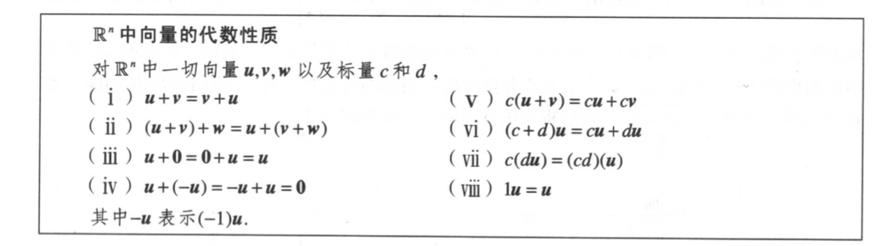

# 一、代数
## 1.前述概念
### （1）代数
- 代数是一个较为基础的数学分支。它的研究对象有许多，诸如「数」、数量、代数式、关系、方程理论、「代数结构」等等都是代数学的研究对象。
- 「代数结构」：代数的研究对象不仅是数字，还有各种抽象化的结构。例如整数集作为一个带有加法、乘法和序关系的集合就是一个代数结构。在其中我们只关心各种关系及其性质，而对于“数本身是什么”这样的问题并不关心。常见的代数结构类型有：群、环、域、模、线性空间。
- 「代数分类」：初等代数、抽象代数（近世代数）、线性代数、泛代数、计算代数。
    - 初等代数：初等代数一般在中学时讲授，介绍代数的基本思想：研究当我们对数字做加法或乘法时会发生什么，以及了解变量的概念和如何建立多项式并找出它们的根。学习以位置标识符标记常数和变量的符号，与掌控包含这些符号的表示式及方程的法则，来记录实数的运算性质。
    - 抽象代数：讨论代数结构的性质，例如群、环、域等。这些代数结构是在集合上定义运算而来，而集合上的运算则适合某些公理。
    - 线性代数：专门讨论矢量空间，包括矩阵的理论。
    - 泛代数：讨论所有代数结构的共有性质。
    - 计算代数：讨论在电脑上进行数学的符号运算的算法。
- 现代代数的入门点是两个部分：抽象代数（也叫近世代数）、线性代数。
- 代数，主要研究的是运算规则。一门代数，其实都是从某种具体的运算体系中抽象出一些基本规则，建立一个公理体系，然后在这基础上进行研究。
- 「代数结构」：一个集合再加上一套运算规则，就构成一个代数结构。
    - 群：在主要的代数结构中，最简单的是群，它只有一种复合「结合律」的可逆运算，通常叫乘法。如果，这种运算也符号「交换律」，那么就叫阿贝尔群。
    - 环：如果有两种运算，一种叫加法，满足交换律和结合律，一种叫乘法，满足结合律，它们之间满足分配律，这种丰富一点的结构叫做环。如果环上的乘法满足交换律，就叫可交换环。
    - 域：如果一个环的加法和乘法具有了所有的良好性质，那么就称为一个域。
    - 线性空间：基于域，我们可以建立一种新的结构，能进行加法和数乘，就构成了线性代数中的线性空间。
- 代数的好处在于，它只关心运算规则的演绎，而不管参与运算的对象。

### （2）初等代数
初等代数是代数中最基本的一种类型。在算术里，只有数和其算术运算（如加、减、乘、除）会出现。在代数里，数通常会以a、b、m、n、x、y 等符号来标记，表达式以f(x)、g(x)、f(g(x))、f(x1,x2)等符号来标记。

### （3）抽象代数
抽象代数将基本代数和数的算术中一些相似概念延广成更一般的概念。

### （4）线性代数
- 线性代数是在大学开始阶段开始学习的。线性代数，包括建立在它基础上的各种学科，最核心的两个概念是「向量空间」和「线性变换」。
- 线性变换是保持基础运算（加法和乘法）的映射。

# 二、初等代数

# 三、抽象代数

# 四、线性代数

符号|含义
-|-
u|向量u，黑斜体
c|标量c，细体
$\begin{bmatrix}3 \\ -1\end{bmatrix}$|列向量
(3,-1)|列向量，同上等价
[3 -1]|1X2行矩阵，行向量。$\begin{bmatrix}3 \\ -1\end{bmatrix}$≠[3 -1]

## 1.前述概念
### （1）向量
### （2）向量空间
- 向量空间是可以缩放和相加的（叫做向量的）对象的集合。
- 向量空间的一个直观模型是向量几何，几何上的向量及相关的运算即向量加法、标量乘法，以及对运算的一些限制如封闭性、结合律，已大致地描述了“向量空间”这个数学概念的直观抽象。
- 数学概念是非常抽象的概念，在现实不同的应用中有不同的指代。
- 在现代数学中，“向量”的概念不仅限于此，满足下列公理的任何数学对象都可被当作向量处理。譬如，实系数多项式的集合在定义适当的运算后构成向量空间，在代数上处理是方便的。单变元实函数的集合在定义适当的运算后，也构成向量空间，研究此类函数向量空间的数学分支称为泛函分析。

## 2.线性方程组
### ➤➤➤ 线性方程组与行化简 ➤➤➤
### （1）线性方程
包含未知数$x_1,x_2,...,x_n$的一个线性方程是形如 $$a_1x_1+a_2x_2+...+a_nx_n=b$$的方程，其中 b 与系数 $a_1,a_2,...,a_n$是实数或复数，通常是已知数。下标 n 可以使任意正整数。
### （2）线性方程组
线性方程组是由一个或几个包含相同变量 $x_1,x_2,...,x_n$的线性方程组成的。例如：
$$
\begin{array}
{ccc}
x_1& -x_2+&1.5x_3&=&8 \\
x_1&  &-4x_3&=&-7
\end{array}
$$

### （3）线性方程组的解
线性方程组的一组解是一组数$(s_1,s_2,...,s_n)$，用这组数分别代替$x_1,x_2,...,x_n$时所有方程的两边相等。

线性方程组的解有下列三种情况：
- 1.无解
- 2.有唯一解
- 3.有无穷多解

### （4）线性方程组的解集
方程组所有可能的解的集合称为线性方程组的解集。
- 若两个线性方程组有相同的解集，称它们是等价的。就是说，第一个方程组的每个解都是第二个方程组的解，第二个方程组的每个解都是第一个方程组的解。

### （5）线性方程组的系数矩阵
一个线性方程组包含的主要信息可以用一个称为矩阵的阵列表示。给出方程组
$$
\begin{array}
{ccc}
x_1-2x_2+x_3=0 \\
2x_2-8x_3=8 \\
-4x_1+5x_2+9x_3=-9
\end{array}
$$
把每一个「变量的系数」写在对齐的一列中，矩阵
$$
\begin{bmatrix}
1&-2&1 \\
0&2&-8 \\
-4&5&9
\end{bmatrix}
$$
称为方程组的系数矩阵。

### （6）线性方程组的增广矩阵
$$
\begin{bmatrix}
1&-2&1&0 \\
0&2&-8&8 \\
-4&5&9&-9
\end{bmatrix}
$$
称为方程组的增广矩阵。方程组的增广矩阵是把它的系数矩阵添上一列所得，这一列是由方程组右边的常数组成的。

### （7）矩阵的维数
矩阵的维数说明它包含的行数和列数。

### （8）线性方程组的解法
基本思路是把方程组用一个更容易解的「等价方程组」（即有相同解集）代替。

### （9）线性方程变换
等价方程组可以通过线性方程组的变换得到。

用来化简线性方程组有三种变换，经过这三种变换，不会改变方程组的解集。

用来化简线性方程组的三种基本变换：
- 把某一个方程换成它与另一方程的倍数的和
- 交换两个方程的位置
- 把某一方程的所有的项乘以一个非零常数

###### 例子
**例1** 解以下方程组
$$
\begin{array}{lll}
x_1-&2x_2+x_3&=0 \\
&2x_2-8x_3&=8 \\
-4x_1+&5x_2+9x_3&=-9
\end{array}
$$

解：一通变换，得到方程组
$$
\begin{array}{llll}
x_1&&&=29 \\
&x_2&&=16 \\
&&x_3&=3
\end{array}
$$

### （10）增广矩阵的行的变换（行初等变换）
线性方程的变换对应于增广矩阵的行的变换。

行初等变换：
- 1.倍加变换：把某一行换成它本身与另一行的倍数的和。
- 2.对换变换：把两行对换。
- 3.倍乘变换：把某一行的所有元素乘以同一个非零数。

行变换可施加于任何矩阵，不仅是对于线性方程组的增广矩阵。

### （11）矩阵行等价
若其中一个矩阵可以经一系列行初等变换成为另一个矩阵，我们称这两个矩阵为行等价的。

一个线性方程组的增广矩阵经过行变换，得到另外一个新的方程组。原方程组的任何一个解仍是新的方程组的一个解，新方程组的每个解也是原方程组的解。

若两个线性方程组的增广矩阵是行等价的，则它们具有相同的解集。

### （12）行变换可逆
行变换是可逆的，若两行被对换，则再次对换它们就会还原为原来的状态。同理，倍加和倍乘也可以。

### （13）线性方程组解集
一个现象方程组的解集可能：
- 不包含任何解
- 一个解
- 无穷多解

线性方程组两个基本问题：
- 方程组是否相容，即它是否至少有一个解
- 若它有解，它是否只有一个解，即解是否唯一

可通过增广矩阵的行变换来回答这些问题。

### （14）矩阵非零行、矩阵非零列
矩阵中非零行或列指：矩阵中至少包含一个非零元素的行或列

### （15）先导元素
非零行的先导元素是指该行中最左边的非零元素。

### （16）阶梯形（行阶梯形）矩阵
定义：一个矩阵称为「阶梯」形（行阶梯形），若它具有以下三个性质：
- 1.每一非零行在每一零行之上
- 2.某一行的先导元素所在的列位于前一行先导元素的右面。（性质2说明先导元素构成阶梯形）
- 3.某一先导元素所在列下方元素都是零。（性质3其实是性质2的推论）

### （17）简化阶梯形（简化行阶梯形）
若某一个阶梯形矩阵还满足以下性质，称为简化阶梯形（简化行阶梯形）
- 4.每一非零行的先导元素是1
- 5.每一先导元素1是该元素所在列的唯一非零元素。（在每个先导元素1的上、下，各元素都是0）

一个矩阵可以行化简（即用行初等变换）变为阶梯形矩阵，使用不同的方法可化为不同的阶梯形矩阵。然而，一个矩阵只能化为唯一的简化阶梯形矩阵。

###### 例子
**例1** 如下第一个矩阵是阶梯形，第二个矩阵是简化阶梯形。
$$
\begin{gathered}
\begin{bmatrix} 
2 & -3 & 2 & 1 \\ 
0 & 1 & -4 & 8 \\
0 & 0 & 0 & 5/2
\end{bmatrix}
\quad
\begin{bmatrix} 
1 & 0 & 0 & 29 \\ 
0 & 1 & 0 & 16 \\
0 & 0 & 1 & 3
\end{bmatrix}
\end{gathered}
$$

### （18）简化阶梯形矩阵的唯一性
每个矩阵行等价于唯一的简化阶梯形矩阵。

若矩阵A等价于阶梯形矩阵U，称U为A的阶梯形；若U是简化阶梯形，称U为A的简化阶梯形。

### （19）主元位置
当矩阵经行变换化为阶梯形后，经进一步的行变换将矩阵化为简化阶梯形时，先导元素的位置并不改变。因简化阶梯形时唯一的，当给定矩阵化为任何一个阶梯形时，先导元素总是在相同的位置上。这些先导元素对应于简化阶梯形中的先导1。

定义：矩阵中的主元位置是A中对应于它的阶梯形中先导元素的位置。主元列是A的含有主元位置的列。

### （20）变换矩阵成阶梯形或简化阶梯形的算法
- 1.由最左的非零列开始，这是一个主元列。主元位置在该列顶端。
- 2.在主元列中选取一个非零元作为主元。若有必要的话，对换两行使这个元素移到主元位置上。
- 3.用倍加行变换将主元下面的元素变成0
- 4.暂时不管包含主元位置的行以及它上面的各行，对剩下的子矩阵使用上述的三个步骤直到没有非零行需要处理为止
- 5.由最右面的主元开始，把每个主元上方的各元素变成0。若某个主元不是1，用倍乘变换将它变成1

### （21）基本变量和自由变量
某个线性方程组的增广矩阵如

$$
\begin{bmatrix} 
1 & 0 & -5 & 1 \\ 
0 & 1 & 1 & 4 \\
0 & 0 & 0 & 0
\end{bmatrix}
$$

对应的线性方程组是

$$
\begin{array}{ll}
x_1&&-5x_3&=1 \\
&x_2&+x_3&=4 \\
&&0&=0
\end{array}
$$

对应于主元列的变量 $x_1$ 和 $x_2$ 称为基本变量。其他变量 $x_3$，称为自由变量。

- 自由变量：是指它可取任意值。自由变量取值选定后，可确定基本变量的值。
- 因为有自由变量的存在，解不是唯一的

### （22）线性方程组的解
行化简算法应用于方程组的增广矩阵时，可以得出线性方程组解集的一种显式表示法。

a.不包含任何解，即不相容。
当一个方程组化为阶梯形，包含形如 $0=b$ 的方程，方程组无解。

b.唯一解
无自由变量

c.无穷解
有自由变量

### （23）存在与唯一性定理
线性方程组相容的充要条件是增广矩阵的最右列不是主元列。就是说，增广矩阵的阶梯形没有形如 b≠0 的行，若线性方程组相容，它的解集可能有两种情形：
- 1.当没有自由变量时，有唯一解。
- 2.若至少有一个自由变量，有无穷多解。

### ➤➤➤ 向量方程 ➤➤➤
线性方程组的重要性质都可用向量概念与符号来描述。

### （1）列向量（向量）、行向量
仅含一列的矩阵称为列向量，或简称向量。

### （2）二维向量集
所有两个元素的向量的集记为$\mathbb{R}^2$，$\mathbb{R}$表示向量中的元素是实数，指数2表示每个向量包含两个元素。

$\mathbb{R}^2$中两个向量相等，当前仅当对应元素相等。$\mathbb{R}^2$中向量是实数的有序对。

### （3）向量加法
给定$\mathbb{R}^2$中的两个向量 u 与 v，它们的和 u+v 是把对应元素相加所得的向量。

例如：$$
\begin{gathered}
\begin{bmatrix}1 \\-2\end{bmatrix}
+
\begin{bmatrix}2 \\5\end{bmatrix}
=
\begin{bmatrix}3 \\3\end{bmatrix}
\end{gathered}
$$

### （4）向量数乘
给定$\mathbb{R}^2$中向量u和实数 c，u与c的标量乘法（数乘）是把u的每个元素乘以c，所得向量记为 cu。

例如：$$
\begin{gathered}
u=\begin{bmatrix}3 \\-1\end{bmatrix}
,c=5,
则cu=\begin{bmatrix}15 \\-5\end{bmatrix}
\end{gathered}
$$

### （5）加法与数乘组合
向量加法与标量乘法可以组合起来。

### （6）二维向量集的几何表示
$\mathbb{R}^2$的几何表示。考虑平面上的直角坐标系，因平面上每个点由实数的有序对确定，我们可以把集合点 (a,b) 与 列向量 $\begin{bmatrix}a \\b\end{bmatrix}$等同。所以我们可把$\mathbb{R}^2$看作平面上所有点的集合。

例如，向量 $\begin{bmatrix}3 \\-1\end{bmatrix}$的几何表示是一条由原点 (0,0) 指向点 (3,-1) 的有向线段。

### （7）向量的和的几何意义
向量加法的平行四边形法则：

若 $\mathbb{R}^2$中向量 u 和 v 用平面上的点表示，则 u+v 对应于以u,0,v 为三个顶点的平行四边形的第 4 个定点。（u,0,v是三个向量）

### （8）三维向量集中的向量
$\mathbb{R}^3$中的向量是 $3\times 1$ 列矩阵，有 3 个元素。几何表示3维坐标空间中的点。

### （9）n维向量集中的向量
$\mathbb{R}^n$表示所有 n 个实数数列（或有序 n 元组）的集合，通常写成 $n\times 1$列矩阵的形式，如$\begin{bmatrix}u_1 \\u_2 \\ \vdots \\u_n\end{bmatrix}$

### （10）零向量
所有元素都是零的向量称为零向量，用 $\boldsymbol 0$ 表示，零向量中元素的个数可由上下文确定。

### （11）n维向量集中的向量的代数性质
$\mathbb{R}^n$中向量的代数性质

### （13）线性组合
给定$\mathbb{R}^n$中向量$\boldsymbol{v_1},\boldsymbol{v_2},...,\boldsymbol{v_p}$ 和标量 $c_1,c_2,...,c_p$，向量 $$\boldsymbol{y}=c_1\boldsymbol{v_1}+...+c_p\boldsymbol{v_p}$$称为向量$\boldsymbol{v_1},\boldsymbol{v_2},...,\boldsymbol{v_p}$以$c_1,c_2,...,c_p$为权的线性组合。

- 线性组合中的权可以为任意实数，包括零。

例如，下列向量都是$\boldsymbol{v_1},\boldsymbol{v_2}$的线性组合：
$$
\sqrt{3}\boldsymbol{v_1}+\boldsymbol{v_2},\frac{1}{2}\boldsymbol{v_1}+0\boldsymbol{v_2},0\boldsymbol{v_1}+0\boldsymbol{v_2}
$$

### （14）向量方程和增广矩阵
向量方程 $x_1\boldsymbol{a_1}+x_2\boldsymbol{a_2}+...+x_n\boldsymbol{a_n}=\boldsymbol{b}$ 和增广矩阵为 $[\boldsymbol{a_1} \ \boldsymbol{a_2} \ ... \ \boldsymbol{a_n} \ \ \boldsymbol{b}]$ 的线性方程组有相同的解。特别地，当且仅当方程组有解，$\boldsymbol{b}$可表示为$\boldsymbol{a_1},\boldsymbol{a_2},...,\boldsymbol{a_n}$的线性组合。

### （15）线性代数主要思想之一
线性代数的一个主要思想是研究可以表示为某一固定向量集合$\boldsymbol{v_1},\boldsymbol{v_2},...,\boldsymbol{v_p}$的线性组合的所有向量。

### （16）生成空间
定义：若$\boldsymbol{v_1},\boldsymbol{v_2},...,\boldsymbol{v_p}$是$\mathbb{R}^n$中的向量，则$\boldsymbol{v_1},\boldsymbol{v_2},...,\boldsymbol{v_p}$的「所有」线性组合所成的「集合」用记号 $Span\{\boldsymbol{v_1},\boldsymbol{v_2},...,\boldsymbol{v_p}\}$表示，称为由$\boldsymbol{v_1},\boldsymbol{v_2},...,\boldsymbol{v_p}$所生成（张成）的$\mathbb{R}^n$的子集，也就是说，$Span\{\boldsymbol{v_1},\boldsymbol{v_2},...,\boldsymbol{v_p}\}$是所有形如$$c_1\boldsymbol{v_1}+c_2\boldsymbol{v_2}...+c_p\boldsymbol{v_p}$$的向量的集合，其中 $c_1,c_2,...,c_p$为标量。

要判断向量$\boldsymbol{b}$是否属于$Span\{\boldsymbol{v_1},\boldsymbol{v_2},...,\boldsymbol{v_p}\}$，就是判断向量方程$$x_1\boldsymbol{v_1}+x_2\boldsymbol{v_2}...+x_p\boldsymbol{v_p}=\boldsymbol{b}$$是否有解，或等价的，判断增广矩阵为$[\boldsymbol{v_1} \ \boldsymbol{v_2} \ ... \ \boldsymbol{v_p} \ \ \boldsymbol{b}]$的线性方程组是否有解。

- $Span\{\boldsymbol{v_1},\boldsymbol{v_2},...,\boldsymbol{v_p}\}$包含$\boldsymbol{v_1}$的所有倍数,因$c\boldsymbol{v_1}=c\boldsymbol{v_1}+0\boldsymbol{v_2}+...+0\boldsymbol{v_p}$，特别地，它一定包含零向量。

$Span\{\boldsymbol{v}\}$和$Span\{\boldsymbol{u},\boldsymbol{v}\}$的几何解释：
- $Span\{\boldsymbol{v}\}$：设$\boldsymbol{v}$是$\mathbb{R}^3$中的非零向量，那么$Span\{\boldsymbol{v}\}$就是$\boldsymbol{v}$的所有数量倍数的集合，也就是通过$\boldsymbol{v}$和$\boldsymbol{0}$的直线上所有点的集合。
- $Span\{\boldsymbol{u},\boldsymbol{v}\}$：若$\boldsymbol{u}$和$\boldsymbol{v}$是$\mathbb{R}^3$中的非零向量，$\boldsymbol{v}$不是$\boldsymbol{u}$的倍数，则$Span\{\boldsymbol{u},\boldsymbol{v}\}$是$\mathbb{R}^3$中通过$\boldsymbol{u}$、$\boldsymbol{v}$和$\boldsymbol{0}$的平面，特别地，$Span\{\boldsymbol{u},\boldsymbol{v}\}$包含$\mathbb{R}^3$中通过$\boldsymbol{u}$与$\boldsymbol{0}$的直线，也包含通过$\boldsymbol{v}$与$\boldsymbol{0}$的直线。

### （17）向量方程
将线性方程组写成包含向量线性组合形式的向量方程。

例如，方程组
$$
\begin{array}{lll}
x_1&+2x_2-x_3&=4 \\
&-5x_2+3x_3&=1
\end{array}
$$
等价于
$$
x_1\begin{bmatrix}1 \\ 0\end{bmatrix}
+x_2\begin{bmatrix}2 \\ -5\end{bmatrix}
+x_3\begin{bmatrix}-1 \\ 3\end{bmatrix}
=\begin{bmatrix}4 \\ 1\end{bmatrix}
$$

### ➤➤➤ 矩阵方程 ➤➤➤
线性代数中的一个基本思想是把向量的线性组合看作矩阵与向量的积。

### （1）矩阵与向量的积 $\boldsymbol{A}\boldsymbol{x}$
定义：若$\boldsymbol{A}$是$m\times n$矩阵，它的各列为 $\boldsymbol{a_1},...,\boldsymbol{a_n}$，若$\boldsymbol{x}$是$\mathbb{R}^n$中向量，则$\boldsymbol{A}$与$\boldsymbol{x}$的积，记为$\boldsymbol{A}\boldsymbol{x}$，就是$\boldsymbol{A}$的各列以$\boldsymbol{x}$中对应元素为权的线性组合，即
$$
\boldsymbol{A}\boldsymbol{x}=[\boldsymbol{a_1} \ \boldsymbol{a_2}\ ...\ \boldsymbol{a_n}]
\begin{bmatrix}
x_1 \\ x_2\\ \vdots \\ x_n
\end{bmatrix}
=x_1\boldsymbol{a_1}+x_2\boldsymbol{a_2}+...+x_n\boldsymbol{a_n}
$$

注意$\boldsymbol{A}\boldsymbol{x}$仅当$\boldsymbol{A}$的列数等于$\boldsymbol{x}$中元素个数时才有定义。

### （2）矩阵方程
例如，方程组
$$
\begin{array}{lll}
x_1&+2x_2-x_3&=4 \\
&-5x_2+3x_3&=1
\end{array}
$$
等价于向量方程
$$
x_1\begin{bmatrix}1 \\ 0\end{bmatrix}
+x_2\begin{bmatrix}2 \\ -5\end{bmatrix}
+x_3\begin{bmatrix}-1 \\ 3\end{bmatrix}
=\begin{bmatrix}4 \\ 1\end{bmatrix}
$$
，将方程左边的线性组合写成矩阵乘向量的形式，成为
$$
\begin{bmatrix}1&2&-1 \\ 0&-5&3\end{bmatrix}
\begin{bmatrix}x_1 \\ x_2 \\ x_3\end{bmatrix}
=\begin{bmatrix}4 \\ 1\end{bmatrix}
$$
。该方程形如$\boldsymbol{A}\boldsymbol{x}=\boldsymbol{b}$，我们称这样的方程为矩阵方程。

矩阵方程中的矩阵仅是线性方程组中的系数矩阵。

### （3）矩阵方程、向量方程、线性方程组具有相同的解集
若$\boldsymbol{A}$是$m\times n$矩阵，它的各列为$\boldsymbol{a_1},...,\boldsymbol{a_n}$，而$\boldsymbol{b}$属于$\mathbb{R}^n$，则矩阵方程$$\boldsymbol{A}\boldsymbol{x}=\boldsymbol{b}$$与向量方程$$x_1\boldsymbol{a_1}+x_2\boldsymbol{a_2}+...+x_n\boldsymbol{a_n}=\boldsymbol{b}$$
有相同的解集，它又与增广矩阵为$$[\boldsymbol{a_1}\ \boldsymbol{a_2}\ ... \boldsymbol{a_n}\ \boldsymbol{b}]$$的线性方程组有相同的解集。

以上定理给出了研究线性代数问题的一个有力工具，使我们现在可将线性方程组用三种不同但彼此等价的观点来研究：作为矩阵方程、作为向量方程、作为线性方程组。当我们构造实际生活中某个问题的数学模型时，我们可自由地选择任何一种最自然的观点。

任何情况下，矩阵方程、向量方程、线性方程组都用相同方法来解：即用行化简算法来化简增广矩阵。

### （4）解的存在性

方程$\boldsymbol{A}\boldsymbol{x}=\boldsymbol{b}$有解当且仅当$\boldsymbol{b}$是$\boldsymbol{A}$的各列的线性组合。

存在性问题：
- 向量方程：$\boldsymbol{b}$是否属于$Span\{\boldsymbol{a_1},...,\boldsymbol{a_n}\}$
- 矩阵方程：$\boldsymbol{A}\boldsymbol{x}=\boldsymbol{b}$是否相容
- 确定方程$\boldsymbol{A}\boldsymbol{x}=\boldsymbol{b}$对任意的$\boldsymbol{b}$是否有解

### （5）矩阵方程定理
定理：设$\boldsymbol{A}$是$m\times n$矩阵，则下列命题是逻辑上等价的，也就是说，对某个$\boldsymbol{A}$，它们都成立或者都不成立。
- a.对$\mathbb{R}^m$中每个$\boldsymbol{b}$，方程$\boldsymbol{A}\boldsymbol{x}=\boldsymbol{b}$有解。
- b.$\mathbb{R}^m$中的每个$\boldsymbol{b}$都是$\boldsymbol{A}$的列一个线性组合
- c.$\boldsymbol{A}$的各列生成$\mathbb{R}^m$。（$\boldsymbol{A}$的列生成$\mathbb{R}^m$时，意思是说$\mathbb{R}^m$中的每个向量$\boldsymbol{b}$都是$\boldsymbol{A}$的列的线性组合。$\mathbb{R}^m$中向量集$\{\boldsymbol{v_1},...,\boldsymbol{v_p}\}$生成$\mathbb{R}^m$，意思是说$\mathbb{R}^m$中的每个向量都是$\boldsymbol{v_1},...,\boldsymbol{v_p}$的线性组合，即$Span\{\boldsymbol{v_1},...,\boldsymbol{v_p}\}=\mathbb{R}^m$）
- d.$\boldsymbol{A}$在每一行都有一个主元位置

上述定理讨论的是系数矩阵。

### （6）矩阵-向量积计算
矩阵-向量积$\boldsymbol{A}\boldsymbol{x}$计算

若乘积$\boldsymbol{A}\boldsymbol{x}$有定义，则$\boldsymbol{A}\boldsymbol{x}$中的第 i 个元素是 $\boldsymbol{A}$ 的第 i 行元素与 $\boldsymbol{x}$的相应元素乘积之和。

例如，
$$
\begin{bmatrix}1&2&-1 \\0&-5&3\end{bmatrix}
\begin{bmatrix}4 \\3 \\7\end{bmatrix}
=\begin{bmatrix}1\cdot 4+2\cdot 3+(-1)\cdot 7 \\ 0\cdot 4+(-5)\cdot 3+3\cdot 7 \end{bmatrix}
=\begin{bmatrix}3 \\6\end{bmatrix}
$$

### （7）矩阵-向量积性质
矩阵-向量积$\boldsymbol{A}\boldsymbol{x}$性质

定理：若$\boldsymbol{A}$是$m\times n$矩阵，$\boldsymbol{u}$和$\boldsymbol{v}$是$\mathbb{R}^n$中向量，c是标量，则
- a.$\boldsymbol{A}(\boldsymbol{u}+\boldsymbol{v})=\boldsymbol{A}\boldsymbol{u}+\boldsymbol{A}\boldsymbol{v}$
- b.$\boldsymbol{A}(c\boldsymbol{u})=c(\boldsymbol{A}\boldsymbol{u})$

### ➤➤➤ 线性方程组解集 ➤➤➤
线性方程组的解集是线性代数研究的重要对象。

### （1）齐次线性方程组
若线性方程组可写成$\boldsymbol{A}\boldsymbol{x}=\boldsymbol{0}$的形式，则线性方程组称为齐次的。
- $\boldsymbol{A}$是 $m\times n$矩阵
- $\boldsymbol{0}$是$\mathbb{R}^m$中的零向量
- 这样的方程组至少有一个解，即$\boldsymbol{x}=\boldsymbol{0}$（$\mathbb{R}^n$中的零向量），这个解称为它的平凡解。
- 对给定方程$\boldsymbol{A}\boldsymbol{x}=\boldsymbol{0}$，重要的是它是否有非平凡解，即满足$\boldsymbol{A}\boldsymbol{x}=\boldsymbol{0}$的非零向量$\boldsymbol{x}$
- 非平凡解向量$\boldsymbol{x}$可能有些零元素，只要不是所有元素都是0就行

根据解的存在性与唯一性定理：齐次方程$\boldsymbol{A}\boldsymbol{x}=\boldsymbol{0}$有非平凡解，当且仅当方程至少有一个自由变量。

### （2）齐次线性方程组解集
单一方程也可看作是方程组，描述下列齐次方程组的解集。$$10x_1-3x_2-2x_3=0$$
用自由变量表示基本变量（$x_2,x_3$为自由变量），通解为$$x_1=0.3x_2+0.2x_3$$
写成向量形式（$x_2,x_3$为自由变量），通解为：
$$
\boldsymbol{x}=
\begin{bmatrix}x_1 \\x_2 \\x_3\end{bmatrix}
=\begin{bmatrix}0.3x_2+0.2x_3 \\x_2 \\x_3\end{bmatrix}
=\begin{bmatrix}0.3x_2 \\x_2 \\0\end{bmatrix}+\begin{bmatrix}0.2x_3 \\0 \\x_3\end{bmatrix}
=x_2\begin{bmatrix}0.3 \\1 \\0\end{bmatrix}+x_3\begin{bmatrix}0.2 \\0 \\1\end{bmatrix}=x_2\boldsymbol{u}+x_3\boldsymbol{v}
$$

计算表明，线性方程的每个解都是向量$\boldsymbol{u}$和$\boldsymbol{v}$的线性组合，即解集为$Span\{\boldsymbol{u},\boldsymbol{v}\}$。几何上，解集是通过原点的一个平面。

### （3）齐次线性方程组解集与Span
齐次方程$\boldsymbol{A}\boldsymbol{x}=\boldsymbol{0}$解集总可表示为$Span\{\boldsymbol{v_1},...,\boldsymbol{v_p}\}$，其中，$\boldsymbol{v_1},...,\boldsymbol{v_p}$是适当的解向量。
- 若唯一解是零向量，则解集就是$Span\{\boldsymbol{0}\}$
- 若方程$\boldsymbol{A}\boldsymbol{x}=\boldsymbol{0}$仅有一个自由变量，解集是通过原点的一条直线
- 若有两个或更多自由变量，解集可是通过原点的一个平面

### （4）参数向量形式表示解集
线性方程$10x_1-3x_2-2x_3=0$的解是一个平面。该线性方程是平面的隐式描述。

解此方程就是要找这个平面的显式描述，$\boldsymbol{x}=x_2\boldsymbol{u}+x_3\boldsymbol{v}$称为平面的参数向量方程，有时写作$\boldsymbol{x}=s\boldsymbol{u}+t\boldsymbol{v}$，强调参数可取任何实数值。

### （5）非齐次线性方程组
$\boldsymbol{A}\boldsymbol{x}=\boldsymbol{b}$

### （6）非其次线性方程组的解
当非齐次线性方程组有许多解时，一般可表示为参数向量形式，即由一个向量加上满足对应的齐次方程的一些向量的任意线性组合的形式。

## 3.矩阵

## 4.行列式

## 5.向量空间
### （1）n维向量
定义：由 n 个数 $a_1,a_2,...,a_n$组成的一个有序数值称为一个 n 维向量，数 $a_i$ 称为该 n 维向量的第 i 个分量。
- n 维列向量
- n 维行向量

### （2）n维向量的集合
{n 维向量}

###### 例子

例1：$w=\{(0,x_2,x_3)^T|x_2,x_3\in R\}$

w是三维向量的集合，这个三维向量有个特点，第一个坐标是0。

### （3）（n维）向量空间
{n 维向量；+，数乘}
- 什么叫向量空间？n维向量的集合，带上两个运算：加法、数乘。

### （4）子空间
###### 抽象定义
w 是 n 维向量的非空集合，且
- 1.$\forall \alpha,\beta \in w \Rightarrow \alpha +\beta \in w$
- 2.$\forall \alpha \in w ,\forall k \Rightarrow k\alpha  \in w$

则称 w 是 n 维向量空间的子空间

###### 具象定义
w是n维向量的非空集合，w满足以下两个性质
- 加法封闭： w中的任意两个向量$\alpha ,\beta$，加法运算后的向量还在w的集合中
- 数乘封闭： w中的任意一个向量$\alpha$和任意一个实数 k，数乘后的向量还在w的集合中

则称集合w是n维向量空间的子空间

- 向量空间是一个带运算的向量集合
- 子空间是加法与数乘封闭的向量集合

###### 例子

**例1**：已知三维向量的集合$w=\{(0,x_2,x_3)^T|x_2,x_3\in R\}$，该集合w是否是三维向量空间$\{(0,x_2,x_3)^T;+,数乘\}$的子空间

设 $\alpha =(0,a_2,a_3)^T,\beta =(0,b_2,b_3)^T \in w$ 

能得到 $\alpha +\beta =(0,a_2+b_2,a_3+b_3)^T \in w$，$k\alpha =(0,ka_2,ka_3)^T \in w$

因此 w是三维向量空间$\{(0,x_2,x_3)^T;+,数乘\}$的子空间

**例2**：$w=\{k\alpha_0|\alpha_0=(1,3,5)^T,k\in R\}$，该集合w是否是三维向量空间的子空间

$\alpha_0$向量的倍数构成一个集合。

设 $\alpha_1=k_1\alpha_0,\alpha_2=k_2\alpha_0$，能得到 $\alpha_1+\alpha_2=(k_1+k_2)\alpha_0 \in w$ （加法封闭）

设 $\alpha=l\alpha_0$,能得到$k\alpha=k(l\alpha_0)=(kl)\alpha_0 \in w$ （数乘封闭）

所以集合w是三维向量空间的子空间

**例3**：$w=\{(1,x_2,x_3)^T|x_2,x_3 \in R\}$，集合w是否是子空间

设 $\alpha=(1,3,5)^T \in w$，但$2\alpha=(2,6,10)^T \notin w$

不满足乘法封闭（当然加法也不封闭），所以集合w不是子空间

**例4**：$w=\{(x_1,x_2,x_3)^T|x_1x_2=0,x_i\in R\}$，集合w是否是子空间

设$\alpha=(1,0,2)^T,\beta=(0,3,1)^T \in w$，但是 $\alpha+\beta=(1,3,3)^T \notin w$

所以集合w不构成子空间

## 6.特征值与特征向量

## 1.前述概念
### （1）向量空间（线性空间）
- 向量空间又称为线性空间。
- 随着向量理论的发展，向量空间的产生、发展并日趋成熟也成为必然，并且在此基础之上发展和形成了更多的抽象空间。
- 向量空间是现代数学理论中的重要内容，它包含着丰富的数学内容，同时也蕴含着深厚的数学思想方法，它的理论和方法已经渗透到各个研究领域。向量空间理论从1930年之后，像一种语言一样迅速渗透到现代科学的各个方向，不仅仅因为向量空间理论具有的基础性、一般性等特征，更是因为它帮助诸多数学家在已有的数学领域创造了新的理论方法。
- 向量空间理论的发展离不开向量理论的产生和发展，而且向量空间理论的发展也是随着向量理论发展起来的。

## 2.向量
### （1）向量理论的发展
- 1.早期物理学中物理量的向量特征 
在向量的概念产生之前，向量已经在物理学中广泛的被应用，力、速度等都是具有大小和方向的向量。
- 2.向量理论与位置几何 
- 3.源自复数几何表示的向量理论 

### （2）向量概念的历史发展
- 1.基于物理量的定义 
基于物理量的定义指的是以力、位移、速度等有方向的物理量为背景而产生的向量定义。在物理情境下，向量有三个关键要素：大小、方向和「位置」。以力为例，力的刻画必须要有「作用点」、大小和方向。这类定义又可以分成三类：
    - 1) 第一类定义相对于物理中的标量给出。英国物理学家亥维赛德1889年指出，“生活中有两种不同的大小，像质量、密度、能量、温度只具有代数意义上的大小，是「标量」意义上的大小。还有一些具有大小的量，如位移、速度、加速度、力、动力、电流等，有大小也有方向，两者缺一不可，这些都是「向量」。”
    - 2) 第二类定义是在物理量的基础上，将向量定义为表示物理量的有向线段。如Palmer将向量定义为“表示物理矢量的有向线段”。此类定义强调有向线段是力的几何表征，力的方向用「有向箭头」表示，力的大小用「有向线段的长度」衡量，力的作用点就是「有向线段的起点」，这种表示力的线段就是向量。
    - 3) 第三类定义是物理量的抽象。Coffin给出的定义是：“向量是任何具有方向与大小的物理量的抽象结果”，向量是<u>某类具有大小与方向特征的量</u>的统称，仅限于物理量的抽象结果。
- 2.基于「有向线段」的定义 
有向线段的概念：“A、B是一直线上的任意两点，在初等几何中，人们习惯将以A、B为端点的线段记为 AB 或 BA，不在乎字母书写的顺序。然而，当线段用来表示从点 A 到点 B 的轨迹或者从点 B 到点 A 的轨迹时，有必要区分线段 AB 与线段 BA 的差别。此时，这种线段就叫「有向线段」或向量或移动，用字母的书写顺序来表示这种差别。因此，AB 表示点 A 到点 B 的向量，BA 表示点 B 到点 A 的向量，向量 AB 与向量 BA 长度相同，方向相反。”
- 3.基于复数的定义 
向量作为复数的几何表征，主要出现在代数教科书中。
- 4.基于平移运动的定义 
有两类平移，一类是点或图形的平移，另一类是指纯粹的平移变换。

### （3）自由向量
不考虑起点，相当于自由向量。

### （4）位置向量
位置向量是在某一时刻，以坐标原点为起点，以运动质点所在位置为终点的有向线段。

### （5）有向线段
$A\to B$是从点 A 向点 B 延伸的，$B\to A$是从点 B 向点 A 延伸的。设$A\to B$是一条直线上的任意一条有向线段，$C\to D$是同一条直线上的另一条有向线段，如果$A\to B$与$C\to D$的箭头方向相同，并且 AB 与 CD 的长度相同，那么有向线段 AB 与 CD 相同。

接受了有向线段的概念后，我们仅仅需要考虑有向线段的方向和长度，这两个元素与点 A 向点 B 行进的路径无关。有向线段$A\to B$与$C\to D$有所不同，但是通过平移能够互相重合，那么它们只是表征不同，本质相同。因此，<u>这两个不同的有向线段不过是同一个向量的不同表征而已</u>。

人们经常用有向线段刻画物理上得到的力、速度等有向量，用有向线段表示向量就显得理所当然。向量概念应满足三个特征：有大小、有方向、没有位置。“向量是位置不确定的有向线段，每一个向量的代数表征都有对应的几何结构”。这一简短的定义揭示了向量的本质特征：向量是不固定的，向量有代数与几何两种表征方式，因此它是沟通代数和几何的桥梁。

### （6）平移运动
Tail将向量定义为“将一点运载到另一点的工具，因此，向量可以表示空间中的特定平移”。Wood给出的定义是：“向量是定距离定方向平移的表示方法”。如果A、B是两个点，那么向量 AB 表示从点 A 到点 B 的平移。向量可以用几何上的线段表示，线段的长度等于平移的距离，方向就是平移的方向。

- 多个相等的向量，其本质是同一个向量。
- 向量只含有两个基本要素：大小和方向。
- 从动态视角认识向量，把向量看作一种平移操作过程。向量蕴含着一种操作，表示特定方向上特定距离的平移。
- 平移背景下的向量与起始位置无关，其本质就是自由向量。

### （7）向量定义的演变
- 向量最初用以表示速度和力，后来表示一般有方向的物理量。因此，向量是从物理学科延伸出来的数学概念，是用几何上的有向线段来表示物理上的矢量。
- <u>后来，数学家们研究了位置几何以及寻求平移运动或变换的符号表示，区分了位置向量与自由向量</u>。
- 1865~1884，基于平移运动的定义
- 1885~1904，基于平移运动的定义占主要地位
- 1905~1924年间，基于物理量的定义与基于有向线段的定义占据主要地位。
- 1925~1944，人们逐渐认识到基于有向线段定义的缺陷，取而代之的是基于平移的定义。
- 1945~1965，基于物理量和有向线段的定义重新占据主要地位

从物理量到有向线段，再到复数的几何表征，最后基于平移运动的定义，并不是一个直线发展的过程。一开始，向量仅仅指位置向量，是物理量的抽象结果。因此，物理量是向量出现的背景之一。接着，人们用有向线段代替向量，源于物理量的几何表征和复数的几何表征，有大小和方向是向量的特征。最后，自由向量的出现源于数学家对于位置几何的探讨和平移运动与变换的表达。不同背景下的向量定义蕴含了不同的数学思想与方法，如整形结合、从特殊到一般、从有限到无限等。

## 3.向量空间
### ➤➤➤ 前述概念 ➤➤➤
### （1）向量空间思维
- 向量空间又称线性空间。
- 在解析几何里引入向量概念后，使许多问题的处理变得更为简洁和清晰，在此基础上的进一步抽象化，形成了与域相联系的向量空间概念。
- 解析几何：又称坐标几何，指借助笛卡尔坐标系，是一种借助于解析式进行图形研究的几何学分支。解析几何通常使用二维的平面直角坐标系研究直线、圆、圆锥曲线、摆线等各种一般平面曲线，使用三维的空间直角坐标系来研究平面、球等各种一般空间曲面，同时研究它们的方程，并定义一些图形的概念和参数。
- 线性空间是在考察了大量的数学对象（向量、矩阵、多项式，函数）的本质属性后抽象出来的数学概念

### （2）向量空间

### （3）平面（二维空间）
$R^2=\{(x,y):x,y\in R\}$，这是我们熟悉的平面（plane），也是一个二维的向量空间。

记作：
$$
 \left[
 \begin{matrix}
   x \\
   y
  \end{matrix}
  \right]
$$

### （4）立体空间（三维空间）
$R^3=\{(x,y,z):x,y,z\in R\}$，这是我们熟悉的立体空间（space），也是一个三维的向量空间。

记作：
$$
 \left[
 \begin{matrix}
   x \\
   y \\
   z
  \end{matrix}
  \right]
$$

### （5）n维空间

记作：
$$
 \left[
 \begin{matrix}
   x_1 \\
   x_2 \\
   \vdots \\
   x_n
  \end{matrix}
  \right]
$$

### （5）n元列表（n元组）
二维，三维...为了将这一维度推向更高，我们引出 n 元列表，或者叫做 n 元组 $(x_1,x_2,...,x_n)$。数学上，n 元组是对象个数有限的序列，n 元组被数学家们用来「描述确定成分」的数学对象。多元组不同于「集合」。

### （6）集合

### （7）向量空间的元素
向量空间的元素可以是一个个的向量，但是，并不是所有的向量空间都是向量构成的。

### （8）向量、向量组、矩阵、向量空间
- 向量：一行或一列的矩阵
- 矩阵：向量组
- 向量空间，如二维空间$R^2=\{(x,y):x,y\in R\}$，可以认为是一个集合。（有人说可以将向量空间类比为面向对象中的类，向量类比为对象）

### （9）向量的分量（维）
向量分量的个数称为向量的维。

### （10）向量的个数
向量组（矩阵）中向量的个数

### （11）行数、列数
向量组（矩阵）中的行数、列数

### （12）向量空间中的向量
向量空间中的元素称为向量

### （13）向量与几何向量
向量是抽象的概念，几何向量是相对具体的概念。

### （14）不同语境的向量
有向线段、向量、向量空间中的向量、几何向量。

在物理学和工程学中，几何向量更常被称为矢量。许多物理量都是矢量，比如一个物体的位移，球撞向墙而对其施加的力等等。与之相对的是标量，即只有大小而没有方向的量。一些与向量有关的定义亦与物理概念有密切的联系，例如向量势对应于物理中的势能。几何向量的概念在线性代数中经由抽象化，得到更一般的向量概念。此处向量定义为向量空间的元素，要注意这些抽象意义上的向量不一定以数对表示，大小和方向的概念亦不一定适用。因此，平日阅读时需按照语境来区分文中所说的"向量"是哪一种概念。不过，依然可以找出一个向量空间的基来设置坐标系，也可以透过选取恰当的定义，在向量空间上介定范数和内积，这允许我们把抽象意义上的向量类比为具体的几何向量。

### （15）向量的维、矩阵的维、向量空间的维
- 向量的维数，一般指向量中分量的个数
- 矩阵的维数，一般指矩阵的阶数（方阵）
- 向量空间的维数，一般指空间中一组基中向量的个数。如果有r个向量线性无关，切线性空间中任意一个向量都能由这r个向量线性表示，称r为向量空间的维，称这r个向量维空间的基。
- 向量维数与空间维数的区别：空间维数指的是空间基中向量的个数，并不是由向量的维数确定的。

### 向量组的线性

向量原点、同维向量
向量空间的基
形象定义、公理化定义、线性相关、子空间、线性映射（线性变换）、

# 五、泛代数

# 六、计算代数