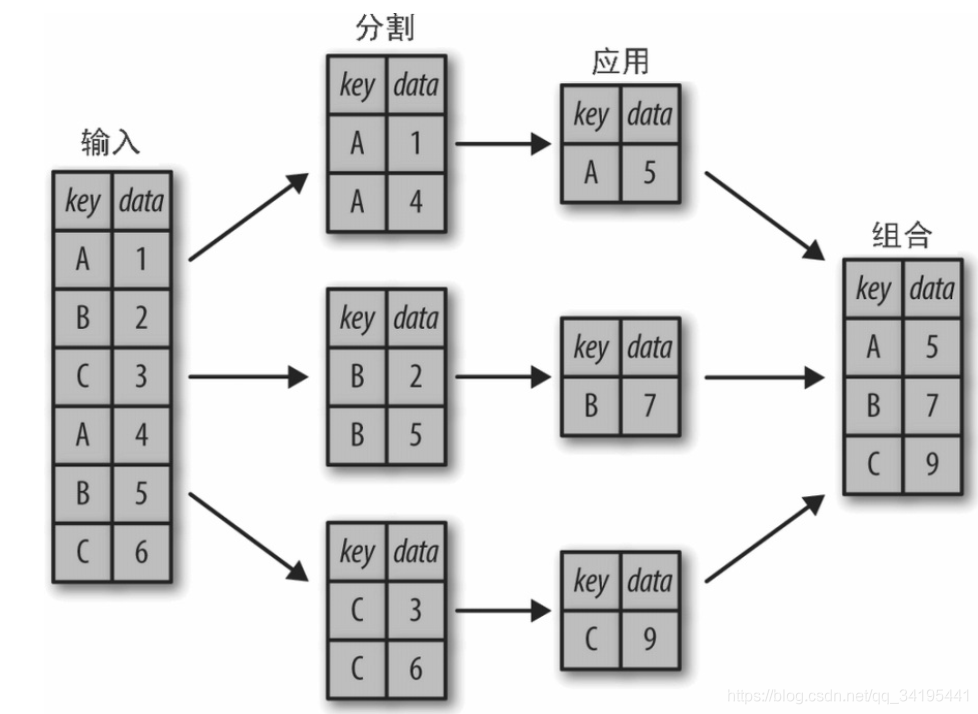

# 一、Pandas
## 1.Pandas对象
如果从底层视角观察Pandas对象，可以把它们看成增强版的NumPy结构化数组，行列都不再只是简单的整数索引，还可以带上标签。

Pandas的每一个工具、方法和功能几乎都需要我们理解基本数据结构的内部细节。因此，需掌握Pandas的三个基本数据结构：Serises、DataFrame、Index。

### 1.1.Series对象

#### （1）Series是什么
Pandas的Series对象是一个带「索引」数据结构的「一维」数组。

可以用一个数组创建Series对象，如下所示：
```
import pandas as pd
data = pd.Series([0.1, 0.3, 0.5])
data
0    0.1
1    0.3
2    0.5
dtype: float64
```
以上，Series对象将一组数据和一组索引绑定在一起。可以通过values属性和index属性获取一维数组和索引标签。

```
data.values
out:array([0.1, 0.3, 0.5])
data.index
out:RangeIndex(start=0, stop=3, step=1)
```

#### （2）Series与一维NumPy数组比较
Series对象比一维NumPy数组更加通用，灵活。

##### a.Series是通用的NumPy数组
Series对象和一维NumPy数组基本可以等价交换，但两者间的本质差异其实是索引：NumPy数组通过「隐式定义」的「整数索引」获取数值，Series对象用一种「显式定义」的「任意类型索引」与数值关联。

- Series显式定义索引
- Series定义的索引可以是任意类型，如字符串。

**使用字符串定义索引并索引数据**
```
data = pd.Series([0.1, 0.3, 0.5],index=['a','b','c'])
data
out:
a    0.1
b    0.3
c    0.5
dtype: float64
data['b']
out:0.3
```

**使用不连续的整数定义索引并索引数据**
```
data = pd.Series([0.1, 0.3, 0.5],index=[5,20,2])
data
out:
5     0.1
20    0.3
2     0.5
dtype: float64
data[20]
out:0.3
```

##### b.Series是特殊的字典
可以把Pandas的Series对象看成是一种特殊的python字典。字典是一种将任意键映射到一组任意值得数据结构，Series对象其实是一种将类型键映射到一组类型值得数据结构。类型至关重要：就像NumPy数组背后特定类型的经过编译的代码使得它在某些操作上比普通的Python列表更加高效一样，Pandas Series的类型信息使得它在某些操作上比Python的字典更高效。

可以直接用Python的字典创建一个Series对象，让Series对象与字典的额类比更加清晰：
```
population_dict={'北京':2154,'上海':2632,'广州':1531,'深圳':1259}
population = pd.Series(population_dict)
population
out:
北京    2154
上海    2632
广州    1531
深圳    1259
dtype: int64
```

索引获取数据
```
population['北京']
out:
2154
```
切片获取数据
```
population['上海':'深圳']
out:
上海    2632
广州    1531
深圳    1259
dtype: int64
```
#### （3）创建对象
创建Series对象的语法是 `pd.Series(data, index=index)`
- data参数支持多种数据类型，index是一个可选参数。可以通过显式指定索引获取数据
- data可以是列表或NumPy数组，这时index默认值维整数序列
```
pd.Series([1,3,5])
out:
0    1
1    3
2    5
dtype: int64
```
- data可以是一个标量，创建Series对象时会重复填充到每个索引上
```
pd.Series(5, index=[100,200,300])
out:
100    5
200    5
300    5
dtype: int64
```
- data可以是一个字典，index默认是排序的字典键
```
pd.Series({2:'a',1:'b',3:'c'})
out:
2    a
1    b
3    c
dtype: object
```

#### ➤➤➤ Series属性 ➤➤➤
#### （3）Series.values属性

#### （4）Series.index属性

#### （5）获取数据
可以通过显式指定索引获取数据。


### 1.2.DataFrame对象
#### （1）DataFrame是什么
- 如果将Series类比为带灵活索引的一维数组，那么DataFrame就可以看做是一种既有「灵活的行索引」，又有「灵活列名」的二维数组。就像可以把二维数组看成是有序排序的一维数组一样，可以把DataFrame看成是有序排列的若干Series对象。

#### （2）DataFrame与二维NumPy数组比较
##### a.DataFrame是通用的NumPy数组

##### b.DataFrame是特殊的字典

#### ➤➤➤ 创建对象 ➤➤➤
DataFrame对象可以通过许多方式创建。
#### （1）构造函数
`DataFrame(data=None, index=None, columns=None, dtype=None, copy=None)`
- data:ndarray (structured or homogeneous), Iterable, dict, or DataFrame. Dict can contain Series, arrays, constants, dataclass or list-like objects.如果data是一个字典，列顺序遵循插入顺序。
- index
- columns:Index or array-like
- dtype
- copy

#### （2）通过单个Series对象创建
DataFrame是一组Series对象的集合，可以用单个Series创建一个单列的DataFrame。
```
population_dict={'北京':2154,'上海':2632,'广州':1531,'深圳':1259}
population = pd.Series(population_dict)
population
out:
北京    2154
上海    2632
广州    1531
深圳    1259
dtype: int64
pd.DataFrame(population, columns=['population'])
out:
population
北京	2154
上海	2632
广州	1531
深圳	1259
```

#### （3）通过字典列表（list of dicts）创建
任何元素是字典的列表都可以变成DataFrame
```
data = [{'a':i, 'b':2*i} for i in range(3)]
pd.DataFrame(data)
out:
a	b
0	0	0
1	1	2
2	2	4
```
#### （4）通过Series对象字典创建
可以用一个由Series对象构成的字典创建DataFrame
```
population_dict={'北京':2154,'上海':2632,'广州':1531,'深圳':1259}
population = pd.Series(population_dict)
area_dict={'北京':16410,'上海':6340,'广州':7434,'深圳':1997}
area = pd.Series(area_dict)
pd.DataFrame({'population':population,'area':area})
out:
population	area
北京	2154	16410
上海	2632	6340
广州	1531	7434
深圳	1259	1997
```

#### （5）通过NumPy二维数组创建
假如有一个二维数组，就可以创建一个可以指定行列索引值的DataFrame。如果不指定行列索引值，那么行列默认都是整数索引值。
```
pd.DataFrame(np.random.rand(3,2))
out:
    0	1
0	0.783028	0.184407
1	0.726870	0.685593
2	0.757775	0.806291
pd.DataFrame(np.random.rand(3,2),columns=['foo','bar'],index=['a','b','c'])
out:
    foo	bar
a	0.757035	0.684511
b	0.790210	0.807101
c	0.032117	0.170443

```
#### （6）通过NumPy结构化数组创建。

#### ➤➤➤ 数据选择 ➤➤➤
#### （1）将DataFrame当做字典

##### a.字典形式（dictionary-style）

把DataFrame当做一个由若干个Series对象构成的字典。
```
pop = pd.Series({'北京':2154,'上海':2632,'广州':1531,'深圳':1259})
area = pd.Series({'北京':16410,'上海':6340,'广州':7434,'深圳':1997})
data = pd.DataFrame({'pop':pop,'area':area})
data
out:
        pop	area
北京	2154	16410
上海	2632	6340
广州	1531	7434
深圳	1259	1997
```
两个Series分别构成DataFrame的一列，可以通过对列名进行字典形式（dictionary-style）的取值获取数据。
```
data['area']
out:
北京    16410
上海     6340
广州     7434
深圳     1997
Name: area, dtype: int64
```
##### b.属性形式（attribute-style）
可以用属性形式（attribute-style）选择纯字符串列名的数据。
```
data.area
out:
北京    16410
上海     6340
广州     7434
深圳     1997
Name: area, dtype: int64
```
虽然属性形式的数据选择方法很方便，但是它并不是通用的。
- 如果列名不是纯字符串
- 或者列名与DataFrame的方法同名

就不能用属性索引。
```
data.pop
out:
<bound method DataFrame.pop of      pop   area
北京  2154  16410
上海  2632   6340
广州  1531   7434
深圳  1259   1997>
```
为避免歧义，尽量不使用属性形式选择数据。

#### （3）将DataFrame看做二维数组
可以把DataFrame看做是一个增强版的二维数组

##### a.values属性按行查看数组数据
用values属性按行查看数组数据。
```
data.values
out:
array([[ 2154, 16410],
       [ 2632,  6340],
       [ 1531,  7434],
       [ 1259,  1997]], dtype=int64)
```

##### b.对DataFrame进行行列转置
```
data
out:
	    pop	area
北京	2154	16410
上海	2632	6340
广州	1531	7434
深圳	1259	1997
data.T
out:
    北京	上海	广州	深圳
pop	2154	2632	1531	1259
area	16410	6340	7434	1997
```

##### c.用单个行索引获取一行数据
```
data
out:
pop	area
北京	2154	16410
上海	2632	6340
广州	1531	7434
深圳	1259	1997
data.values[0]
out:
array([ 2154, 16410], dtype=int64)
```

##### d.用单个列索引获取一列数据
```
data['area']
out:
北京    16410
上海     6340
广州     7434
深圳     1997
Name: area, dtype: int64
```

##### e.索引器获取数据
接下来，将DataFrame当做数组时，通过loc、iloc、ix索引器，我们就可以像对待NumPy数组一样索引Pandas的底层数组（Python的隐式索引），DataFrame的行列标签会自动保留在结果中。
```
data
out:
  pop	area
北京	2154	16410
上海	2632	6340
广州	1531	7434
深圳	1259	1997
data.iloc[:3,:2]
out:
  pop	area
北京	2154	16410
上海	2632	6340
广州	1531	7434
```

### 1.3.Index对象
## 2.类sql操作
### 2.1.GroupBy
可以使用分割（split）、应用（apply）、组合（combine）来理解GroupBy操作。
- 分割步骤将DataFrame按照指定键分割成若干组。
- 应用步骤对每个组应用函数、通常是累计、转换或过滤函数。
- 组合步骤将每一组的结果合并成一个输出数组。



GroupBy操作经常只需一行代码，就可以计算每组的和、均值、计数、最小值以及其他累计值。GroupBy的用处就是将这些步骤进行抽象，用户不需要知道在底层如何计算，只要把操作看成一个整体就够了。

#### （1）groupby对象
```
df = pd.DataFrame({'key':['A','B','C','A','B','C'],'data':range(6)},columns=['key','data'])
df
out:
	key	data
0	A	0
1	B	1
2	C	2
3	A	3
4	B	4
5	C	5
df.groupby('key')
out:
<pandas.core.groupby.generic.DataFrameGroupBy object at 0x00000190053734F0>
```
`df.groupby()`的返回值不是一个DataFrame对象，而是一个DataFrameGroupBy对象。这个对象的魔力在于，可以将它看成是一种特殊形式的DataFrame，里面隐藏着若干组数据，但是在乜有应用累计函数之前不会计算（已经执行了分组操作，应用累计函数就会完成相应的应用/组合步骤并生成结果）。这种延迟计算（lazy evaluation）的方法使得大多数常见的累计操作可以通过一种对用户而言几乎是透明的方式非常高效的实现。

#### ➤➤➤ groupby按列取值 ➤➤➤
数据集：
```
df = pd.DataFrame({'班级':['331','331','331','331','331','331','331','332','332','332','332','332','332','333','333','333','333','333'],
                   '姓名':['张1','张2','张3','李1','李2','李3','王1','王2','王3','赵1','赵2','孙1','孙2','孙3','钱1','钱2','宋1','宋2'],
                   '性别':['男','男','男','女','女','女','女','男','男','男','女','女','女','男','男','女','女','女'],
                   '身高':[175,182,179,159,163,165,170,189,178,177,159,160,170,180,179,163,158,169],
                   '成绩':[98,90,96,99,96,95,92,81,83,85,87,82,85,71,73,78,77,76]},
                 columns=['班级','姓名','性别','身高','成绩'])
out:
	班级	姓名	性别	身高	成绩
0	331	张1	男	175	98
1	331	张2	男	182	90
2	331	张3	男	179	96
3	331	李1	女	159	99
4	331	李2	女	163	96
5	331	李3	女	165	95
6	331	王1	女	170	92
7	332	王2	男	189	81
8	332	王3	男	178	83
9	332	赵1	男	177	85
10	332	赵2	女	159	87
11	332	孙1	女	160	82
12	332	孙2	女	170	85
13	333	孙3	男	180	71
14	333	钱1	男	179	73
15	333	钱2	女	163	78
16	333	宋1	女	158	77
17	333	宋2	女	169	76
```
#### （1）按列取值
GroupBy 对象与DataFrame一样，也支持按列取值，并返回一个修改过的GroupBy对象。`df.groupby('XX1')['XX2']`

```
df.groupby('班级')
out:
<pandas.core.groupby.generic.DataFrameGroupBy object at 0x00000190071E39D0>
df.groupby('班级')['成绩']
out:
<pandas.core.groupby.generic.SeriesGroupBy object at 0x00000190071E3820>
```
这里从原来的DataFrame中取某个列名作为一个Series组。

#### （2）按列取值并对该列进行操作
按列取值返回一个修改过的groupby对象，同样，直到我们运行累计函数，才会开始计算。

```
df.groupby('班级')['成绩'].count()
out:
班级
331    7
332    6
333    5
Name: 成绩, dtype: int64

df.groupby('班级')['成绩'].mean()
out:
班级
331    95.142857
332    83.833333
333    75.000000
Name: 成绩, dtype: float64
```

#### ➤➤➤ groupby对象的操作方法 ➤➤➤
#### （1）describe()
对数据表中的「数值列」进行统计，不会对非数值列统计。

统计信息包括：count、mean、std、min、25%、50%、75%、max。

```
df.groupby('班级').describe()
out:
身高	成绩
count	mean	std	min	25%	50%	75%	max	count	mean	std	min	25%	50%	75%	max
班级																
331	7.0	170.428571	8.599557	159.0	164.0	170.0	177.00	182.0	7.0	95.142857	3.184785	90.0	93.50	96.0	97.0	99.0
332	6.0	172.166667	11.548449	159.0	162.5	173.5	177.75	189.0	6.0	83.833333	2.228602	81.0	82.25	84.0	85.0	87.0
333	5.0	169.800000	9.679876	158.0	163.0	169.0	179.00	180.0	5.0	75.000000	2.915476	71.0	73.00	76.0	77.0	78.0
```
unstack()可以将每列的统计信息垂直排列。

#### ➤➤➤ groupby对象的聚合、过滤、转换、应用操作 ➤➤➤
GroupBy对象是一种非常灵活的抽象类型，在大多数场景中，可以将它看成是DataFrame的集合，在底层解决所有难题。

GroupBy中重要的操作可能就是aggregate（聚合）、filter（过滤）、transform（转换）和apply（应用）了。

数据集：使用以下这个DataFrame。
```
rng = np.random.RandomState(0)
df = pd.DataFrame({'key':['A','B','C','A','B','C'],'data1':range(6),'data2':rng.randint(0,10,6)},columns=['key','data1','data2'])
df
out:
key	data1	data2
0	A	0	5
1	B	1	0
2	C	2	3
3	A	3	3
4	B	4	7
5	C	5	9
```
#### （1）聚合aggregate
聚合操作是groupby后非常常见的操作，聚合操作可以用来求和、均值、最大值、最小值。聚合操作有：min、max、sum、mean、median、std、var、count。

##### a、按某列分组，其余所有列指定一个聚合操作
```
df.groupby('key').agg('mean')
out:
data1	data2
key		
A	1.5	4.0
B	2.5	3.5
C	3.5	6.0
```

##### b、按某列分组，其余所有列指定多个聚合操作
```
df.groupby('key').aggregate(['sum','mean','max'])
out:
	data1	data2
sum	mean	max	sum	mean	max
key						
A	3	1.5	3	8	4.0	5
B	5	2.5	4	7	3.5	7
C	7	3.5	5	12	6.0	9
```

##### c、按某列分组，指定列指定一个聚合操作
```
df.groupby('key').agg({'data1':'min','data2':'max'})
out:
data1	data2
key		
A	0	5
B	1	7
C	2	9
```

##### d、按某列分组，指定列指定多个聚合操作
```
df.groupby('key').agg({'data1':['min','max'],'data2':'max'})
out:
data1	data2
min	max	max
key			
A	0	3	5
B	1	4	7
C	2	5	9
```

##### e、按多个列分组
```
rng = np.random.RandomState(0)
df = pd.DataFrame({'key1':['A','B','C','A','B','C'],'key2':['X','X','X','Y','Y','Y'],'data1':range(6),'data2':rng.randint(0,10,6)},columns=['key1','key2','data1','data2'])
df
out:
key1	key2	data1	data2
0	A	X	0	5
1	B	X	1	0
2	C	X	2	3
3	A	Y	3	3
4	B	Y	4	7
5	C	Y	5	9

df.groupby(['key1','key2']).aggregate('mean')
```


#### （1）count计数

#### （2）分组计数
```python
from sklearn.datasets import load_boston
import pandas as pd
boston = load_boston()
df=pd.concat([pd.DataFrame(boston.data),pd.DataFrame(boston.target)],axis=1)
df.columns=['CRIM','ZN','INDUS','CHAS','NOX','RM','AGE','DIS','RAD','TAX','PTRATIO','B','LSTAT','MEDV']

df['RAD'].groupby(df.RAD).count()
```

# 二、数据可视化
## 1.前言
### （1）数据可视化
数据可视化是以图示或图形格式表示的数据。让决策者可以看到以直观方式呈现的分析，以便他们可以掌握困难的概念或识别新的模式。

### （2）交互式可视化

## 2.matplotlib
### 2.1.概念
#### （1）matplotlib

## 3.seaborn
### 3.1.前言
#### （1）seaborn
- matplotlib应该是基于python语言最优秀的绘图库了，但是它有一个十分头疼的问题，就是太过于复杂。3000多页的官方文档，上千个方法以及数万个参数，属实是可以用它做任何事，但是又无从下手。seaborn是基于matplotlib核心库进行了更高阶的API封装，可以更轻松的画出漂亮的图形。seaborn的漂亮主要体现在配色更加舒服、以及图形元素的样式更加细腻。

### （2）seaborn特点
- 内置数个经过优化的样式效果
- 单变量和双变量分布绘图更为简单，可用于对数据子集相互比较
- 与NumPy和Pandas数据结构配合良好
- Pandas是一个用于管理关系（表格式）数据集的优秀库，DataFrame时用于数据分析的最广泛使用的数据结构，seaborn在处理DataFrame时非常方便。


