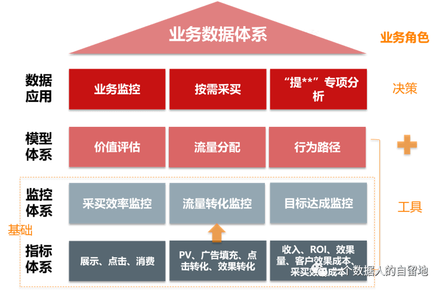

# 1.数据体系
## 1.1.数据体系及数据体系架构
### （1）数据体系是什么
### （2）数据体系架构
不同的业务形态，具有不同的数据体系架构。

以流量采买业务示例，数据体系架构如下：

## （1）业务流程
构建体系的第一步，绝不是网上搜索XX行业指标体系，也不是到处询问XX行业得看什么指标，也不是到处找《XX行业指标体系规范权威发布》，而是认真梳理业务流程。因为网上搜索的一大堆AARRR方法论太过粗放，不足以指导具体业务操作。

业务流程包含三个部分：
- 业务流
- 数据流
- 管理流

# 2.指标分析体系
## 2.1.指标体系构建方法
### （1）第一关键指标
### （2）海盗指标法

# 3.数据运营体系

# 4.数据营销体系

# 5.数据闭环

