# 一、数字化营销
## 1.概念
### （1）全链路运营
- 全链路的意义是数据反哺运营：怎么去做全链路的数字化，先做整个全流程方面的数字化，包括门店、展示、陈列、客户、价格、导购等等整个流程的数字化，之后能够很全面的去累计用户的数据，全链路真正的意义在精准运营上面，数据来了之后，能够更加准确的去把这些人群做分层，更加准确的对接运营策略，不仅赋能整个终端销售，还可以反哺上游的服务设计、产品设计，营销和销售策略方面的迭代优化。总结就是利用数据分析消费者需求，借力精细化运营促进销售转化，再反哺产品和服务，实现全链路数字化升级。

### （2）精细化运营
流量红利见底，获客难，企业将更多注意力集中在盘活存量客户上面。在经济形式紧张的情况下，资源投放要考虑ROI，就需要针对客户进行精细化运营，也就是差异化运营，怎么做差异化，就需要给客户分层，建设用户画像。

###  ➤➤➤ 分割线 ➤➤➤
### （1）数据营销的过去与现在：数据营销&数字营销
最近有人讨论，「从前的营销要依靠数据」，如今的数字化营销与过去有什么区别？主要区别有以下几个方面。「」
- 信息技术的差异。 
在电脑出现之前，数字、文字、音频、视频等信息都以不同的形式存在着，自从有了电脑与扫描技术，各种信息都可以进行数字化处理并长期保存。数字化是一项专门的技术，与传统意义上的数据化有着根本区别。
- 信息内涵的差异 
在移动互联网出现之前 ,各类信息主要来源于静态渠道，如经营记录、调研数据、统计数据 、研究报 等 ，都是过去某个时点或连续观察所获得的信息。而如今所能获得的信息，不仅是全时 、全域的“大数据”，更能通过对用户的“到访跟踪”，揣摩用户心心理与消费偏好，并由此形成用户画像。信息内涵从静态与过去式转变为动态与进行时，从而才有可能真正实现精准营销。
- 信息收集的差异 
传统的信 息收集方式“以人为主 ”，这是一种被动收集信息的方式。互联网与智能手机的出现 ，就像编织了一张“信息之网”,在互联网上也有一只“蜘蛛”，到处抓取“食物”这一信息，包括文字、图片、视频等，并收录起来。由此诞生了获取信息的独门绝技“爬虫技术”，Python、Java 、PHP都可以运用爬虫技术。信息收集的技术化、自动化、智能化 ，这是数字化时代的重要特征。这一特征是由消费者的数字化所决定的 ，每名消费者以及消费行为的数字化奠定了全社会数字化的基础。

数字化的实质是可计量，这是一次真正的革命，以数字化为特征的营销与运营可以实现智能化管理。所以，这是一场管理革命，更是一场思维革命，并由此产生了数字化营销的五个基本功能：一是引流，二是传播，三是促销，四是服务，五是管理。

### （2）营销传播&数字营销传播

营销传播：营销传播是公司试图向消费者直接或间接地告知、劝说和提醒其销售的产品和品牌信息的活动。在某种意义上，营销传播代表着公司及其品牌的声音，它们是公司与消费者进行对话和建立关系的桥梁。营销传播能够通过强化顾客忠诚度，提高顾客资产。

数字营销传播的发展：数字营销传播是伴随着数字营销发展起来的，数字营销是在网络技术下发展起来的。
- web1.0时代：网页具有代表性，用户只是单纯地通过浏览器获取信息，信息不是动态的，总体呈现机械化特点，不能满足用户的个性化需求，这个时期的数字营销是以网页广告为主。
- web2.0时代，网页不再是文字和图片的组合，大量应用软件开始出现，用户从信息接受者的身份变为信息生产者和接收者，具备双重身份，他们可以按照自己的喜好在网站上进行内容编辑和生产，信息的传播渠道也更加丰富。
- web3.0时代，移动互联网的各类应用和人们的学习生活息息相关，带来便利，用户依赖性也逐渐增强。。这一时代的网络具有的技术特性使得各类应用平台的社会化发展趋势更加明显，交互程度得到极大提高。同时，移动互联网技术对消费行为产生了极大的影响，人们可以随时随地通过移动终端接触到信息，作出购买决策。消费者的注意力成为商家争夺的对象。数字营销传播活动也不断创新。

### （3）数字营销传播
当代信息技术的一大特点就是数字化，具有物质性和信息性。数字营销传播活动是在数字技术上发展起来的，它的目的是营销传播，把营销信息借助当代信息技术传播给受众，并对传播效果进行评估。与其他传播不同的是，营销传播更加注重经济效益，但实质上还是信息传播活动。因此，虽然数字营销传播的发展离不开技术的支持，但是数字化技术只是为了实现信息传播的手段，它的存在意义需要通过信息和接收信息的人体现出来。信息技术和信息是存在的形式和内容的结合，互相依托，互相影响。当代信息技术和数字营销传播也是这样一种相互影响的关系，两者协同进化。

人的认识也受到信息技术的影响。首先是人们接收信息的方式，从之前的单向性、符号化，慢慢向互动化和图像化转变。了解信息的渠道也发生了变化，这是在技术生存时代，新一代技术出现并普及后对人提出的要求。在这种趋势下，数字营销传播从传统的营销传播中应势而生，虽然刚开始还摆脱不了传统营销的影子，但是由于从受众到媒介都发生了变化，数字营销传播已经不能再简单地归结为传统营销传播在新媒体下的拓展。

在web1.0到web3.0的发展过程中，随着人们认识方式和认识手段的变化，数字营销传播也从单向性过渡到「互动性」，从大众化走向个性化。

### （4）线上线下融合的全渠道布局
在消费升级的趋势下，线上线下的渠道不再割裂，全渠道布局需要从供应链的各方围绕“人、货、场”进行资源的有效配置，实现全渠道运营。对于消费者来说，消费活动不再局限于同一个时间和空间，线上线下的融合可以使消费者体验不同渠道间的无差异化购物。在数字技术的帮助下，品牌商可以更精准的了解到消费者的习惯、喜好、需求。最终可以通过“线下体验-线上下单-线下提货”等方式，实现线上线下相互引流。

图：全渠道供应链运营分析 
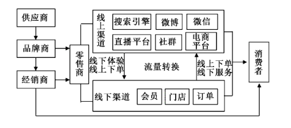

### （5）新媒体平台
图：新媒体平台 
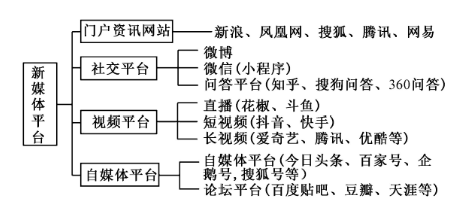

### （6）营销渠道
营销渠道就是商品和服务从生产者向消费者转移过程的具体通道或路径。

### （7）精准营销
精准营销是“营销学之父”科特勒教授提出的，通过准确定位客户群体，定制化建立客户沟通服务体系，使得企业能够及时预测客户需求并以低成本战略进行扩张。目前主要采用的精准营销途径包括数据库营销、互联网营销和第三方渠道营销。
- 数据库营销：数据库营销使用企业客户关系和数据库分析技术挖掘出潜在客户。该营销方案的前提是建立完备的客户信息数据库，并使用短信和微信的方式推送营销活动。
- 互联网营销：互联网营销通过采集用户在门户网站、论坛、微博和搜索引擎上的行为习惯，并识别用户的行为特征和消费心理，推送商品信息广告来激发用户的购买欲望。
- 第三方渠道营销：第三方渠道营销的营销方案，即借助与该企业业务相关的其他企业来挖掘潜在客户。

然而，上述营销模式在处理大量客户数据时会造成企业营销成本的增加。从而导致企业利润的减少，严重限制了企业的长远发展。如何有效处理海量客户信息，并将营销活动及时准确的传达给潜在客户，是当前精准营销必须解决的问题。

### （8）数字化运营
数字化运营让企业诉求与消费者需求紧密连接，让消费者的个性化需求得到满足，让他们感受到更真诚的体验交互，因而与品牌走的更近。

### （9）智能营销
做好智能营销，场景、数据、载体缺一不可。

营销本质上是将合适的内容或理念传播给真正需要的人。智能营销也一样，不同的是，职能营销借助技术的力量更为有效率。在如今信息纷繁的时代，职能营销能够最快地在预算各方面有限的情况下，选择最有效的传播途径，且能够快速的去验收成果，并迭代内容。它的出现不仅大大缩短了营销链路，还能利用智能化的技术快速的验收和迭代，然后以最快的速度去引爆智能上的一些诉求。这就是智能营销的第一特征，即高效。

智能营销的第二特征是交互。人工智能的核心在于它能够像人一样的思考，从人的诉求出发跟人进行互动。在这交互的过程中，逐渐激发人的需求。具体到营销层面，也是一样。

智能营销落地需要满足三个条件。第一是场景，智能营销需要特定的场景，如果用户只是匆匆一憋，是达不到智能交互需求的。它实际上是把用户带入有智能化条件的场景中，再将内容传达给用户。第二是数据，只有当你采集到足够多的样本时，才能更好地配对用户。第三是载体，营销一定要基于载体才会发挥效果，智能营销对这方面的要求则更高。如传统营销，可能放一块广告牌就结束了，但智能营销的要求是全方位的，如视频营销不仅仅只是电视广告投放，更多是全场景跨屏视频营销。

### （10）场景化营销
以充分尊重用户网络体验为先，围绕网民输入信息、搜索信息、获得信息的行为路径和上网场景，构建了以“兴趣引导+海量曝光+入口营销”为线索的网络营销新模式。<u>用户在“感兴趣、需要和寻找时”，企业的营销推广信息才会出现，充分结合了用户的需求和目的</u>（在需要时推荐精准的产品，在正确的时机营销真确的产品），是一种充分满足推广企业“海量+精准”需求的营销方式。

### （11）营销场景
此处的“场景”，简单地理解，就是什么人在什么时间地点，想做什么事。生活中的场景随处可见，任何一个特定场景，在这个行为事件下，消费者一定会产生特定的需求或问题，这些都有可能促使消费者产生消费行为。利用不同场景去实现商业目的，这个场景就是我们所说的`营销场景`。
产品的本质，其实就是<u>为消费者的需求提供解决方案。而通过营销场景做营销，正是将商品和消费者需求进行合理匹配</u>，从而促进销售达成。

## 2.营销体系

营销体系、营销模式、营销范式、营销框架

### （1）传统营销
- 传统营销竞争激烈 
在市场竞争中，企业为了最大化的抢占市场份额以及提升利润水平，都在努力地进行产品广告营销，企业在销售市场与广告市场的竞争颇为激烈。传统的广告营销主要局限于电视、报纸以及广播等方式。而电视播出广告的时间是有限的，并且黄金时段的时间更少。同样的报纸与广播的广告资源也十分有限。在这样的背景下企业为了更好的获取优质的广告资源被迫纷纷竞争少量的黄金广告席位。传统营销渠道的资源有限，众多企业不得不竞争一些稀缺的资源。除了在广告市场上营销竞争较为激烈外，传统营销模式下企业在销售市场上的直接竞争也更为激烈。例如，大型商超之间为了争夺有限的客户资源，常常采取打折促销以及举行相关活动来吸引消费者。在传统营销环境下企业的竞争较为直接，且日趋激烈。
- 传统营销成本高昂 
对于很多企业而言营销成本甚至是超过了产品生产的其他环节费用，成为仅次于直接生产产品的第二大成本来源。
- 传统营销营销范围有限 
对于企业而言最为有效的营销需要达到让最广的人群接收到其营销信息，而在传统的营销方式中很难让企业的营销信息被大范围的人群所了解。例如，电视媒体是影响力最广的一种传统平台，以某省为例，电视平台一天所能影响到的居民只占到总人数的1.54%，营销范围十分有限。

### （2）大数据营销
大数据对于营销的作用：
- 以用户需求为基础定制产品 
在传统的营销中营销的针对性相对欠缺，企业在进行产品的生产与市场广告宣传时只能进行一个模糊的目标定位。而在大数据时代则可以为企业的产品生产提供一个强有力的数据支撑。在互联上消费者的浏览足迹会被后台自动记录下来，并且与众多的浏览信息一起被记录和分析。而企业就可以根据这些信息来确定生产什么样的产品，以及在什么时期进行生产和市场投放。
- 提高营销针对性 
如何提高企业的营销效益成为每一位企业营销人员和企业管理者都在思考的问题，在一个商品竞争激烈的社会，传统的广撒网方式成本高，且浪费了大量的人力资源。在大数据时代，企业的营销可以变得更加具有针对性，从而更好的将不同的商品销售给有需要的消费者。以大数据为基础的精确营销活动可以分为三个类别：第一，企业根据顾客的浏览习惯来为其提供针对性的商品。第二，企业根据顾客的购买习惯数据，来为其提供合适的产品。第三，企业可以根据消费者在消费过程中对于对于促销的热衷度来引导其消费。如企业利用大数据分析可以得知本公司的产品进行优惠券的方式促销时产品的销量状况如何，从而明确优惠券促销对于促进销量增长的作用，进而实时的推出优惠券等活动来刺激消费者的消费。
- 降低营销成本 
对于很多企业而言，营销的成本上升是生产经营活动中的主要压力之一，一方面企业不希望进行大量的营销成本投入，另一方面又不得不进行大量的营销投入。大数据背景下电子营销渠道相比传统营销渠道较低。

大数据时代营销体系的重构：
- 推动营销渠道多元化 
- 调整营销运作模式 
在传统的营销模式下消费者和企业之间的关系较为僵化，一方面是企业大量的向消费者进行海量信息的投放，另一方面则是消费者被迫接受这些信息。在这一过程中企业得不到消费者的反馈信息，而消费者则无法将自己的想法传递给企业。对于传统营销模式而言，要想实现这种消费者与企业之间的互动，存在经济成本压力与工作量的压力。在大数据支持下的现代营销中企业可以实现与顾客的交流与信息收集，从而帮助企业实现与顾客互动营销模式的转变。另一方面就是整个营销过程的全程监督和跟踪服务。传统模式下企业要想实现对用户的全程消费跟踪服务，基本上是无法实现的。在大数据时代企业的这种服务将变成一件可以实现的事情。企业可以利用大数据的收集和分析功能来明确有多少消费者购买了同一款产品，而其中的某些消费者在使用产品时又存在哪些问题。企业利用大数据的收集和分析可以获得用户在使用该产品多长时间后容易在哪些部位出现问题，并及时将分析的数据发送给消费者。

大数据时代营销发展对策：
- 更新营销观念 
认同大数据的价值，引入大数据技术。
- 根据产品和服务来确定是否采用大数据模式
- 强化数据库建设和管理

### （3）营销体系
- 传统营销方式由营销策划人员根据业务经验结合业务目标指定目标客户群，营销目标是否达成很大程度上依赖于策划人员的经验。而互联网主动营销体系是以机器学习推荐模型为基础的营销方式，每个推荐模型包含了大量用户与大量产品的推荐关系，能够比较精准的将客户感兴趣的产品推荐给客户，实现千人千面的营销。

## 3.营销方法
营销方法论

## 3.营销案例

# 二、ToC营销

# 三、ToB营销

# 四、数字化营销平台-零售
## 1.Convertlab Marketing Cloud

企业的数字化基础设施，应该具备私域客户经营、公域流量经营、数据资产管理及智能化四方面的关键能力。
- 建立私域流量池以更低成本持续经营客户；
- 以数据为依据衡量有优化流量渠道去获取更高质量的客户流量；
- 沉淀数据资产并通过数据洞察和数据激活实现数据资产变现；
- 在营销闭环中利用AI赋能以应对更大规模的数据和更复杂的营销场景。

以数字化基础设施为目标打造全链路营销云，就可以实现全渠道、全场景、全链路的精益客户运营
- `全渠道`：线上、线下、公域、私域
- `全场景`：围绕客户生命周期的沟通策略覆盖和实现各业务转化的营销活动
- `全链路`：贯穿客户旅程中的前链路拉新、中链路培育、后链路转化的营销策略设计、执行和衡量过程。

以数字化基础设施为目标，打造全链路营销云产品，产品矩阵组合有：
- AD hub，职能广告投放平台：代表公域流量经营基础设施，构建广告营销神态，评估广告监测和全链路效果，拥有最新的RTA联邦学习能力。
- Data Hub，CDP：代表数据资产基础设施，支持全渠道用户画像，洞察决策及激活数据资产
- DM Hub，营销自动化引擎：代表私域客户经营基础设施，增加新的私域营销渠道，同时大幅增强自动化引擎，支持万物互联自动化营销
- AI Hub，AI赋能平台：代表智能化基础设施，通过AI赋能进一步提升能效，包含智能客群选择、NBA、推荐引擎及客户信息价值评分等。

###  1.1.数字化运营的前-中-后链路
#### （1）AD Hub
AD Hub，实现企业营销「全域全场景」拉新。

近年来兴起的「链路营销」，代表着一个营销生态内公域与私域资源的整合，以技术方式优化的用户转化路径。「全域全链路营销」，则在链路营销的基础上，增加了跨生态流转的可能。AD Hub产品的推出，解锁了广告能力，“一纵一横”实现了基于数据驱动的全域全链路营销闭环。
- 一纵：一纵代表对用户的纵深追踪，贯穿着整个客户生命周期。数据的跨媒体前中后链路的打通起了至关重要的作用。只有打通数据、沉淀数据资产，才能有效地收集和统一管理在不同触点的客户数据，进而了解客户并为他们量身打造营销内容。
- 一横：一横则代表跨生态和公私域的场景流打通。在覆盖不同流量的基础上构建各类跨域流转场景，例如在已点击人群的跨渠道重定向时呈现相关但不相同的创意，又例如用户从广告导流到公众号或小程序后，根据这个用户在不同广告渠道点击的素材来提供个性化的商品和内容。这样，客户在触达任何渠道时，品牌都可以无缝跨渠道与用户沟通，创造出一致的用户体验。

AD Hub将会把一纵一横能力结合在一起延展到广告世界，来形成全渠道用户运营平面，再在这个平面上提供运营赋能来打造“品牌认知-兴趣唤起-行动激发-深度转化-保持忠诚-赋能拉新”的用户旅程，把更多、更优质的客户从公域带到私域，同时让用户私域的行为和数据又能赋能公域的拉新，从而实现营销大闭环。

#### （2）DATA Hub
DATA Hub，实现企业数据全链路业务性管理。（CDP）
- 所以，CDP平台不是营销平台，而是一个客户数据管理，客户洞察的平台？

面对千万级甚至上亿级的用户数据，光靠跨部门的梳理协调效率是极低的，企业迫切需要一个中台，将天猫/京东/公众号/小程序以及门店线下数据等支离破碎的数据全部打通，进行高效率的统一管理。但是，这样的数据平台并不能完全解决业务部门的增长需要。一个合格的中台一定是业务驱动的，且最终要在业务线体现价值。

基于这样的理念，DATA Hub包含了数据接入、数据清洗、数据资产、数据应用和数据赋能几大模块，分别对应采集、统一、分析和激活几个核心能力。

通过数据源管理和数据连接器先将数据孤岛的状态打破，在完成数据接入后进行数据清洗确保数据整洁。之后再讲数据从较为原始的阶段推进到具有更清晰、具有业务含义与洞察的阶段，我们称之为搭建One ID体系，形成客户画像，帮助企业从360度全局视角洞察每一个客户的偏好，甚至洞察客户与客户之间、客户与商品之间的关系，然后给他们打上标签、做好分组，再赋能给其他业务系统，投其所好的开展营销，最后再将营销后产生的数据回流到cdp，完成持续加工出更精准的用户画像的一整套营销数据的闭环流转。

#### （3）DM Hub
DM Hub，实现企业精准营销自动化。（MOLO）

DM Hub围绕客户全生命周期进行精准化营销，为客户建立起全渠道的获客能力，在不同渠道对客户进行身份识别和匹配，生成精准的360度客户画像，让品牌真正了解自己的客户群体。

有了客户画像，就可以与客户进行个性化的营销互动，且所有策略都可以通过一个自动流程搭建起来。流程搭建好并执行后会有对执行结果的统计分析与生成报表，并通过分析洞察发现问题及时调整策略，以便更好的执行下一场营销活动，整个过程就构成了一个完整的营销闭环。

在内容互动上，DM Hub支持通过微页面、微信图文、app或小程序Banner、H5游戏和官网与客户进行互动，并记录客户的互动行为。在消息触达上，支持通过短信、邮件、App push、微信模板消息、企微消息等方式与客户建立沟通。

通过自动流程编排整个活动策略，主要是由出发事件、条件判断和执行动作这三部分组成。整个流程搭建只需用鼠标托拉拽流程组件，就可以快速搭建出一场营销活动，非常便捷。通常组织一场复杂营销活动至少需要15天，而运用自动流程可以缩短到三天，甚至更短的时间。

关于活动效果查看，可以把收集到的大量活动数据基于数据对象、指标、维度、时间范围等进行设置，灵活搭建出所需要的分析看板。除了提供属性、行为、订单和漏斗分析等基础分析能力外，还提供了一些更加贴合业务场景的高级分析能力，包括RFM分析、同期群分析、商品组合分析、交叉分析、转化间隔分析等等，多个分析组件可以自由组合，更加直观。

#### （4）AI Hub
AI Hub，实现全链路营销智能化。

我们一直在强调数字化、自动化、智能化，作为MA三部曲能做且必做的最后一步，智能化极为重要。AI Hub的推出，将全面赋能MAP、CDP、DMP等平台，实现全链路、多场景的降本增效，使整个产品矩阵同时迈入职能时代。AI和营销的结合，需要AI来承担大脑角色做出决策和指挥。

AI将客户洞察、策略搭建、创意优化、运营交互和效果反馈这5个阶段荣威闭环，为行业、品牌和场景重塑营销全链路，系统性的提高营销效率趋近到最优。AI其实是贯穿于营销哥哥环节，以人力不可及、人工不可为的效果回答了4W问题。

###  ➤➤➤数字化运营案例（零售）➤➤➤

### 2.1.案例：快消服饰行业，「全链路营销」实践案例

案例效果：单场活动就冲到5千万，客户提取完成KPI。

#### （1）客户痛点
流量红利消退，获客成本不断提升，品牌坐拥千万用户但运营能力较为薄弱。

##### 痛点一：数据生态尚未成型
用户身份不统一，无法理解用户360度画像；数据分散个渠道和系统，且未做清洗；标签体系不完善，未对用户进行分层；前后链路未打通，难以释放数据价值。
##### 痛点二：数字化转型需求复杂
缺乏跨部门协同能力，变革速度受限；无差异沟通难以满足多样化需求；自动化推送能力有限，营销费时费力；缺少一站式数字化营销平台；缺少可视化数据看板，仍用excel。
##### 痛点三：流量争夺力不从心
媒体渠道众多，账户难统管；预算消耗如流水，效果却不尽如人意；投放策略依赖运营人员，缺乏数据评估与深度洞察；想兼容多方数据协作拓量，却不知如何保护一方数据安全。

#### （2）解决方案
解决方案：全链路运营，让数据更有价值，助力效果、效率双提升。
##### 方案一：全链路数据互通
打通品牌全链路数据，建立统一的用户认知；搭建品牌标签体系，适用于实际业务场景沟通与运营；创建多维度用户画像，智能化全群分组。
##### 方案二：实现精准营销闭环迭代
搭建营销自动化平台，满足品牌高频大规模的用户运营需求；不间断的用户运营互动，减少重复化工作，降低品牌人力成本；可视化数据看板，并持续基于回传数据不断自我优化营销策略。
##### 方案三：智能策略引擎
聚合主流广告平台与媒体，让品牌可对所有广告活动统筹管理；提供多维度策略模型，最大化释放品牌私域数据价值；提供安全的环境，联合多家媒体平台和三方数据商，为数据赋能。

图：快消服饰行业全链路营销解决方案

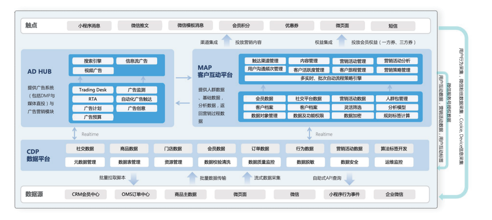

#### （3）落地执行
##### 执行一：历史数据分析与洞察，设计可落地的业务场景「策略」。
做好了用户数据的身份统一，打通企业门店、微信公众号、小程序会员、企业微信等渠道的数据，补全行为数据，全渠道整合得出清晰的用户画像（（user profile）。
- 用户画像像（user profile）偏理性，一般基于用户在系统里产生的真实数据、行为特征和用户主动填写的行为资料，利用已经获得的数据，用来勾勒用户需求、用户偏好的数据分析方法。
- 用户画像（user persona）偏感性，一般来自于用户访谈、用户研究，比较抽象和感性，帮助大家去认识当前的产品所主要服务的用户是一些什么类型的人，用于运营与数据分析等场景。

###### 策略一：人群分组：多维度全方位将千万级存量用户进行人群分组，构建清晰用户画像。
基于上面的数据治理基础，将全渠道产生购买的人群分为新客、老客、活跃老客、沉睡客四类，针对性地对用户历史复购订单数据进行分析，得出复购关键因子。

复购关键因子，就是决定用户复购转化的关键点，可能是某款商品，也可能是某个客单价区间。通过人群定义与复购关键因子分析，再对同组人群的关键沟通时间点分析，建立后期触达的沟通频次，在不打扰用户的情况下，精准传递活动信息。

图：复购分析 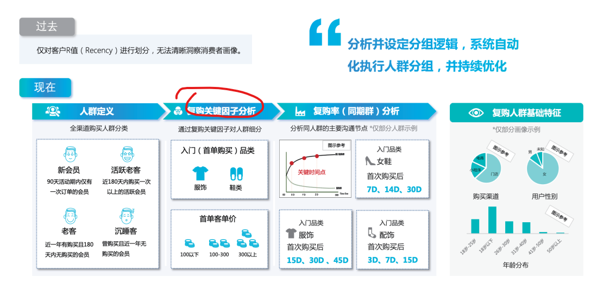

###### 策略二：品类偏好标签：基于用户全网行为进行聚类分析，并通过算法帮助品牌判断用户偏好。
在对用户购买行为进行聚类分析时，要首先设计好商品品类的标签，从大类标签到中类标签再到小类标签，一层一层的细化。设计好标签体系后，通过聚类分析对用户商品偏好进行分析，最终得出不同人群的商品偏好标签。

图：品类偏好分析 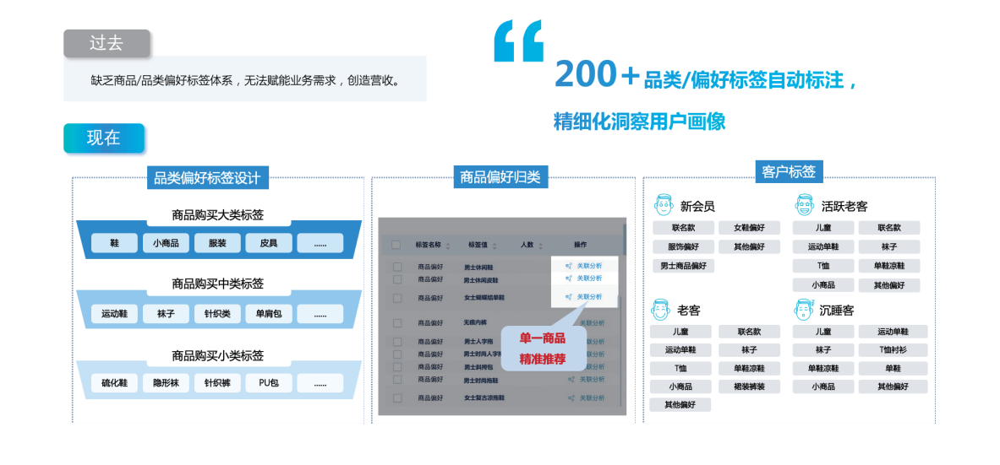

###### 策略三：商品关联推荐：构建persona用户画像模型，精准定位用户需求，寻找最优关联商品。

通过对大量用户群体数据的分析，构建出多个user persona用户画像模型。比如其中家庭用户群体的画像模型，人群的特征是30～40岁、有孩子、折扣敏感、客单价150～200之间等。

通过这些人群特征，去挖掘用户潜在需求，同时结合历史数据分析出对应人群的关联商品。比如在夏季买过T恤的人，推送对方短裤相关的上新/优惠券，购买转化会更高。

在设计精细化运营策略过程中，Convertlab从分析人到分析商品再到人+商品一起，逐步迭代运营策略，不断地去每个场景做细分，通过个性化内容沟通，实现精准推荐提升转化。

图：商品关联推荐 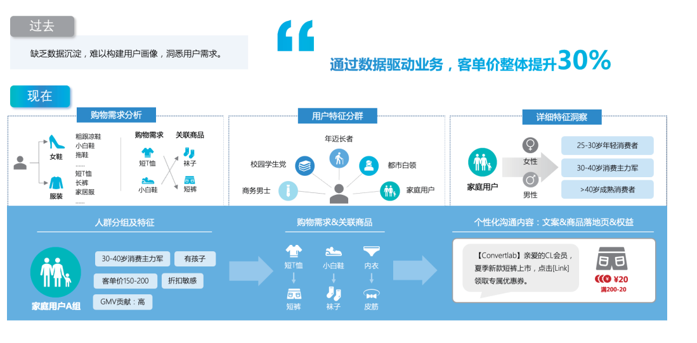

##### 执行二：个性化内容触达，实现用户「精细化运营」。
有了前面做好的人群包分组和用户商品偏好标签，下一步就是个小化沟通策略的落地。策略靠人来不断细化和输出，系统去自动化执行一系列的精准营销流程。

###### 策略一：个性化沟通：提供个性化沟通策略，自动触发精准营销流程，提高用户参与度。
图：个性化沟通 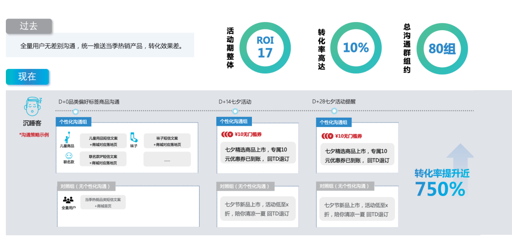

依据新客、老客、活跃老客、沉睡客四大人群场景，划分了对照组与测试组进行实验。测试组选用个性化内容进行沟通，如在内容中提到该对应人群的复购关键因子，挑选关联度高的复购商品推荐/赠送优惠券等；在对照组，默认发送对组内所有人群都一样的促销活动信息。

两组人群的转化效果截然不同，测试组人群转化率提升了750%。这个反馈让客户也有了极大的信心，尝试全面推进个性化营销，进一步提升存量用户的复购率。

###### 策略二：用户复购：通过全息用户洞察进行差异化二次营销，低成本实现私域用户持续复购。

###### 策略三：微信图文分组：根据人群偏好进行分组推送，大幅提升图文打开率。

##### 执行三：数字化运营效率提升，反哺业务场景赋能营销「闭环」。
###### 策略一：库存清理：通过站外引流帮助品牌清理滞销货品，下单新用户占比97%

###### 策略二：爆款打造：通过精准人群包投放，助品牌打造爆款同时指导优化前端投放，节约投放成本

### 2.2.案例：日化行业，「全链路」品牌升级体验
#### （1）客户痛点
##### 痛点一：会员部门痛点
会员ID打通率仅8%，沉睡会员占比75%；会员属性信息单一，且外部渠道未打通；会员模型分析较浅，发券活动ROI低。
##### 痛点二：IT部门痛点
缺乏完备的用户SuperID打通工具及标签体系建设；营销人群需手动圈群进行，效率低下。
##### 痛点三：商品部门痛点
新品研发缺失用户洞察来驱动；用户反馈依赖传统人工手动收集。
##### 痛点四：电商部门痛点
缺少精准触达运营工具；会员运营精细化待提升，无法对会员内90%未消费人群进行重定向触达。
##### 痛点五：市场部门痛点
多家供应商，数据分散；无实时营销监控能力；效果数据回溯困难且效果数据需手工分析。
#### （2）解决方案
##### 方案一：数据治理洞察客户
补齐及沉淀一方数据，并将全渠道数据打通；构建形成全渠道消费者360度画像；建立初步标签体系，深入洞悉用户行为属性特征。
##### 方案二：应用营销场景实现创收
针对核心营销场景（如：拉新转化、沉睡唤醒）设计落地策略；提供简便易上手的自动化营销工具；营销人员实现灵活客群圈选，并进行个性化运营。
##### 方案三：优化用户旅程
效果数据回流，并实现自动化分析能力建设；实现用户全生命周期的自动化运营，打造数字化运营闭环，并持续迭代优化。

图：日化行业全链路品牌升级体验

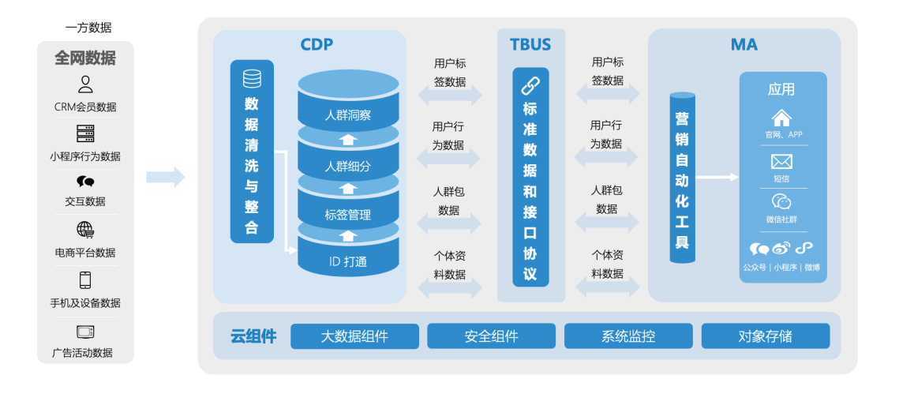
#### （3）落地执行
##### 执行一：数据治理实现消费者身份统一，构建360度客户画像
##### 执行二：微信生态营销触点打通，线上线下互通融合
###### 策略一：拉新引导
###### 策略二：首单转化
###### 策略三：会员复购
###### 策略四：沉睡用户唤醒
###### 策略五：电商重定向
###### 策略六：赋能导购社群运营
##### 执行三：自动化营销工具赋能私域运营，带来业绩增长的喜悦

### 2.3.案例：美妆行业，数字化零售先驱者案例
#### （1）客户痛点：
客户痛点：搭建品牌专属私域流量，掌握私域密码，实现线上线下一体化。
##### 痛点一：线下流量如何线上高效承接
系统孤岛未打通，用户线上 线下体验不一致。
##### 痛点二：平台线上流量成本急剧升高
如何低成本获客的同时又高效 传递品牌价值成为品牌新课题。
##### 痛点三：海量商品如何高效匹配用户
如何将对的商品推给对的人，避免用户挑花眼。
##### 痛点四：门店流量如何线上可视化
全国多门店每日大量客流，如何将线下流量可视化赋能商业决策。
#### （2）解决方案
全渠道用户运营，打造个性化定制数字化体验。
##### 方案一：全渠道用户运营
打破系统壁垒，全渠道用户身份打通，并建立完善的会员运营体系。
##### 方案二：多样化营销手段
系统提供支持多种营销工具，帮助品牌实现多样化的营销创意创造与推广。
##### 方案三：个性化定制产品方案
通过肌肤问题处方式互动问卷，了解用户真实需求，推荐最合适的商品。
##### 方案四：用户主动型流量采集
通过布置店内带参二维码，将线下流量线下可视化的同时，赋能店铺运营与商业决策。
#### （3）落地执行
##### 执行一：用户运营精细化的基础工作：建立全渠道会员体系，自动执行差异化沟通策略
##### 执行二：裂变互动个性化的关键所在：洞察客户需求，打造有温度的品牌私域
##### 执行三：商品运营数字化的两点赋能：高效匹配用户需求与海量商之间的关系
##### 执行四：门店客流数字化的体验升级：最大化门店私域属性

### 2.4.案例：白酒行业，CEM线下线上一体化案例
#### （1）客户痛点
客户痛点：传统化运营模式难以应对日益激增的行业竞争，缺少运营工具难以撬动运营效率
##### 痛点一：行业进入挤压式增长发展
白酒行业近三年产销量均呈下降趋势，品牌逆势增长需夺竞品份额；行业头部品牌正通过并购抢夺区域市场，客户品牌急需进行市场扩张；新兴品牌通过数字化营销争夺市场份额，客户品牌仍高度依赖线下经销商。
##### 痛点二：品牌缺乏全渠道运营能力
90%销售来自线下，线上运营乏力；
线下销售场景高度依赖宴席，却缺少中心化地线索管理体系；
品牌对线下大渠道及终端掌控不够，难以精准提高效率。
##### 痛点三：渠道客户分散运营遇瓶颈
用户私域流量未进行整合，用户信息散落在各渠道；
用户个性化需求不能及时捕捉并落地到营销策略；
缺乏对经销商及销售渠的全局道管理，难以提高运营效率，且渠道之间缺乏粘性。
#### （2）解决方案
解决方案：数字化营销工具与专业策略咨询专家陪跑，助品牌达成逆势增长
##### 方案一：创新式扩大增长
洞察用户画像及行为，实现个性化沟通；用户旅程梳理，线下场景推广数字化策略；通过线下裂变式场景，增强品牌影响力。
##### 方案二：渠道运营效率提升
提供营销工具，精准洞察门店画像，提升门店价值；针对各销售节点，设计B端激励政策，设计可持续运营的always on策略；统一品牌形象，工具赋能经销商，节省沟通成本。
##### 方案三：积累运营私域流量
打通全链路数据资产，快速积攒私域流量；设计激励政策，针对性进行线下用户私域转化；多样化营销活动，促进微商城购买。

#### （3）落地执行
##### 执行一：线上线下打通：全渠道数据整合，从0搭建会员体系
##### 执行二：精细化用户运营：搭建6大标签类型，4000+标签体系
##### 执行三：一物一码：品牌直接触达消费者，数据反哺营销策略
##### 执行四：B端与C端联合：赋能经销商运营，实现“宴请”价值最大化
##### 执行五：可持续运营：全渠道会员运营，形成闭环式营销

### 2.5.案例：家电行业，「全渠道」会员精细化运营
家电行业，全渠道会员精细化运营。电器品牌如何稳扎稳打从0到1，实现分步式会员精细化运营思路。
#### （1）客户痛点
客户痛点：粗放式经营已难以为继，搭建从0到1全渠道会员精细化运营前途不明。
##### 痛点一：数字化系统能力的空白，掣肘数字化转型进程
##### 痛点二：缺乏自动执行差异化的沟通策略，亟待建立个性化客户旅程管理
##### 痛点三：用户分层运营策略缺失，全渠道会员体系搭建缓慢

#### （2）解决方案
##### 方案一：基础设施搭建，完善营销云系统架构
##### 方案二：配合小家电，双11实践数字化理论，提升运营能力
##### 方案三：设计会员标签体系，赋能人群分析和营销活动
##### 方案四：设计埋点规则，帮助品牌优化消费者前端旅程

#### （3）落地执行
##### 执行一：试水双十一，A/B测试会员用户分层分群运营前后效果对比
##### 执行二：标签规则建立，全域会员精细化运营；洞察人群特征，搭建完善的标签体系
##### 执行三：根据业务需求设计埋点规则，优化消费者前端旅程
##### 执行四：用户运营从【公域】走向【私域阵地】

### 2.6.案例：家居行业，消费者「全生命流程」个性化沟通案例
家居行业，消费者全生命流程个性化沟通案例。营销如何从高效到有效，3大个性化场景提升家居行业私域转化率。
#### （1）客户痛点
客户痛点：消费者采购需求极其个性化，会员结构不清，执行营销活动耗时耗力。
##### 痛点一：会员结构不清，会员服务同质化，会员管理不系统
##### 痛点二：历史庞大的会员量也会让企业束手无策，现有的人力并不足以服务号会员顾客
##### 痛点三：单场营销活动，在耗费大量的策划事件的同时，也耗费大量的人力物力
#### （2）解决方案
解决方案：精准广告投放，构建自动化、个性化营销场景。
##### 方案一：家居行业消费人群再思考
##### 方案二：改善拉新环境通过精准人群包投放节约投放成本
##### 方案三：会员精细化运营构建全生命流程的标签体系
##### 方案四：家居行业数字化第一步已迈出接下来才是挑战

#### （3）落地执行
##### 执行一：家居行业消费人群再思考
##### 执行二：改善拉新环境通过精准人群包投放节约投放成本
##### 执行三：会员精细化运营构建全生命流程的标签体系
##### 执行四：家居行业数字化第一步已迈出接下来才是挑战

家居行业特点：

一直以来，家居行业似乎离互联网很遥远，家居消费存在地域、气候、建筑结构、个人喜好等差异，再加上家居产品单价高，消费频率较低，消费需求的碎片化的特点，相比常见的大众消费产品，家居行业是一个非常传统、难标准化、难数字化的行业。

如何在家居采购极其个性化，品牌巨量SKU的情况下，聚合并理解每个消费者的需求？如何在粉丝基数庞大的情况下，形成千人千面的个性化沟通？成为各大家居企业的数字化的重要课题。

前些年我们可以看到，家居连锁品牌客户正在or已经建立线上经营体系，试图打破了空间限制，帮助企业解决碎片聚合的难题。<u>Convertlab早期的家居客户，也利用自动化营销工具已经实现了大规模的「个性化沟通」。更有走在前面的客户，已经开始了更`进阶`的玩法：「打通数字化营销闭环」，通过数据赋能业务——开始根据消费数据反馈，尝试C2M经营生产模式。</u>

##### 方案一：家居行业消费人群再思考
家居行业是最注重线下体验的行业之一，传统的家居行业主要以“场”为交易中心，交易行为属于传统的“买-卖”场景。在传统的家居行业的这种消费场景之下，品牌商<u>一是无法知晓自己的消费群体在哪里；二是无法近距离接触用户；三是无法“以用户为中心”对用户进行精细化运营。</u>

另外，伴随经济的发展，消费者审美观念的改变以及主要消费群体——“Z世代”消费者购物习惯的改变，家居行业品牌客户已经越来越意识到消费者的改变——线上化、需求多样化。

在这种情况下，一部分家居企业认为电商就是数字化，认为登录京东和天猫，或者自建电商平台，就是完成了数字化转型。但其实，数字化成功的要素并非仅仅是跟着消费者的流动，同样将产品搬到线上，也不单纯只是建立了简单的、新的线上联接关系。

Convertlab服务过的某大型连锁家具零售企业，在国内拥有 20 余家门店，透过微信、小程序、官网线下渠道招募「会员」，全国积累超过千万粉丝。从线下走向了线上，但该企业同样面对了两个另外两个难题：
- 1.消费者采购**需求极其个性化**，品牌 SKU 超过千种，家庭成员组成不一、住处空间大小有别、设计风格迥异，面对海量粉丝与会员采取单一形式的营销手段早已过时，急需建立能应对千人千面的个性化沟通体系。
- 2.由于粉丝数基数庞大，倚靠纯人为的用户个性化运营耗时而不切实际，营销自动化管理成为品牌必然之道路。

数字化的成功是对用户的需求的深入了解，通过企业消费者各类数据的洞察和利用，从而自动化、精细化的运营来解决企业运营的高成本和转化低效的问题。这是家居行业品牌客户的需求，也是早期家居行业数字化的第一步。（我司目前的数字化水平处在第一阶段？）

##### 方案二：改善拉新环境，通过精准人群包投放节约投放成本
在广告投放运营中，精细化广告投放运营的效果是集团关注的重点。就拿在朋友圈广告投放来举例，目标人群用户画像不精准的话，投放转化自然不会高。过去，集团坐拥大量会员数据，却难以发挥第一方数据价值，在广告投放上的效果也不太不理想， ROI低于平均水平。

此外，从媒体投放平台去做广告投放，经常会过分的依赖投放平台的能力。这些媒体平台的广告投放策略、媒体的人群包数据，对于企业来说往往不够精准。

数字化工具的应用可以帮助集团利用自有粉丝的一方数据的高价值种子（人群）包，在公域做人群放大，并去追踪人群包放大之后的ROI，实现公域投放的数据沉淀，有效衡量公域投放的价值，并且提升拉新转化率，节约投放的成本。

##### 方案三：会员精细化运营，「构建全生命流程的标签体系」

###### ①会员管理 vs 会员运营
会员管理 vs 会员运营（客户管理 vs 客户运营）。以“体验式”（7日体验退货？）的消费为主的年轻消费者群体，正在成为市场消费的主力。他们鉴赏商品的好坏不再将产品品质、用户评价、价格列为首要的因素。如果企业还停留在消费折扣（内涵什么？）、积分换礼的层面，是难以提升客户入会的意愿以及后续的“下单”转化。

传统的会员管理，只拥有客户的基础资料和交易总额，<u>会员精细化运营的要求搜集更细致的行为数据和交易明细</u>，精确地全方面地为单个顾客画像。商家才能够差异化地会员沟通，营造体验式的消费场景，才能挖掘会员的需求。这一点给家居行业的“会员管理”带来了新的营销挑战。

>当今营销生态要求用户的数据有更丰富的维度。企业需要通过积分体系等功能保持客户的活跃程度，分组、标签等功能也是用户账户管理
的重要部分。在Convertlab DM Hub产品中客户的数据包含很多类别。
 以客户身份为例，该功能点需要拥有全渠道/触点客户数据储存及匹配能力，通过手机号码、邮箱、微信open ID、微信union ID、京东
ID、淘宝ID等可合并的ID进行客户身份的整理。通过”渠道追踪、双因子打分（客户价值评分、客户活跃度评分、客户指标等）、客户阶
段、客户标签、客户分群、忠诚度管理“等功能点做到客户关系远近的管理。
 企业对于不同购买程度的客户群，需要提供不同的激励政策以激活客户资产，而实现数据的价值，更近一步我们可以利用这些数据做到精
准、敏捷的会员运营。

###### ②会员精细化运营
会员精细化运营：新会员生命周期+会员分层+个性化内容/活动营销

传统的家居品牌会员运营都会遇到以下三个问题：
- 1.会员结构不清、会员服务同质化、会员管理不系统；
- 2.历史庞大的会员量也会让企业束手无策，现有的人力并不足以服务号会员顾客；
- 3.单场营销活动，在耗费大量的策划时间的同时，也耗费大量的人力物力。

面对这三个问题，家居行业会员的精细化运营是一个解法。如何解决海量会员的精细化运营问题，从难度上比构思和设计“商场格局”要难得多。能够婉转数以千万计的会员分层运营，再加上新鲜有趣有灵魂的内容营销，这才是家居品牌碾压传统营销模式的核心所在。

解法，ConvertLab将会员精细化运营分为三个维度：
- 新会员转化流程 
通过不同的平台触点设置欢迎与引导互动，激活粉丝意向，多链路实施挽留转化，从中初步评定粉丝价值，实现精准推广及初步的分类管理。这个流程根据不同的家居品牌客户的需求不同的支线场景，例如24小时转化流程、48小时转化流程、菜单转化流程等等。（`断点营销？`）
- 会员全生命流程价值评分及分层 
通过对会员行为事件及资料项设置对应分值进行「价值评分」（将粉丝互动行为转化为系统客观评分）。例如：客户总价值评分、客户总体资料评分、客户总体7天活跃度评分，客户总体30天活跃度评分等。对于家居行业客户的分群营销，可以根据客户的年龄层、已/未婚、购买历史、风格偏好、区域热销、孩童是否同居等具体情况，「建立全生命流程的标签体系」，赋能门店运营。根据用户画像将粉丝分群，规划日常营销、节庆类不同主题图文的分组推送和精细化管理。
- 活动（campaign）召唤计划（增购促销） 
对私域存量用户进行再次转化，对未留资粉丝转化醒计划，已留资粉丝通过裂变形式，提高总体响应率。会员精细化运营要求<u>针对不同人群进行不同的增购促销的计划</u>，以会员关怀撬动会员互动率，可通过活动选人，也可通过人选活动，持续培育提高转化机率，避免错过潜在用户，也避免无价值用户过度投入。

###### ③从高效到有效
从高效到有效，3大个性化「营销场景」提升转化率。

如何在实现了“高效”的“自动化沟通”之后，再让沟通更“有效”，是企业实现“个性化”沟通的目标。

例如：对于家居行业来说，全屋设计是品牌最重要的业务，也是最重要的KPI之一。一次性触达的时效性差，无法及时跟进会员的装修需求，会导致有效的leads数量少，对于企业来说，实时沟通场景的建立（通过搭建完整的流程图，设置递进的“下一步”动作）可以保证会员装修需求的时效性，同时导购也可以及时跟进，不会有滞后的信息，大大提升了leads的质量和数量。

以Convertlab某家居品牌案例为例，该企业利用Convertlab 营销自动化工具DM Hub（策略平台、触达平台）：
- 1.通过数据分析个性化精准触达，提升各类型营销的有效性与成功率。
- 2.通过可视化营销活动编辑器，并提供丰富的营销模板，降低营销人员的学习成本与时间成本。
- 3.利用大规模的营销活动 A/B 测试，选择最优营销活动方案，确保落地之后的活动 ROI 率。

通过这三大场景，逐步实现线上营销数字化，不到一年时间已初见成效，帮助客户沉淀了10w私域用户，获客成本降低了30%，粉丝互动率提升了50%，个性化菜单转化率提升了20%，将10%的存量用户（未留资）转化为留资用户，分享裂变参与率提升了120%。

>社交媒体传播时代的客户关系管理拥有强大的营销属性，发布病毒性内容获得大量的关注和转发并不等于这些关注能转化为销售订单，内
容形式的丰富度以及内容的个性化成为吸引客户的另外一个关键因素。
 内容管理在DM Hub中包含微页面、H5、内容标记、表单、文件管理等具体功能模块，在形成客户360度画像的基础上形成丰富的内容形
式，做到内容的个性化触达。
 在这过程中，实现了对运营数据的数字化采集、多维度分析，结合CRM数据，构建了基于粉丝AIPL全流程的标签体系，全方位洞察消费
者画像，以便于为消费者提供个性化服务体验。

##### 方案四：家居行业数字化第一步已迈出，接下来才是挑战
用户精细化运营-->全渠道营销、全链路营销、全域营销、全流程一体化服务的数字化解决方案

根据Convertlab的观察，在各个家居巨头的引领下，家居行业的数字化进程，通过线上获客做客户数据的管理，自动化和个性化的用户运营已经获得预期的增长。

当数字化已经成为各行各业，良性、可持续发展的核心驱动力时，受制于链条长、高客单价、标准化低、交付周期长等特点，家居行业整体零售的数字化转型相对滞后。家居行业显然不能只停留在用户精细化运营上的探索。走得更快零售行业，开启了对产业的系统性探索。就比如将深度融合线上、线下全渠道营销网络，提供全链路数字化解决方案、全域营销数字化方案和全流程一体化服务，给家居行业带来启示。

家居行业线上线下融合度依旧不够、线上购买与线下服务相割裂的痛点长期存在。数字化更进一步，就是助力商家在引流获客之外，同时在设计服务、商品供给、门店经管、施工履约等线上线下各环节进行数字化改造，提升商业效率，并能标准化、规模化的复制。家居行业数字化第一步已经迈出，接下来的才是挑战。

基于大数据，通过精准分析客户需求，充分了解和参与以用户需求为主导的营销全流程的数字化从未停止，打通线上线下全链路，多渠道多矩阵布局营销数字化运营赋能策略是帮助家居行业获得持续稳定的营收的关键。

Convertlab服务的家居品牌，在完成第一步数字化改造之后，即将或正在开启第2期，甚至第3期数字化升级，家居行业的数字化即将迎来“下一站”。

#### （3）落地执行

## 1.微盟
通过全链路营销撬动企业智慧增长,微盟赋能企业布局私域闭环 重构人货场的连接。
### 1.1.能力
#### （1）3大能力赋能商家全链路升级
##### 能力一：全链路营销升级
全链路营销升级，营销一体化，投放和交易无边界。前链路注重单次转化，后链路注重单客长期价值。
 图：全链路营销 
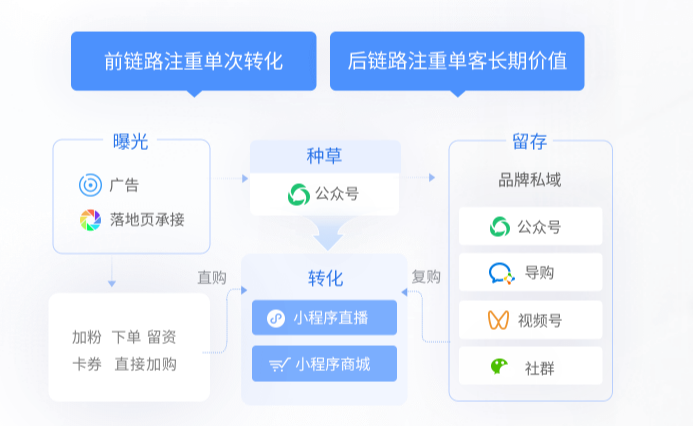

##### 能力二：全渠道经营升级
全渠道经营升级：流量多元化，跨平台数据无边界。
 图：全渠道经营 
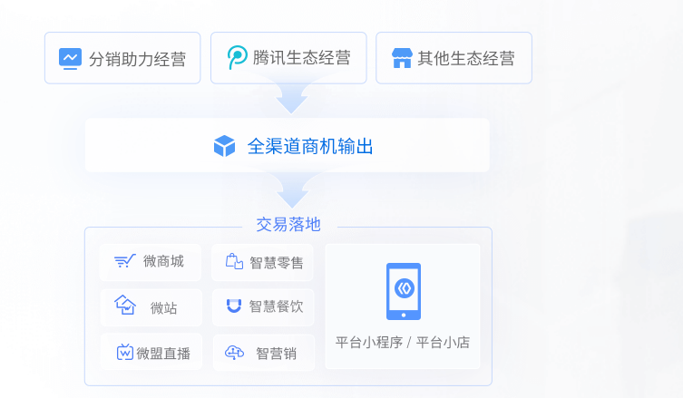

##### 能力三：全流域连接升级
全流域连接升级，公私域合营，用户连接无边界。
 图：公私域合营 
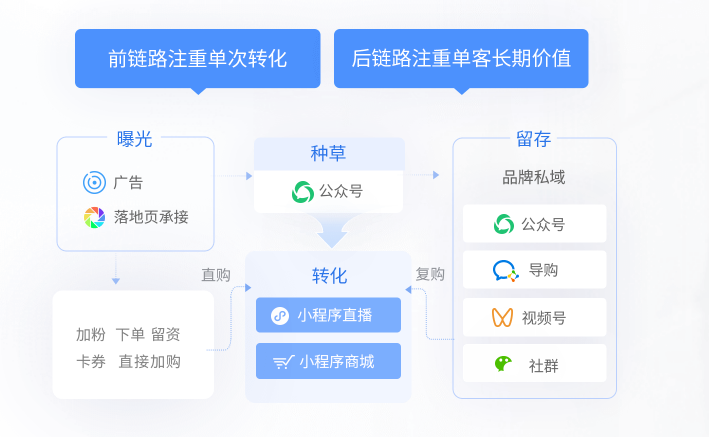

#### （2）微盟全链路营销能力地图
客户生命周期运营
- 品牌认知：强化品牌包装，强化IP；
- 引流获客：广告+分销获取优质客户；
- 裂变激活：线索培育提升激发购买欲；
- 流程转化：转化提升，沉淀品牌会员。

5大模块
- 诊断分析 
市场调研，营销洞察，品牌梳理，运营诊断，商城诊断，加盟商诊断。
- 全链搭建 
商城装修，公众号配置，社群布局，营销链路构建，门店带教，SCRM搭建。
- 广告精投 
创意策划，计划设定，素材制作，投放运营，策略部署，数据分析。
- 私域运营 
公众号运营，商城运营，视频号运营，社群运营，活动运营，终端运营。
- 直播转化 
脚本设计，直播选品，导流规划，实战落地，直播连麦，直播复盘。

#### （3）全行业16大营销打法玩转全链路运营
- 服饰鞋包
>通过布局社群、直播及分销策略，实现全渠道一体化运营，带动私域流量高效变现。（小程序商城、智能导购、社群运营、私域直播）。
- 母婴美妆
>深度围绕消费者需求展开多方位数字化布局，重新定义经营场景，打通消费全渠道。（广告营销、直播导流、导购上云、社群运营）。
- 3C数码
>根据经营的差异性，指定符合门店客群的营销政策，用个性化的服务精准匹配目标客群。（小程序商城、门店上云、差异化营销、私域直播）
- 生活家居
>将线上商城与实体店有机结合，推动智慧零售和圈层销售的广泛应用，助力实体经济保持平稳运营
- 食品酒水
>通过打造数字化门店，实现整体运营和管理的升级，拓展线上线下用户触点的同时，业绩持续攀升。

#### （4）微盟全链路智慧运营解决方案
微盟赋能企业加速建立私域业态，构建全链路数字化商业闭环。
- 流量 traffic 
全渠道流量扶持：公域+私域资源整合多链路助力私域扩容；精准营销引流，时效广告投放能力，实现单次高转化；打通全流量平台，解决流量增长难题；不同生态流量端口源源不断沉淀私域流量池。
 图：全渠道引流 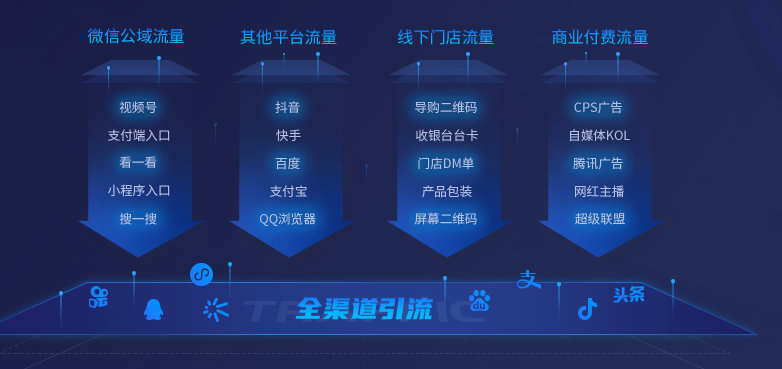
- 运营 operation 
用户数据洞察精准运营提升品牌长效价值：社交营销活动进行私域用户运营，形成闭环；多触点布局构建私域用户，反复触达，唤醒用户；整合各生态用户数据能力，进行全域布局与营销。
 图：精准运营 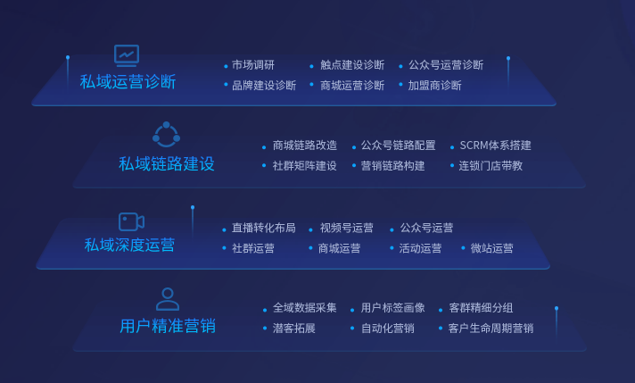
- 产品 saas 
线上线下一体化自主运营全维度高效变现：用户第一时间被连接、被服务、被转化；通过社群、小程序商城、秒杀、直播等方式随时交易；线上线下无缝融通，可复制、可规模化实现可持续交易。
 图：微盟saas产品赋能 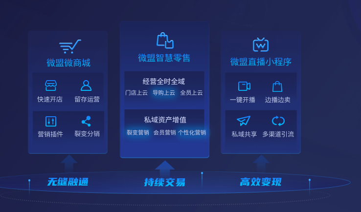

### 2.1.案例：零售行业，数字化运营
微盟智慧零售解决方案，零售行业数字化运营方案。
#### （1）客户痛点
消费者数字经营挑战，消费市场的供需变化，对零售企业的经营增长呈现巨大压力。
- 获客难 
线上线下极其分散的用户触点，对企业面向潜客的获取和连接能力提出了挑战。
- 转化难 
用户的持续性互动、需求洞察能力不足，让企业即使拥有海量商品也难以击中用户需求.
- 留存难 
用户全景的缺失、定向营销能力的不足，使得企业面向用户价值挖掘和长期留存带来挑战。

零售渠道数字经营挑战，企业内部庞大的销售网络和业务组织，让数字化业务推行受阻、收效甚微。
- 全渠道体验构建难 
线上线下商品、价格、服务、权益存在差异，难以实现用户安心购买
- 数字化渠道构建难 
繁复的渠道利益机制与倡导用户直联的数字化业务模式，形成业务冲突，数字化业务推行层层受阻
- 数字化业务推行难 
缺乏统筹和赋能体系的数字化业务，难以实现规模化、持续性的推行与效果

#### （2）解决方案
微盟零售行业数字化运营解决方案，数据驱动智能营销，实现用户长效价值。
- 全域获客 
基于用户旅程，构建完整的全域触点连接方案，实现海量且长效的用户获取
- 全息洞察 
设定标签体系，构建用户全渠道画像布局，实现可实时感知的用户需求及用户资产沉淀
- 定向营销 
基于用户个体需求，实行千人千策营销策路，为每个用户提供所需且美好的用户体验
- 全渠道业务构建 
紧贴实体渠道的业务形态与业务机制，构建聚焦实体业务数字化升级的全渠道业务
- 数字化业务赋能 
构建数字化运营及赋能体系，助力实体渠道数字化业务开展与推动，驱动实体业务经营增长
- 数字化业务协同 
以长效和先进的数字零售力，重构用户经营模式，以用户价值的深度挖掘驱动企业的经营增长

#### （3）产品矩阵
- 企微助手 
消费者快速连接与互动，提供不可替代的服务温度
- 营销工具 
互动游戏，提升用户活跃，结合用户标签，实现千人千策的个体营销
- 导购助手 
完整赋能导购数字零售力，驱动导购作业效率的全面提升
- 商城 
不断整合多渠道流量一站式接入，满足电商经营需求的小程序商城
- CRM 
会员权益，灵活积分，提升用户消费意愿与品牌忠诚
- MA 
可自定义的自动化营销任务，以快速触达、敏捷反馈实现营销效果优化
- CDP 
多维度标签，构建用户完整画像，为定向营销，提供数据基础
- 云店 
聚焦门店经营形态，满足企业、渠道、店主协同经营的小程序云店
- 组织 
多层级、多能力账号体系，满足全渠道业务开展相关组织在线化作业，所需的业务管理和权限要求

# 五、数字化营销平台-ToB
## 1.埃森哲
### 1.1.报告：B2B业务的破局之道-数字化重塑营销服体系
#### （1）前言介绍
相比B2C领域，在面向企业级的B2B领域，中国企业数字化进程相对迟缓。然而，近年来B2B业务正面临前所未有的挑战和激烈的竞争。而<u>新冠疫情在大范围内阻隔了B2B企业和客户的联结，传统的展会营销、销售拜访等方式不再可行，B2B企业迫切需要利用数字化方式重建与客户的对话通道，转变销售和服务模式，打造更智能、更便捷的客户体验</u>。

#### （2）B2B业务老难题
长期以来，市场营销投入大、销售链条长、服务要求多、回款周期长，都是困扰B2B业务经营者的难题。

###### 市场-->线索-->订单-->收入
一个面向企业客户的产品或解决方案，从被客户所认知，到最终形成收入，要经历Market to Lead（市场到线索）、Lead to Order（线索
到订单）、Order to Cash（订单到现金）等多个环节，价值链中所涉及的决策变量多、不确定性大。并且产品和解决方案通常需要定制和交付，往往带来更高的生产和服务成本。

B2B业务决策者们最头疼的问题：
- 如何高效获客
- 复制推广产品和解决方案
- 管理交付和回款
- 加强CRM系统
- 更专业的销售专家

#### （3）B2B业务新挑战
由于数字化带来的用户体验的持续提升，企业端客户（买方）的购买行为也受到影响，呈现出线上化、社交化、难以捉摸的特征，并且越来越看重对于其终端用户体验的影响。越来越多企业（卖方？）从一次性的产品销售转变为长期的服务支持。

B2B企业客户购买行为新趋势：
- 线上化、社交化 
线上互动更常见，88%的B2B交易从线上开始，75%的客户将社交媒体作为产品研究渠道。
- 复杂化 
销售流程更复杂，平均每次B2B购买行为中，有7个利益相关方会影响最终的购买决策，与客户的第一次会面会完成客户购买流程57%的事项
- 谨慎化 
客户关系建立更重要，90%的决策者从不回应硬推广。
- 关注成效 
终端用户体验更关键，超过80%的企业将会在5年内将核心企业向 “X-aa-Service”模式转型，77%的客户期望服务提供商能了解其终端用户的需求和痛点。

图：B2B业务模式变革 
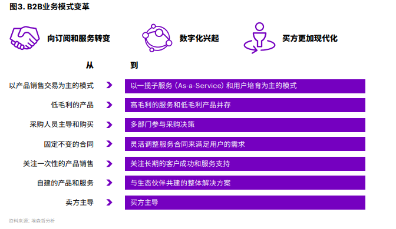

#### （4）数字化驱动的B2B业务营销服体系转型
图：数字化营销服体系蓝图 
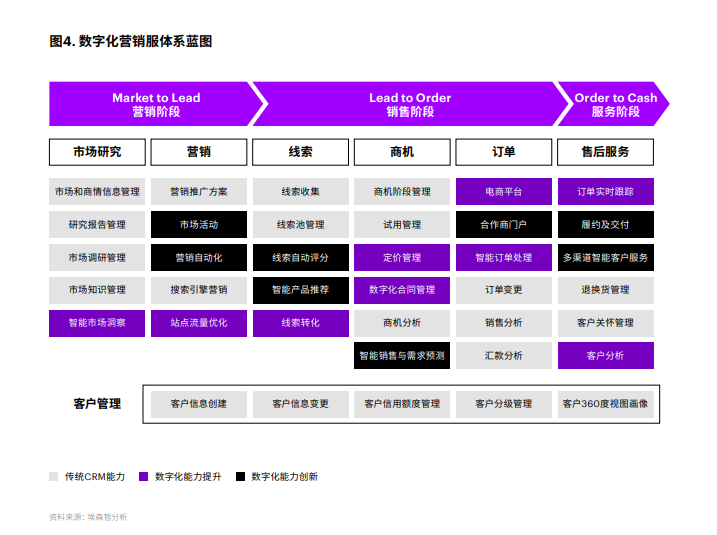

为应对日益多变和具有挑战性的商业环境，B2B企业必须构建数据驱动的 营销-销售-服务体系，不断沉淀全链条客户数据、精准洞察客户需求，并善用数字化工具提升客户体验和运营效率，以智能化手段降低营销和服务成本，实现竞争力的倍速升级。

#### （5）从市场到线索 Market to Lead
##### a.数字化重塑会销历程，打造全新交互场景

##### b.智能化改变营销触点，实现持续精准培育

#### （6）从线索到订单 Lead to Order
##### a.多维度挖掘线索价值，实现智能收入增长
##### b.全链条优化渠道体验，打造销售合作生态

#### （7）从订单到现金 Order to Cash
##### a.智能化配置交付资源，提升服务响应弹性
##### b.智能化升级客户服务，以服务打开新销售

## 2.体验家
### 2.1.公司介绍
瀚一数据科技（深圳）有限公司是一家致力于用多源的数据，帮助企业提升客户体验的SaaS公司。2019年-2021年连续三年完成真格基金、SIG等顶级风投机构数千万元融资，是客户体验管理行业的领军企业。 

瀚一数据推出的「体验家XMPlus」，是一款全旅程客户体验管理SaaS系统，适用于企业的客户体验部、产品部、运营部、客服部、营销部等，帮助打造客户体验管理闭环，降低流失率、提升转化率、复购率和口碑推荐，增加利润与品牌价值。截至目前，已累计服务包括来伊份、易快报、周大福、重庆农村商业银行等多家标杆客户，业务涵盖物业、零售、银行、医疗、企业服务等多个领域。

瀚一数据团队包括曾在Nielsen、益普索等顶级市场研究机构服务过的咨询顾问，来自普林斯顿大学、北京大学的数据科学家，以及有硅谷背景的软件工程师。瀚一数据心怀“用科技弥合企业与客户之间的体验鸿沟”的愿景，帮助客户在“体验经济”时代获得商业成功。

### 2.2.客户旅程图模板
#### （1）银行业的客户旅程模板
体验经济时代，优质的客户体验已然成为银行等金融机构未来竞争的护城河。一方面，在产品同质化严重的情况下，以产品驱动的增长模式难以为继。另一方面，在疫情的催化之下，数字化技术在金融服务领域的应用显著加快，带动了新型消费行为空前崛起，金融客户愈发被方便快捷的体验所吸引，对体验的要求越来越高，个性化需求日渐膨胀。

客户体验的浪潮加速推进，银行业客户体验转型迫在眉睫。为此，银行需要一个完善的客户体验提升策略，转向客户旅程的思维方式，通过梳理和搭建客户旅程图，洞悉金融消费者在全生命周期中的个性化需求和深层次期待，在各触点上提供一致的高品质服务，提升客户的整体体验。

为了帮助银行等金融机构使用好客户旅程图这一工具，我们为大家精心准备了两套适用于银行、金融服务领域的客户旅程图模板，分别从个人客户和企业客户的视角出发，包括客户需要经历的所有阶段和触点，以及在考虑各种购买、销售和理财投资时遇到的所有流程、系统和渠道，具体包括前期客户的研究与评估、确定候选产品与服务，以及从购买到售后服务的期间线上线下体验的所有互动和心理历程，帮助银行有效改善不同阶段、触点下的客户交互体验。

图：体验家-银行业客户旅程模板-银行金融个人客户应用场景 
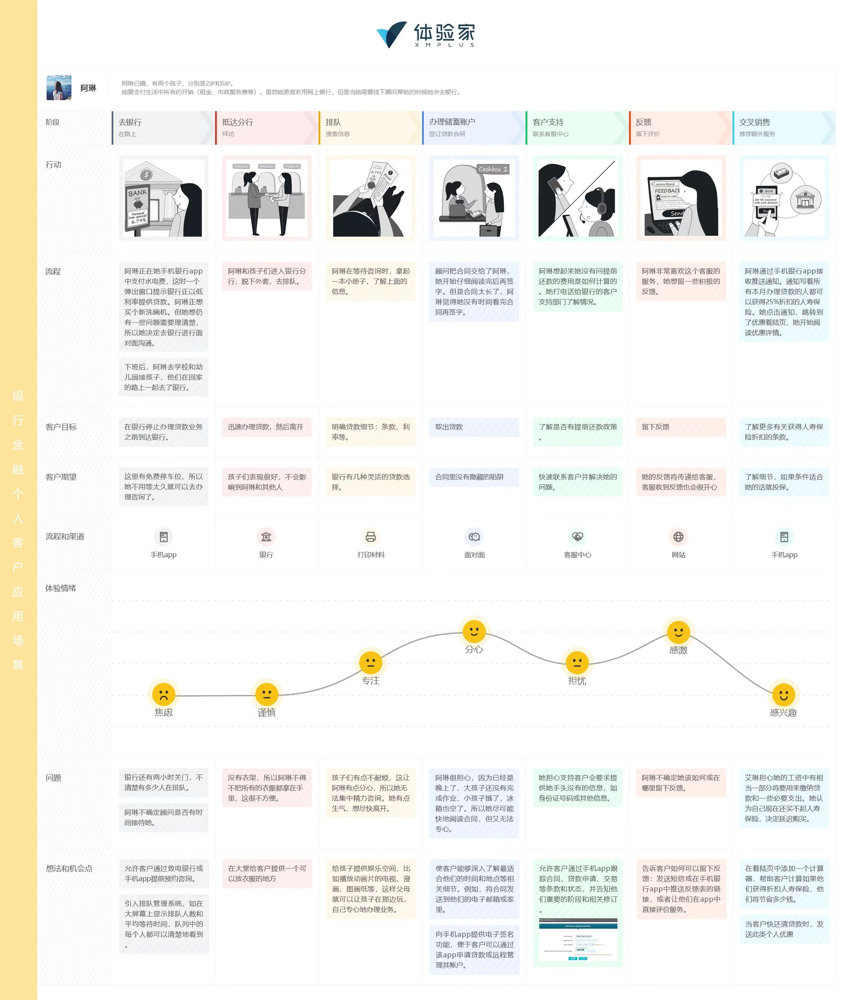

图：体验家-银行业客户旅程模板-银行金融企业客户应用场景 
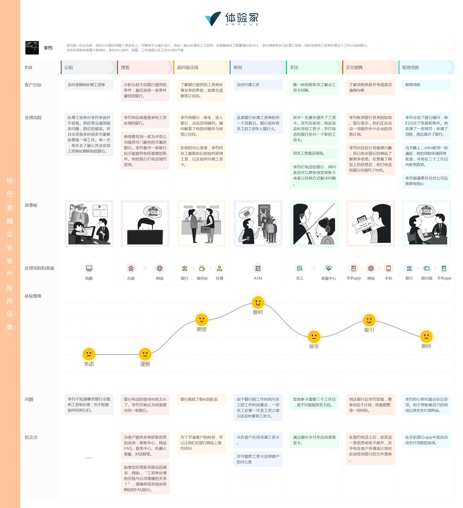

                      
数字营销参与主体
营销发展：。。。电子商务
流量运营
流量池
cdp map
营销科技
「」