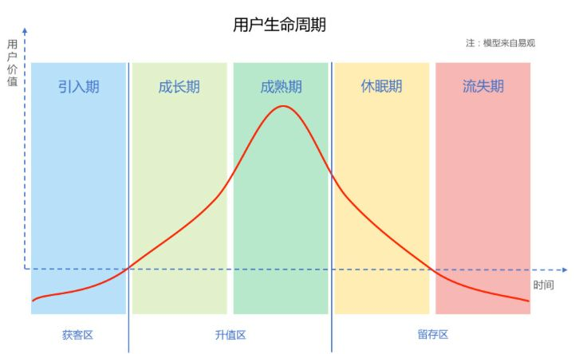
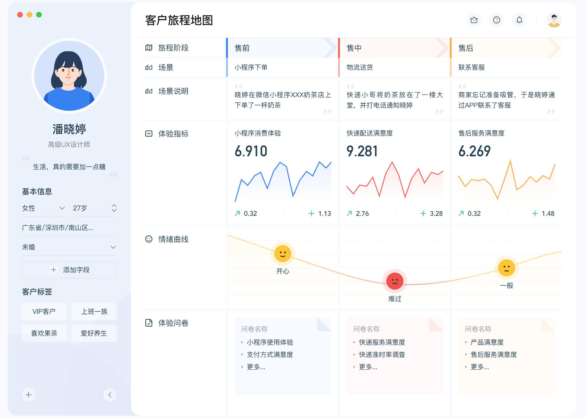

# 一、四大运营模块
## 1.互联网运营

### 1.1.运营的底层认知
#### （1）商业认知

##### 商业目的
商业企业的目的是利润和更多的利润。商业企业的首要目的是盈利。

##### 利润
利润=收入-成本
- 收入：收入是怎么来的？收入来自我们的客户，我们得找到客户并让客户为交易付费。但是客户在哪里，

## 2.运营之用户运营
用户运营是指通过数据分析，对处在不同生命周期中的用户制定相应策略的工作。

### 2.1.什么是用户运营
#### （1）用户运营
用户运营是以用户为中心，通过量化用户旅程中的关键场景的关键行为，对用户进行生命周期阶段的划分以及人群的细分，针对用户生命周期的不同阶段、不同细分人群，制定的运营目标，并通过工具和手段为不同用户人群提供差异化的服务并实现运营目标。用户运营通过各种手段与渠道将产品与用户联系起来并持续不断的维护这种关系。

用户运营是指通过数据分析，对处在不同生命周期中的用户制定相应策略。

### 2.2.用户生命周期理论
#### （1）周期
周期是指事物在运动、变化过程中，某些特征多次重复出现，其连续两次出现所经过的时间段。也指事物进程中，其重复出现的一次现象从头至尾经历一遍所需要的时间。

周期现象:就是指事物按一定的规律变化的周期。比如,每年都会按春、夏、秋、冬的顺序进行四季轮换;每周都有7天,每天都有24小时,等等。如果我们能找出事物的变化规律,掌握周期,就可以灵活地利用周期解决很多实际问题。

生命周期就是指一个对象的生老病死。生物体从出生、成长、成熟、衰退到死亡的全部过程。一个人从出生到病死经历生命周期5个阶段，另外一个人也是经历这5个阶段。所以，这5个阶段就构成一个生命周期。

#### （2）用户生命周期
用户生命周期<u>是</u>反映客户和供应商之间的联系在一段时间内动态变化的一系列<u>阶段</u>。

用户生命周期管理是指从用户与产品接触开始，直到用户不再使用产品的整个过程，运营人员采取分层的策略对用户实施管理。用户生命周期大致可以分为五个阶段：引入期、成长期、成熟期、休眠期和流失期。

### 2.3.用户旅程
用户旅程是由阶段构成的。

「用户体验旅程」是指从用户角度出发，以叙述故事的方式描述用户使用产品或接受服务的「体验情况」，以「可视化」图形的方式展示。

#### （1）用户旅程图 customer journey map
用户旅程图是服务设计中的一种常用方法，它是以用户需求为导向，以时间顺序描述用户在经历「完整服务流程」中「分阶段」产生的体验情绪及满意度。其<u>强调用户体验</u>，通过对每个服务接触点的人、行为、情绪产生不良体验的具体环节的展示，知道服务痛点及机会点，从而改进或者提升服务水平。

用户旅程地图：全面洞察客户需求，构建统一流畅的全旅程体验。

客户旅程地图是指以地图的形式记录客户首次接触品牌、直至下单，并享受产品或服务期间与品牌互动的全过程。

#### （2）用户旅程图的构成要素
用户旅程图是从服务流程全局出发，聚焦目标用户群体，对目标用户在各服务接触点的行为模式、体验感受进行解读，帮助服务提供者明确用户，了解用户需求，从而定义产品机会点。用户旅程图对服务触点的内容进行详细分解，分析用户在使用服务过程中各阶段的体验感受。

用户旅程图一般包括用户角色、时间轴、接触点、用户体验 4 个主要部分。
- 用户角色：通过对目标用户定性、定量研究，将用户特征进行聚类分析，得出目标用户的综合原型，即用户角色。用户分类
- 时间轴：主要是指用户使用产品或服务所经历的时间进程。
- 触点：主要是指用户在使用产品或接受服务过程中，与产品或服务的提供者之间的互动关系节点。这里更引申为用户在接受服务过程的前、中、后不同阶段与服务提供者、后台操作者、内部支持系统之间的相互关系，是用户在使用服务中的“真实瞬间”。
- 用户体验：通常包含两个部分：一是在使用服务之前，对服务、服务提供者的预期，期望获得什么样的信息、服务或者体验；二是用户在使用产品服务的过程中，与服务提供者或服务本身接触的每一个瞬间实际获得的体验、情绪和感觉。

用户旅程地图的构成要素：
- 人物：确定客户旅程的主人公，TA的年龄、身份、收入、喜欢、讨厌...
- 阶段：梳理客户旅程中的阶段，例如售前、售中、售后、线上、线下
- 期望：了解客户的期望，比如客户对产品、服务、企业有哪些期待
- 情绪：感知客户的情绪，比如某个场景下客户是开心、愤怒、无奈还是冷漠
- 场景：还原客户旅程中的场景，客户所处的环境、时间、遇到了哪些事情
- 触点：找到客户旅程中的触点，与客户发生交互的店，如网站、店铺、客服
- 痛点：定位客户旅程中的痛点，比如产品本身、服务例程中存在的问题
- 机会：挖掘优化客户旅程的机会点，如何才能让体验更好，让客户更满意

#### （3）客户旅程地图的作用
- 优化企业的服务流程：通过绘制客户旅程地图，发现一些不够理想的服务环节，以及环节背后的服务流程中存在的问题，制定出相应的解决方案
- 打破部门之间的壁垒：透过客户视角，统一各部门对客户需求的理解，串联各部门的工作目标和业务内容，打破沟通壁垒，促进协调与合作
- 提升员工的共情能力：帮助员工站在客户角度，思考客户的需求，了解客户在各个阶段的想法、情绪和感受等，更好的与客户共情

#### （4）旅程阶段
阶段，是客户旅程的主心骨。

划分阶段，是在绘制客户旅程地图中、继创建客户画像之后的又一重要步骤。然而，很多时候，比起层次分明的阶梯，客户旅程更像是一段难分彼此的流水，这无形中给旅程阶段的划分增加了不少难度。

让我们一起了解一下，如何更高效、更精准地定义与划分客户旅程阶段。
##### 方法一：定义范围
>首先，你需要做的是明确客户旅程的范围。 
一般有两种方式：要么从全局出发，从更广、更高的层次去划分产品或服务的阶段，如客户认知、考虑、喜好、行为和忠诚度等；要么从细微处着手，聚焦客户旅程中的某一个部分，如服务过程中存在问题最多、最应该优先改善的某个区域，亦或是你最了解的那个部分。 
举个例子，如果你是一家超市的老板，你大可以只关注“物流配送”阶段，通过详细地标记出这个阶段下所涉及到的场景、触点、客户情绪、痛点、满意度等，从而找到改善和提升“物流配送”阶段体验的具体方法。

##### 方法二：由触点入手
>明确了客户旅程的范围之后，如果还是不清楚该如何划分阶段、要划分几个阶段的话，不妨试试从触点入手，由小入大。先按照时间顺序罗列出客户经历的所有触点，再依据亲疏远近、相似程度等因素，将它们合并成若干个组合。 
假设你是一家旅行社的员工，准备绘制一张客户旅程地图。你需要做的第一件事就是代入客户视角，把自己想象成一名旅客，然后将跟团旅游可能会经历的所有触点罗列出来，再把它们组合成不同的阶段，具体如下： 
1.搜索结果、百度广告 >>> 搜索阶段 
2.旅行社官网首页、价格页面和其他页面 >>> 选择阶段 
3.电话、邮件、联系表单 >>> 初次接触 
4.旅程报价单、传单、宣传册 >>> 挑选旅游线路 
5.付款单、合同 >>> 付费阶段 
6.旅游攻略 >>> 信息收集 
7.机构的服务热线 >>> 服务与支持 
8.反馈单、邮件 >>> 反馈阶段 

##### 方法三：拆解客户目标
>或者，你也可以将客户旅程理解成一个被客户拆解成很多个小目标的大目标，即客户为什么会选择你。你需要做的则是站在客户角度上思考，找到那些客户在使用产品和服务时的小目标。 
就拿上面的例子来说，一旦客户选择了一家旅行社之后，下一个目标一定是选择一个合适的旅行套餐，而这恰恰是旅程中的一个重要阶段。
##### 方法四：使用关联映射
>关联映射图（Affinity Map）可以将大量复杂的数据、想法分门别类。它是一种简单而高效的工具，对划分客户旅程阶段也有“奇效”： 
1.头脑风暴：在头脑中搜索一下客户为了达到目标可能会付诸的所有行动 
2.记录：用便利贴记录客户的每一项行动，并将它们张贴在一个空白的平面上，如白板或墙上 
3.分析：寻找那些看起来有关联的“行动便利贴”，并将它们排成一列 
4.分类：基于这些关联，试着给每一列起个组名 

[来源] [体验家](https://www.xmplus.cn/blogs/cembaike/735)

#### （5）客户旅程案例
图：客户旅程图-模板 

#### （6）触点 touchpoints
接触点是用户在使用某个服务过程中，与服务提供者之间发生互动关系的节点，是服务分析与设计的关键点。涵盖了服务各阶段过程中用户的情感、目的、交互、障碍等体验感受，能够帮助服务提供商改进服务内容，满足用户需求。

#### （7）营销路径
#### （8）用户体验
体验经济时代，优质的客户体验已然成为企业未来竞争的护城河。

### 2.2.用户运营模型
ARGO模型
AARRR模型
RFM

### 1.1.概念
#### （1）客户价值 Customer Value

客户价值（customer value）是指在企业与客户交往过程中，企业从客户那里获得的总价值（total value）。

#### （2）价值分层

- 客户价值分类有什么用？对于不同类型客户，如果采取单一的服务策略会造成资源的浪费、客户满意度水平低等一系列问题，所以，要构建客户价值评估指标体系，细分客户群体，针对不同价值的客户群体提供差异化的服务策略。

### 1.1.用户价值
#### （1）用户生命周期价值 LTV
LTV（life time value）也就是用户生命周期价值，是产品从用户获取到流失所得的全部收益的总和。LTV用于衡量用户对产品所产生的价值，是所有用户运营手段的最终衡量指标。

### 1.2.用户分层/分群

### ➤➤➤ 用户分层 ➤➤➤
### 1.1.AARRR 模型
### 1.2.用户生命周期
用户生命周期和RFM上一级隶属于用户价值模型。

#### （1）用户生命周期模型
用户生命周期模型，本质上就是用户的一种分层、分类的方法论。是按照用户在产品中的阶段进行的划分，反映了用户从接触产品到离开产品的整个过程。从技术层面，可以理解成一个用户标签，标签值有新用户、成长期用户、流失用户等。

#### （2）用户生命周期价值 LTV
- 用户生命周期管理是一个很大的话题，用户从第一次使用APP，到最后一次打开的时间，可以定义为用户生命周期。运营一直贯穿整个生命周期，在新用户还没有注册前，就寻求媒体曝光、渠道推广和活动营销，哪怕在卸载APP后，同样会用尽手段希望挽回用户，例如老用户回馈，邮件推送社交好友动态等。
- 运营的目的就是让用户留下来，并且赚钱。用户生命周期价值（LTV）比生命周期更重要，让用户能在生命周期中产生商业价值，才是运营的使命。运营的目标就是尽一切可能延长用户的生命周期，并且在生命周期中尽一切可能产生商业价值。

### 1.3.RFM 模型
### 1.4.金字塔分层

## 3.运营之内容运营
## 4.运营之活动运营
## 5.运营之产品运营

# 一、ToB运营
## 1.线索管理
### 1.1.线索生命周期
#### （1）生命周期
生命周期这个词最早诞生于20世纪60年代的一场能源危机中，学者们为了研究包装废弃物，对原材料采掘到被废弃整个「链条」进行了定量研究，从更宏观、更「长期」的视角对事物进行把控。而后，它也经常出现在企业管理、产品管理等「时间周期长」、「流程环节多」的话语体系中。 

对B2B企业而言，基于营销云实施线索生命周期管理，才能让企业精准找到线索流失的环节，并有针对性地<u>提升线索从诞生到成单的整个链条的效率</u>。

- 营销链：营销链路模式，AISAS法则，即A注意（attention）、I兴趣（interest）、S搜索（search）、A购买（action）、S分享（share）。不管从哪个法则看，每一个「环节」都是环环相扣的，不可能「单点」存在，必须整合起来引导着消费者一步步走近你，最终走进你的店，引导生意往好的方面发展，从这意义上讲，营销链有助于企业开展全局营销，在困境在找到希望的突破口。
- 营销环节：营销环节是商品未售出之前制定的一系列的政策以及战略制度,促进商品销售。
- 环节：指互相关联的许多事物中的一个。

