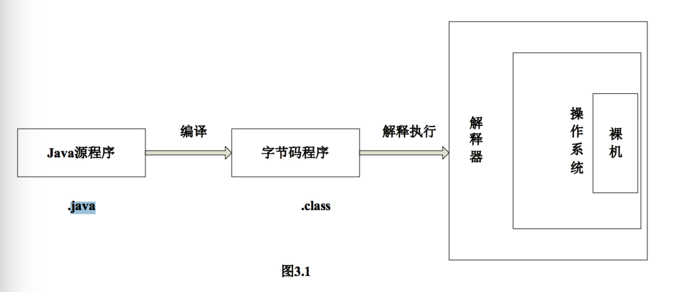

# 问题
1.编程的本质？ 
程序的本质是数据和函数。编程就是编写函数处理数据。函数就是接收输入参数，处理功能，输出结果。听到呼唤-->处理事情-->回应结果。呼唤函数的动作叫调用，调遣函数，让函数运行。如加法函数就是参数：(第一个数字，第二个数字)-->处理：{将两个参数相加}-->输出：相加结果。处理功能可以增加判断（控制结构）、计算的过程。在函数内，也可以调用其他函数，不断套娃下去。如点赞操作，参数：(视频id)，处理：{查到这个视频的点赞数，+1}，输出：返回新的数量渲染到界面。剩下的就是熟悉语言、工具、框架。软件就是数据+函数+输出渲染。比如浏览网页，参数是数据的html文件，即数据，浏览器是函数，输出就是看到的添加了渲染的数据。数据极其大，函数极其复杂。

# 1.高级语言程序的编译及执行
## 1.1.C语言
## 1.2.Java语言
### （1）Java编译器javac
java编译器的作用是将java源程序编译成中间代码字节码文件。编译时首先读入java源程序，然后进行语法检查，如果出现问题就终止编译。语法检查通过后，生成中间代码即字节码，字节码文件名和源文件名相同，扩展名为.class。目前市面上流行的java编译器有：javac、eclipse。这些编译器将java源程序转换为字节码程序后再解释执行达到用户需要的结果。

###### javac编译器运行原理
从某种意义上来说，是编译器成就了程序语言功能的多样化，编译器是人类和机器沟通的桥梁。javac的编译器就是将java这种对人类非常友好的编程语言编译成对所有机器都非常友好的语言。<u>javac将java源码编译成java字节码，也就是jvm能够识别的二进制码</u>。运行原理图如下所示：

图：javac编译运行原理图

javac编译过程分为如下3个子过程：
- 1.解析与填充符号表过程：解析主要包括词法分析和语法分析两个过程
- 2.插入式注解处理器的注解处理过程
- 3.语义分析与字节码的生成过程

### （2）java运行
经编译后的字节码文件是一种中间代码，它与具体机器环境以及操作系统环境都没有关联，同时它也是一种特殊的二进制文件，是Java源文件由Java编译器编译后生成的目标代码文件，它将前面生成的语法树、符号表等信息转化成字节码，然后写到磁盘Class文件中。由编译器生成的字节码文件人类和机器都无法直接读懂，它必须经由专用的Java解释器来解释执行，因此Java是一种在编译基础上进行解释运行的语言。Java解释器负责将字节码文件翻译成具体硬件环境和操作系统平台下的机器代码，经过执行后达到用户想要的结果。

## 1.3.python语言
