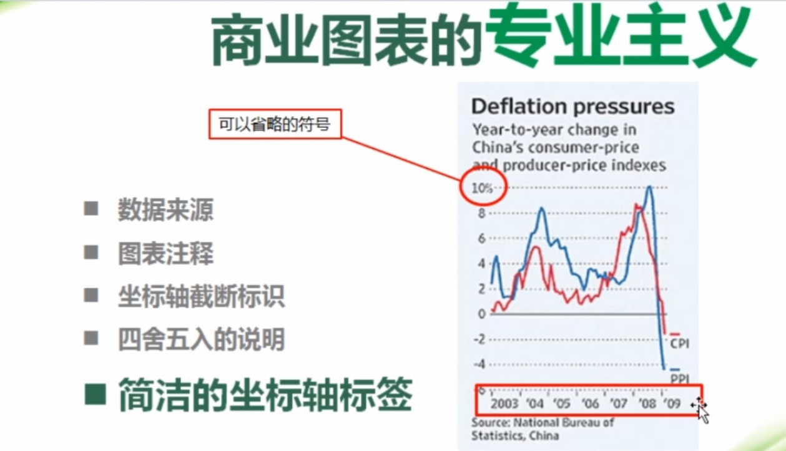
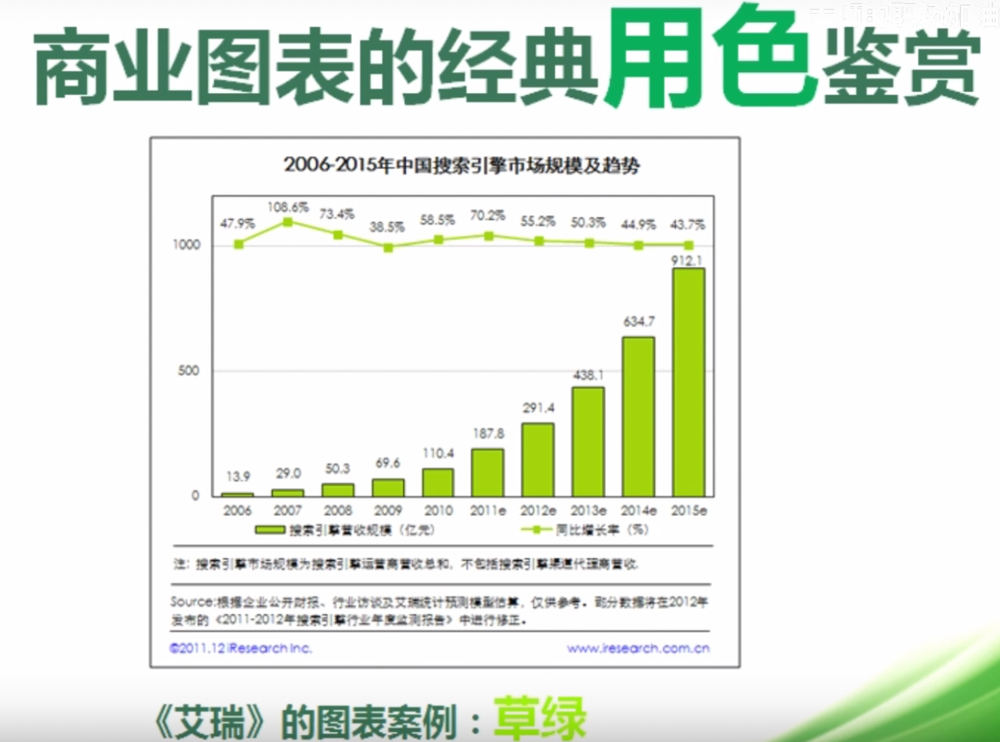

# 一、ppt
1.配色
确保页面上有深浅两种颜色用来做背景和强调色就好。

2.页面排版
- 封页：文案内容比较少，换成居中布局才能够更加聚焦观众的视线。标题用书法字体，错位布局更显大气
- 纯文字页：大段的文字信息铺满全屏，观看起来很有压力。可以在排版前先给文字分段，重点信息通过加粗字体以及更换颜色来进行强调，可以插入一张图片用作配图，这样才能够让配图和文案产生视觉关联不突兀。满屏都是文字的PPT，除了不美观，页面仅仅是文字的堆砌毫无章法，观众阅读起来没有结构可循，理解起来比较吃力，要找到文字间的逻辑以此确定板式结构。对于数据比较多的段落，可以把关键数据单独拿出来

3.技巧

# 二、excel
1.普通普通 vs 商业图表
（1）颜色
（2）布局
（3）字体
（4）专业主义
- 数据来源
在注脚区标注出这个数据的一个来源

- 图表注释
例如，如果横轴2012e表示预估值

- 坐标轴截断标识

一般来说，图表的纵坐标都应该是零起点的。当使用非零起点坐标轴的时候，往往意味着夸大差异，尤其是非零起点的柱形图。如果你确实要使用非零起点坐标，一定要记得表上坐标轴截断图示，标记原点为零，尽到提示之责，这也将是专业性的体现。截断标识只需要简单的用自选图形绘制而已。
这里，本质上坐标轴是从5开始，然后插入文本框0，背景是白色，覆盖住了原始的5

截断标识是自己绘制的三段线拼在了一起

- 四舍五入的说明
图表中有四舍五入计算时，特别要注意检查各分项之和是否等于总额，饼图显示数字之和是否等于100%，有时大牌杂志也会犯这个错误，可以在脚注区标上一句“由于四舍五入，各数据之和可能不等于总额（或100%）”，既避免了被动发现错误的尴尬，又能体现专业性。

- 简洁的坐标轴标签

简洁的坐标轴可以使得人们在阅读图表的时候更加容易集中注意力。

另外一个思路是坐标轴可以间隔展示，本质是隐藏坐标轴，然后插入文本框。这样使图表满足纵向的一个原则，不至于像右图被拉得很长。

（5）元素

2.excel图表布局

默认布局：
- 标题不够突出，信息量不足
- 绘图区占据了过大的面积
- 绘图区的四周浪费了很多地方，空间利用率不高
- 图例在绘图区右侧，阅读动线往返跳跃，需要长距离检索、翻译

商业布局（纵向原则）：
- 完整的图表要素
- 突出的标题区
- 竖向的构图方式

3.excel颜色
- 从商业杂志图表中借鉴颜色（取色软件）
经济学人：水蓝色系

商业周刊：红蓝组合

华尔街日报：黑白灰配色

艾瑞：草绿

- 自己定义和配置色彩

4.excel实例

只有条形图使用了图表，其余元素使用了excel的其他元素，例如图例和数值都是插入的文本框然后整体对齐的。

5.图表设计图鉴

