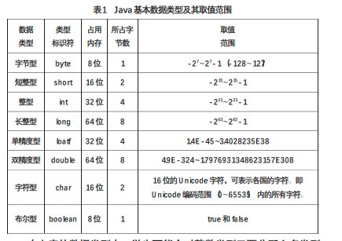
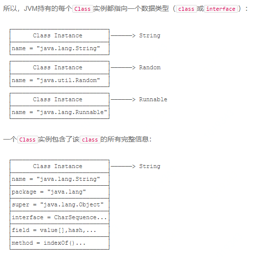
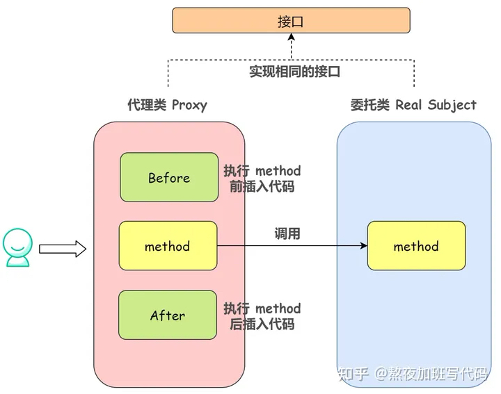
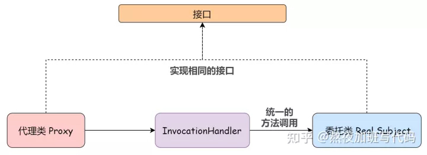

# 一、Java
## （一）Java语言
java体系结构包括Java语言、Java class文件、Java API、JVM。
### 0.java原理
#### ➤➤➤ java字节码 ➤➤➤
#### （1）java字节码
- 字节码文件（即.class文件）是与平台无关的一种二进制文件，它能够被JVM识别并加载和执行。
- 字节码文件是一连串的8位字节的二进制流，它包含的数据项是按照固定次序组成的，且相邻的项之间没有间隔

#### 字节码文件
- 结构
- 常量池
- 字段表集合
- 方法表集合
- 属性表集合
#### 字节码文件的结构
#### 字节码文件的常量池
#### 
#### 字节码工具

### 1.java语言风格
#### （1）main()方法
- main()方法是程序的入口方法，java命令行所调用的那个类的main()方法是程序的入口。如`java Detergent`，那么`Detergent.main()`将会被调用。
- 可以为程序中的每一个类都创建一个main()方法。这种在每一个类中都设置一个main()方法的技术可使每个类的单元测试都变得简便易行。而且在完成单元测试之后，也无需删除main()，可以将其留待下次测试。
- 即使是一个程序中含有多个类，也只有命令行所调用的那个类的main()方法会被调用。
- 一个程序只能有一个public类，public可以不用来修饰期望被调用的main方法所在类
- 即使一个类只具有包访问权限，其public main()仍然是可访问的。
- 一个java源文件（.java文件）被称为编译单元，每个编译单元都必须有有个后缀名.java，而在编译单元内则可以有一个public类，该类的名称必须与文件（.java文件）的名称相同（包括大小写）。每个编译单元只能有一个public类，否则编译器就不会接受。如果在该编译单元之中还有额外的类的话，那么在包之外的世界是无法看见这些类的，这是因为它们不是public类，而且它们主要用来为主public类提供支持

#### （2）关键字
- 用于包、类、接口定义：package、class、interface
- 访问控制修饰符：public、private、protected、default
- 数据类型：byte、char、int、double、boolean
- 流程控制：if、else、while、switch、case、do、break、continue
- 异常处理：try、catch、finally、throw、throws
- 引用：this、supe
- 创建对象：new

#### （3）保留字
true、false、null

#### （6）泛化
##### 定义
>泛化（generalize）是将一些不必要的特殊值（比如常量）用更普遍化的值代替（比如变量或参数）的过程。泛化可以增加程序的可重用性，有时还可以使程序更易阅读。
##### 特点
##### 举例

#### （7）泛型
##### 定义
##### 特点
- 泛型的本质是参数化类型，也就是说所操作的数据类型被指定为一个参数。
- 泛型的本质是参数化类型，参数就是定义方法的时候定义形参（局部变量），调用方法（执行方法）的时候传递实参（引用，或变量值）。参数化类型就是将原来具体的类型参数化
- 泛型是一种语法糖，在编译阶段完成类型转化，避免在运行时候强制类型转换出现的错误。
- java中泛型是JDK1.5的新特性，在1.5及之后版本中支持
- Java的泛型就是在定义的同时明确指明其类型，增强程序的可读性，同时类型的检查在编译阶段就可以完成，避免运行时的异常，从而使程序有更强的健壮性。例如：传统的定义容器对象：`Map m = new HashMap()`，使用泛型定义对象：`Map<Integer, News> = new HashMap<Integer, News>()`

##### 举例

#### （8）泛型方法

#### （9）this.
this是一个特殊的关键字，表示当前创建的对象。

#### （10）this()
子类构造器，this()可以带形参也可以不带。构造器间相互调用。用于初始化子类本身的属性。

#### （11）super.
- super，父类引用。
- 子类中有一个隐藏的父类引用super会指向父类实例，在实例化子类之前会先实例化一个父类，也就是说会先执行父类的构造函数。
- 父类的方法在重写后会被子类覆盖，当需要在子类中调用父类的被重些的方法时，需要使用super关键字。

#### （12）super()
父类构造器，子类调用父类构造器用于初始化从父类继承来的属性。

##### 定义
##### 特点
- 定义一个泛型方法，该方法在调用时可以接收不同类型的参数。根据传递给泛型方法的参数类型，编译器适当地处理每一个方法调用。

#### （13）父类引用指向子类对象
>声明的是父类，实际指向的是子类的一个对象。父类这里可以是类、也可以是接口，子类是继承或者实现父类的子类。

```
Person p = new Student();
```
这里，`Person`是一个类或者一个接口，`Student`是继承或者实现`Person`的子类。

- 父类应用可以指向子类对象，子类引用不能指向父类对象。

#### （14）向上转型
把子类对象直接赋值给父类引用叫做向上转型（upCasting），不需强制转换。
- 父类引用指向子类对象。
- 父类一般是接口，也可以是类。
- 向上转型后，父类引用指向子类对象，父类引用调用方法实际调用的是子类对象的方法，但是父类引用会丢掉子类的特色方法（即与父类共用外的其他方法）

##### 应用场景
将父类作为方法的形参，调用方法是传递子类作为实参，方法内部以父类引用调用所传递的子类的方法，传参的子类不同，执行的方法也不同。

#### （15）向下转型
把指向子类对象的父类引用赋值给子类引用叫做向下转型（downCasting），需强制转换。

- 前提：先向上转型，才能再向下转型。因为子类引用不能指向父类对象。

##### 应用场景
向上转型时户丢掉与父类共有的特色方法，可以使用向下转型再重新转回。

#### （16）多态
多态存在的三个必要条件：
- 继承
- 重写
- 父类引用指向子类对象

### 2.java基础
#### （1）常量
- java语言中，处理的数据有不变的量和可变的量。
- 不可变的量称为常量，在java中常量也称为字面值。
    - 整数5默认为整型类型，5L或5l代表长整型数据
    - 浮点数5.0默认为双精度型，5.0F或5.0f代表单精度型数据
    - 字符型字面量：'a'
    - 布尔型字面量：true和false（只能是小写）

#### （2）变量
- 在数据处理过程中可以改变的量叫变量。
- 变量其实就是某内存区域的另一种称呼。
- 标识符：变量名的命名有严格的规则，只能以英文字母或下划线开头，由英文字母、数字、下划线组成的字符序列，并且大小写有别。
- 变量名代表某内存区域，将数据存入变量前，首先要说明这个内存区域能存放的数据类型。这种规则叫“变量必须先声明后使用”
- 变量名：内存区域名称（类比教室的名称）
- 变量：内存区域地址（类比教室的楼层）
- 变量值：内存区域内的值（类比教室中的人和桌椅）

#### （3）标识符
>标识符是用来标识类名、对象名、变量名、方法名、类型名、数组名、文件名的有效字符序列，也就是它们的名称。由字母、数字、下划线、\$组成。首字母不能是数字。

命名规则：
- 类名，首字母大写
- 方法名，首字母小写
- 常量，全部字母大写。如 `final double PI = 3.14159; //final说明PI是常量名，值不可改变`
- 包名，所有字母小写

```
double r; //声明内存中某个连续的64位区域，取名为r，里面能存放双精度型数据，此时内存区域还没有数据（简单描述：声明一个名叫r的double类型的变量）
r = 5.0; //将5.0这个双精度数据存入到r所指的内存区域中（简单描述：将5.0存入到变量r中）
```

#### ➤➤➤ 基础数据类型 ➤➤➤
#### （1）数据类型的引入
- 计算机的主要功能是进行信息处理，处理的对象都是数据。计算机中数据是以某种特定形式存在的，对于日常生活中不同的数据，需要进行分类处理。在计算机中不同类型的数据表示不同的性质与不同的存储方式。
- 数据类型决定了其在计算机内存中存储形式。
- 数据类型有数值型的、布尔型的、字符型的。

#### （2）数据的存储方式
在计算机内部数据处理都是采用二进制数。不同类型的数据，其存储方式是完全不同的。
- 数值：数值数据在计算机内存储的是其对应的二进制值。例如数字5，对应的二进制是101，在计算内如果占一个字节，编码为00000101。数字5.0,是一个浮点数，在计算机内要转换成纯小数处理，即为0.5*10，表示成科学计数法是0.5E1，其中E表示以10为底的幂，E前面的0.5称为尾数，E后的1称为指数。在计算机内存储该数时必须将尾数与指数分别转换成二进制，整个数至少占4个字节（32位），其中前一个字节用来存储指数部分，后三个字节用来存储尾数部分。
- 字符：字符数据在计算机内存储的是其对应的ASCII码值。例如字符'5'，在计算机内存储的是5对应的ASCII码值53，再转为二进制110101，其在计算机中编码为00110101。
- 字符串：字符串在计算机内存储的是每个字符的ASCII码值。例如字符串'15'，在计算机内是存储1与5对应的ASCII码值，1的ASCII码值是十进制49，5对应的ASCII码值是十进制53，分别转换为二进制，则编码为0011000100110101。
- 布尔型：布尔型数据只有TRUE和FALSE，在计算机中用00000001或00000000表示。

#### （3）数据类型的标识符
在计算机中对于`0011 0101`这样一个编码，究竟表示数值53还是字符5呢？`0000 0000`这样的编码究竟表示数值0还是布尔型FALSE呢？java程序设计语言要处理这类问题就必须引入一个类型标识符来说明数据类型。Java语言中基本数据类型表示负有如下几种：

- 4个整数型
- 2个浮点型
- 1个字符型
- 1个布尔型
- 整数型分这么多类型，是为了应对不同的需求，更好的利用有限的资源。

#### （4）byte
#### （5）short
#### （6）int
#### （7）long
#### （8）float
- java怎么在内存中存储float和double值？对于float值，在内存中占用4个字节共32bit，1 bit用来存符号，8 bit用来存指数，23 bit用来存尾数（有效部分）。

#### （9）double
#### （10）char
#### （11）boolean
#### （12）浮点运算精度不准
```java
public class Test {
    public static void main(String[] args) {
        double d1 = 2.0;
        double d2 = 1.1;
        double s = d1 - d2;
        System.out.println(s);
    }
}
out:0.8999999999999999
```

```java
public class Test2 {
    public static void main(String[] args) {
        BigDecimal bd1 = new BigDecimal("2.0");
        BigDecimal bd2 = new BigDecimal("1.1");
        System.out.println(bd1.subtract(bd2));
    }
}
out:0.9
```
### 3.常用API
#### ➤➤➤ java.math ➤➤➤
#### （1）BigInteger
- 在java中，由CPU原生提供的整型最大范围是64位long型整数。使用long型整数可以直接通过CPU指令进行计算，速度非常快。
- 如果我们使用的整数范围超过了long型怎么办？这个时候，就只能用软件来模拟一个大整数。`java.math.BigInteger`就是用来表示任意大小的整数。BigInteger内部用一个`int[]`数组来模拟一个非常大的整数。
- BigInteger用于表示任意大小的整数。
- 对BigInteger做运算的时候，只能使用实例方法。例如，加法运算`BigInteger.add()`

#### （2）BigDecimal
- 基本数据类型float、double主要用来处理科学计算和工程计算，有时存在精度损失问题。
- 在实际应用中，特别是商业计算往往要求结果更加精确，BigDecimal可以很方便的解决这个问题
- 在公司实际开发中，很少使用float、double，常常使用BigDecimal的加减乘除运算
- BigDecimal可以表示一个任意大小且精度完全准确的浮点数
- BigDecimal用于表示精确的小数，常用于财务计算

###### 构造函数

###### 成员方法

### 4.面向对象
#### ➤➤➤ 访问控制修饰符 ➤➤➤
权限|同一类|同一包|不同包的子类|所有类
-|-|-|-|-
public|允许|允许|允许|允许
protected|允许|允许|允许|不允许
默认|允许|允许|不允许|不允许
private|允许|不允许|不允许|不允许

#### （1）访问控制修饰符
- java中的访问控制修饰符实现了对类的封装。面向对象技术的基本特征是封装性，这样可以限制类的外部成员对类的内部成员进行访问，只有通过公共接口才能访问类的成员数据。
- 在java语言中的封装是通过访问控制实现的，而访问控制的实现是通过访问修饰符实现的。
- 在编写程序时，有些核心数据往往不希望用户能够直接使用，需要控制这些数据的访问，对类成员访问的限制是面向对象程序设计的一个基础，有利于防止对象的误用。只允许通过一系列定义完善的方法来访问私有数据，就可以防止数据被赋予不正当的值。
- 访问控制修饰符是限定一个名字的可访问性，这里的名字可以是**类、成员属性和成员方法**。也就是说，它是限定类、属性或方法是否可以被程序里的其他部分访问和调用。
- 可访问性是一种在编译时确定的静态特性，在编译时就确定了一个名字在什么范围内可以被访问，从而限制一个名字的访问权限。
- 学习如何将类库构件置于包中，然后就会理解访问权限修饰词的全部意义

#### （2）包
包：库单元。包内包含有一组类，它们在单一的名字空间下被组织在了一起。

- 一个java源文件（.java文件）被称为编译单元，每个编译单元都必须有有个后缀名.java，而在编译单元内则可以有一个public类，该类的名称必须与文件（.java文件）的名称相同（包括大小写）。每个编译单元只能有一个public类，否则编译器就不会接受。如果在该编译单元之中还有额外的类的话，那么在包之外的世界是无法看见这些类的，这是因为它们不是public类，而且它们主要用来为主public类提供支持

#### （3）代码组织
###### .java和.class
当编译一个.java文件时，在.java文件中的每个类都会有一个输出文件，而该输出文件的名称与.java文件中每个类的名称相同，只是多了一个后缀名.class。因此，在编译少量.java文件之后，会得到大量的.class文件。

###### java可运行程序
java可运行程序是一组可以打包并压缩为一个java文档文件（JAR，使用java的jar文档生成器）的.class文件，java解释器负责这些文件的查找、装载和解释。

###### 类库
类库实际上是一组类文件，其中每个文件都有一个public类，以及任意数量的非public类，因此每个文件都有一个构件。

###### 包名
`package access`
按照惯例，package名称的第一部分是类的创建者的反顺序的Internet域名。第二部分是把package名称分解为你机器上的一个目录。
`package net.mindview.simple`

类A所在包
```
package net.mindview.simple
public class A {}
```
类B位于相同的包
```
package net.mindview.simple
public class B {}
```
- 解释器获取包的名称并将每个句点替换成反斜杠。如`net.mindview.simple`变成`net\mindview\simple`
- `net.mindview`是`mindview.net`的反写
- `simple`是目录
- 整体路径 `C:\DOC\java\net\mindview\simple`

###### 默认包
如果不指定包名的话，java将这样的文件自动看作是隶属于该目录的默认包之中。

#### （4）CLASSPATH

###### 对于.class文件
- Java解释器运行过程如下：首先，找出环境变量CLASSPATH，CLASSPATH包含一个或多个目录，用作查找.class文件的根目录。
- 从根目录开始，解释器获取包的名称并将每个句点替换成反斜杠，以从CLASSPATH根中产生一个路径名称（如 xxx/com/baidu/hellworld）
- 得到的路径会与CLASSPATH中的各个不同的项相连接，解释器就在这些目录中查找与你所要创建的类名称相关的.class文件。（解释器还会去查找某些涉及java解释器所在位置的标准目录）

###### 对于JAR文件
在使用JAR文件时，必须在类路径中将JAR文件的实际名称写清楚，而不仅是指明它所在位置的目录。

#### （5）访问控制修饰符
有4个访问控制修饰符：pubilic、protected、默认、private。如果不提供任何访问权限修饰符，则意味着它是”包访问权限“。因此，无论如何，所有事物都具有某种形式的访问权限控制。


#### （6）public：接口访问权限
- 使用public，就意味着public之后紧跟着的成员声明自己对灭个人都是可用的，尤其是使用类库的客户程序员更是如此

#### （7）protected：继承访问权限
不知有用没用的背景：构造函数不属于成员函数，不能被继承。如果类中没有定义构造函数，编译器会自动创建一个默认的构造函数，没有参数的构造函数称为默认构造函数。

- 关键字protected处理的是继承的概念，通过继承可以利用一个现有类，然后将新成员添加到该类。
- 如果创建了一个新包，并自另一个包中继承类，那么唯一可以访问的成员就是源包中的public成员。（当然，如果在同一个包内执行继承工作，就可以操纵所有的拥有包访问权限的成员）
- 有时，父类的创建者会希望有某个特定成员，把对它的访问权限赋予派生类而不是所有类，这就需要protected来完成这一工作。
- protected也提供包访问权限，也就是说，相同包内的其他类可以访问protected元素。
- protected必须要有继承关系才能够访问
- 

#### （8）默认：包访问权限
- 虽然访问权限可以修饰类、成员变量和成员方法，但以下说法主要针对成员变量和成员方法。
- 默认访问权限没有任何关键字，但是通常是指包访问权限，这就意味着当前包中的所有其他类对那个成员都有访问权限，但对于这个包之外的所有类，这个成员是private。
- 由于一个编译单元（即一个文件）只能隶属于一个包，所以经由包访问权限，处于同一个编译单元中的所有类彼此之间都是自动可访问的。
- 包访问权限允许将包内所有相关的类组合起来，以使它们彼此之间可以轻松的相互作用，当把类组织起来放进一个包内时，也就给它们的包访问权限的成员赋予了相互访问的权限。
- 包访问权限为把类群聚在一个包中的做法提供了意义和理由

#### （9）private：无法访问
- 关键字private的意思是，除了包含该成员的类之外，其他任何类都无法访问这个成员。
- 由于处于同一个包内的其他类是不可以访问private成员的，因此这等于说是自己隔离了自己。
- 许多人共同合作创建一个包是不大可能的。
- 默认的包访问权限通常已经提供了充足的隐藏措施，使用类的客户端程序员是无法访问包访问权限成员的。因为默认访问权限是一种我们常用的权限，同时也是一种在忘记添加任何访问权限控制时能够自动得到的权限。通常考虑的是，哪些成员是想要明确公开给客户端程序员使用的，从而将它们声明为public。
- 对private的使用同样很重要，在多线程环境下更是如此
- 如果想控制如何创建对象，并阻止别人直接访问构造器，将构造器设为private。并提供其他成员方法创建对象。
- 任何可以肯定只是该类的一个助手方法的方法，都可以把它指定为private，以确保不会在包内的其他地方误用它。
- 对于成员变量，除非必须公开底层实现细目，否则就应该将所有的成员变量指定为private。

#### ➤➤➤ 类 ➤➤➤
java对象属于完全面向对象的编程语言，代码设计的核心是类的设计，类的设计具有封装的特性，在类中封装了属性的描述和方法的描述。

#### （1）类
相关方法的集合，对象类型的一个模板。

#### （2）实例/对象
实例（instance），某种类型的一个对象。java中每个对象都是某种类型的实例。类的一个成员，每一个对象都是某个类的一个实例。

#### ➤➤➤ 构造器 ➤➤➤
#### （1）构造函数
构造器，构造函数，构造方法，用于初始化新建对象的实例变量的特殊方法。
- java中的构造方法是一种特殊类型的方法，用于初始化对象。java构造函数在对象创建时被调用。
- 调用构造函数时，将在内存中为对象分配内存。
- 构造函数返回当前类的实例（定义构造函数不能指定返回值类型，但它是有返回值的）
- 构造函数可以执行其他任务而不是初始化。比如：对象创建、启动线程、调用方法等。可以像在方法中执行的任何操作一样，在构造函数中也可以做到。
- 构造方法的灵活运用可以使程序运行起来既顺利可读性又强。

##### 构造函数定义规则
- 构造函数名称必须与类名称一致
- 构造函数不能指定返回类型

##### 构造函数约束规则
- 构造函数不属于成员函数，不能被继承。

#### （2）无参构造函数
没有参数的构造函数称为默认构造函数（default constructor）。
##### 语法
```
<class_name>(){}
```

- 因为构造函数无法被继承。如果类中没有定义构造函数，编译器会自动创建一个默认的构造函数。
- 默认构造函数的作用：默认构造函数根据类型为对象成员属性提供默认值，如：0、null等。

##### 例子
```java
public class Test {
    int id;
    String name;

    void display(){
        System.out.println(id+" "+name);
    }

    public static void main(String[] args) {
        Test test1 = new Test();
        test1.display();
    }
}
out:0 null
```

#### （3）参数化构造函数
具有参数的构造函数称为参数化构造函数。参数化构造函数用于为不同对象提供不同初始化的值。
- 当一个类声明了有参数的构造方法，编译器不会再创建一个无参构造方法。

#### （4）构造函数重载
构造函数重载是java中的一种技术，一个类可以有任何数量的「参数列表不同」的构造函数（构造方法名是类名）。编译器通过构造函数参数列表中的参数数量及其类型来区分这些构造函数。
- 参数列表参数数量不同
- 参数列表参数类型不同

构造方法的重载就是在同一个类中定义多个不同参数的构造方法，以适用于创建含有不同参数的对象时适用。这些构造方法或形参类型，或形参个数不同。当一个类中存在多个参数不同的构造方法，由类创建对象时，系统会自动根据对象实参的数目、类型和顺序来确定调用哪一个构造方法来完成对新对象的初始化工作。

同一个类中多个重载的构造方法也可以相互调用。当类中的一个构造方法需要调用另一个构造方法时，可以使用this()关键字，this()关键字根据需要可以带参数，也可以不带参数。

#### （5）初始化本类成员属性

#### （6）初始化继承来的成员属性
实例化一个对象时，编译器会调用相应的构造方法对成员属性进行初始化。

对于从父类继承而来的成员属性如何进行初始化？

在子类的构造方法中隐含调用了父类的无参构造方法super()，如果父类中不含无参构造方法，则需要在子类的构造方法中显式调用父类的构造方法，可以通过super(实参表)来进行调用。

#### （7）this()
同一个类中多个重载的构造方法也可以相互调用。当类中的一个构造方法需要调用另一个构造方法时，可以使用this()关键字，this()关键字根据需要可以带参数，也可以不带参数。
```java
public class Test {
    int id;
    String name;

    public Test(int a,String b){
        this.id = a;
        this.name = b;
    }
    public Test(int a){
        this(a,"zhangsan");
    }
    void display(){
        System.out.println(id+" "+name);
    }

    public static void main(String[] args) {
        Test test1 = new Test(01,"xavi");
        test1.display();
        Test test2 = new Test(99);
        test2.display();
    }
}
out:
1 xavi
99 zhangsan
```

#### （8）spuer()
super()用于调用直接父类构造函数。

#### （9）子类调用父类构造方法
在子类与父类的继承关系中，子类不能继承父类的构造方法，子类需要设计自己的构造方法生成对象，但可以调用父类的构造方法。在子类定义的构造方法中，可以使用this来调用本类的其他成员属性或方法，或者使用super来调用父类的构造方法。

#### ➤➤➤ 成员 ➤➤➤
#### （1）toString()方法
- 每一个非基本类型的对象都有一个`toString()`方法
- 当编译器需要一个`String`对象，而你只有一个对象时，该方法会被调用

###### 例子
```java
public class Test2 {
    public static void main(String[] args) {
        A a = new A();
        System.out.println("a = " + a); //自动调用a.toString()方法
    }
}
 class A {
    public String toString(){return "hello";}
}
```

#### （2）成员变量初始化
```
//洒水车
public class SprinklerSystem {
    private String valve1, valve2, valve3, valve4; //阀门
    private WaterSource  source = new WaterSource();
    private int i;
    private float f;
    public String toString() {
        return  "valve1 = " + valve1 + " " +
                "valve2 = " + valve2 + " " +
                "valve3 = " + valve3 + " " +
                "valve4 = " + valve4 + "\n" +
                "i = " + i + " " + "f = " + f + " " +
                "source = " + source;
    }

    public static void main(String[] args) {
        SprinklerSystem sprinkler = new SprinklerSystem();
        System.out.println(sprinkler);
    }
}
//水源
class WaterSource {
    private String s;
    WaterSource() {
        System.out.println("waterSource()");
        s = "Constructed";
    }
    public String toString() {return s;}
}
out:
waterSource()
valve1 = null valve2 = null valve3 = null valve4 = null
i = 0 f = 0.0 source = Constructed
```
- 创建对象后，成员变量为基本数据类型时自动初始化为0
- 创建对象后，成员变量为对象引用时会被初始化为null，如果试图为它们调用任何方法，会得到一个异常（运行时错误）

#### ➤➤➤ Java对象 ➤➤➤
#### （1）对象的创建方式
java创建对象有5种方式。
- new关键字
- Class.newInstance
- Constructor.newInstance
- Clone方法
- 反序列化

https://cloud.tencent.com/developer/article/1497720
#### （2）new方法创建对象
调用构造函数。
#### （3）

#### 依赖注入、反射？

#### （1）new()
java对象的一般生产方法是用new()来创建的，在创建类的实例时，要做些初始化的工作，比如赋值、查询数据库等。这好比工厂中的产品在真正出厂交付客户之前，要做一些出厂设置或配置之类的工作。

new()方法存在的问题：
- 初始化工作较多
- 编码时不能预见需要创建哪一个类的实例。如果一个系统中存在较多的类，而且在编码时不能预见需要创建哪一个类的实例（实现相同接口的多个类），即需要根据一定的条件，来进行选择性的创建对象，用new()方法实现起来比较困难。
- 实例的创建信息需要隐藏，开发人员不希望创建了哪个类的实例以及如何创建实例的信息暴露给外部程序。

#### （2）工厂模式
由于以上问题，需要将创建实例的工作与使用实例的工作分开，也就是说，使创建实例所需要的大量初始化工作从类的构造函数中分离出去，因此我们提出了工厂模式。

#### ➤➤➤ 类的初始化 ➤➤➤
#### （1）类变量、实例变量
在Java中，被声明为static属性的成员变量和成员方法被称为类变量和类方法。没有被声明为static属性的成员变量和成员方法称为实例变量和实例方法。
- 类变量和类方法属于一个类而被所有类的实例所共享，在没有创建实例的情况下，也可以通过类名访问。
- 实例变量和实例方法必须通过类的实例被访问，首先需要创建对象。
- 类变量在类加载后的准备阶段在方法区分配内存；实例变量在类实例化为对象的时候在堆中分配内存。
- 实例变量初始化顺序：父类的初始化代码-->定义变量时直接赋值-->构造函数代码块

#### （2）实例变量的初始化
- 1.使用缺省值<br>
如没有使用下述的任何一种方法去初始化，实例变量采用缺省的初始值。即所有包含在变量域字段中的数字域是0，布尔域是false，对象变量域是null。
- 2.在声明变量时初始化<br>
```
class classname {
    int a = 0;
    ...
}
```
- 3.使用初始化快<br>
在类声明中包含专用代码块。在“初始化块”内初始化的实例变量必须事先在块外定义。如果在块内定义，则根据java中关于“块作用域”的规定，被定义的变量成了局部变量，其作用域被限制在块内，从而失去了作为实例变量的意义。

这种方式称为使用实例初始化。

```
class classname {
    int a;
    //一个初始化快
    {a = 0;
     ...
    }
}
```
- 4.构造方法初始化<br>
使用new运算符为对象分配内存的同时，实现对象中实例变量的初始化，实例变量主要采用这种方法初始化。初始化对象由类的构造方法进行，根据需要可以调用不同参数的构造方法。
- 5.定义一个初始化方法初始化实例变量<br>
如：setter方法，也可以定义其他实例方法。

这种实例变量的初始化方式称为惰性初始化，只有在用到这些对象的时候才初始化。

#### （3）类变量的初始化
与实例变量不同，类变量属于类。它的初始化不使用构造方法来进行。
- 1.使用缺省值
- 2.声明时初始化<br>
`public static int a = 6;`
- 3.使用静态初始化块<br>
当初始化不适合于一个表达式时，可以采用这种方式。
- 4.使用一个类方法初始化

#### ➤➤➤ 类的设计 ➤➤➤

#### ➤➤➤ 类关系 ➤➤➤
在生产中，很多场景下类与类之间都存在一定的联系，类之间的关系包括：依赖、关联、聚合、组合、继承、实现等，通过学习类之间的关系有利于提高面向对象编程的能力，为解决实际问题打下基础。

#### （1）依赖
表现形式：假设有两个类，类A和类B，类A的某个成员的参数有类B，说明类A使用了类B，类A依赖类B，依赖关系即`uses-a`关系，依赖关系除了被依赖方作为依赖方的方法参数，还可能作为依赖方的方法返回值返回。

###### 例子
```
public class A{
    public void fun1(B b){ //B作为参数，A依赖B

    }
    public B fun2(){ //B作为返回值，A依赖B

    }
}
public class B{

}
```
实际例子：LocalDateTime的now方法根据市区ID创建LocalDateTime，这里说明LocalDateTime依赖Zoneid。
```
public static LocalDateTime noew(ZoneId zone){
    return now(Clock.system(zone));
}
```

#### （2）关联
关联关系是一种强依赖关系，假设有两个类，类A和类B，类B作为类A的成员变量存在，类A也可以作为类B的成员变量存在，如果互为成员变量则为双向依赖，否则为单向依赖。

关联关系与依赖关系的区别在于，依赖关系是一种临时的关系，依赖关系主要体现在方法参数，当调用方法时才有关系；关联关系是一种长期的关系，体现在成员变量，无论是否调用方法这种关系都存在。

###### 例子
```
public class A{
    public B b; //B作为A的成员变量，A强依赖B，关联关系
}
public class B{

}
```
实际例子：比如ZonedDateTime与LocalDate关联，ZonedDateTime是带时区的日期时间，ZonedDateTime关联LocalDateTime
```
public final class ZonedDateTime implements Temporal,ChronoZonedDateTime<LocalDate>,Serializable{
    private final LocalDateTime dateTime; //ZonedDateTime关联LocalDateTime
    private final ZoneOffset offset;
}

```

#### （3）聚合
聚合关系是一种 has-a 关系，是包含关系，假设有两个类，类A和类B，类A包含类B，类B是类A的成员变量。

聚合关系和关联关系都体现在成员变量，区别在于：关联关系双方是平级的，是个体和个体的关系，聚合关系双方是不平级的，是整体和部分的关系。

比如：LocalDateTime类中包括LocalDate date和LocalTime time，这是一种聚合关系。
因为`LocalDateTime`表示日期时间，而`LocalDate`表示日期，`LocalTime`表示时间，日期和时间组成日期时间，是整体和部分的关系。

#### （4）组合
组合关系是一种强聚合关系，组合关系与聚合关系的区别在于：聚合关系中部分离开整体仍可存活，组合关系中部分离开整体没有意义，比如：人由身体、四肢等部分组成，它们的关系为组合关系。

#### （5）继承
#### （6）实现

#### ➤➤➤ 组合 ➤➤➤
#### （1）代码复用
复用代码是Java众多引入注目的功能之一，窍门在于使用类而不破坏现有程序代码。有两种方法达到这一目的，一是组合；二是继承，三是代理。
- 组合：在新的类中产生现有类的对象，由于新的类是由现有类的对象所组成的，所以这种方法也叫组合。该方法只是复用了现有程序代码的功能，而非它的形式。
- 继承：按照现有类的类型来创建新类，无须改变现有类的形式，采用现有类的形式并在其中添加新代码。编译器在继承的过程中会完成大部分的工作。
- 代理：

#### （2）组合
- java中的组合是在类中实现`has-a`关系的设计技术。可以在java中使用对象组合来重用代码。
- 在java编程中表现出来的就是：一个类使用另一个类作为它的成员。
- 通过使用引用其他对象的实例变量来实现java组合。

#### ➤➤➤ 继承 ➤➤➤
#### （1）继承
java中继承是一种机制，表示为一个对象获取父对象的所有属性和方法。
- 继承表示为 is-a 关系，也称为父子关系。
- extends关键字表示从父类派生创建子类。”extends“的含义是增加功能。
- 通过继承一个类或的另一个类的属性或方法，达到扩充旧的程序以适应新的需求。
- 当创建一个类时，总是在继承，因此，除非已明确指出要从其他类中继承，否则就是在隐式地从Java的标准根类Object进行继承。

##### 继承的语法
```
class Subclass_name extends Superclass_name
{
    //methods and fields
}
```

#### （2）可继承成员
- 超类和子类在同一个包中
    - 😡超类中`private`关键字修饰的成员不能被子类继承
    - 😁超类中没有修饰符、`protected`、`public`修饰的成员都能被子类继承
- 超类和子类不在同一个包中
    - 😡超类中`private`、无修饰的成员不能被子类继承
    - 😁超类中`protected`、`public`修饰的成员都能被子类所继承

#### （3）重写（覆盖）
有时子类并不想原封不动地继承父类的方法，而是想作一定的修改，这就需要采用方法的重写（覆盖）。
- 继承过来的数据可以重写
- 继承过来的方法可以重写，当子类的成员方法与父类同名（参数列表也一样），子类会隐藏父类的成员，发生重写。

#### （4）重写变量
如果子类中定义了与父类同名的变量，父类的这个变量被隐藏。在子类中访问变量时，子类变量起作用，如果在子类中想引用父类被隐藏的变量，可以使用`super`访问父类被隐藏的变量或方法。
#### （5）重写方法

#### （6）子类对象和父类对象的转化
```
class Superclass{
    //
}
class Subclass{
    //
}
Superclass superclass = new Subclass(); //is-a
```
可以将子类对象赋值给父类对象，赋值后是什么情景？将子类对象赋值给父类对象，所得到的对象是这样一个对象，它是个编译为父类对象，但运行时时个子类对象。具体特征如下：
- 被声明为父类对象
- 拥有父类属性
- 占用子类的内存空间
- 子类方法覆盖父类的方法时，此时对象调用的是子类的方法。否则，自动调用继承父类的方法


#### ➤➤➤ 接口 ➤➤➤
#### （1）接口Interface
##### 定义
>在JAVA编程语言中是一个抽象类型，是抽象方法的集合，接口通常以Interface来声明。一个类通过继承接口的方式，从而来继承接口的抽象方法。
```
//接口的声明
[可见度] interface 接口名称 [extends 其他的接口名]{
    [public static final] String str = "hello";//声明变量
    [public abstract] void eat();//抽象方法
//接口的实现
}
public class 类名 implements 接口名称[...,其他接口名称，...]{
    public void eat(){
        //
    }
}
```
##### 特点
- 接口是隐式抽象的，当声明一个接口的时候，不必使用abstract关键字。
- 接口中的方法都是公有public的，隐式抽象的，声明时不必显式使用public、abstract关键字。声明方法时不写public不代表是default，默认就是public。约定声明方法要写public，为了避免混淆，但是可以不写abstract。
- 接口中的成员变量都是public、static、final的，不必显式使用这些关键字声明。
- 在接口中，所有的方法必须都是抽象的，默认为public abstract，在声明方法时可以省略这些关键字，不能有方法体，它比抽象类更加抽象。
- 使用关键字`interface`来声明，接口可以指定一个类必须做什么，而不是规定如何去做。
- 现实中也有很多接口的实例，比如说串口电脑硬盘，Serial ATA委员会指定了Serial ATA 2.0规范，这种规范就是接口。Serial ATA委员会不负责生产硬盘，只是指定通用的规范。
- 接口之间也可以继承，子接口可以继承父接口中的常量和抽象方法，并添加新的抽象方法。
- 接口没有构造方法，不能被实例化。
- 类只能单继承，多实现；接口可以多继承。`public interface C extends A,B`
- 接口在继承链中可插入，解决了Java程序的单继承问题。
- Java项目在设计阶段最重要的任务之一就是设计出各部分的接口，然后通过接口的组合，形成程序的基本框架结构。
- 接口必须通天类来实现（implements）它的抽象方法，然后再实例化类。
- 接口作为引用类型来使用，任何实现该接口的类的实例都可以存储在该接口类型的变量中，`interface A{};class B implements A{};A a = new B();`，接口的对象利用子类对象的向上转型进行实例化操作
- 接口的使用率是最高的，所有的设计基本是围绕接口进行的，与接口相关的两个重要设计模式：工厂设计模式、代理设计模式。
- 接口一定要定义子类，子类必须覆写接口中的全部抽象方法
- 抽象类可以实现接口
- 大多数情况下接口中不会定义全局常量
- 实际开发中接口的三个使用原则：指定操作的标准；表示一种能力；将服务器端的远程方法视图提供给客户端。

##### 举例

### 4.Java动态性
#### （1）编译型与解释型语言
计算机只能够执行由低级语言编写的程序。因此，由高级语言编写的程序必须先被翻译成低级语言才能够运行。对由高级语言编写的程序进行翻译有两种：
- 解释：解释器按行对程序进行翻译，然后执行命令。
- 编译：完成编译任务的程序叫做编译器，它在运行任何一条指令之前先读入由高级语言编写的程序并一次性对该程序进行编译。高级语言称为源代码，经编译器生成的程序称为目标diamante或者可执行程序。

java语言编写的程序就可以被编译，也能够被解释。和其他语言不同的是，java的编译过程并不生成机器语言，而是生成字节码。字节码可以被JVM解释执行。

hava是半编译，半解释语言。

#### （2）动态语言、静态语言
动态编程语言是指可在运行阶段执行那些在编译阶段执行的操作的编程语言。类似JavaScript中，可以在程序运行时改变变量的类型，或者未一个对象增加一个新属性或者方法。
python是动态语言，java是静态语言。

#### （3）强类型、弱类型
强类型语言是一种强制类型定义的语言，即一旦某个变量被定义类型，如果不经强制转换，那么它永远就是该数据类型。

#### （4）动态性
java本质为静态语言，而不是动态语言。动态语言显著的特点是在程序运行时，可以改变程序结构或变量类型。java不是动态语言，但java具有一定的动态性
- 反射机制
- 字节码操作
- 动态编译
- 代理

#### ➤➤➤ 动态类加载 ➤➤➤
java语言是动态性的语言，它可以在不用全部重新编译的情况下更新系统，可以在不用退出主程序的情况下添加原本不具备的新功能，这些动态性的实现都与Java的类加载器有着密不可分的联系，所以对java语言来说，类加载器是非常重要的技术。


- 动态加载：动态加载是一种在运行时安装程序组件的技术。
- 预先加载：java运行环境为了优化系统，提高程序的执行速度，在JRE运行的开始会将Java运行所需要的基本类采用预先加载的方法全部加载到内存当中，因为这些单元在Java程序运行的过程中经常要使用到，主要包括JRE的rt.jar文件里面所有的.class文件。
- 按需加载：在程序中需要使用自己定义的类的时候就要使用按需加载方法，就是在Java程序需要用到的时候再加载，以减少内存的消耗。


#### （1）加载（字节码）
将.class文件加载进内存。
- 从硬盘中读取类文件到内存里
- 加载编译后的字节码

#### （2）解释（字节码）
JVM要通过加载、连接和初始化三步解释字节码。
- 加载是.class格式文件进行读入，创建对象
- 连接是把已加载数据合并到虚拟机运行中，在JVM当中合并已经加载过的二进制数据。
- 初始化时将类变量赋以初始值，初始化静态变量和静态代码块

#### （3）HelloWorld执行过程
当我们在windows窗口模式运行如下命令时`java HelloWorld.java`（HelloWorld是java类文件），内部会做如下操作：
- 1.根据注册表位置找到java虚拟机
- 2.找到JVM ddl动态链接库坐在位置
- 3.启动ajva虚拟机，并进行初始化
- 4.产生Bootstrap Loader（引导类加载器）
- 5.载入ExtClassLoader（扩展类加载器）
- 6.载入AppClassLoader（应用类加载器）
- 7.加载HelloWorld类

#### （4）引导类加载器
引导类加载器负责加载jdk中的系统类，这类加载器都是用c语言实现的，在java程序中没有办法获得这个类加载器。java程序可以不用考虑它的存在，像String这样的内部类是由引导类加载器加载的。
- 引导类加载器用于加载那些Java中的系统类，如String类

#### （5）扩展类加载器
扩展类加载器负责加载标准扩展类，一般使用java实现，这是一个真正的java类加载器，负责加载jre/lib/ext中的类，和普通的类加载器一样，可以通过java程序获得这个类加载器。
- 扩展类加载器用于加载JRE路径下lib/ext目录里的类和JAR包

#### （6）应用类加载器
应用类加载器，加载第一个应用类的加载器，也就是执行JavaMainClass时加载MainClass的加载器，这个加载器使用Java实现，负责加载classpath中指定的类。
- 应用类加载器用于加载系统自定的CLASSPATH中类和JAR包

#### （7）动态性
java是一中具有动态性的解释性编程语言，当指定程序运行时，java虚拟机就将编译生成的.class文件按照需求和一定的规则加载进内存，并组织成为一个完成的java应用程序。**Java语言把每个单独的类Class和接口实现编译成单独的一个.class文件**，这些文件对于Java运行环境来说就是一个个可以动态加载的单元，这些文件**只有在需要使用程序代码时才会被加载**。正是因为Java的这种特性，我们可以在不重新编译其他代码的情况下，只编译需要修改的单元，并把修改文件编译后的.class文件放到Java的路径当中，等到下次该Java虚拟机器重新激活时，这个逻辑上的Java应用程序就会因为加载了新修改的.class文件，自己的功能也做了更新，这就是Java的动态性。

#### ➤➤➤ 反射机制 ➤➤➤
java反射机制指的是在java程序运行状态中，对于任何一个类，都可以获得这个类的所有属性和方法，对于给定的一个对象，都能够调用它的任意一个属性和方法。这种动态获取类的内容以及冬天调用对象的方法称为反射机制。

在运行java程序的过程中，会产生以后缀.class结尾的文件，称为字节码文件。JVM最终负责对.class文件的解析。这种在程序的动态运行过程中，JVM对于编译所产生的任意一个.class文件**动态获取**此类的相关信息的这一机制，就叫做java的反射机制。

从反射机制的概念可以看出，使用反射机制可以提高应用程序的扩展性，因为可以在程序运行过程中动态的分析和加载某些内容，这些内容通常是对程序功能的扩展。反射机制得以进行的前提就是我们得获取某一类的字节码文件对象。

在实际开发中，关于反射机制的作用，经常是用来增强程序的扩展性，使用者只需实现源程序暴露出来的接口，然后将程序的相关信息写在一个配置文件中去（如XML文件），然后主程序会在动态的运行过程中去读取配置文件，从而拿到新扩展的程序的相关信息，达到不改动源代码进行程序的功能扩展。

通过反射机制相关的API可以获取任何java类的包括属性、方法、构造器、修饰符等信息。元素不必在JVM运行时进行确定，反射可以使得它们在运行时动态地进行创建或调用。反射技术在中间件领域应用得较多。

反射机制是Java的一种高级功能，通过它可以获取任何类的全部信息，即动态调用。反射机制是目前流行的Struts、Spring、Hibernate框架的基础，SSH会频繁地使用反射API进行其动态功能。

在java中我们可以于运行时加载、发现、使用编译期间完全未知的classer。`Person p = new Person()`，这是实例化一个对象，可是这种实例化对象的方法存在一个问题，就是必须要知道类名才可以实例化它的对象，这样我们在应用方面就会受到限制。有没有一种方式，让我们不知道这个类的类名就可以实例化它的对象？通过采用反射技术来实现。

java反射机制指的是在java程序运行状态中，对于任何一个类，都可以获得这个类的所有属性和方法；对于给定的一个对象，都能够调用它的任意一个属性和方法。这种动态获取类的内容以及动态调用对象的方法称为反射机制。Java的反射机制允许编程人员在对类未知的情况下，获取类相关信息的方式变得更加多样灵活，调用类中的相应方法，是Java增加其灵活性与动态性的一种机制。

#### （1）✔︎ Class 类
class是由JVM在执行过程中动态加载的。JVM在第一次读取到一种class类型时，将其加载进内存。每加载一种class，JVM就为其创建一个 `Class` 类型的实例（class Class），并关联起来。

例如，以String类为例，当JVM加载String类时，它首先读取String.class文件到内存，然后，为String类创建一个Class 实例并关联起来，`Class cls = new Class(String);`。这个Class 实例（cls）是JVM内部创建的，Class类构造方法是private，只有JVM能创建Class实例。JVM持有的每个Class实例都指向一个数据类型（class或interface），一个Class实例包含了该class（例如String类型）的所有完整信息。

java程序在运行时，JRE会标识所有对象运行时的类型，此信息记录了每个对象所属的类。JVM通常使用运行时类型信息选取正确方法去执行，而用来保存这些类型信息的类是Class类。作为反射开发的入口，Class类在反射机制中起到了至关重要的作用。

java中的”Class“类是Java中一个十分特殊的类，它和其他类一样继承自Object类，其对象（Class的对象）用以表达Java程序运行时的类和接口，当一个类被加载时，JVM便自动产生一个类对象（Class 对象）。

##### ① Object实例
对象实例。

##### ② Class实例
JVM为每个加载的class（如String类）创建了对应的Class实例，并在实例中保存了该class（Straing类）的所有信息，包括类名、报名、父类、实现的接口、所有方法、字段等，因此，如果获取了某个Class实例，我们就可以通过这个Class实例获取到该实例对应的class（如String类或自定义类）的所有信息。

**这种通过Class实例（cls）获取class信息的方法称为反射**。

获取一个class（自定义类型）的Class实例，有三种方法：

方法一：直接通过一个class（自定义类等）的静态变量class获取：
```
Class cls = String.class;
Class cls = int.class; //JVM为每一种基本类型创建了Class
```
方法二：如果我们有一个实例变量，可以通过该实例变量提供的`getClass()`方法获取
```
String s = "Hello";
Class cls = s.getClass();
```
方法三：如果知道一个class（自定义类）的完整类名，可以通过静态方法`Class.forName()`获取
```
Class cls = Class.forName("java.lang.String");
```
由于Class实例在JVM中是唯一的，上述方法获取的Class实例（cls）是同一个实例。

##### ③ Object实例、Class实例与反射

有了Object实例，可以获取该类（class）的Class实例，得到该类（class）的class信息。
获取了Class实例，可以通过Class实例创建对应类的object 实例。

###### 通过Class实例创建Object实例
```
Class cls = String.class;
String s = (String) cls.newInstance();
```
通过`Class.newInstance()`创建Object实例，等价于`new String()`。

局限是只能调用public的无参构造方法，带参或者非public的构造方法无法通过`Class.newInstance()`被调用。

##### ④class信息
由于JVM为每个加载的class创建了对应的Class实例，并在实例中保存了该class的所有信息，包括类名、报名、父类、实现的接口、所有方法、字段等，因此，如果获取了某个Class实例，我们就可以通过这个Class实例获取到该实例对应的class的所有信息。



##### ⑤ class信息-完整类名
`cls.getName()`
##### ⑥ class信息-简单类名
`cls.getSimpleName()`
##### ⑦ class信息-包名
`cls.getPackage().getName()`
##### ⑧ class信息-父类
##### ⑨ class信息-实现的接口
##### ⑩ class信息-方法
先获取Class实例，再得到方法信息，返回Method实例。
- `Method getMethod(name)` 获取pbulic的Method，包括父类。无参方法
- `Method getMethod(name,Class)` 获取pbulic的Method，包括父类。有参方法
- `Method getDeclaredMethod(name)` 获取当前某个类的Method，不包括父类。无参方法
- `Method getDeclaredMethod(name,Class)` 获取当前某个类的Method，不包括父类。有参方法
- `Method[] getMethods()` 获取所有public的Method，包括父类
- `method[] getDeclaredMethods()` 获取当前类的所有Method，不包括父类

```java
public class Test {
    public static void main(String[] args) throws Exception{
        Class cls = Student.class;
        System.out.println(cls.getMethod("getScore"));
        System.out.println(cls.getDeclaredMethod("getGrade"));
        System.out.println(cls.getMethod("getScore", String.class));
        System.out.println(cls.getDeclaredMethod("getGrade", int.class));
    }
}

class Student extends Person {
    public int getScore() {
        return 98;
    }
    public int getScore(String type) {
        return 99;
    }
    private int getGrade() {
        return 0;
    }
    private int getGrade(int year) {
        return 1;
    }
}

class Person {
    public String getName() {
        return "Person";
    }
}
out:
public int Student.getScore()
private int Student.getGrade()
public int Student.getScore(java.lang.String)
private int Student.getGrade(int)
```
##### ⑪ class信息-字段
对任意一个Object实例，只要我们获取了它的Class，就能获取它的一切信息。

通过Class实例获取字段信息：
- `Field getField(name)` 根据字段名称获取某个public的field（包括继承自父类的字段），返回Filed类型对象
- `Field getDeclaredField(name)` 根据字段名获取当前类的某个filed（不包括父类的）
- `Field[] getFields()` 获取所有public的filed（不包括继承自父类的字段）
- `Field[] getDeclaredFields()` 获取当前类的所有field（不包括父类）

注：得到的是Filed对象

```java
public class Test {
    public static void main(String[] args) throws Exception{
        Class cls = Student.class;
        //获取public字段 score
        System.out.println(cls.getField("score"));
        //获取继承的public字段 name
        System.out.println(cls.getField("name"));
        //获取private字段 grade
        System.out.println(cls.getDeclaredField("grade"));
    }
}

class Student extends Person {
    public int score;
    private int grade;
}

class Person {
    public String name;
}
out:
public int Student.score
public java.lang.String Person.name
private int Student.grade
```

##### ⑫ class信息-构造函数
通过Class实例可以获取Constructor实例
- `Constructor  getConstructor()`
- `Constructor getDeclaredConstructor()`
- `Constructor[] getConstructors()`
- `Constructor[] getDeclaredConstructors()`

#### （2）✔︎ Field类
获取类的Class实例后，通过Class实例方法访问字段返回Field对象，一个`Field`对象包含一个字段的所有信息。

##### ① 获取字段信息
- `getName()` 返回字段名称
- `getType()` 返回字段类型
- `getModifiers()` 返回字段修饰符,它是一个int,不同的bit表示不同的含义

```java
public class Test {
    public static void main(String[] args) throws Exception{
        Class cls = Student.class;
        //获取public字段 score
        System.out.println(cls.getField("score"));
        //获取public字段score的信息
        System.out.println(cls.getField("score").getName());
        System.out.println(cls.getField("score").getType());
        System.out.println(cls.getField("score").getModifiers());
    }
}

class Student {
    public int score;
    private int grade;
}
out:
public int Student.score
score
int
1
```

##### ② 获取字段值
`Filed.get(Object)` 先获取Class实例，再获取Field实例，用`Field.get(Object)`获取指定实例的指定字段的值。

```java
import java.lang.reflect.Field;

public class Test {
    public static void main(String[] args) throws Exception{
        Object p = new Student("zhangsan");
        Class cls = p.getClass();
        Field f = cls.getField("name");
        Object value = f.get(p);
        System.out.println(value);
    }
}

class Student {
    public String name;
    public Student(String name) {
        this.name = name;
    }
}

out:
zhangsan
```

##### ③ 设置字段值

`Field.set(Object, Object)`，其中第一个`Object`参数是指定的实例，第二个`Object`参数是待修改的值。

```java
import java.lang.reflect.Field;

public class Test {
    public static void main(String[] args) throws Exception{
        Object p = new Student("zhangsan");
        Class cls = p.getClass();
        Field f = cls.getField("name");
        System.out.println(f.get(p));
        f.set(p, "lisi");
        System.out.println(f.get(p));
    }
}

class Student {
    public String name;
    public Student(String name) {
        this.name = name;
    }
}
out:
zhangsan
lisi
```
#### （3）✔︎ Method类
通过Class实例可以获取所有的Method信息。
##### ① 调用方法
先获取Class实例，获取方法信息返回Method实例，就可以调用方法了。

对Method实例调用`invoke`就相当于调用该方法，`invoke`的第一个参数是对象实例，即在哪个实例上调用该方法。

```java
import java.lang.reflect.Method;
public class Test {
    public static void main(String[] args) throws Exception{
        //String对象
        String s = "Hello World!";
        //常规调用方法
        System.out.println("常规调用方法：" + s.substring((6)));
        //反射获取String.substring(int)方法，参数为int
        Method m = String.class.getMethod("substring", int.class);
        String r = (String) m.invoke(s, 6);
        System.out.println("反射调用方法：" + r);
    }
}
out:
常规调用方法：World!
反射调用方法：World!
```
##### ② 调用静态方法
如果获取到的Method表示一个静态方法，调用静态方法时，由于无需指定实例对象，所以`invoke`方法传入的第一个参数永远是`null`。
##### ③ 调用非public方法
对于非public方法，通过`class.getDeclaredMethod()`获取Method实例，再通过`Method.setAccessible(true)`允许其调用。
##### ④ 多态
#### （4）✔︎ Constructor类
Constructor对象封装了构造方法的所有信息，通过Constructor实例可以创建一个Object实例。
- `newInstance(object...parameters)` 创建Object实例
- `setAccessible(true)` 设置可以访问非public构造方法

```java
import java.lang.reflect.Constructor;
public class Test {
    public static void main(String[] args) throws Exception{
        // new()方法创建对象
        Student s = new Student("zhangsan", 18);
        System.out.println(s);
        // 反射创建对象
        Constructor cons = Student.class.getConstructor(String.class, int.class);
        System.out.println(cons);
        Student s2 = (Student) cons.newInstance("lisi", 20);
        System.out.println(s2);

    }
}
class Student {
    String name;
    int age;
    public Student(String name,int age){
        this.name = name;
        this.age = age;
    }
    @Override
    public String toString() {
        return this.name+" "+this.age;
    }
}

```

#### （5）✔︎ 反射的主要接口和类
在JDK中，主要由以下类来实现Java反射机制，这些类位于`java.lang.reflect`包中。
- Class类，代表一个类
- Field类，代表类的成员变量
- Method类，代表类的方法
- Constructor类，代表类的构造方法
- Array类，提供类动态创建数组，以及访问数组元素的静态方法

#### （6）反射机制使用场景

#### ➤➤➤ 动态代理 ➤➤➤
#### （1）代理类
#### （2）静态代理
#### （3）动态性
#### （4）动态代理

### 5.容器（集合）
#### （1）Java容器（集合）
##### 定义
##### 特点
- java容器设计目标：该框架必须是高性能的，基本集合的实现也是高效的。该框架允许不同类型的集合。对一个集合的扩展和适应必须是简单的。
- ArrayList:元素可重复且有序、修改和查找效率高、频繁访问列表元素和在列表末尾添加删除元素的场景用ArrayList
- LinkedList:增加和删除效率高、频繁在列表任意位置进行增加删除元素用LinkList、通过循环迭代来访问列表中的元素用LinkList
- HashSet:元素不重复且无序、
- HashMap:键值对

#### （1）ArrayList
##### 定义
```
import java.util.ArrayList; //引入 ArrayList 类
ArrayList<E> a = new ArrayList<>(); //初始化
ArrayList<String> sites = new ArrayList<String>();
sites.add("baidu");
sites.add("google");
ArrayList<Integer> n = new Array<Integer>();
n.add(1);
```
##### 特点
- ArrayList类是一个可以动态修改的数组，与普通数组的区别就是它是没有固定大小的限制，可以添加或删除元素。
- ArrayList继承了AbstractList，并实现了List接口
- ArrayList类位于 `java.util` 包中
- ArrayList是一个数组队列，提供了相关的添加、删除、修改、遍历等功能。常用方法有`增add()、删remove()、改set()、查get()、排序sort()、size()`
- 可以用`for`和`for-each`迭代元素。
- ArrayList中的元素都是引用数据类型的对象，如果要存储基本类型，需要用到基本类型的包装类。

##### 举例

#### （2）LinkList
##### 定义
```
import java.util.LinkedList
LinkedList<String> sites = new LinkedList<String>();
sites.add("baidu");
sites.add("google");
System.out.println(sites); //打印列表元素
sites.addFirst("weibo"); //在表头添加元素
sites.addLast("wangyi"); //在表尾添加元素
sites.removeFirst();
sites.removeLast();
sites.getFirst();
sites.getLast();
```
##### 特点
- LinkedList继承了AbstractSequentialList类；实现了Queue接口，可作为队列使用；实现了List接口，可进行列表操作；实现了java.io.Serializable接口，可支持序列化，能通过序列化去传输。
- 常用方法：

##### 举例
#### （3）HashSet
##### 定义
##### 特点
- HashSet基于HashMap来实现，是一个不允许有重复元素的集合，允许有null值，无序、不会记录插入的顺序，不是线程安全
- 实现了Set接口

##### 举例

#### （4）HashMap
##### 定义
##### 特点
- HashMap是一个散列表，存储键值对。
- 实现了Map接口，根据键的HashCode值存储数据，具有很快的访问速度，最多允许一条记录的键为null，不支持线程同步。
- HashMap是无序的，不会记录插入的顺序
- HashMap继承了AbstractMap，实现了Map、Cloneable、java.io.Serializable接口

##### 举例

#### （5）泛型与容器
##### 定义
##### 特点
- 在java编程中，常常用到在容器中存放对象或从容器中取出对象，并根据实际情况转型为相应的对象，但在转型过程中极易出现错误，且很难发现。而使用泛型则可以在存取对象时**明确指明对象的类型**，将问题暴露在编译阶段，由编译器检测，从而避免java在运行时出现转型异常，增加程序的可读性与稳定性，提高程序的运行效率。

##### 举例

### 6.异常
##### 定义
##### 特点
- 异常是程序运行是出现的非正常情况，如包含不合法的输入数据、数据越界存取、试图使用空引用。当错误发生时，希望程序能够只能化处理，而非导致系统崩溃。在不支持异常处理的编程语言中，错误只能手工检查和处理。Java的异常处理机制用面向对象的方法规范化管理运行时错误。
- 异常处理思想的由来：在面向过程的编程语言中，错误处理由程序员完成，造成程序员负担过重，且出错处理不规范。Java中的异常处理机制为方法的异常中止和错误处理提供清晰的接口：方法引发异常之后，可将异常抛出，由该方法的直接或间接调用者处理这个异常。
- Java处理异常的机制基于三种操作：声明异常、抛出异常、捕获异常。声明异常告诉编译器哪里可能出错，错误语句所在的方法会创建一个异常对象并将它传递给系统。异常对象包含有关异常信息，包括异常类型、出错时程序状态。方法抛出异常后，Java运行系统从当前方法开始，通过方法调用链向后搜索用来处理错误的代码。处理错误的代码（即处理器）应与抛出的异常类型相匹配，若未发现异常处理器，程序会中止。非程序捕获的异常用系统默认处理程序处理，显示描述异常的字符串，并打印异常发生处的堆栈轨迹并中止程序。
- Java异常体系结构：java把异常当做对象来处理，Throwable类是所有异常和错误的超类，有两个子类Error和Exception，分别表示错误和异常。Exception类分运行时异常（RuntimeException，也叫不检查异常Unchecked Exception）和非运行时异常（也叫检查异常Checked Exception）。Error是程序无法处理的错误（如OutOfMemoryError），这些异常发生时，JVM一般会选择线程中止。Exception是程序本身可以处理的异常，这种异常分为运行时异常和非运行时异常。运行时异常都是RuntimeException类及其子类异常，如NullPointerException、IndexOutOfBoundsException等，这些异常是不检查异常，程序中可以选择捕获处理，也可以不处理。这些异常一般是由程序逻辑错误引起的，程序应该从逻辑角度尽可能避免这类异常的发生。非运行时异常是RuntimeException以外的异常，从程序语法角度讲是必须进行处理的异常，如果不处理，程序就不能编译通过，如IOException、SQLException等以及用户自定义的Exception异常，一般情况不自定义检查异常。
- Java程序能够捕获异常，通常不会捕获错误。错误不在Java程序处理的范畴之内。
- try代码块出现异常，try块中后续代码会被跳过。如果捕获了产生的异常对象，执行完catch代码块后，执行catch后的内容。程序正常结束。
- 程序如果产生异常，自己能解决就解决。如果解决不了，谁调用就让谁去解决，如果调用者解决不了，最后交给JVM来解决。
- Throwable可以用来表示任何可以作为异常抛出的类，分为两种：Error和Exception。Error用来表示JVM无法处理的错误，Exception分为两种：受检异常和非受检异常。受检异常需要用try...catch...语句捕获并进行处理，并且可以从异常中恢复。非受检异常是程序运行时的错误，例如空指针异常。
- Java使用了一种被称为“异常处理”的错误捕获机制来处理程序中的异常和错误。当JVM在执行应用程序的某种方法时遇到了非正常现象，比如数组下标越界、空指针应用等，JVM就会生成一个异常对象，把它抛给客户，以便向客户通报程序在运行中出现了问题。这里的客户可以是上层调用的方法，或者是终端用户。


##### 举例
### （1）抛出异常
### （2）捕获异常

### 7.java注解
#### （1）java程序运行
java源文件（*.java）--java编译器-->字节码文件（*.class）-->类加载-->JVM环境-->运行

大致过程是：我们写好的.java文件（源文件）经过编译器「编译」后变成.class文件（字节码），然后被JVM的类加载器「加载」到内存，通过字节码校验器去做一些校验，校验通过后交由解释器将字节码文件「解释」成计算机能够识别的机器指令。

- 编写源文件
- 编译（为）字节码
- 加载字节码
- 校验字节码
- 解释字节码

#### （2）注解
“说明”、“修饰”。
- Annontation是Java5开始引入的新特征，中文名称叫注解。
- 它提供了一种安全的类似注释的机制，用来将任何的信息或元数据与程序元素（类、方法、成员变量等）进行关联。为程序的元素（类、方法、成员变量）加上更直观更明了的说明，这些「说明信息」是与程序的业务逻辑无关，并且供指定的「工具或框架」使用。
- 注解像一种修饰符一样，应用于包、类、构造方法、方法、成员变量、参数及本地变量的声明语句中。
- 注解是附加在代码中的一些元信息，用于一些工具在编译、运行时进行解析和使用，起到说明、配置的功能。
- 注解不会也不能影响代码的实际逻辑，仅仅起到辅助性的作用，包含在`java.lang.annotation`包中。
- 注解是放在Java源码的类、方法、字段、参数前的一种“说明”。
- 从JVM的角度看，注解本身对代码逻辑没有任何影响，如何使用注解完全由工具决定。

#### （3）注解作用
- 编译器编译为字节码时使用的注解<br>
这类注解由编译器使用，编译期可以使用注解来检测错误或抑制警告，例如`@override`让编译器检查该方法是否正确地实现了覆写。这类注解不会被编译进入`.class`文件，它们在编译后就被编译器扔掉了。
- 工具加载.class文件时使用的注解<br>
程序可以处理注解信息以生成代码、XML文件等。这类注解由工具处理`.class`文件时使用，比如有些工具会在加载class文件的时候对class做动态修改，实现一些特殊的功能。这类注解会被编译进入`.class`文件，但加载结束后并不存在于内存中。这类注解只被一些底层库使用，一般我们不必自己处理。
- ✔︎ 程序运行期间使用的注解<br>
可以在运行时检查某些注解并处理，在程序运行期能够读取的注解，它们在加载后一直存在于JVM中，这也是最常用的注解。例如，一个配置了`@PostConstruct`的方法会在调用构造方法后自动被调用（这是Java代码读取该注解实现的功能，JVM并不会识别该注解）。

#### （4）解析注解
解析一个注解有两种形式：
- 编译期扫描<br>
编译器在对java代码编译字节码的过程中会检测到某个类或者方法被一些注解修饰，这时它就会对于这些注解进行某些处理，这种情况只适用于JDK内置的注解类。
- 运行期反射<br>
如果要自定义注解，java编译器无法识别并处理这个注解，它只能根据该注解的作用范围来选择是否编译进字节码文件。如果要处理注解，必须利用反射技术，识别该注解以及它所携带的信息，然后做相应的处理。

#### （4）注解例子

https://dunwu.github.io/javacore/basics/java-annotation.html#_1-2-%E4%BB%80%E4%B9%88%E6%98%AF%E6%B3%A8%E8%A7%A3
### 8.java哲学
- 面向对象=对象+类+继承+通信
- 面向对象的基本特征有四种：标识唯一性、分类性、多态性、继承性
- 面向对象软件开发技术：封装、继承、多态
#### （1）封装
#### （2）继承
#### （3）多态
多态性是一种方法，在多个类中可以定义一个操作和属性名，并在每一个类中有不同的实现。正式的说法就是同一个消息被不同的对象接收时，可产生不同的动作或执行结果，即每个对象将根据自己所属类中定义的操作执行。多态性就是相同的命令使得不同的类做出不同的响应。这些不同的类继承自同一个类，并对其父类方法做了不同的重写，导致不同的类有不同的表现行为。

## （二）java编译器

## （三）JVM
### 1.java体系结构
#### （1）体系结构
java体系结构包括4个独立但相关的技术：
- java程序设计语言
- java class文件格式
- java应用编程接口（API）
- java虚拟机

当编写并运行一个java程序时，就同时体验了这四种技术。用java编程语言编写源代码，把它编译成java class文件。然后再在java虚拟机中运行class文件。当编写程序时，通过调用类（这些类实现了JAVA API）中的方法来访问系统资源（比如I/O）。

#### （2）java程序设计语言
java程序设计语言的许多软件技术：
- 面向对象<br>
面向对象技术的优点之一是提升代码的重用率，提高开发者的效率。
- 多线程
- 结构化错误处理
- 垃圾收集
- 动态连接
- 动态扩展
- 内存保护<br>
1.在java中使用对象时，需要严格遵守类型规则。在java中，将一个引用类型转换成别的类型时可以的，但只能在此对象的确为这种新类型的前提下才能进行。由于java在运行时强制执行严格的类型规则，根本无法以可能导致内存冲突的方式直接管理内存。2.java避免无意间破坏内存的另一个办法是自动垃圾收集，只需要停止对一个对象的引用，一段时间后，垃圾收集器会自动回收这个对象所占据的内存。垃圾收集器禁止程序员显式指明那个对象应该被释放。3.java在运行时保护内存完整性的第三个办法是数组边界检查，在每次使用数组的时候，java都会检查数组的边界。当在java中创建一个10个成员的数组，然后尝试向第11个成员写入的时候，java会抛出一个异常，java绝对不允许数据操作超出边界，从而导致内存冲突。
- 健壮性<br>
java对对象引用的检查，每次使用引用的时候，java都会确保这些引用不为空值，使用一个空的引用会导致一个异常抛出。

#### （3）class文件
- java class文件是可以运行在任何支持java虚拟机的硬件平台和操作系统上的二进制文件。
- C/C++这些传统语言写的程序通常首先被编译，然后被连接成为单独的、专门支持特定硬件平台和操作系统的二进制文件。当编译和连接一个C++程序的时候，所获得的可执行二进制文件只能在指定的硬件平台和操作系统上运行，因为这个二进制文件包含了目标处理器的机器语言。而java编译器把java源文件的指令翻译成字节码，这个字节码就是java虚拟机的”机器语言“。
- class文件设计的紧凑，因此它们可以快速的在网上传送。其次，由于java程序时动态连接和动态扩展的，class文件可以在需要的时候才下载。

#### （4）API
- java API是运行库的集合，它提供一套访问主机系统资源的标准方法。
- 编写java程序时，可以假设在任何可运行程序的java虚拟机上都能够获取java API class文件。因为java虚拟机和java API class文件是任何java平台都要实现的必要部分。
- 运行java程序时，虚拟机加载程序的class文件和所使用的的java API class文件。所有被加载的class文件（包括从应用程序和从java API 中提取的）和所有已经加载的动态库共同组成了在java虚拟机上运行的整个程序。
- 正是因为在每个特定的主机平台上都明确的实现了java虚拟机和java API，因此，java程序自身就能够成为具有平台无关性的程序。

#### （5）JVM
java虚拟机支持了：平台无关性、安全性和网络移动性。
- java虚拟机保留了很多选择，如虽然每个java虚拟机都必须能够执行java字节码，但是用何种技术来执行时可以选择的。
- java虚拟机的主要任务是加载class文件并且执行其中的字节码
- java虚拟机包含一个类加载器，它可以从程序和API中加载class文件。java API中只有程序执行时需要的那些类才会被加载。
- 执行引擎<br>
字节码由执行引擎来执行，不同的java虚拟机，执行引擎可能不同。1.最简单的执行引擎就是一次性解释字节码；2.另一种执行引擎更快，但是也更消耗内存，叫做”即时编译器（just-in-time）“，在这种情况下，第一次被执行的字节码会被编译成本地机器代码，编译出的本地机器代码会被缓存，当方法以后被调用的时候可以重用；3.第三种执行引擎是自适应优化器，在这种方法里，虚拟机开始的时候解释字节码，但是会监控运行中程序的活动，并且记录下使用最频繁的代码段。程序运行的时候，虚拟机只把那些活动最频繁的代码编译成本地代码，其他的代码由于使用的不频繁，继续保留为字节码--由虚拟机继续解释它们。


## （四）J2EE

# 二、数据结构


# 三、算法

## 1.算法分析
算法分析可评估算法的优劣。评价一个算法优劣的标准有三个：耗费时间长短；占用空间多少；是否易于理解、编码、调试、推广。

### （1）无穷大渐近与阶
假如解决一个规模为 n 的问题所花费的时间表示为：$T(n) = 4n^2-2n+2$.

当 n 增大时，$n^2$ 项将开始占主导地位，而其他各项可以忽略，省略其他项对表达式的值的的影响将是可以忽略不计的。

进一步看，如果 n 一直增大，$n^2$ 项的系数也是无关紧要的。这样，$T(n)=O(f(n))=O(n^2)$

我们说该算法具有$n^2$阶的时间复杂度。   

### （2）渐进表示
从数学上讲，可以把 f(n)=O(g(n)) 看作是关于极限，渐近的意思和微积分中渐近是一样的，我们在推理极限中某个量的行为。

### （3）问题规模n
n 是问题的规模大小或者理解为算法所处理的数据总量。

### （4）原操作
按照结构化程序设计的观点，程序和算法的基本结构只有三种，即顺序、选择和循环。
- 顺序结构：将各个语句的运行时间求和即可。
- 选择结构(if-else)：
- 循环结构：

### （5）时间复杂度
时间复杂性分析包含如下步骤：确定问题规模；确定原操作；计算原操作的执行频度；求出渐近时间复杂性。
- 算法的时间复杂度考虑的只是对于问题规模 n 的增长率，则在难以精确计算的情况下，只需考虑它关于 n 的增长率或阶即可。

### （6）空间复杂度
由于计算机内存容量的不断扩大，空间性能分析的重要性不断降低，常常拿空间换时间，所以空间复杂性可以先过。

# 四、设计模式
## （一）代理模式
- 代理模式的作用：为其他对象提供一种代理以控制对这个对象的访问。也就是在某些情况下客户不想或不能直接引入一个对象，而代理对象可以在客户和目标对象之间起到中介作用，去掉客户不能看到的内容和服务或增添客户需要的额外服务。

### 1.基本概念
#### （1）代理
代理，意即一个角色代表另一个角色来完成某些特定的功能或任务。

代理具有以下优点：
- 一是委托方可以将自己有限的资源投入到自己的核心业务上，加快新产品的研发进度，从而更好地满足消费者的需求，而一些附属业务则可以交给代理方来完成。
- 二是省去了亲自开拓市场的麻烦，让当地的代理人去开拓当地市场，充分利用了代理人在当地的各种资源，既提升了自己产品的知名度，又扩大了市场占有率
- 三是可以极大地激发代理商的热情，在销售产品的同时创造性地给顾客提供一些额外的服务，提高商品的附加值，增加代理商的利润。

#### （2）代理模式
代理模式属于设计模式中结构化模式的一种，为其他对象提供一个代理对象，并使用代理对象来控制对原对象的访问。就是在一些情况下已有对象提供的服务不能直接应用于当前的问题环境中，或者不想让访问者直接访问现有对象，这是可以为该对象建立一个代理对象，这样客户程序就可以通过代理对象来访问对象，代理对象就成了客户程序和目标对象之间的中介。在代理对象中可以对真实对象已有的服务进行适当性修改，还可以在原对象的业务方法执行前后增加特定的服务性代码，使得服务更加人性化。

#### （3）三个角色
代理模式中的代理对象要为真实对象提供代理，就必须和被代理的对象使用相同的业务规范模式。在java中，这个相同的业务规范模式可以用Java中的接口来实现。代理模式一般涉及到三个角色
- 抽象角色
- 代理角色
- 真实角色

#### （4）抽象角色
声明真实对象和代理对象的共同接口。定义了真实角色和代理角色共同遵守的业务规范，即接口。
##### 特点
- 真实角色作为代理对象的内部属性

#### （5）代理角色
代理角色内部含有对真实对象的引用，从而可以操作真实对象，同时代理对象实现与真实对象相同的接口以便在任何时刻都能代替真实对象。代理对象可以在执行真实对象操作时，附加其他的操作，相当于对真实对象进行封装。
- 为真实角色提供代理服务的对象，和真实角色都实现了抽象角色中定义的接口。
- 代理角色包含了真实角色的引用。

#### （6）真实角色
代理角色所代表的真实对象，是我们最终要引用的对象。定义了需要通过代理访问的真实对象。
#### （7）场景类/客户端

#### （8）代理的类型
代理模式可以分为静态代理和动态代理。

#### （9）静态代理
静态代理指需要代理的真实角色和代理角色都是事先定义好的，并且真实角色与代理角色之间是一对一的关系。

缺点：
- 真实角色与代理角色之间是一对一的关系，如果一个程序中有很多真实角色需要代理，就会导致类绝对数量的增加。
- 真实角色和代理角色之间的代理关系是固定的，不能在程序运行过程中动态改变和调整。

#### （10）动态代理
在动态代理中，代理角色是在程序运行时利用Java机制动态创建的。可以在运行时动态改变被代理的角色，改变代理的接口以及控制代理的方式，实现了一种非常灵活的代理关系。
- 动态代理通常是在程序运行时，通过反射机制动态生成的。
- 动态代理类通常代理接口下的所有类，实现不知道要代理哪个类，只有在运行时才能确定。
- 动态代理的调用处理程序必须事先事先InvocationHandler接口，使用Proxy类中的newProxyInstance方法动态的创建代理类。

### 2.静态代理

### 3.动态代理

#### （1）✔︎ 接口 Subject
#### （2）✔︎ 委托类 Real Subject

#### （3）✔︎ InvocationHandler接口
代理类=委托类+增加方法，代理类中调用委托类方法。为了做一个通用的代理类（代理不同的委托类），我们把调用委托类方法这个动作抽取出来，把它封装成一个通用性的处理类，于是就有了动态代理中的InvocationHandler角色（处理类）。

在代理类和委托类之间多了一个处理类的角色，这个角色主要是对代理类调用委托类方法的这个动作进行统一的调用，也就是由InvocationHandler来统一处理代理类调用委托类方法这个操作。

#### （4）invoke()方法
`invoke()`方法在接口中声明，创建一个处理类实现`InvocationHandler`接口，重写其 `invoke()` 方法。在`invoke()`方法中利用反射机制调用委托类方法，并自定义一些处理逻辑。

##### 定义
```java
public interface InvocationHandler {
    public Object invoke(Object proxy, Method method, Object[] args) 
        throws Throwable;
}
```
##### invoke方法功能
##### invoke方法参数
- proxy：代理类对象
- method：Method.invoke，通过这个反射调用委托类方法
- args：传给委托类方法的参数列表

#### （5）反射机制
java提供了一套机制来动态执行方法、构造方法以及数据操作等，这套机制叫反射。反射机制是如今很多java流行框架的实现基础，其中包括Spring和Hibernate等。如果将反射机制加入到java的代理模式中，就可以**实现一个公共的代理类**，省去不少功夫。

#### （6）处理类
创建自己的处理类，实现`InvocationHandler`接口，重写`invoke`方法。并将委托类注入处理类。

#### （7）✔︎ 代理类
#### （8）代理类实例工厂
通过`Proxy.newProxyInstance()`创建代理对象。
```java
public static Object newProxyInstance(ClassLoader loader,
                                      Class<?>[] interfaces,
                                      InvocationHandler h)
    throws IllegalArgumentException

```
##### `newProxyInstance`方法参数
- 类加载器
- 委托类实现的接口数组，至少需要传入一个接口
- 处理类，以上创建的实现InvocationHandler接口的处理类，用来处理接口方法，即代理类调用委托类方法
- 静态代理中代理类需要传入被代理对象，而使用newProxyInstance方法生成代理类实例时传入的实际对象时InvocationHandler实现类的实例，看起来好像生成了InvocationHandler的代理对象

#### （9）动态性
动态代理是在运行时生成`.class`字节码文件，并加载到JVM中（而不是在编译器生成的.class字节码）。


#### （3）（动态）代理类
动态代理类（公共代理类）是一个实现在创建类时在运行时指定的接口列表的类。
- 每一个动态代理类都必须要实现InvocationHandler接口。
- 事先InvocationHandler的接口方法invoke。

#### （4）（动态）代理实例
代理实例是代理类的一个实例。
- 每个动态代理实例都关联到了一个Handler，当我们通过代理对象调用一个方法的时候，这个方法的调用会被转发为有InvocationHandler接口的invoke()方法来进行调用。

#### （5）Proxy类
- Proxy这个类的作用就是用来动态创建一个代理对象的类。
- Proxy类使得设计师能够在运行期间创建代理。通过调用`Proxy.getProxyClass()`方法时传入的类加载器和一个接口数组，就可以得到一个对应代理类的Class对象。代理对象有一个构造函数，它需要一个`InvocationHandler`对象做参数，这个构造函数对应的Constructor对象可以由上面的Class对象得到，在该Class对象上引发newInstance方法可以得到一个代理对象。
- Proxy类包含一个创建动态代理所用的静态方法：`newProxyInstance()` 。这是一种快捷方式，该方法需要一个类加载器、一个接口数组和一个调用处理程序三个参数。

##### Proxy类提供的方法
###### `getProxyClass()`方法
功能：创建动态代理类的字节码。
###### `newProxyInstance()`方法
功能：创建动态代理类的实例。
###### `Invoke()`方法
功能：

`public static Object newProxyInstance(ClassLoader loader,Class<?>[] )`
这个方法的作用就是得到一个动态的代理对象。


### 4.代理使用场景


# 五、scala
# 六、python
# 七、工具
## （一）IDEA
### 1.快捷键
`System.out.println()`快捷键：sout
