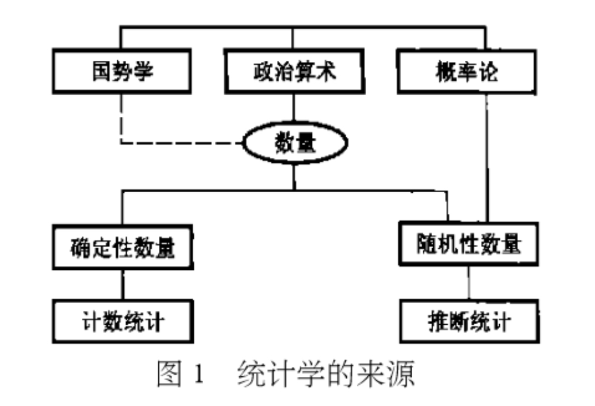
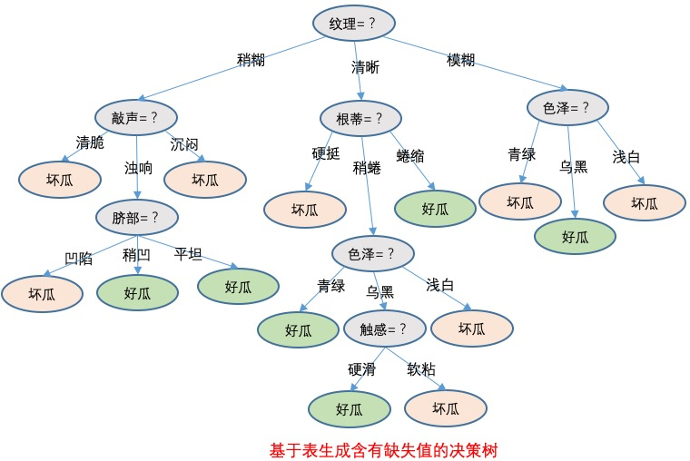

# 一、数学
## （零）数学思维

### 1.抽象思维
- 形象思维是以直观形象和表象为支柱的思维过程。例如，作家塑造一个典型的文学人物形象，画家创作一幅图画，都要在头脑里先构思出这个人物或这幅图画的画面，这种构思的过程是以人或物的形象为素材的，所以叫形象思想象维。
- 动作思维（action thinking）亦称直观动作思维。其基本特点是思维与动作不可分，离开了动作就不能思维。动作思维一般是在人类或个体发展的早期所具有的一种思维形式。
- 根据思维的形态，可以把思维分成动作思维、形象思维和抽象思维（逻辑思维）。其中抽象思维是用词进行判断、推理并得出结论的过程，又叫逻辑思维。抽象思维以词为中介来反映现实，这是思维的最本质特征，也是人的思维和动物心理的根本区别。抽象思维属于理性认识阶段。抽象思维凭借科学的抽象概念对事物的本质和客观世界发展的深远过程进行反映，使人们通过认识活动获得远远超出靠感觉器官直接感知的知识。科学的抽象是在概念中反映自然界或社会物质过程的内在本质的思想，它是在对事物的本质属性进行分析、综合、比较的基础上，抽取出事物的本质属性，撇开其非本质属性，使认识从感性的具体进入抽象的规定，形成概念。空洞的、臆造的、不可捉摸的抽象是不科学的抽象。科学的、合乎逻辑的抽象思维是在社会实践的基础上形成的。
- 并运用概念进行推理、判断的思维活动。
- 抽象思维与形象思维不同，它不是以人们感觉到或想象到的事物为起点，而是以概念为起点去进行思维，进而再由抽象概念上升到具体概念。
- 只有穿透到事物的背后，暂时撇开偶然的、具体的、繁杂的、零散的事物的表象，在感觉所看不到的地方去抽取事物的本质和共性，形成概念，才具备了进一步推理、判断的条件。
- 抽象思维不能走向极端，而必须与具体思维相结合，由抽象上升到具体。
- 不管你过去是多么地近乎本能的习惯于形象思维和抽象思维相互干扰的混合状态，你在一些相对重要得问题上必须强迫自己进行一个完整的抽象思维过程。
- 与抽象思维的定义密切相关的是分析、综合、归纳、演绎的定义。
- 分析是指用思维把事物分解为各个部分分别加以考察从而便于形成各个概念或便于确定概念间的关系的方法。归纳是指思维找出多个特殊性的具体事物的共同性的方法。综合是指思维把事物的各个部分用形成的各个概念分别代表，形成原来的整体事物的概念或确定这些各个部分的概念的关系的思维过程。演绎是指思维从事物的一般性返回到事物的具体的个别性的方法。
- 演绎推理（Deductive Reasoning）是由一般到特殊的推理方法。与“归纳法”相对。推论前提与结论之间的联系是必然的，是一种确实性推理。
- 演绎推理的形式有三段论、假言推理和选言推理等。
- 所谓演绎推理，就是从一般性的前提出发，通过推导即“演绎”，得出具体陈述或个别结论的过程。
- 抽象涉及到的第一个含义就是概念上的复杂度

## （一）微积分
### 0.历史渊源
#### （1）极限思想
- 数学分析（又称高级微积分，数学基础分支，一般指以微积分学和无穷级数一般理论为主要内容）就是用极限思想来研究函数的一门学科。数学分析中的一系列重要概念，如函数的连续性、导数以及定积分等等都是借助于极限来定义的。
- 起初牛顿和莱布尼茨以无穷小概念为基础建立微积分，之后才以极限概念作为基础。

#### （2）无穷小悖论
- 也叫“贝克莱悖论”，笼统地说，贝克莱悖论可以表述为“无穷小量究竟是否为0”的问题，就无穷小量在当时实际应用而言，它必须是0，又不是0。但从形式逻辑而言，这无疑是一个矛盾。
- 起初，微积分主要建立在无穷小分析之上，而无穷小后来证明是包含逻辑矛盾的。
- 贝克莱指责牛顿，为计算比如说 $x^2$ 的导数，先将 $x^2$ 取一个不为0的增量 $\Delta x$，由 $\Delta y=(x+\Delta x)^2-x^2=2x\Delta x+\Delta x^2$，$\frac{\Delta y}{\Delta x}$ 得到$2x+\Delta x$，最后突然令 $\Delta x=0$，求得导数为 $2x$。这是“依靠双重错误得到了不科学却正确的结果”。因为无穷小量在牛顿的理论中一会说是零，一会又说不是零。因此，贝克莱嘲笑无穷小量是“已死量的幽灵”。
- 无穷小量悖论的解决：本质上说，无穷小量悖论没有解决。用极限的定义与公式巧妙的绕过了悖论，导数并非两个无穷小量之比，而是这两个无穷小量之比的极限。无穷小量不是等于0，二是趋近于0。
- 解决：无穷小量不是0。差商 => 差商的极限

#### （3）以直代曲 线性逼近
##### 定义
##### 特点
- “以直代曲，线性逼近”是微积分的基本思想，“以直代曲”的意思就是切线可以在切点附近很好的近似曲线（拟合曲线）。
- “以直代曲”是微积分的基础，所以我们的首要任务就是要找到这个“直”，也就是切线，也就是所谓的“线性近似”。导数就是为了完成这个任务需要使用的数学工具。在一元函数中，我们把导数看做斜率，可以找到我们想要的“线性近似”（切线）。
- 微分的思想是“以直代曲”，在一点的邻域内用切线段代替曲线段，即用理想规则近似一般规则，这也是建立导数、微分模型的依据。

### 1.函数
#### （1）函数
##### 定义
##### 特点
- 函数显示输入与输出的关系，函数有三个重要部分：输入、关系、输出。
- 有多种形式描述函数，比如 $f(x)$、乘以2、$x^2$
- $f(x) = x^2$，$x$ 表示输入，$f$ 是函数的名字，$x^2$ 是输出。关系是平方，$f$ 是这个关系。
- 函数有时没有名字，例如 $y = x^2$，$x$ 是输入，平方是关系，$y$ 是输出。
- 函数可以输入一个集合的元素来输出另一个集合的元素。
- 函数的规则：要使用于所有可能的输入；每一个输入值只有一个关系，输出唯一。
- 函数是关系，关系不全是函数，假如一个输入对应多个输出，就是关系不是函数。
- 函数是两个数集间的一种特殊对应，是两个变量间的变化规律，函数的导数和定积分是函数知识的提升，它们都是特殊类型的极限，极限是研究变量在无限变化中的变化趋势，本质是静止中认识运动，有限中认识无限，量变中认识质变。导数与定积分是互逆运算。

##### 举例
#### （2）初等函数
#### （3）复合函数
#### （4）反函数
### 2.极限
#### （1）极限
##### 定义
##### 特点
- 接近于0却永远不等于0的极限状态
- 极限思想是反映一个变量与另一个已知量的一种无限逼近，然后用这个已知量代表变量的终极值。
- 极限思想成为最伟大的数学工具
- 极限反映的是无限变化过程中的终极限度

#### （2）数列极限
#### （3）函数极限
##### 定义
##### 特点
- 函数极限表现为自变量在变化过程总函数值的变化趋势
##### 举例
### 3.连续
### 4.导数
#### （1）变化量
##### 定义
##### 特点
- $\Delta$是改变量，一般不为0，所以可以写 $\Delta x \to 0$ 这样的表达式。
- 改变量就是新的值减去旧的值，自变量的改变量是 $\Delta = x_2-x_1$，因变量的改变量是 $\Delta y = y_2-y_1$，也可以是$\Delta y = f(x_2)-f(x_1)$

##### 举例

#### （2）平均变化率
##### 定义
平均变化率，是y的增量与x的增量的比，可以用来观察函数的变化速度以及函数是怎样变的。
一个函数在$x_0$处有增量$\Delta x$，则$y$也会有相应的增量$\Delta y$，那么我们就称$\Delta y$与$\Delta x$的比$\frac{\Delta y}{\Delta x}$为函数$f(x)$在$x_0$处增量为$\Delta x$的平均变化率。
##### 特点
- 我们可以利用平均变化率的知识，求出一个股票在某一时间段内的平均变化率，从而了解股票的趋势以及未来的走势。
- 导数其实就是平均变化率在增量趋于 0 时的极限。导数可以理解为当 $\Delta x \to 0$ 时，平均变化率的极限，也就是$\lim\limits_{\Delta x \to 0}\frac{\Delta y}{\Delta x}$

##### 举例
1.一般地，函数 $f(x)$ 在区间 $[x_1,x_2]$ 上的平均变化率 $\frac{f(x_2)-f(x_1)}{x_2-x_1}$。平均变化率是曲线陡峭程度的“量化”，曲线陡峭程度是平均变化率的“可视化”。

#### （3）瞬时变化率（导数）
##### 定义
如果当 $\Delta x \to 0$ 时，$\frac{\Delta y}{\Delta x}$有极限，我们就说函数 $y=f(x)$ 在点 $x_0$ 处可导，这个极限叫做 $f(x)$ 在点 $x_0$ 处的导数（即瞬时变化率，简称变化率）。
##### 特点
- 可以通过减小自变量的改变量，用平均变化率“逼近”瞬时变化率。
- 可以用 $f(x_0+\Delta x)-f(x_0)$ 除以 $\Delta x$ 来计算瞬时变化率。
- 平均变化率是曲线上两点割线的斜率，瞬时变化率是曲线上一点切线的斜率。

##### 举例

#### （4）导数
##### 定义
##### 特点
- 导数，也叫导函数值，又名微商。
- 一个函数在某一点的导数描述了这个函数在这一点附近的变化率。
- 导数全是关于改变的，导数表达在任何一点的改变速度（变化率）。
- 导数可以用莱布尼茨记法表示：$\frac{dy}{dx}$
- 两点平均变化率：$\frac{\Delta y}{\Delta x}$。一点处瞬时变化率：让$\Delta \to 0$，但不是0，趋近0称为 $dx$，即无穷小。同样，$\Delta y$ 变成无穷小，称为 $dy$。结果就是 $\frac{dy}{dx}$
- 两点的平均变化率可以用$\frac{\Delta y}{\Delta x}$ 表示，但是一点处的变化率怎么表示，可以让$\Delta \to 0$，即$dx$。
- 无穷小思维和极限思维求导数
- “xxx的导数”可以写成 $\frac{d}{dx}$，例如 $x^2$ 的导数写成 $\frac{d}{dx}x^2$。
- $f'(x)$ 也是导数的另一个写法，例如 $f'(x) = 2x$ 表示 $f(x)$ 的导数等于 $2x$。
- 导数可以写成 $\frac{dy}{dx}$
- 函数 $y=f(x)$ 在 $x_0$ 处可导，则它在 $x_0$ 处连续，反之不然。
- 导数是差商的极限，$f'(x_0)=\lim\limits_{x \to x_0} \frac{f(x)-f(x_0)}{x-x_0}$

#### （5）微分
##### 定义
$df(x_0)=f'(x_0)(x-x_0)=f'(x_0)dx$
##### 特点
- 导数刻画函数在所考察的点处的变化速度，而微分则提供了函数在所考察的点的邻域内的最佳线性近似。
- 导数与微分是两个不同的概念，但函数可导与函数可微又是等价的，可以不加区分。
- 函数 $f(x)$ 在 $x_0$ 可导（可微），则 $f(x)$ 必有一次逼近。

#### （6）导数与微分
- 微分的计算可以转换为计算导数的实现；同样，导数的计算也可以通过微分来计算。
- 导数与微分是数学家创造的两个代数工具，是为了从代数的角度来描述函数图像在几何上的变化。说白了，就是每次描述函数图像变化，不用再画图了，直接用算式计算就行了。导数与微分是沟通几何和代数的重要桥梁。导数描述的是函数在一点处的变化率，微分描述的是函数从一点到另一点的变化幅度，是一个变化的量。$dy=f'(x)dx$，$dy$ 是一个变化量，是关于导数线性的？
- 描述变化快慢看导数，描述变化多少看微分。

#### （7）方向导数
- 函数在 A 点无数个切线的斜率的定义。每一个切线都代表一个变化的方向。

#### （8）梯度
- 函数在 A 点无数个变化方向中变化最快的那个方向。

#### （9）全微分
- 函数从 A 点到 B 点变化的量（其实是一个取无穷小的变化的量）

#### （10）偏导数
- 多元函数降维时候的变化，固定一个维度研究另一个维度的变化。
- 可不是多个切线中的一个切线方向。是要固定一个维度。

### 5.微分
### 6.一元微分学
#### （1）数列的极限
#### （2）函数的极限
#### （3）函数的导数
#### （4）闭区间上连续函数的性质
#### （5）无限小增量公式
#### （6）有限增量公式
#### （7）函数局部行为研究
#### （8）函数全局行为研究
### 7.一元积分学

## （二）概率论

概率论符号表

符号|含义|备注
-|-|-
E|试验|试验含义广泛，可以是科学实验，可以是对某个事物的某个特征的观察
S|样本空间|一个集合，样本点的集合，试验E的所有可能的结果组成的集合，如试验掷骰子的样本空间为{1,2,3,4,5,6}
A|事件|一个集合，试验结果的集合，样本点的集合，样本空间的子集，试验的某些结果组成的集合，如试验掷骰子掷得奇数这个事件{1,3,5}。这个子集中的一个样本点出现，称事件A发生
$A\subset B$|事件B包含A
A = B|事件A等于事件B
$A \cup B$|和事件|事件A与事件B的和事件，当A或B有一个事件发生时，事件 $A\cup B$ 发生
$A\cap B$（AB）|积事件|事件A与事件B的积事件，A与B同时发生时，事件$A\cap B$发生
$\overline A$|互逆事件，对立事件|$A \cup B=S,A\cap B=\emptyset$，事件A与B必有一个发生，且仅有一个发生
P(A)|事件A的概率，函数，离散模型的事件的概率由包含的各个试验结果的概率确定
$P(A\cup B)$||事件A、B至少发生一个的概率
$P(A\cup B)=P(A)+P(B)$|概率的有限可加性|前提是，A与B是不相容的事件，即$A\cup B=\emptyset$
$P(A\cup B)=P(A)+P(B)-P(AB)$|概率的$\red{加法公式}$|没有前提，任意两个事件A、B
$P(A\cap B)或P(AB)$|联合概率|事件A、B同时发生的概率
$P(A\cap B)=P(AB)=P(A)P(B)$|A、B同时发生的概率|前提，事件A、B相互独立。事件A对事件B的发生没有影响，反之亦然
$P(A\cap B)=P(AB)=P(A)P(B\|A)$|概率的$\red{乘法公式}$|前提，事件A、B不是相互独立。事件A对事件B的发生有影响
P(B\|A)|条件概率|事件A已发生的条件下事件B发生的概率。事件A对事件B发生的概率有影响
X|随机变量|是函数，是自变量，是样本点的映射，是随机试验的试验结果，或者随机试验的样本空间中的样本点或样本点集合（事件）在实数范围内的映射。是对事件的量化
### 0.概率论发展
概率论有三种不同的解释：古典概率、频率概率、主观概率。
### 1.概率论基础概念
#### ➤➤➤集合➤➤➤
#### （1）集合
将一些研究对象放在一起，形成集合。
- 概率论大量应用集合运算。

##### 记法
若 S 包含有限个元素 $x_1,x_2,...,x_n$，我们只需将这些元素包含在花括号中，$S = \{x_1,x_2,...,x_n\}$

我们也可以以 x 具有某种性质 P 为条件来刻画一个集合，记作 {x|x 满足性质 P}。如 $\{x|0\leq x \leq 1\}$

#### （2）集合元素
集合中的对象称为元素。
记号：x 是 S 的元素，我们将元素和集合的这种关系写成 $x\in S$，若 x 不是 S 的元素，就写成 $x\notin S$。

#### （3）空集
一个集合可以没有元素，这个特殊的集合称为空集，记作 $\emptyset$。

#### （4）子集
若集合 S 的所有元素均为集合 T 的元素，就称 S 为 T 的子集。记作 $S\subset T$

#### （5）空间
将我们感兴趣的所有元素放在一起，形成一个集合，这个集合称为空间。记作 $\Omega$

#### （6）集合运算
##### 补集
集合 $\{x\in \Omega|x\notin S\}$称为集合 S 相对于 $\Omega$ 的补集。
##### 并集
由属于 S 或属于 T 的元素组成的集合称为 S 和 T 的并，记为 $S\cup T$，$S\cup T = \{x|x\in S 或 x\in T\}$。
##### 交集
既属于 S 又属于 T 的元素组成的集合称为 S 和 T 的交，记为 $S\cap T$，$S\cap T$，$S\cup T = \{x|x\in S且x\in T\}$。
##### 无穷个集合并
$$\bigcup_{n=1}^{\infty}S_n = S_1\cup S_2\cdots =\{x|x\in S_n 对某个n成立\}$$

##### 无穷个集合交
$$\bigcap_{n=1}^{\infty}S_n = S_1\cap S_2\cdots = \{x|x\in S_n 对一切n成立\}$$

#### （7）韦恩图
集合及其运算可用韦恩图形象化表示。

#### （8）有序对
设 x 和 y 为两个研究对象，我们用 (x,y) 表示 x 和 y 的有序对。

#### （9）实数集合
我们用 R 表示实数集合，用 $R^2$ 表示实数对的集合，即二维平面。用 $R^3$ 表示三维实数向量的集合（三维空间）。

#### ➤➤➤试验➤➤➤
#### （10）随机试验
试验作为一个含义广泛的术语，可以是科学试验，也可以是对某一个事物的某一特征的观察。用 E 表示试验，例如掷骰子试验 E。

将具有以下三个特点的试验称为随机试验
- 1.可以在相同的条件下重复地进行
- 2.每次试验的可能结果不止一个，并且能事先明确试验的所有可能结果
- 3.进行一次试验之前不能确定哪一个结果会出现。

#### （11）随机现象
在个别试验中其结果呈现出不确定性，在大量重复试验中其结果又具有统计规律性的现象，我们成为随机现象。概率论与数理统计是研究和揭示随机现象统计规律性的一门数学学科。

我们是通过研究随机试验来研究随机现象的 。

#### ➤➤➤样本➤➤➤
#### （12）样本空间
试验的所有可能结果组成的集合是已知的，将随机试验 E 的所有可能结果组成的集合称为 E 的样本空间，记为 S。例如掷骰子的样本空间为：S = {1,2,3,4,5,6}

样本空间是样本点的集合。

#### （13）样本点
样本空间的元素，即 E 的每个结果，称为样本点。

#### ➤➤➤事件➤➤➤
#### （14）随机事件
我们称试验 E 的样本空间 S 的子集为 E 的随机事件。记为A，如掷骰子掷得奇数的事件 A = {1，3，5}

事件是集合，样本点的集合。

#### （15）事件发生
当且仅当事件中的一个样本点出现时，称这一事件发生。

#### （16）基本事件
由一个样本点组成的单点集，称为基本事件。

#### （17）必然事件
#### （18）不可能事件
#### （19）事件间的关系与事件的运算
事件是一个集合，因而事件间的关系与事件的运算按照集合论中集合之间的关系和集合运算来处理。
- 子集
- 包含
- 相等
- 和事件：$A\cup B=\{x|x\in A或x\in B\}$称为事件 A 和 事件 B 的和事件，当A、B中有一个样本发生时，事件 $A\cup B$发生。
- n个事件的和事件：$$\bigcup_{k=1}^nA_k为n个事件A_1,A_2,...,A_n的和事件$$
- 可列个事件的和事件：
$$\bigcup_{k=1}^{\infty}A_k为可列个事件A_1,A_2,...的和事件$$
- 积事件：$A\cap B=\{x|x\in A且x\in B\}$称为事件 A 与 事件 B 的积事件，当且仅当A、B同时发生时，事件$A\cap B$发生，也记作 AB。
- 和事件：$A\cup B=\{x|x\in A或x\in B\}$称为事件 A 和 事件 B 的和事件，当A、B中有一个样本发生时，事件 $A\cup B$发生。
- n个事件的积事件：$$\bigcap_{k=1}^nA_k为n个事件A_1,A_2,...,A_n的和事件$$
- 可列个事件的积事件：
$$\bigcap_{k=1}^{\infty}A_k为可列个事件A_1,A_2,...的和事件$$

#### （20）差事件
事件$A-B=\{x|x\in A 且 x\notin B\}$称为事件 A 与事件 B 的差事件。当且仅当 A 发生、B不发生时事件 A-B 发生。

#### （21）互斥事件
若 $A\cap B=\emptyset$，则称事件 A 与 B 是互不相容的，或互斥的，即事件 A 与事件 B 不能同时发生。

#### （22）对立事件（互逆事件）
若 $A\cup B=S，且A\cap B=\emptyset$，则称事件 A 与事件 B 互为逆事件，又称事件 A 与事件 B 互为对立事件。对每次试验而言，事件A、B必有一个发生，且仅有一个发生。A的对立事件记为 $\overline A$，$\overline A=S-A$

#### （23）事件运算
事件运算，即集合运算
- 交换律
- 结合律
- 分配律
- 德摩根律

#### ➤➤➤概率➤➤➤
#### （24）试验次数
重复试验次数 n
#### （25）频率
频率：表征事件在一次试验中发生的可能性的频繁程度。

定义：
在相同的条件下，进行了 n 次试验，在这 n 次试验中，事件 A 发生的次数 $n_A$ 称为事件 A 发生的频数，比值 $n_A/n$ 称为事件 A 发生的频率，并记成$f_n(A)$

#### （26）频率的性质
- $0\leq f_n(A)\leq 1$
- $f_n(S)=1$
- 若$A_1,A_2,...,A_k$是两两互不相容的事件，则 $f_n(A_1\cup A_2\cdots A_k)=f_n(A_1)+f_n(A_2)+\cdots +f_n(A_k)$

当重复试验的次数 n 逐渐增大时，频率 $f_n(A)$ 呈现出稳定性，逐渐稳定于某个常数，这种“频率稳定性”即通常所说的统计规律性。

但是，在实际中，我们不可能对每一个事件都做大量的试验，我们从频率的稳定性和频率的性质得到启发，给出表征事件发生可能性大小的概率的定义。

#### （27）概率
概率：表征事件在一次试验中发生的可能性的大小的数。

- 逆概率
- 互斥：A、B不可能同时发生
- 对立：A、B不可能同时发生，必有一个发生
- 独立：A、B发生互不影响
- 条件：A、B发生有影响

##### 定义：
设 E 是随机试验，S 是它的样本空间，对于 E 的每一个事件 A 赋予一个实数，记为P(A，称为事件的概率。
- 频率，概率都是函数。

##### 概率的性质
- 1.$P(\emptyset)=0$
- 2.有限可加性，若$A_1,A_2,...,A_n$ 是两两互不相容的事件，则 $P(A_1\cup A_2\cup \cdots \cup A_n)=P(A_1)+P(A_2)+\cdots+P(A_n)$
- 3.逆事件概率：$P(\overline A)=1-P(A)$
- 4.概率的加法公式：对于任意两事件A、B，有$P(A\cup B)=P(A)+P(B)-P(AB)$

#### （28）概率律（概率定律）
没有规律的过程却从大体上呈现有规律性。由四条概率定律组成：
- 概率第一定律： 
概率是0到1之间任何一个数字，数字越大，概率越高。当数字为1时，表明该事件绝对会发生。当数字为0时，表明该事件绝对不会发生。
- 概率第二定律： 
互斥事件：如果A和B是相互独立的事件（A、B互斥，即事件A、B不可能同时发生），那么P(A+B)=P(A)+P(B)
- 概率第三定律： 
对立事件：A、B对立，即事件A、B不可能同时发生，但A、B必然有一个发生，计算公式P(A)+P(B)=1，P(A)=1-P(B),$P(\overline A)=1-P(A)$
- 概率第四定律： 
互相独立事件：一个事件 A 是否发生对另一个事件 B 发生的概率没有影响。P(AB)=P(A)P(B)

##### 概率公理
- 非负性 
对于一切事件A，满足 P(A>=0
- 可加性 
设A、B为两个互不相容的集合（概率论中称为互不相容的是事件），则它们的并满足 $P(A\cup B)=P(A)+P(B)$，更一般地，$P(A_1\cup A_2\cup ...)=P(A_1)+P(A_2)+...$
- 归一化 
整个样本空间 $\Omega$ 的概率为1，即 $P(\Omega)=1$

为了将概率定律形象化，可以把样本空间中的试验结果看成质点，每一个质点有一个质量，P(A) 就是这个质点的质量，全空间的总质量为1。

#### （29）概率模型
概率模型是对不确定现象的数学描述。概率模型的两个构成：
- 样本空间：$\Omega$，这是一个试验的所有可能结果的集合。
- 概率定律：没有规律的过程却从大体上呈现有规律性。概率定律为试验结果的集合或者也叫事件A确定一个非负数P(A)（称为事件A的概率）。而这个非负数刻画了我们对事件Ade认识或所产生的信念的程度。

- 概率模型用来刻画样本空间中的试验结果。

#### （30）序贯模型
#### （31）离散概率模型
##### 离散概率定律
设样本空间由有限个可能的结果组成，则事件的概率可由组成这个事件的试验结果的概率所决定，事件 $\{s_1,s_2,...,s_n\}$ 的概率是 $P(s_i)$ 之和，即
$$P(\{s_1,s_2,...,s_n\})=P(s_1)+P(s_2)+...+P(s_n)$$
此处 用简单的记号 $P(s_i)$表示事件 $\{s_i\}$的概率，而不用正式的符号 $P(\{s_i\})$

#### （32）离散均匀概率定律（古典概型）
设样本空间由 n 个等可能性的试验结果组成，因此每个试验结果组成的事件的概率是相等的，$$P(A)=\frac{含于事件A的试验结果数}{n}$$

#### （33）连续模型
- 若试验的样本空间是一个连续集合，其相应的概率律于离散情况有很大的差别。
- 在离散情况下，基本事件的概率就可以确定概率律
- 将离散模型中的等概率模型推广到连续的情况

### 2.随机变量及其分布

##### 为什么要引入随机变量
- 为了能对更复杂的问题进行抽象建模，进行定量的概率公式化处理，因此，通过引入随机变量，将样本空间这个集合概念转化为一个无量纲的数集，使得能统一地处理各种随机现象。（函数化）
- 引入随机变量的好处主要有两点：一是可用随机变量的不同取值代表不同的事件，比起用A、B、C、D等符号方便很多。二是可以进行综合分析，比如求和、均值等。
- 引入随机变量可以量化随机事件
- 随机变量的概念是概率论中一个极为重要的基本概念
- 随机变量及其分布函数是概率论中的核心概念，它们将”随机试验中关于随机现象及其统计规律性的研究“投射为”实数集中关于随机变量的概率分布的研究“，这样一来我们就可以通过研究随机变量来研究随机现象
- 随机变量就是一个函数，自变量是样本点，定义域是样本空间。值域是实数
- 随机取值的因变量X 为随机变量。大量试验中样本点呈现出的统计规律性决定了 X 在其值域中的取值也具有统计规律性，称之为 X 的概率分布。
  

#### 随机变量
##### 定义
设随机试验的样本空间为 $S=\{e\}$，$X = X(e)$ 是定义在样本空间 S 上的实值单值函数，称 $X=X(e)$为随机变量。

- 在许多概率模型中试验结果是数值化的，例如许多仪器的仪表盘的读数以及股价等。也有其他一些例子中的试验结果不是数值化的，但是这些试验结果与某些数值相联系，例如，从某个群体中选择学生，我们希望了解每位学生的平均学分，当我们讨论这些数字的时候，通常给这些数字确定概率。我们可以通过随机变量实现这个任务。
- 假设在某个试验中，所有可能的试验结果构成一个样本空间。对于样本空间中的每一个可能的试验结果，关联着一个特定的数，这种**试验结果与数的对应关系形成一个随机变量**。将试验结果所对应的数称为随机变量的取值。
- 随机变量是一个函数，随机变量是试验结果的一个实值函数。
- 随机变量是因变量，是样本点的映射，样本空间中样本点在实数上的映射。

#### 随机变量的取值

## （三）统计学
### 1.统计学发展

#### ➤➤➤古典统计学➤➤➤
17世纪中叶~18世纪中叶，这是统计学的创立时期。
#### （1）国势学派
又称记述学派，由于该学派主要以文字记述国家的显著事项，故称记述学派。
- 该学派在进行国势比较分析中，偏重事物性质的解释，而不注重数量对比和数量计算。

#### （2）政治算术学派
这里的政治是指政治经济学，算术指统计方法。注重数量对比和数量计算。注重从数理角度探讨社会经济现象规律的活动。标志着统计学的诞生。不同于记述手段，明确地用大量的数据资料分析问题，试图把研究结论建立在可靠的事实基础上。

统计研究方法是数量性质的，主要以数字资料为语言，通过对数字资料的分析探讨客观现象发展变化的规律。

统计学产生之初，主要是为研究社会经济问题。

#### ➤➤➤近代统计学➤➤➤
18世纪末~19世纪末
#### （1）数理统计学派
- 数理统计学派产生于19世纪中叶，它是在概率论已有相当发展的基础上，把概率论引进统计学而形成的。促进了统计学的研究手段由”算术“阶段向”数理“阶段的迅速转变，是统计学发展成为一门既适用于自然科学又适用于社会科学的通用方法论。
- 奠基人是凯特勒，主张用研究自然科学的方法研究社会现象。最先用大数据定律论证了社会生活现象纷繁复杂变化的偶然性中存在着一定的规律性，并提出了**误差理论**，在方法论方面解决了统计观测的准确性问题。
- 由于历史局限性，凯特勒在研究社会问题过程中混淆了自然现象和社会现象的本质区别。
#### （2）社会统计学派
19世纪后半叶，社会统计学派以德国为中心，认为统计学是研究社会总体而不是个别的社会现象，认为由于社会现象的复杂性和整体性，必须对总体进行大量观察和分析，研究其内在联系，才能揭示现象内在规律，这是社会统计学派的实质性科学的显著特点。

#### （3）统计方法
社会经济的发展，要求统计学提供更多的统计方法，向方法论转换。
#### （4）描述统计
高尔顿、皮尔逊为代表的，共同创立了描述性统计的基本体系。

#### ➤➤➤现代统计学➤➤➤
20世纪初迄今。

- 数理统计学由于广泛用于自然科学和工程技术而获得快速发展。首先，它**在随机抽样的基础上建立了推断统计的理论和方法**。
- 随着数学发展，数理统计学越来越广泛的应用数学方法
- 出现了数理统计学新分支和以数理统计为基础的边缘学科，如抽样理论、非参数估计、多变量分析、时间序列分析，经济计量学、工程统计学
- 数理统计学称为现代统计学的主流派。社会统计学发展缓慢，且由实质性科学向方法论转变。

#### （1）推断统计
通过随机样本来推断**总体数量特征**的方法。

#### （2）统计假设理论
#### （3）决策理论
将统计雪中的估计和假设理论加以归纳，创立了决策理论。
#### （4）样本分布理论
#### （5）试验设计的理论和方法

#### （6）概率论
柯尔莫哥洛夫把勒贝格测度引入概率论研究，使人们第一次清楚地认识到现代统计学的继承--概率论原来也是数学大家庭的一员。
#### （7）t分布
t分布，揭开了小样本统计推断研究的序幕。有的实验不能多次重复进行，必须依据少量观察做出结论，比如有些化学实验、生物学实验，它们也应该成为统计学的研究对象。
#### （8）统计方法论
#### （9）经典统计学
所谓经典统计学是以内曼和皮尔逊为代表，以频率思想为基础、以置信推断为基本特征的统计学。
#### （10）贝叶斯统计学
指以贝叶斯公式为核心、以先验信息和后验信息为综合依据、以辩证推断为主要特征的统计学。

#### ➤➤➤大数据统计学➤➤➤
#### （1）大数据
所谓大数据就是一个大的样本和数据集合，通过某些样本的问题，利用统计学来进行抽样分析，达到需要的精度，由于有些问题维数高，需要通过统计学原理来降维，压缩以及分解。
#### （2）数据预处理

### 2.统计思维
任何科学研究，无论是自然科学还是社会科学，都是试图回答休谟诘问：如何从经历到的过去、特殊、局部，推论到没有经历到的未来、一般、整体？都遵循以下过程，首先是关于偶然的、个别的、特殊的现象的观察；其次是从对偶然的、个别的、特殊的现象的观察中，提出假说，或者说理论，或者是模型，这些假说是关于必然、一般、普遍现象而言的；然后对假说进行检，检验方法一般包括实验的方法、预测的方法和回归的方法；最后是发现，关于必然、一般、普遍的规律的发现。

### 3.统计学基本概念
#### （1）小数据
- 小数据是样本数据。小数据是是因为回答特定问题，通过传统抽样调查方式获得的数据，小数据是基于抽样调查技术而建立的数据收集、存储、传输、处理的安全系统，抽样调查时小数据的本质特征。
- 小数据来源于实验室，来自于被测试者（样本）的调查
- 数据体量小且通过传统抽样方式采集的数据就是小数据
- 小数据是围绕不同个体的人而采集的相关兴趣爱好
- 大数据重相关关系的发现，小数据则有利于发现因果关系，因为小数据是在海量数据下根据特定需要有针对地提供个性化服务或寻找因果关系的依据

#### （2）大数据
- 不是随机样本，而是全体数据。（在一定条件下的全体数据，大数据并不一定等同于总体数据）
- 不是精确性，而是混杂性
- 不是因果关系，而是相关关系

样本、总体、参数、估计、特征等等、回归、中位数、似然函数、矩估计、卡方分布
#### （3）统计学是什么
>统计学是收集、分析、展示和解释数据的科学。
- 统计学有两个大的分类，数理统计学和应用统计学，一个偏理论一个偏应用。应用统计学分为描述性统计学和推断性统计学，分别对应数据分析和数据挖掘。
- 统计学起源于收集数据的活动
- 统计学研究客观现象的数量方面，数量包括确定性数量和随机性数量，对一个问题，可用确定的数量方法进行认识，也可以把它转化为随机性数量来研究，而统计学研究随机性数量，主要依靠概率论。所以概率论是统计学的第三个来源。
- 描述性统计学和推断统计学的争论，构筑了统计学的完整体系

#### （4）科学研究
科学研究的方法是：观测世界或进行试验，得到数据，提出可以解释这些观测的假说或理论，试图尽可能地接近现实世界的规律。

当出现理论或假说无法解释的现象（数据）时，就有可能需要对原有理论进行修正或者代之以新理论。

试验-->数据-->假说-->分析评估结论-->重复

#### （5）试验
#### （6）数据
#### （7）假说/模型
统计学的假说或理论称为模型。
- 统计学的模型仅仅是对现实的仅是，没有任何模型是”正确“的，也无法证明任何模型是正确的。
- 在数学逻辑中存在的确定性在统计中完全不成立。
- 能否解决实际问题是评价统计方法的最终标准。

#### （8）分析结论（假说）
评估结论的可信度

#### （9）总体回归模型
计量经济学模型方法说到底就是回归分析方法。任何一项计量经济学应用研究课题，首先也是最重要的工作是设定总体回归模型。只有设定了正确的总体回归模型，才能通过严格的数学过程和统计推断，得到正确的研究结果。因此，它决定了应用研究的成败。
$$Y=f(X)+\mu=\beta_0+\beta_1X+\mu$$

总体回归模型与样本回归模型不同点：
- 描述对象不同 
总体回归模型描述总体中变量 y 与变量 x 的相互关系，而样本回归模型描述所观测的样本中变量 y 与 x 的相互关系。
- 建立的模型不同 
总体回归模型是依据总体全部观测资料建立的，样本回归模型是依据样本观测资料建立的。
- 模型性质不同 
总体回归模型不是随机模型，样本回归模型是随机模型，它随着样本的改变而改变。

#### （10）总体回归函数（方程）
$$E(Y|X) = f(X) = \beta_0 + \beta_1X$$
#### （11）样本回归模型
$$Y=\hat Y+\hat\mu=\hat{\beta_0} + \hat{\beta_1}X+\epsilon$$
#### （12）样本回归函数（方程）
$$\hat Y = \hat{\beta_0} + \hat{\beta_1}X$$
#### （13）随机干扰项
随机干扰项，又称随机误差项、随机扰动项，指不包含在模型中的解释变量和其他一些随机因素对被解释变量的总影响项。随机干扰项包括：模型中省略的对被解释变量不重要的影响因素（解释变量）；解释变量和被解释变量的观测误差；经济系统无法控制、不易度量的随机因素。将随机误差项引入模型，是计量经济学和数理经济学的根本区别。
- 随机干扰项不是一个固定的值，而是一个变量。与截距的区别。截距称之为参数，随机项可不是参数。
- 模型数学形式的误差，如用线性模型近似非线性经济关系，不属于随机误差。
- 随机项反映了未纳入模型中的其他各种因素的影响
- 计量经济模型就是由有关的变量、相应的参数、随机干扰项组成的数学表达式，借以反映经济变量之间的因果相关关系。

#### （14）残差
- 用残差 $e$ 去估计随机干扰项 $\mu$。
- 随机误差项（随机干扰）标识总体模型的误差，残差标识样本模型的误差。
- 随机误差项：观察值 $y_i$ 与条件期望 $E(Y|X_i)$ 的差
- 残差：观察值 $y_i$ 与估计值（样本条件均值）$\hat {y_i}$的差

#### （15）均值回归
## （四）计量经济学
数理统计、计量经济学、机器学习异同
[!计量经济学与机器学习](https://www.zhihu.com/question/294293951)
[!统计学与计量经济学](https://www.zhihu.com/question/24622808)
### 1.概念
#### （1）经验分析
经验分析就是利用数据来检验某个经济理论或者估计变量之间某种经济关系。
#### （2）经验分析步骤（建模步骤）
- 1.建立模型或者确定变量之间的经济关系 
经济学模型是以方程的形式建立的，方程主要用于描述经济和相关变量的行为，所建立的模型可以是一个方程或者是包含若干方程的系统。
模型建立依据：可以依据经济理论建立经济模型；可以从经验或者常识出发建立描述经济行为的经济模型。

- 2.收集数据 
- 3.估计模型参数 
- 4.假设检验 
- 5.解释结果 

## （五）线性代数

# ————————————————————

# 二、机器学习

机器学习符号表

符号|含义|备注
-|-|-
m|样本大小|
h|函数或者模型|模型，假设
x|标量值
$\mathbf{x}$|向量
D|数据集
y|实际值
$\hat y$|预测值
$\pmb{X}$|矩阵
$\mathrm{X}$|随机变量
$\mathcal{X}$|训练样本
\|x\||x的绝对值，向量x的长度，集合x的势（集合的元素个数）

## （一）机器学习基础
### 1.什么是机器学习
- 机器学习就是让机器具备找一个函数的能力。找到一个函数以后，就能处理输入产生输出。语音识别：$f(声音)=“how are you”$。图像识别：$f(图片)=“cat”$。不同的函数类型：回归Regression，输入数字，输出是一个数值。分类Classification，输入类别，输出类别。生成Strucured Learning，生成图片，文档。如何寻找函数。首先依据领域知识假设一个f。

### 2.机器学习基础概念
#### （1）机器学习
机器学习是一种基于已知数据，根据假设模型，训练得到一个确定函数的过程。在得到确定函数之后，输入新的数据，输出预测结果。
##### 按预测属性类型
- 分类任务
- 回归任务

##### 按学习方式
- 监督学习 
- 无监督学习
- 半监督学习
- 强化学习

#### （2）向量
默认是列向量。
#### （3）属性/特征
特征，也叫属性。在数据中的表现形式为数据集的一列，一个特征表示一列数据。
##### 符号
我们可以用上标表示属性，例如 $x^1,x^2,...,x^d$，我们可以用双下标表示属性，例如用 $x_{i1},...,x_{id}$ 表示某一个样本的属性 1,...,d。
#### （4）属性值/特征值
表示特征的具体取值
#### （5）属性空间/样本空间
##### 定义
特征的所有可能取值组成的集合。如果特征是一维的，则特征空间是一个向量，如性别的取值组合是[0,1]。如果特征是多维的，则特征空间是多维度的集合，如一个人有性别和国籍组合，特征空间表示为[[0,1],[China,Japan,Korea,America]]。属性张成的空间，称为属性空间或样本空间。例如西瓜书中我们把“色泽”、“根蒂”、“声响”作为三个坐标轴，把他们张成一个用于描述西瓜的三维空间，每个西瓜都可以在这个空间中找到自己的坐标位置，由于空间中的每个点对应一个坐标向量，因此我们也把一个示例称为一个“特征向量”。
#### （6）样本/特征向量
##### 定义
样本，又叫记录、实例，不包括标签。具体是指一个事物的各个具体属性描述。
##### 符号
样本一般用特征向量表示，比如第 j 条样本：$\mathbf{x_j} = (x_j^1,x_j^2,...,x_j^d)^T$。
该样本有 d 维，第 j 个样本的第 i 个特征值为 $x_j^i$。
#### （7）样本空间/属性空间
#### （8）标签
在有监督学习中，标签是我们要预测的变量，如 y 变量。在已知的数据集中，目标列称为标签label。它可以在模型学习过程中进行指导。
#### （9）标签值
标签值是标签的具体取值。
#### （10）标签空间
标签所有可能的取值组成的集合。
#### （11）样例
##### 定义
样本和标签组成一个样例，即拥有了标签的实例，称为样例。
##### 符号
$(\mathbf{x}_j,y_j)$，其中$\mathbf{x}_j = (x_j^1,...,x_j^d)^T$
#### （12）样例空间
#### （13）数据集
样例的集合。
##### 符号
我们用大写字母 $D$ 表示数据集，数据集是一个集合，$D = \{(\mathbf{x}_1,y_1),(\mathbf{x}_2,y_2),...,(\mathbf{x}_m,y_m)\}$
数据集分为：
- 训练集 
训练集用于训练和确定模型参数。
- 验证集 
验证集用于模型选择，帮助选出最好的模型。
- 测试集 
测试集用于评估模型，测试模型用于新样本的能力（即泛化能力）。模型在训练集表现好并不能说明全部问题，在测试集表现好才是好的模型。

#### （14）模型/假设
##### 定义
模型（model），带有未知参数（unknown parameter）的函数（function），一组函数，函数集合，模型也叫假设（hypothesis）。机器学习一开始一般都需要假设一个模型来拟合数据。
##### 符号

#### （15）参数
#### （16）训练
当我们有了一个假设模型之后，我们要基于数据集训练出一个函数（求参数），这个函数能够很好地映射输入（自变量）和输出（因变量）的关系。
#### （17）函数

#### （18）真相
数据中真正存在的潜在规律
#### （19）假设
学习模型对应了关于数据的某种潜在规则

#### （6）收敛
- 收敛是一个数学名词，是研究函数的一个重要工具，是指汇聚于一点，向某一值靠近。收敛类型有收敛数列、函数收敛、全局收敛、局部收敛。
- 在数学分析中，与收敛相对的概念就是发散。收敛与发散判断方法简单来说就是有极限（极限不为无穷）就是收敛，没有极限就是发散。简单来说就是看极限是否存在。
- 一个迭代算法（迭代是循环的一次执行），随着迭代的进行，输出越来越接近一些特定值就是收敛。
- 机器学习模型不收敛的直观体现是loss函数无法下降。不论是loss值一直大幅震荡还是loss值一直居高不下，都表示模型不收敛。
3.领域知识
4.参数
weight，bias
5.loss损失函数
损失函数 $L(b,w)$ 是关于参数的函数。输入是模型model里的参数，输出是
6.估测值 $y$
7.真实值 $\hat y$

### 3.评价指标

## （二）数据处理
## （三）机器学习模型
### 1.回归分析
- 回归分析是确定两种或两种以上变量间（因变量也可能是多个变量）相互依赖的定量关系的一种统计分析方法，是一种预测性的建模技术，它研究的是因变量和自变量之间的关系，例如中国人的消费习惯对美国经济的影响等。其又分为线性回归分析和非线性回归分析。
- 回归分析是广泛使用的统计分析方法，可以用于分析其中一方对另一方的影响关系，也可以分析自变量对因变量的影响方向（正向影响还是负向影响）。
- 回归分析是通过建立因变量Y和影响它的自变量$X_1,...,X_n$ 间的回归模型，衡量自变量 $X_i$ 对因变量的影响能力，进而用来预测因变量的发展趋势。回归分析模型包括线性回归和非线性回归两种。线性回归又分为简单线性回归、多重现性回归。非线性回归需要通过对数转化等方式，将其转化为线性回归的形式进行研究。

#### ➤➤➤ 渊源 ➤➤➤
#### （1）高尔顿
- 相关和回归分析的创始人
- 发现父亲的身高和儿子的身高之间存在着某种给定的关系：事实上子辈的平均身高是其父辈平均身高以及他们所处族群平均身高的加权平均和。
- 高尔顿回归的不足，没有引入控制变量。从结果上来看，回归模型更像是显示了两个变量的统计关联度，而非因果关系。
- 向平均回归：人类的身高从高矮两个极端移向所有人的平均值。
#### （2）高尔顿谬误
如果人类的身高一代又一代都向中等平庸回归，那么人类的身高必将趋于相等。而在经济学上也有相同的谬误，经济发展水平较低的国家和地区将会有较高的经济增长率，而经济发展水平较高的国家和地区则只有较低的经济增长率。而现实是世界各国之间的经济发展的差距并没有缩小。为什么看上去合理的假设过程导出的结论却是谬论呢？是因为各人身高的长成是一个充满了偶然的、随机的、不确定因素的过程，虽然各人的身高主要决定于父母的遗传基因，但是在生命的形成过程中却充满了各种各样的机会变异，这些机会变异对各人身高的决定也有相当的作用。高尔顿发现的人类身高”向中等平庸回归“的现象，纯粹是由于机会变异所产生的回归效应所致，它并不会导致人类升高趋于相同。

以上机会变异就是扰动项，也就是误差？现实世界是充满机会变异和不确定性的世界，不能完全用想象的确定性世界的思维模式来进行思考和决策。

#### （3）控制变量
实验中主要涉及三种变量：自变量、因变量和控制变量。自变量和因变量称为实验变量。
- 自变量：在实验中由实验者操作和控制的变量
- 因变量：实验中被试对自变量操作反应的实验反应值
- 控制变量：指那些除了实验因素（自变量）以外的所有影响实验结果的变量，这些变量不是本实验所要研究的变量。只有将自变量以外一切能引起因变量变化的变量控制好，才能弄清实验中的因果关系。控制变量法是指把多因素的问题变成多个单因素的问题，而只改变其中的某一个因素。从而研究这个因素对事物影响，分别加以研究。

#### （4）尤勒
- 在高尔顿的基础上提出了回归模型中应当加入尽可能多的控制变量的理念。

#### ➤➤➤ 线性回归 ➤➤➤
#### （1）线性回归
线性回归是一种以线性模型来建模自变量和因变量关系的方法。当自变量只有一个的情况称为简单线性回归，当自变量大于一个的情况称为多重线性回归。

#### （2）线性回归模型
形式化地表示，给定一个数据集$\{y_i,x_{i1},...,x_{ip}\}_{i=1}^n$，其中 n 为样本个数，线性回归会假设自变量 $X = x_1,...,x_p$ 和因变量 y 之间的关系是线性的，并且通过加入误差变量 $\epsilon$ 来建模 x 以外的因素对 y 的印象。模型形式如下：
$$y_i = X_i^T\beta +\epsilon_i$$
其中，$\beta$即为模型参数，通常可以使用最小二乘法估计得到。

###### 总体回归函数
$$E(Y|X) = f(X) = \beta_0 + \beta_1X$$
###### 总体回归模型
$$Y=f(X)+\mu=\beta_0+\beta_1X+\mu$$
###### 样本回归函数
$$\hat Y = \hat{\beta_0} + \hat{\beta_1}X$$
###### 样本回归模型
$$Y=\hat Y+\hat\mu=\hat{\beta_0} + \hat{\beta_1}X+\epsilon$$
#### （3）线性回归应用
- 预测：线性回归可以在拟合到已知数据集后用于预测自变量所对应的因变量。
- 解释：线性回归可以用于量化因变量与自变量之间关系的强度。

#### （4）检验
建立模型的步骤：理论模型设计 -> 样本数据收集 -> 模型参数估计 -> 模型的检验

#### （1）正态性
###### 假设
线性回归模型的因变量假定来源于正态分布的总体。在这一假定前提下，通常的做法是采用极大似然法或最小二乘法给出参数的估计。如果通过随机抽样的数据非正态分布，则会使显著性校验程序是无效的，实际上估计出来的参数没有意义，直接影响回归分析结果。因此，非正态数据的处理是应用线性回归模型时需要解决的问题。

**线性回归**要求因变量 Y 值满足满足正态分布要求，如果不满足如何办呢？一般情况下可对因变量进行数据转换处理，如对数、或者开根号等，使数据尽可能的满足正态性要求。

### 1.决策树
#### （1）节点

- 作为一种常见的解决分类问题的模型，决策树的形状类似于一个树，包含根节点、中间节点和叶子节点。
- 每个叶子节点存放一个类别，每个非叶子节点标识一个特征属性上的测试。根节点代表总体样本，中间节点表示一个属性上测试得到的样本子集，叶子节点存放标签。
- 决策树决策过程就是从根节点开始，测试待分类项中相应的属性，并按照其值选择输出分支，直至到达叶子节点，将叶子节点存放的类别作为决策结果。
- 根节点、中间节点、叶子节点、决策节点、子节点。

#### （2）选择分裂属性
决策树分类属性的选择就是选择哪个自变量作为树杈，即在 n 个自变量中，优先选择哪个自变量进行分叉，而采用何种计算方式选择树杈决定了决策树算法的类型。
典型的分裂属性的选择方法有ID3算法、C4.5算法、CART算法三种。三种决策树算法选择树杈的方式是不一样的。
#### （3）熵
熵是衡量数据集纯度的指标。
$$E(D) = -\sum_{i=1}^mp_i\log_2p_i$$
- D 表示（分裂前的）数据集。E(D) 就是数据集的熵。
- m 表示目标属性有 m 个值，$i=1,2,...,m$，$m$为类别数。
- $p_i=\frac{|C_i|}{n}$，$|C_i|$ 指类别为 $C_i$ 的样本数，n 表示样本大小，$p_i$ 表示类别 $C_i$ 的样本占比。

例如：
如果有一个大小为10的布尔值样本集$S_b$，其中有6个真值，4个假值。那么该样本的熵为：
$$Entropy(S)=-\frac{6}{10}\log_2\frac{6}{10}-\frac{4}{10}\log_2\frac{4}{10}=0.9710$$
样本集的熵越高，则样本集的纯度越低。样本集的纯度越高，样本集的熵越低。以上例子，样本集的熵为0.9710，已经很高了，说明样本集的纯度很低，再看样本集，一共10个样本，6个真值，4个假值，纯度缺失很低。如果有5个真值，5个假值，样本集的熵为1。如果有10个真值，0个假值，样本集的熵为0。
#### （4）信息增益
信息增益是分支属性对于数据集分类好坏程度的度量。

信息增益 = 分裂前后数据集熵降低的值 = 分裂前数据集的熵 - 分裂后数据集的熵
$$gain_A(D)=E(D) - E_A(D)$$
- E(D) 分裂前数据集的熵
- $E_A(D)$ 属性 A 对数据集 D 划分（分裂）后的熵（子集熵的和）
- $gain_A(D)$ 是属性 A 分裂数据集 D 后的信息增益
$$E_A(D)=\sum_{j=1}^v{\frac{|D_j|}{|D|}E(D_j)}$$
- $E_A(D)$ 表示分裂后数据集的熵（数据子集的熵的和）
- j=1,2,...,v 表示分裂后的分支个数
- $|D_1|,|D_2|,...,|D_v|$ 表示分裂后的各个分支的数据子集的样本数。$|D|$ 是分裂前数据集的样本数。
- $E(D_1),E(D_2),...,E(D_v)$ 表示分裂受各个分支的数据子集的熵。

#### （5）ID3算法
- 哪个属性分裂数据集的信息增益最大，ID3就选择哪个属性分裂数据集
- ID3算法的不足之处是只能选择离散型属性进行分裂，即仅支持分裂的属性是离散值，信息增益的选择分裂属性的方式会偏向选择具有大量值的属性
- ID3算法是目前决策树算法中较有影响力的算法，1986年提出，该算法只是一个启发式的算法。
- ID3算法的核心是判断测试哪个属性为最佳的分类属性。ID3算法选择分裂后信息增益最大的属性进行分裂，以信息增益度量属性选择。
- ID3算法是在每个节点处选取能获得最高信息增益的分支属性进行分裂
- 在每个决策节点划分分支，选取分支属性的目的是将整个决策树的样本纯度提升
- 衡量样本集纯度的指标是熵，计算分支属性对于样本集好坏程度的度量是信息增益
- 由于分裂后样本集的纯度提高，样本集的熵降低，熵降低的值就是该分裂方法的信息增益
- 以某个属性作为分支属性时能获得最大的信息增益，则认为该属性具有最强的区分样本的能力

#### （6）信息增益率
$$gain\_ratio_A(D) = \frac{gain_A(D)}{split_A(D)}$$
- $gain\_ratio_A(D)$ 表示属性 A 分裂数据集 D 的信息增益率
- $gain_A(D)$ 表示属性 A 分裂数据集 D 的信息增益
- $split_A(D)$表示属性 A 分裂数据集 D 的分裂信息

#### （7）分裂信息
$$split_A(D) = -\sum_{j=1}^v\frac{|D_j|}{|D|}\log_2\frac{|D_j|}{|D|}$$
- $split_A(D)$表示属性 A 分裂数据集 D 的分裂信息
- $j=1,j=2,...,j=v$ 表示分裂后的分支数目
- $|D_1|,|D_2|,...,|D_v|$表示分裂后各个分支，即数据子集的样本数
- $|D|$ 是分裂前的数据集的样本数

#### （8）C4.5算法
- C4.5算法采用最大信息增益率的属性被选为分裂属性
- C4.5支持离散型和连续性属性，即分裂的属性可以是离散型也可以是连续性。
- 对于分裂属性为连续型时，只需将连续型变量由小到大递增排序，取中点作为分裂点，然后按照离散型变量计算信息增益的方法计算信息增益
- C4.5只是ID3算法的改进算法

#### （9）基尼系数
$$Gini(D)=1-\sum_{i=1}^mp_i^2$$
- Gini(D) 表示数据集 D 的基尼系数
- i=1,i=2,...,i=m 表示目标属性有 m 个分类
- $p_i=\frac{|C_i|}{|D|}$。$|C_1|,|C_2|,...,|C_m|$表示目标属性各个类别的样本数，$|D|$ 是总样本数。

基尼值越小，数据集的纯度越高。
属性 A 分裂数据集的基尼系数定义为：
$$Gini_A(D) = \sum_{j=1}^v\frac{|D_j|}{|D|}Gini(D_j)$$
- $Gini_A(D)$ 表示属性 A 划分数据集得到的基尼系数和
- j=1,j=2,...,j=v 表示分支个数，$|D_1|,|D_2|,...,|D_v|$表示各个分支数据子集的样本数，|D| 是分裂前样本数。
- $Gini(D_1),Gini(D_2),...,Gini(D_v)$表示各个分支数据子集的基尼系数 

#### （10）CART算法
- CART算法在候选属性集合A中选择那个使得划分后基尼系数最小的属性作为最优划分属性。
- CART是个二叉树，也就是当使用某个特征划分样本集合只有两个集合：等于给定的特征值的样本集合D1和不等于给定的特征值的样本集合D2。
CART全称是分类与回归树，通过构建二叉树达到预测目的，是一种十分有效的非参数分类和回归算法。

#### （3）树剪枝

### 2.集成学习
#### （1）集成学习
集成学习就是将若干个弱分类
#### （2）弱学习器
#### （3）强学习器
#### （4）bagging
#### （5）boosting
- 样本选择：bagging算法是有放回的随机采样。boosting算法是每一轮训练集不变，只是训练集众的每个样例在分类器中的权重发生变化，
#### （6）stack

## （四）XGBoost
- XGBoost（Extreme Gradient Boosting，极限梯度提升）用来取代回归模型（线性回归、逻辑回归）。
- XGBoost基于决策树的集成机器学习算法，以梯度提升（Gradient Boost）为框架。
- 在非结构化数据（图像、语音、文本）的预测问题中，神经网络表现优于其他算法或框架，但在处理中小型结构数据时，基于决策树的算法是最好的。
- 决策树演变：Decision Trees-->Bagging-->Random Forest-->Boosting-->Gradient Boosting-->XGBoost
- XGBoost特点：应用范围广泛，可以解决回归、分类、排序以及用户自定义的预测问题；可移植性，可以在windows、Linux、OS X上运行；语言，支持C++、python、R、Java、scala等机会所有主流编程语言；云集成，支持AWS、Yarn集群，可以很好的配合Flink、Spark等其他生态系统。

##### 决策树及其演变类比生活实例（面试场景）
- 决策树：每一名面试官都有一套自己的面试标准，比如教育水平、工作经验以及面试表现等。决策树类似于面试官根据他自己的标准面试求职者。
- 袋装法（Bagging）：现在面试官不止一人，而是一整个面试小组，小组中的每位面试官都有投票权。Bagging（Boostrap Aggregating）就是通过民主投票过程，综合所有面试官的投票，然后做出最终决定。
- 随机森林（Random Forest）：这是基于Bagging的算法，但与Bagging有明显的区别，它随机选择特征子集。也就是，每位面试官只会随机选择一些侧面来对求职者进行面试（比如测试编程技能的技术面或者是评估非技术技能的行为面试）
- Boosting：这是一种替代方法，每位面试官根据前一位面试官的反馈来调整评估标准。通过部署更动态的评估流程来提升面试效率。
- 梯度提升（Gradient Boosting）：这是Boosting的特例，这种算法通过梯度下降来最小化误差。用面试类比的话，就是战略公司用案例面试来剔除那些不符合要求的求职者。
- XGBoost：极限梯度提升。他可以在最短时间内用更少的计算资源得到更好的结果。

### 1.概念
#### （1）集成学习
- 集成学习的基本思想是把多个学习器通过一定方法进行组合，以达到最终效果的提升。

#### （2）弱学习算法
- 识别准确率仅比随机猜测高一些的学习算法为弱学习算法。
- 我们只需先找到一个弱学习算法，再将其提升为强学习算法，而不用一开始就找强学习算法。

#### （3）强学习算法
- 识别准确率很高并能在多项式时间内完成的学习算法称为强学习算法。

#### （4）Boosting
Boosting会训练一系列的弱学习器，并将所有学习器的预测结果组合起来作为最终预测结果，在学习过程中，后期的学习器更关注先前学习器学习中的错误。
- AdaBoosting 
1995年提出AdaBoost，继承了Boosting的思想，为每个弱学习器赋予不同的权重，将所有弱学习器的权重和作为预测的结果，达到强学习器的效果。
- Gradient Boosting 
1999年提出，与AdaBoost不同的是，它将损失函数梯度下降的方向作为优化的目标，新的学习器建立在之前学习器损失函数梯度下降的方向。代表算法有GBDT、XGBoost。

#### （5）Bagging
#### （6）Stacking

## （五）机器学习哲学
### 1.机器学习理论
#### （1）没有免费的午餐
- “某个模型不可能在每个方面都是最好的。” --所以要尝试许多模型，找到适合当前数据的
- “某个模型不会在每个方面都比另一个模型强”
- “你不可能在没有假设的情况下从数据中学习”

#### （2）奥卡姆剃刀
- “简单的是最好的”
- 好的公式应当是简洁明了的

# 三、深度学习

# ————————————————————
# 四、数据分析
# 五、数据挖掘
## （一）数据挖掘介绍
## （二）认识数据
数据挖掘的第一步就是认识数据，了解数据。
### 1.数据类型
- 用来描述数据对象的属性可以具有不同的类型，定量或者定性的。
- 数据的类型决定我们应使用何种工具和技术来分析数据。

#### （1）数据集
>数据集可以看做数据对象的集合。
- 通常，数据集是一个文件，其中对象是文件的记录（或行），而每个字段（或列）对应于一个属性。
- 基于记录的数据集在关系数据库系统中是最常见的。

##### 数据集特性
- 维度：数据集的维度是数据集中对象具有的属性数目。低维数据与中、高维数据有质的区别。分析高维数据往往陷入维度灾难。数据预处理有时减少维度或称为维规约就是为了避免陷入维度灾难。
- 稀疏性：有些数据集，如具有非对称特征的数据集，一个对象的大部分属性上的值都为0，在许多情况下，非零项还不到1%。稀疏性有时是一个优点，可节省计算时间和存储空间。有些数据挖掘算法仅适合处理稀疏数据。
- 分辨率：

##### 数据集类型
我们分析三种数据集类型：记录数据、基于图形的数据、有序数据。
- 记录数据：
- 基于图形的数据：
- 有序数据：对于某些数据类型，属性具有涉及时间或空间序的联系。
    - 时序数据：时序数据也称时间数据，每个记录包含一个与之相关联的时间。时间序列数据是一种特殊的时序数据，其中每个记录都是一个时间序列，即一段时间以来的测量序列。例如：金融数据集可能包含各种股票每日价格的事件序列对象。
    - 序列数据：序列数据是一个数据集合，它是各个实体的序列，如词或字母的序列。除没有时间戳之外，它与时序数据非常相似，只是有序序列考虑项的位置。空间数据除了其他类型的属性之外，还具有空间属性，如位置或区域。

#### （2）数据对象
> 数据对象有时也叫作记录、点、向量、模式、事件、案例、样本、观测或实体。数据对象用一组刻画对象基本特性的属性描述。

#### （3）属性
>属性有时也叫作变量、特性、字段、特征或维。属性是对象的性质或特性，它因对象而异，或随时间而变化。
- 例如：眼球颜色因人而异，物体的温度随时间而变。

##### 属性的类型
- 定性的（分类的）
    - 标称属性：代表某种类别、编码或者状态，标称属性值不具有有意义的序且不是定量的。例如，邮政编码、性别等。可做=、≠操作。度量操作有众数、熵、卡方检验$\chi ^2$。均值和中位数无意义。二元属性是标称属性的一种。
    - 序数属性：值之间具有有意义的序。例如矿石硬度等。可做<、>操作。度量操作有众数、中位数、中值、百分位，均值意义不大。
- 定量的（数值的）
    - 区间属性：可以计算出不同值之间的差值，但是不能简单描述一个值和另一个值的倍数问题，也就是说不能用比率来谈论这些值。例如温度、日期等。可做+、-操作，度量操作有均值、标准差、皮尔逊相关、t 和 F 检验。
    - 比率属性：可以描述一个值和另一个值的倍数关系。例如：年龄、质量、长度等。可做*、\操作。度量操作有几何平均、调和平均等。
- 注意操作符是累积的，比率属性可做=、≠、>、<、+、-、*、\等。
- 零散属性具有有限个值或无限可数个值。连续属性是取实数值（浮点数）的属性。通常，标称和序数属性是李兰的，而区间和比率属性是连续的，但不是绝对的。

### 2.数据质量
数据挖掘使用的数据常常在收集时未明确其目的，不能在源头控制其质量。相比之下，统计学的实验设计或调查往往其数据质量都达到了一定要求。由于无法避免数据质量问题，因此第一步往往需要进行数据清洗。
导致数据质量的原因：
- 测量误差：测量误差是指测量过程中导致的问题，如记录的值与实际值不同。
- 数据收集误差：指诸如遗漏数据对象或属性值，或不当地包含了其他数据对象等错误。
- 测量误差或数据收集误差可能是系统的也可能是随机的。

常见的数据质量问题：
#### （1）噪声<非法无效>
噪声是测量误差，数值可能被扭曲。噪声通常用于包含时间或空间分量的数据。完全消除噪声通常是困难的，许多数据挖掘工作都关注鲁棒算法，即在噪声干扰下也能产生可接受的结果。
#### （2）伪像
数据错误可能是更确定性现象的结果，如一组照片在同一地方出现条纹，数据的这种确定性失真称作伪像。
#### （3）离群点（异常值）<合法有效>
离群点，也称为异常对象、异常值，是在某种意义上具有不同于数据集中其他大部分数据对象的特征的数据对象，或是相对于该属性的典型值来说不寻常的属性值。
- 与噪声不同的是，离群点可以是合法的数据对象或值。因此，不像噪声，离群点本身有时是人们感兴趣的对象。
- 例如，欺诈和网络攻击检测中，目标就是从大量正常对象或事件中发现不正常的对象和事件。

#### （4）遗漏值
一个对象遗漏一个或多个属性值的情况并不少见，有时可能会出现信息收集不全的情况，例如有的人拒绝透露年龄或体重。或者有些情况下某些属性并不能用于所有对象。

处理遗漏值的策略，每种策略可能适用于特定的情况：
- 删除数据对象或属性 
如果某个数据值只有少量的对象具有遗漏值，则忽略他们是划算的。但是，可能被删除的属性对分析是至关重要的，此时删除要非常小心。
- 估计遗漏值（平滑、插值） 
有时，遗漏值可以可靠的估计。
    - 插值，如果属性是连续的，则可以使用最近邻的平均属性值。如果属性是分类的，则可以取最近邻中最常出现的属性值。
-在分析时忽略遗漏值 
许多算法可以修改、忽略遗漏值。但是，如果整个属性数据很少，或者遗漏值的数量很大，则不能忽略遗漏值。

#### （5）数据不一致
例如，身高是负数，地址填的是邮编。需要检测这种不一致的数据，如果可能的话，纠正错误。

#### （6）数据重复
数据集可能包括重复或几乎重复的数据对象。
- 如果重复数据代表相同的对象，需要删除。
- 如果重复数据代表不同的对象，需要添加额外属性避免重复。

#### （7）时效性
有些数据收集后就开始老化，如果数据已过时，则基于它的模型和模式也已经过时。

#### （8）抽样偏倚
抽样偏倚指样本包含的不同类型的对象与它们在总体中的出现情况不成比例。抽样偏倚通常导致不正确的分析。

#### （9）相关性
可用的数据必须包含应用所需要的信息。考虑构造一个模型，预测交通事故发生率，如果忽略了驾驶员的年龄和性别信息，那么除非这些信息可以间接地通过其他属性得到，否则模型的精度可能是有限的。
- 如果若干属性是强相关的，则说明这些属性可能提供了冗余的信息，可以决定只保留一个（如销售税和销售价格）。

### 3.数据的基本统计描述
把握数据的全貌可以更全面的认识数据，基本统计描述可以用来识别数据的性质，凸显哪些数据值应该视为噪声或离群点。
#### （1）中心趋势度量：均值、中位数、众数
中心趋势度量数据分布的中心位置。直观的说，给定一个属性，它的值大部分落在何处？
中心趋势度量包括均值、中位数、众数和中列数。
- 在具有完全对称的数据分布的单峰频率曲线中，均值、中位数、众数都是相同的中心值。
- 在大部分实际应用中，数据都是不对称的。它们可能是正倾斜的，众数出现在小于中位数的值上。负倾斜的话，众数出现在大于中位数的值上。
##### 均值
定义：令$x_1,x_2,...,x_n$为某属性 $X$ 的 $N$ 个观测值，该值集合的均值为$\bar x=\frac{\sum_{i=1}^Nx_i}{N}=\frac{x_1+x_2+...+x_N}{N}$。

特点：
- 数据集“中心”最常用的度量是（算术）均值。

##### 加权算术均值或加权平均
有时，对于 $i=1,...,N$ 的每个值 $x_i$ 可以与一个权重 $w_i$ 相关联。权重反映它们所依附的对应值的意义、重要性或出现的频率。$\bar x=\frac{\sum_{i=1}^Nw_ix_i}{\sum_{i=1}^Nw_i}=\frac{w_1x_1+...+w_Nx_N}{w_1+...+w_N}$。
特点：
- 尽管均值是描述数据集的最有用的单个量，但是它并非总是度量数据的最佳方案。主要问题是均值对极端值（如离群值）很敏感，容易“被平均”。

##### 截尾均值
特点：
- 为了抵消少数极端值的影响，我们可以使用截尾均值。截尾均值是丢弃高低极端值后的均值。

##### 中位数
特点：
- 对于倾斜（非对称）数据，数据中心的更好度量是中位数。中位数是有序数据值的中间值。如果 N 是奇数，中位数是有序集的中间值。如果 N 是偶数，如果 $X$ 是数值，中位数取中间两个值的平均值。如果 $X$ 非数值，中位数取中间两个值之间的任意值。
- 当观测的数量很大时，中位数的计算开销很大。

##### 众数
特点：
- 数据集的众数是集合中出现最频繁的值。
- 可能最高频率对应多个不同值，导致多个众数。具有一个、两个、三个众数的数据集合分别称为单峰、双峰、三峰。
- 极端情况下，如果每个数据值仅出现一次，则它没有众数。

##### 中列数
- 中列数是数据集的最大值和最小值的平均值。

#### （2）数据散布度量：极差、四分位数、方差、标准差、四分位数极差
#### （3）图形显示

### 3.数据预处理
### 4.数据度量
## （三）数据探查
## （四）分类
## （五）关联分析
## （六）聚类
## （七）异常检测
# ————————————————————
# 六、运营分析