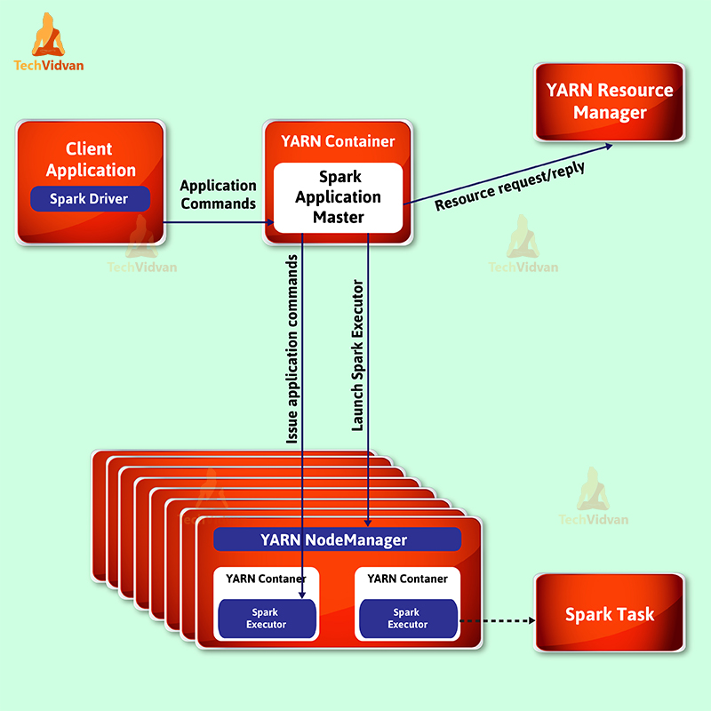
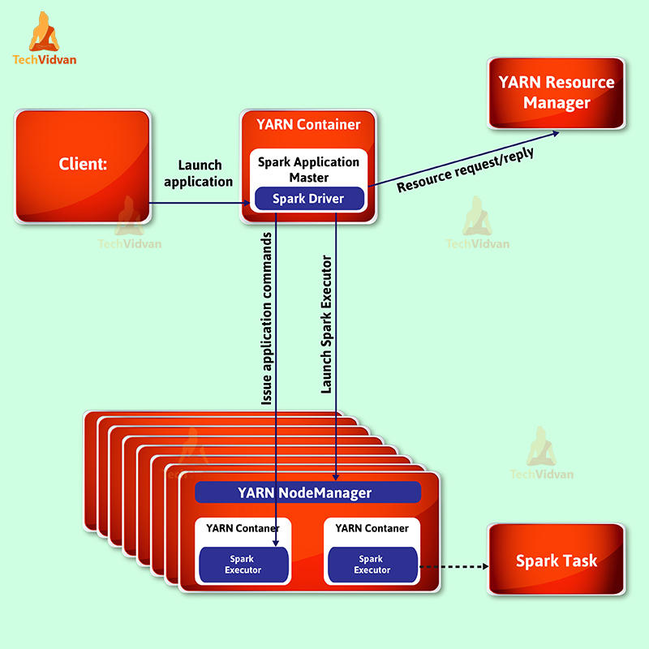

# spark运行模式和应用部署模式

spark运行模式（spark running mode）和应用部署模式（application deploy mode）经常被混淆。

- spark运行模式 Spark Running Mode
  - 本地运行 Run Locally
  - 集群运行 Run on Cluster
- 应用部署模式 Spark Application Deployment Mode
  - 客户端部署模式 Client Deployment Mode
  - 集群部署模式 Cluster Deployment Mode

## spark运行模式

spark可以运行在单机上，也可以运行在YARN或Mesos之类的集群管理器上，以利用整个集群的资源（内存、CPU等）。

### 本地运行

在本地模式下，spark作业在单台计算机上运行，并使用多线程并行执行：并行数限制为（最多）计算机中的核数。可以通过将[master url][master-url]设置为local或local[x]来启用本地模式。本地模式的最大优点是，无需在运行Spark应用程序之前部署Spark集群，通常用于开发和测试Spark应用程序。

#### 发布命令参数
1.spark-shell命令：
```
spark-shell \
  --master local[1]
```
可以写local[*]、local、local[2]。

2.spark-submit命令：

```
spark-submit \
  --class com.df.SparkWordCount SparkWC.jar local[1]
```
#### 适用场景

- 当提交作业的机器位于Spark集群附近，由于Drive程序和Spark集群不存在用于最终结果生成的数据移动的高网络延迟，此模式非常有效。
- 当提交作业的机器距离Spark集群很远时，网络延迟很高。此种情况下适合用本地运行模式。

### 集群运行

集群模式当前支持多个集群管理器：

- Standalone：Spark附带的一个简单的集群管理器，可以轻松设置集群
- Apache Mesos：通用集群管理器，可以运行Hadoop MapReduce和服务应用程序。
- Hadoop YARN：Hadoop2中的资源管理器。
- Kubernetes：一个开源系统，用于容器化应用的自动部署、扩展和管理。

#### standalone mode

##### 发布命令参数
1.spark-shell命令：
```
spark-shell \
  --master spark://hduser:7077
```

2.spark-submit命令：

```
spark-submit \
  --class com.df.SparkWordCount SparkWC.jar spark://hduser:7077
```

#### YARN mode

##### 发布命令参数

1.客户端提交命令（spark-shell与spark-submit）
```
spark-shell \
  --master yarn

spark-shell \
  --master yarn \
  --deploy-mode client

spark-submit \
  --class com.df.SparkWordCount SparkWC.jar yarn-client
```
2.集群提交命令（spark-submit）
以集群部署模式提交spark应用时，必须使用spark-submit命令，因为driver进程在集群节点运行，不可能通过spark-shell运行。
```
spark-submit \
  --class com.df.SparkWordCount SparkWC.jar yarn-cluster
```

#### Mesos mode

##### 发布命令参数
```
spark-submit \
  --class com.df.SparkWordCount SparkWC.jar spark://hduser:7077
```

#### 适用场景
- 当提交作业的机器原理Spark集群时，由于Drive运行在集群节点，减少了提交作业的机器与Spark集群之间的数据移动，且drive程序和集群之间网络断开的机会小，适合用集群运行模式。


## spark应用部署模式

部署模式与Spark drive程序的运行位置有关。Spark提供两种类型的部署模式：客户端和集群。在客户端部署模式下，Spark drive程序在集群外的客户端节点上运行；在集群模式下，它在集群内的节点上运行。

### client mode

提交Spark应用时，客户端部署模式是默认模式。在客户端模式下，driver守护进程在向集群提交Spark作业的机器上运行。在交互式使用中，该模式非常有用。同样，在该模式下，可以使用诸如`take()`和`collect()`的行动操作，这些操作将转换结果提取到driver程序并可以看到该结果。

### cluster mode

在集群部署模式下，无法交互使用Spark作业，因为一旦成功将作业提交到集群，客户端就会消失。在这种模式下，使用`take()`很浪费内存而且没用，因为它将所有结果提取到driver程序而不是客户端。因此，需要将转换结果存储到HDFS才能看到结果。集群部署模式不适用于spark shell工具，包括spark-shell，pyspark和**spark-sql**。

## Spark on YARN
国内YARN资源管理器用的多，重点说下YARN集群管理器上的部署模式。
当我们在YARN上运行Spark应用程序时，YARN控制资源管理、调度和安全性。此时可以在客户端和集群两种模式下部署应用，无论是哪一种模式，每个应用程序实例在YARN中都有一个Application Master进程，通常，这是应用程序启动的第一个容器。该应用负责从Resource Manager请求资源，一旦分配了资源，该应用程序便指示Node Manager启动容器运行Executor。

### 客户端部署模式
当driver程序在提交作业的机器上运行时，则为客户端部署模式。


### 集群部署模式
当driver程序在YARN选择的集群节点上运行时，则为集群部署模式。
