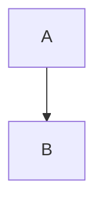

- [数据分析作战地图](03data_analytic/数据分析脑图.html)

数据分析路径图

- [互联网数据分析](03data_analytic/Internet/readme.md)

- 金融数据分析



# markmap-lib

## Links

- <https://markmap.js.org/>
- [GitHub](https://github.com/gera2ld/markmap-lib)

## Related

- [coc-markmap](https://github.com/gera2ld/coc-markmap)
- [gatsby-remark-markmap](https://github.com/gera2ld/gatsby-remark-markmap)

## Features

- links
- **inline** *styles* ~~text~~
- multiline
  text
- `inline code`
-
    ```js
    console.log('code block');
    ```
- MathJax - `\(x = {-b \pm \sqrt{b^2-4ac} \over 2a}\)`