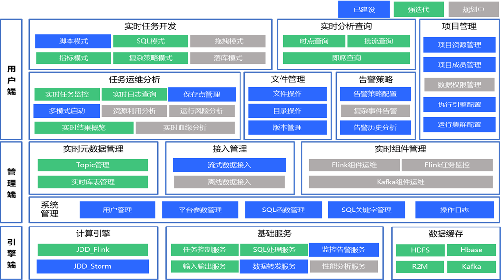

# 一、jdsk
## （一）、数据中台
### 1.RIC 实时计算平台
#### （1）产品介绍
RIC实时计算平台是一个提供高性能低延迟处理实时流式大数据的计算服务平台；计算能力上可以支持PB级毫秒级别的处理延迟，并且可以通过简单的SQL开发就可实现复杂的实时场景。能够支持多种数据格式接入或落地。
#### （2）产品架构
产品架构

技术架构

### 实时数仓

# 二、jdls
## （一）、消息队列
### 1.JDQ
分布式消息队列JDQ是京东数据中台基于Kafka实现的消息管理平台，是结合京东对线上业务数据及系统日志的管理需要，在对主流消息管理系统进行选型对比后，在商城大促中经过实践验证的平台产品。
### 2.FMQ
FMQ消息队列（Finance Message Queue,简称FMQ）定位于金融级消息中间件。产品基于高可用分布式集群技术，提供消息发布订阅、消息预览、延迟消费、资源统计、监控报警等一系列消息服务。
FMQ整体思想可参考RocketMQ，FMQ和JMQ在策略上可能不太一样，但大体类似。
### 3.JMQ
JMQ是一种高效、可靠、安全、弹性的分布式消息服务。它能够帮助应用开发者在他们应用的分布式组件上自由的传递数据，轻松构建松耦合系统。
JMQ与JDQ比较：
根据与JDQ侧沟通的数据，目前估计集团内部的大数据场景流量，JMQ侧占比30%，JDQ侧占比20%，JMQ的应用业务主要是黄金眼、广告、推荐搜索、信息安全、京东云。
