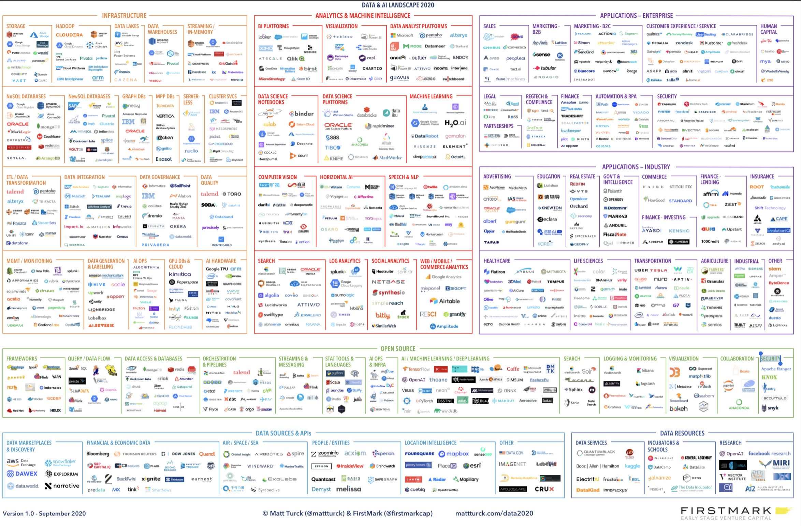
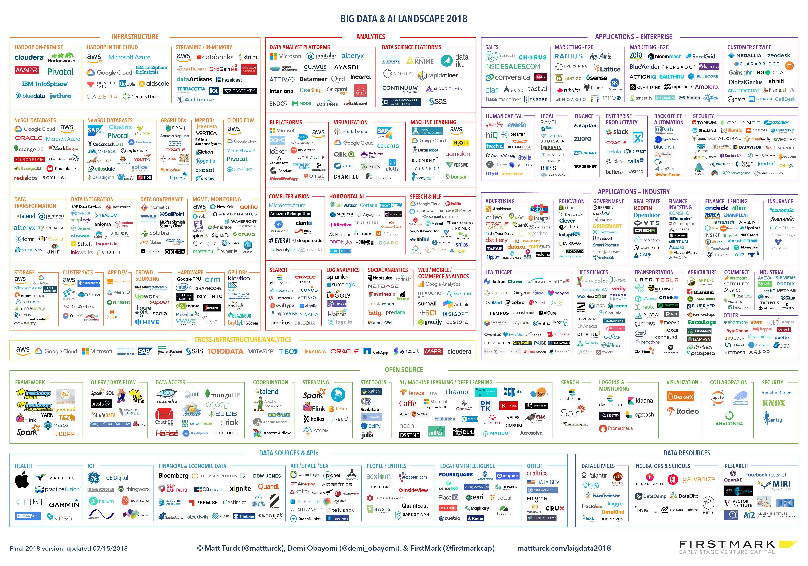
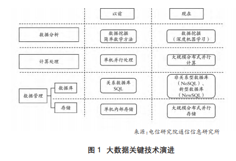
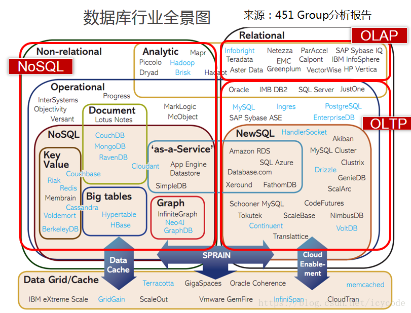

# 一、大数据
## （一）开篇
[首先看下大数据全景图](https://zhuanlan.zhihu.com/p/328773484)

## （二）大数据模块
### 1.存储技术
### 2.数据库技术
### 3.计算技术
### 4.数据分析技术

## （三）大数据发展历史
### 1.存储技术的发展历史
### 2.数据库的发展历史
### 3.计算技术的发展历史
### 4.数据分析技术的发展历史

### 5.大数据开源技术发展研究
大数据是新型计算、数据库、存储、数据分析等技术发展的综合结果。大数据核心技术领域包含数据分析、计算处理和数据管理三项，其中数据管理技术又可分为数据库技术和数据存储技术两部分。
- 数据分析技术 
大数据发展使得数据分析技术由简单数学方法的数据挖掘向深度机器学习的数据挖掘能力演进。目前该领域的技术在处理结构化数据的深度分析以及非结构数据分析利用时，还面临很多限制，需要突破。
- 基础处理技术 
在计算处理技术领域，大数据发展使得以往的单机并行处理技术向大规模分布式并行计算技术演进，其中谷歌MapReduce及其开源实现Hadoop MapReduce批处理计算应用最广，同时业界出现了面向特定场景的不同的并行计算架构路线，如实时计算Spark、流计算Storm、图计算Pregel等。
- 数据管理技术 
数据库管理领域的数据库技术由以往的关系数据库（SQL）向非关系型数据库（NoSQL）和新型数据库（NewSQL）演进，融合关系型和非关系型数据库特点的超大规模新型数据库是数据量未来的发展方向；存储技术也由以往的单机内部存储向大规模分布式并行存储技术演进。目前谷歌GFS和Hadoop的HDFS是主流技术，未来存储技术将能够突破GFS/HDFS在写操作、小文件存取等方面的性能瓶颈，发展成为新一代文件系统。

目前，大数据开源项目主要集中在计算处理和数据管理领域，其中Hadoop和Spark逐渐发展成为可以为大数据应用提供各个层面技术支持的开源项目生态，受到了业界广泛关注和应用。

#### （1）开源项目Hadoop发展
Hadoop开源项目采用分布式系统架构，共包含四个模块。
https://www.ixueshu.com/download/466acba9d1aca3e9740c264bc037bdb6318947a18e7f9386.html
#### （2）开源项目Spark发展
#### （3）NoSQL产品

### 2.时间线看大数据发展

## （四）大数据未来趋势

## （五）大数据相关概念
**1.什么是大数据**

# 二、[分布式架构](https://juejin.cn/post/6844903967701336078)
## （一）分布式理论基础
### 1.节点与网络
**节点** 
- 传统的节点就是一台单体的物理机，所有的服务都揉进去，包括服务和数据库。
- 虚拟化时代，单台物理机往往可以分成多台虚拟机，实现资源利用的最大化，节点的概念也变成单台虚拟机上面的服务。
- 容器化时代，服务已经彻底容器化，节点只是轻量级的容器服务。

总结下来，节点就是能提供单位服务的逻辑计算资源的集合。

**网络** 
分布式架构的根基就是网络，不管是局域网还是公网，没有网络就无法把计算机联合在一起工作，但是网络也带来了一系列的问题。网络消息的传播有先后，消息丢失和延迟是经常发生的事情。
三种网络工作模式：
- 同步网络 
节点同步执行，消息延迟有限，高效全局锁。
- 半同步网络 
锁范围放宽。
- 异步网络 
节点独立执行，消息延迟无上限，无全局锁，部分算法不可行

两大网络传输层协议：
- TCP协议
- UDP协议

### 2.一致性理论
#### （1）强一致性ACID
ACID，是指数据库管理系统在写入或更新数据的过程中，为保证事务是正确可靠的，所必须具备的四个特性。
在数据库管理系统中，一个事务是指：由一系列数据库操作组成的一个**完整**的逻辑过程。例如银行转账，从原账户扣除金额，以及向目标账户添加金额，这两个数据操作的总和，构成一个完整的逻辑过程，不可拆分。**这个过程**被称为一个事务，具有ACID特性。

- 原子性 atomicity 
一个事务中的所有操作，要么全部完成，要么全部不完成，不会结束在中间某个环节。事务在执行过程中发生错误，会被回退到事务开始之前的状态，就像这个事务从来没有执行过一样。
- 一致性 consistency 
在事务开始之前和事务结束之后，数据库的完整性没有被破坏。这表示写入的数据必须完全符合所有的预设规则。例如数据库完整性约束了a+b=10，一个事务改变了a，那么b也应该随之改变。
- 隔离性 isolation 
事务的隔离性也称作独立性，是指两个以上的事务不会出现交叉执行的状态，因为这样可能会导致数据不一致。数据库允许多个并发事务同时对其数据进行读写和修改的能力，隔离性可以防止多个事务并发执行时由于交叉执行而导致数据的不一致。事务隔离分为不同级别，包括读未提交、读提交、可重复读、串行化。
- 持久性 durability 
事务处理结束后，对数据的修改就是永久的，即便系统故障也不会丢失。

#### （2）分布式一致性CAP
分布式环境下，无法保证网络的正常连接和信息的传送，于是发展出了CAP、FLP、DLS这三个重要的理论。
https://www.cnblogs.com/xrq730/p/4944768.html
##### CAP
##### ②FLP
##### ③DLS
- CAP 
- FLP 
- DLS 

# 二、数据库
## （一）开篇
先看一张数据库行业全景图

**NoSQL**
**OLAP**
**OLTP**
## （二）数据库发展历史

## （三）ClickHouse
> ClickHouse是一个开源的列式数据库，主要用于在线分析处理查询（OLAP）

ClickHouse特点：
- :smile:批量写入，实时查询。可摄入实时批数据
- :smile:数据压缩空间大，减少I/O
- :smile:ClickHouse查询很快是因为采用了并行处理机制，即使一个查询，也会用服务器一般的CPU去执行，所以ClickHouse不能支持高并发的使用场景
- :angry:不支持事务，不支持真正的删除/更新
- :smile:索引是CK查询速度比较快的一个重要原因，正是因为有所以可以避免不必要的数据的扫描和处理，传统基于HDFS的OLAP引擎都是不支持索引的，基本的数据过滤只能支持分区进行过滤，这样会扫描处理很多不必要的数据。
- :smile:ClickHouse不仅支持分区的过滤也支持列级别的稀疏索引。索引粒度默认是8192，即每8192条数据进行一次记录，这样对于1亿的数据只需要记录12207条记录，可以很好的节约空间。

https://cloud.tencent.com/developer/article/1106103
https://developer.aliyun.com/article/762097
https://clickhouse.tech/docs/zh/
https://www.infoq.cn/article/vggxs8hqbewg1z3ndtt0

# 三、存储
# 四、计算
# 五、Hadoop生态圈
Hadoop最初指代的是分布式文件系统HDFS和MapReduce计算框架，但是它一路高歌猛进，在此基础上像搭积木一般快速发展成为一个庞大的生态（包括Yarn、Hive、Hbase、Spark等数十种之多）。

